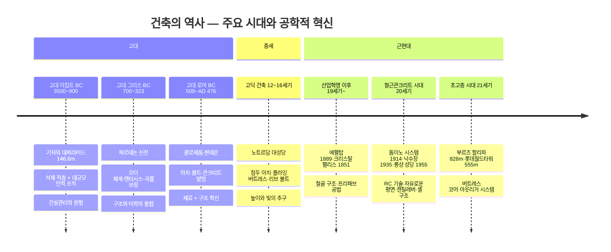

# L02. 건축공학의 과거 — "건축은 어떻게 발전해 왔는가"

> [!finding] 핵심 메시지
> 건축은 인류 문명과 함께 발전해 왔고, 공학적 접근의 부재는 재앙으로 이어진다.

## 강의 중점
- 고대 건축의 놀라운 공학 기술 (도입 영상)
- 건축의 역사와 발전 과정 (고대→근현대)
- 건축공학의 필요성: 사고 사례를 통한 공학적 접근의 중요성

## 학습 목표
1. 고대부터 현대까지 건축의 발전 과정과 주요 양식을 설명할 수 있다.
2. 건축공학이 왜 필요한지, 공학적 접근이 없을 때 어떤 문제가 발생하는지 이해한다.

## 강의 내용

---

### 도입 영상

> [!ref] 도입 영상 — 고대 건축의 놀라운 공학
> - **건축기술의 역사**: [고대공학기술의 비밀 2편 — 건축기술의 역사](https://www.youtube.com/watch?v=9md-vKKNJIw) — EBS 사이언스 (고대~중세 건축 공학 기술의 발전 과정)
> - **피라미드의 토목공학**: [고대 사람들이 모래 위에 피라미드를 지을 수 있었던 이유](https://www.youtube.com/watch?v=aW7cRObBcMA) — 문화유산의 토목공학적 분석 (피사의 사탑, 피라미드 지반 공학)
> - **로마의 건축기술**: [로마 건축기술의 집약체 '콜로세움' 건설과정과 역사적 배경](https://www.youtube.com/watch?v=MnhH2pbXG4c) — EBS 컬렉션 사이언스 (콜로세움, 아치, 로마 콘크리트, 15분)
> - **에펠탑의 역사**: [에펠탑은 왜 지어졌을까?](https://www.youtube.com/watch?v=7jIACDNaHK4) — 19세기 철골 구조 혁명의 배경

> [!ref] 도입 영상 — 건축공학의 필요성
> - **삼풍백화점 붕괴**: ["5초 만에 사라졌다" 삼풍백화점 아무도 몰랐던 진실](https://www.youtube.com/watch?v=pVkzvP4rTvM) — 무단 증축, 구조 무시, 502명 사망의 구조적 원인
> - **반복되는 붕괴 사고**: [반복되는 붕괴 사고 재발 방지 대책은?](https://www.youtube.com/watch?v=EMu2Vx8P8jk) — 연합뉴스TV (1990년대~최근 한국 주요 건설 사고 연대순 정리)

> [!question] 생각해보기
> "고대 이집트인은 어떻게 146m 높이의 피라미드를 지을 수 있었을까? 그들에게도 '공학'이 있었을까?"

---

### 건축의 역사: 인류 문명과 함께한 건축

건축은 인류 문명의 시작과 함께 발전해 왔다. 시대별 건축 양식의 변화를 통해 기술의 발전과 건축공학의 뿌리를 이해할 수 있다.

#### 1) 고대 이집트 건축 (BC 3500~900)

![[pyramid-giza.jpg|500]]
*기자의 대피라미드 (BC 2560년경) — 출처: PBC Today / Dreamstime*

- **대표 건축물**: 기자의 대피라미드 (높이 146.6m, 약 230만 개의 석재 블록)
- **공학적 특징**:
  - 평균 2.5톤의 석회암 블록을 정밀하게 가공·적층
  - 4면이 거의 정확히 동서남북을 향함 (오차 0.05도 이내)
  - 내부 통로와 왕의 방의 정밀한 구조 설계
- **의의**: 대규모 인력 조직과 측량·운반 기술의 결합 — 건설관리의 원형

#### 2) 고대 그리스 건축 (BC 700~323)

![[parthenon-athens.jpg|500]]
*파르테논 신전, 아테네 (BC 447~432) — 출처: Wikimedia Commons*

- **대표 건축물**: 파르테논 신전 (아테네 아크로폴리스)
- **공학적 특징**:
  - **오더(Order) 체계**: 도리스·이오니아·코린트 양식의 기둥 비례 체계 확립
  - **엔타시스(Entasis)**: 기둥 중간부를 약간 볼록하게 하여 시각적 안정감 구현
  - **곡률 보정**: 기단과 처마를 미세하게 곡면 처리하여 착시 교정
- **의의**: 구조와 미학의 통합 — "비례와 조화"라는 건축 설계의 영원한 원칙 수립

#### 3) 고대 로마 건축 (BC 509~AD 476)

![[colosseum-rome.jpg|500]]
*로마 콜로세움 (AD 70~80) — 출처: Vocal Media*

- **대표 건축물**: 콜로세움 (5만 명 수용), 판테온 (직경 43.3m 돔)
- **공학적 특징**:
  - **아치(Arch)와 볼트(Vault)**: 곡선 구조를 통한 넓은 공간 확보
  - **콘크리트(Opus Caementicium)**: 로마식 시멘트 개발 — 현대 콘크리트의 기원
  - **수도교(Aqueduct)**: 중력을 이용한 장거리 급수 시스템
- **의의**: 재료 혁신(콘크리트)과 구조 혁신(아치)이 결합된 공학의 도약

#### 4) 고딕 건축 (12~16세기)

![[notre-dame-paris.jpg|500]]
*노트르담 대성당, 파리 (1163~1345) — 출처: Encyclopaedia Britannica*

- **대표 건축물**: 노트르담 대성당, 샤르트르 대성당, 쾰른 대성당
- **공학적 특징**:
  - **첨두 아치(Pointed Arch)**: 하중을 효율적으로 분산, 더 높은 천장 가능
  - **플라잉 버트레스(Flying Buttress)**: 외벽의 수평 추력을 외부에서 지지
  - **리브 볼트(Rib Vault)**: 구조적 뼈대를 분리하여 벽체를 얇게 → 대형 스테인드글라스 창 설치
- **의의**: "높이와 빛"의 추구 — 구조 역학의 직관적 이해가 설계에 반영된 시대

#### 5) 근현대 건축 (19세기~현재)

##### (a) 산업혁명과 철골 구조의 탄생

![[eiffel-tower-paris.jpg|500]]
*에펠탑, 파리 (1889) — 출처: Wikimedia Commons / Benh LIEU SONG*

- **대표 건축물**: 에펠탑 (1889, 324m), 크리스탈 팰리스 (1851)
- **공학적 특징**:
  - **철(Iron)과 강철(Steel)의 대량 생산**: 산업혁명으로 철의 대량 생산이 가능해지면서 건축 재료의 혁명 발생
  - **에펠탑**: 18,038개의 연철 부재를 250만 개의 리벳으로 결합 — 당시 세계 최고 높이(324m)
  - **풍하중 설계**: 귀스타브 에펠은 바람의 영향을 고려한 곡선형 구조를 수학적으로 설계 — 현대 구조공학의 선구
- **의의**: 석재·벽돌 중심의 건축에서 **금속 구조**로의 전환점, 구조 역학의 수학적 설계 시대 개막

![[crystal-palace-1851.png|500]]
*크리스탈 팰리스, 런던 (1851) — 출처: Wikimedia Commons / Public Domain*

- **크리스탈 팰리스** (조셉 팩스턴 설계):
  - 철골 프레임 + 유리 패널의 조합 — 총 면적 약 92,000㎡
  - **프리패브리케이션(Prefabrication)**: 표준화된 부재를 공장에서 제작 → 현장 조립, 공기 단축의 원형
  - 만국박람회 개최 후 해체·이전 — **모듈러 건축의 시초**

##### (b) 철근콘크리트 시대

![[domino-system-corbusier.jpg|400]]
*르 코르뷔지에의 돔이노 시스템 (1914~15) — 출처: Wikimedia Commons*

- **대표 건축물**: 르 코르뷔지에의 돔이노 시스템 (1914)
- **공학적 특징**:
  - **철근콘크리트(RC)**: 콘크리트의 압축 강도 + 철근의 인장 강도를 결합한 복합 재료
  - **돔이노 시스템**: 기둥(Column)과 슬래브(Slab)만으로 구조를 지지 → 벽체가 하중을 부담하지 않음
  - **자유로운 평면(Free Plan)**: 내벽을 자유롭게 배치할 수 있는 혁명적 개념 → 현대 건축의 기본 원리
- **의의**: 조적조(벽체 구조)에서 **골조 구조(Frame Structure)**로의 전환 — 현대 아파트·오피스 건축의 기본 골격

![[fallingwater-wright.jpg|500]]
*낙수장(Fallingwater), 펜실베이니아 (1935) — 출처: Wikimedia Commons*

- **낙수장(Fallingwater)** (프랭크 로이드 라이트, 1935):
  - 폭포 위에 걸쳐진 주택 — RC 캔틸레버(Cantilever) 기술의 극적인 활용
  - 최대 약 4.6m의 캔틸레버 슬래브가 지지 기둥 없이 공중에 돌출
  - **철근콘크리트이기에 가능한 건축**: 석재나 목재로는 불가능한 구조 — RC가 인장력을 부담하여 "떠 있는 건축"을 실현
  - 자연과 건축의 유기적 통합(**유기적 건축, Organic Architecture**)의 대표작
  - 준공 후 캔틸레버 처짐 문제 발생 → 2002년 포스트텐션 보강 — **구조 설계와 장기 거동 예측의 중요성**을 보여주는 교훈적 사례

![[ronchamp-chapel-corbusier.jpg|500]]
*롱샹 성당(Notre-Dame du Haut), 프랑스 (1955) — 출처: Wikimedia Commons*

- **롱샹 성당(Notre-Dame du Haut)** (르 코르뷔지에, 1955):
  - RC의 **조형적 자유(Sculptural Freedom)**를 극한까지 보여준 작품
  - 곡면 지붕은 콘크리트 셸(Shell) 구조 — 두께 약 6cm의 얇은 RC 셸이 넓은 지붕을 덮음
  - 벽체 두께를 자유롭게 변화시키며 불규칙한 개구부(창)를 배치 → 빛의 연출
  - **공학적 시사점**: RC가 단순한 직선 골조를 넘어 **곡면·비정형 구조**까지 가능하게 함 → 이후 현대 비정형 건축(자하 하디드 등)의 선구적 사례

> [!tip] 교육 포인트 — 철근콘크리트가 바꾼 것
> 돔이노 시스템(골조 구조), 낙수장(캔틸레버), 롱샹 성당(셸 구조) — 이 세 건축물은 RC가 건축을 어떻게 변화시켰는지 단계적으로 보여준다:
> 1. **구조의 자유**: 벽 없이 기둥과 슬래브만으로 건물 지지
> 2. **공간의 자유**: 지지점 없이 공중으로 뻗는 캔틸레버
> 3. **형태의 자유**: 직선을 넘어 곡면과 비정형까지 구현

##### (c) 초고층 시대

### 건축공학이 만든 세계 (도입 영상/사진)

> [!ref] 도입 영상
> - **부르즈 할리파**: [Burj Khalifa | 메가 구조의 모든 공학적 비밀 (10:51)](https://www.youtube.com/watch?v=gknlhAu4gDE) — Sabin 토목공학 (Y자형 평면, 버트레스 코어, 풍하중 저감 등 공학적 설계 비밀)
> - **롯데월드타워**: [롯데월드타워 다큐멘터리 (5:56)](https://www.youtube.com/watch?v=Hzq8wIDvE7E) — 롯데월드타워(LWT) 공식 채널 (30년간의 건설 과정과 선도적 시공 기술)
> - **롯데월드타워 기술영상**: [롯데월드타워 기술영상(ENG)](https://www.youtube.com/watch?v=X-XwbaoqUp8) — 기술 중심, 짧고 밀도 높은 시공 기술 소개
> - **타이페이 101 제진장치**: [실제 지진 시 TMD 흔들림 (0:55)](https://www.youtube.com/watch?v=Tkz6b7Q3dRk) — 규모 6.8 지진에서 Tuned Mass Damper가 작동하는 실제 영상
> - **한국 건설 기술**: [전세계 포기한 프로젝트를 한국이 해냈다](https://www.youtube.com/watch?v=REhm6hA6YYM) — 52도 기울기 등 해외 메가프로젝트에서의 한국 시공 기술력

초고층 건축물(Supertall: 300m 이상, Megatall: 600m 이상)은 현대 건축공학의 정수를 보여준다. 구조공학, 재료공학, 건설관리, 환경설비가 모두 극한 수준으로 통합되어야만 가능한 건축이다.

![[645943488_18039267335751439_5594468549364445255_n.jpg|600]]
*세계 주요 초고층 건축물 높이 비교 — 출처: CTBUH / SkyscraperCenter (Upsurge)*

##### 세계 초고층 건축물 TOP 10 (2025년 기준, 완공 건물)

| 순위 | 건축물 | 도시 | 높이 | 완공 | 층수 | 핵심 구조 시스템 |
|:---:|--------|------|-----:|:----:|:---:|----------------|
| 1 | **부르즈 할리파** | 두바이, UAE | 828m | 2010 | 163 | 버트레스 코어(Buttressed Core) |
| 2 | **메르데카 118** | 쿠알라룸푸르, 말레이시아 | 679m | 2023 | 118 | 코어-아웃리거 + 메가컬럼 |
| 3 | **상하이 타워** | 상하이, 중국 | 632m | 2015 | 128 | 이중 외피(Double Skin) + 메가프레임 |
| 4 | **아브라즈 알바이트** | 메카, 사우디 | 601m | 2012 | 120 | RC 코어 + 철골 프레임 |
| 5 | **핑안 국제금융센터** | 선전, 중국 | 599m | 2017 | 115 | 메가컬럼-코어-아웃리거 |
| 6 | **롯데월드타워** | 서울, 한국 | 555m | 2017 | 123 | 코어월-아웃리거-벨트트러스 |
| 7 | **원 월드트레이드센터** | 뉴욕, 미국 | 541m | 2014 | 104 | 하이브리드 코어(RC+철골) |
| 8 | **광저우 CTF 금융센터** | 광저우, 중국 | 530m | 2016 | 111 | 튜브인튜브(Tube-in-Tube) |
| 9 | **톈진 CTF 금융센터** | 톈진, 중국 | 530m | 2019 | 97 | 메가컬럼-코어월-아웃리거 |
| 10 | **중국존(中國尊)** | 베이징, 중국 | 528m | 2018 | 108 | 메가브레이스-코어월 |

> [!tip] 교육 포인트 — 초고층 구조 시스템의 핵심
> 초고층 건축물의 최대 과제는 **풍하중(Wind Load)**이다. 높이 300m 이상에서는 중력 하중보다 바람에 의한 수평 하중이 구조 설계를 지배한다. 이를 위해 다양한 구조 시스템이 발전했다:
> - **코어월(Core Wall)**: 건물 중심부의 RC 벽체가 수평력에 저항
> - **아웃리거(Outrigger)**: 코어와 외곽 기둥을 연결하여 횡력 저항 증대
> - **메가프레임(Mega Frame)**: 대형 기둥과 보로 구성된 외부 골조
> - **벨트트러스(Belt Truss)**: 건물 외곽을 두르는 트러스로 강성 확보
> - **튜브(Tube)**: 건물 외벽 전체를 하나의 구조 튜브로 활용

##### 특징적인 초고층 건축물 소개

**1. 부르즈 할리파 (828m, 두바이)** — 세계 최고층

![[burj-khalifa-dubai.jpg|300]]
*부르즈 할리파 (828m, 두바이) — 출처: Unsplash*

- Y자형 평면(Triaxial Plan)으로 와류(Vortex) 발생을 저감 — 풍동 실험으로 최적화
- **버트레스 코어(Buttressed Core)**: 중앙 육각형 코어에서 3방향으로 뻗은 날개(Wing)가 서로를 지지
- 26개 세트백(Setback)으로 높이에 따라 단면 축소 → 와류 공진 방지
- 고강도 콘크리트(80MPa급)를 601m 높이까지 펌핑 — 당시 세계 기록

**2. 메르데카 118 (679m, 쿠알라룸푸르)** — 세계 2위, 동남아시아 최고층

![[merdeka-118.jpg|300]]
*메르데카 118 (679m, 쿠알라룸푸르) — 출처: Unsplash*

- 삼각형 평면의 코어월 + 8개 메가컬럼 + 2단 아웃리거 시스템
- 말레이시아 독립(Merdeka)을 상징하는 디자인 — 국기의 삼각형 패턴 반영
- 2023년 완공으로 페트로나스 트윈타워(452m)를 넘어 말레이시아 최고층 갱신

**3. 상하이 타워 (632m, 상하이)** — 세계 3위, 중국 최고층

![[shanghai-tower.jpg|500]]
*상하이 푸동 스카이라인 — 우측 비틀림 형태가 상하이 타워 (632m) — 출처: Unsplash*

- **이중 외피(Double Skin Facade)**: 내부 원형 타워 + 외부 삼각형 유리 커튼월 사이에 공간을 두어 에너지 절감
- 120도 비틀림(Twist) 형태 → 풍하중 24% 저감 (풍동 실험 기반)
- 9개 존(Zone)으로 나뉜 수직 도시(Vertical City) 개념
- 세계 최고속 엘리베이터 (초속 18m, 약 65km/h)

**4. 롯데월드타워 (555m, 서울)** — 국내 최고층, 세계 6위

![[lotte-world-tower.jpg|300]]
*롯데월드타워 (555m, 서울) — 출처: Wikimedia Commons*

- **구조 시스템**: RC 코어월 + 8개 메가컬럼 + 2단 아웃리거 + 벨트트러스
- 고강도 콘크리트(100MPa급)를 500m 이상까지 초대형 펌프카로 타설 — 국내 기술력의 결정체
- 지진하중과 풍하중을 동시에 고려한 설계 (수도권 지진 대비)
- 580m 높이에 세계 최고층 유리 바닥 전망대(스카이워크) 설치

**5. 원 월드트레이드센터 (541m, 뉴욕)** — 9·11 재건의 상징

![[one-world-trade-center.jpg|300]]
*원 월드트레이드센터 (541m, 뉴욕) — 좌측에 오큘러스(Oculus) 교통허브 — 출처: Pexels*

- RC 코어 + 철골 모멘트프레임의 **하이브리드 구조** — 연쇄붕괴 방지 설계(Progressive Collapse Design) 적용
- 9·11 테러 교훈 반영: 강화된 비상 계단, 내화 성능, 피난 시스템
- 높이 1,776피트(541m) — 미국 독립선언 연도(1776년)를 상징

##### 미래: 제다 타워 (1,000m+, 사우디아라비아, 건설 중)

- 완공 시 **세계 최초 1km 초과 건축물** — 부르즈 할리파보다 약 180m 이상 높음
- 2018년 공사 중단 후 2025년 1월 재개, 2026년 1월 기준 80층 도달
- 3~4일마다 1개 층씩 시공 중, **2028년 8월 완공 예정**
- 삼각형 평면 + 테이퍼(Taper) 형태로 높이에 따라 단면 점진적 축소
- 사우디 비전 2030의 상징적 프로젝트

> [!question] 생각해보기
> "피라미드에서 부르즈 할리파까지, 건축 기술은 어떻게 발전해 왔을까? 그 발전을 가능하게 한 것은 무엇일까?"
>
> "제다 타워가 1km를 넘으면, 그 다음 한계는 어디일까? 초고층 건축의 물리적 한계는 존재하는가?"

---

### 건축공학의 필요성: 왜 공학적 접근이 필요한가?

건축은 단순한 예술이 아니다. 공학적 지식 없이 지어진 건축물은 인명 피해로 이어질 수 있다. 역사적 사고 사례를 통해 건축공학의 중요성을 이해한다.

#### 사례 1: 삼풍백화점 붕괴 (1995, 서울)

![[sampoong-collapse.webp|500]]
*삼풍백화점 붕괴 현장 (1995.6.29) — 출처: 나무위키*

| 항목 | 내용 |
|------|------|
| **일시** | 1995년 6월 29일 |
| **피해** | 사망 502명, 부상 937명 |
| **원인** | 설계 변경(4층→5층 무단 증축), 옥상 냉각탑 이전, 기둥 철근 부족, 콘크리트 품질 불량 |
| **교훈** | 구조 설계 무시, 시공 품질 관리 부재, 유지관리 소홀의 복합 결과 |

- **구조공학적 문제**: 5층 슬래브 두께 부족 (설계 하중 초과), 기둥-슬래브 접합부 펀칭 전단 파괴
- **건설관리적 문제**: 무자격 시공, 감리 부실, 균열 발생 후 영업 지속

#### 사례 2: Surfside 콘도 붕괴 (2021, 미국 플로리다)

![[surfside-collapse.jpg|500]]
*Champlain Towers South 붕괴 현장 (2021.6.24) — 출처: NIST*

| 항목 | 내용 |
|------|------|
| **일시** | 2021년 6월 24일 |
| **피해** | 사망 98명 |
| **원인** | 지하 주차장 슬래브의 장기 열화, 철근 부식, 방수층 파손, 구조적 유지관리 미비 |
| **교훈** | 건축물의 생애주기(Life-cycle) 관리와 정기 구조 안전 점검의 필수성 |

- 준공 후 40년간 콘크리트 열화 진행 → 펀칭 전단 파괴 → 연쇄 붕괴(Progressive Collapse)
- NIST 조사 결과: 설계 당시에도 일부 부재가 기준 미달이었던 것으로 확인

#### 사례 3: 최근 한국 건설 사고 — 왜 반복되는가?

한국에서는 2021년 이후에도 대형 건설 사고가 연이어 발생하고 있다. 이 사례들은 설계·시공·감리 전 과정에서의 **총체적 부실**이 어떤 결과를 낳는지 보여준다.

##### (1) 광주 학동 철거건물 붕괴 (2021)

![[gwangju-hakdong-collapse-2021.jpg|500]]
*광주 학동 철거건물 붕괴 현장 (2021.6.9) — 출처: BBC News 코리아*

| 항목     | 내용                                                          |
| ------ | ----------------------------------------------------------- |
| **일시** | 2021년 6월 9일                                                 |
| **피해** | 사망 9명, 부상 8명 (시내버스 탑승객)                                     |
| **원인** | 무리한 해체 방식 — 내부 바닥 절반 철거 후 10m 이상 과도한 성토 → 1층 바닥판 붕괴 → 건물 전도 |
| **교훈** | 철거 공사의 구조적 안전성 검토 의무화, 해체 공정 관리·감독 체계 강화                    |

- 5층 건물이 7차선 도로 쪽으로 전도되면서 정류장에 정차 중이던 시내버스를 덮침
- 주민 민원에도 불구하고 적절한 조치가 이루어지지 않았던 것으로 확인
- 이후 **건축물관리법** 개정으로 해체 허가 및 감리 기준 강화

##### (2) 광주 화정 아이파크 붕괴 (2022)

![[gwangju-ipark-collapse-2022.jpg|500]]
*광주 화정 아이파크 붕괴 현장 (2022.1.11) — 출처: 경향신문*

| 항목 | 내용 |
|------|------|
| **일시** | 2022년 1월 11일 |
| **피해** | 사망 6명 (실종 작업자), 39층 아파트 23~38층 외벽 붕괴 |
| **시공사** | HDC현대산업개발 |
| **원인** | ① 무단 설계변경(바닥 시공방식 임의 변경 → 하중 2.2배 증가), ② 불량 콘크리트(설계강도의 60% 수준), ③ 감리 부실 |
| **교훈** | 설계 변경 시 구조 안전성 재검토 필수, 콘크리트 품질 관리 체계 강화 |

- 콘크리트 양생이 충분히 이루어지지 않은 상태에서 상층 시공을 강행한 **총체적 부실 시공**
- 17개층 중 15개층의 콘크리트가 설계기준강도의 85% 미달 (실제 60% 내외)
- HDC현대산업개발 **영업정지 1년** 처분

##### (3) 인천 검단 아파트 지하주차장 붕괴 (2023)

![[incheon-geomdan-collapse-2023.jpg|500]]
*인천 검단 아파트 지하주차장 붕괴 현장 (2023.4.29) — 출처: 뉴시스*

| 항목 | 내용 |
|------|------|
| **일시** | 2023년 4월 29일 |
| **피해** | 인명 피해 없음 (야간 발생), 그러나 1,666세대 전면 재시공 → 약 4,000억 원 손실 |
| **시공사** | GS건설 |
| **원인** | ① 전단보강근 누락(기둥 32곳 중 50% 이상 미배근), ② 콘크리트 강도 부족(설계 24MPa → 실제 16.9MPa), ③ 과도한 토사 적재(설계 1.1m → 실제 2.1m) |
| **교훈** | 설계·시공·감리의 **삼중 안전망**이 동시에 무너진 전형적 사례 |

- 지하주차장 슬래브의 **펀칭 전단 파괴(Punching Shear Failure)** → 연쇄 붕괴
- 공정률 70%인 아파트 17개 동 전체를 철거하고 재시공 결정
- GS건설 **영업정지 10개월** 처분 추진

##### (4) 안성 고속도로 교량 구조물 붕괴 (2025)

![[anseong-bridge-collapse-2025.jpg|500]]
*서울~세종 고속도로 안성 구간 교량 붕괴 현장 (2025.2.25) — 출처: 경향신문*

| 항목 | 내용 |
|------|------|
| **일시** | 2025년 2월 25일 |
| **피해** | 사망 4명, 부상 6명 |
| **현장** | 서울~세종 고속도로 건설 현장 |
| **원인** | 교량 상판 구조물 붕괴로 작업자 10명 추락 |
| **교훈** | 가설구조물(동바리·거푸집)의 구조 검토와 시공 중 안전 관리의 중요성 |

##### 공통 교훈 — 반복되는 원인 패턴

> [!action] 건축공학도가 알아야 할 것
> 위 사고들은 **기술의 부족이 아니라 관리의 부재**에서 비롯되었다. 구조 설계 원리를 이해하고, 시공 품질을 검증하며, 감리의 독립성을 확보하는 것 — 이것이 건축공학 교육의 핵심 목적이다.

#### 참고: 해외 주요 구조물 사고

| 사고 | 연도 | 원인 | 교훈 |
|------|------|------|------|
| 로난 포인트 아파트 붕괴 (영국) | 1968 | 가스 폭발 → 연쇄 붕괴 | 연쇄붕괴 방지 설계(Progressive Collapse Design)의 필요성 |
| I-35W 교량 붕괴 (미국) | 2007 | 거셋 플레이트 설계 결함 + 부식 | 기존 구조물 정기 안전 점검 강화 |

> [!finding] 핵심 메시지
> 건축공학은 **사람의 생명을 지키는 학문**이다. 구조 설계, 환경설비, 시공관리 — 어느 하나라도 소홀하면 대형 사고로 이어질 수 있다.

> [!question] 생각해보기
> "만약 건축공학 지식 없이 건물을 짓는다면 어떤 일이 벌어질까?"

---

## 실습/과제
- [ ] **아이스브레이킹** (수업 중): 건축공학과를 선택한 이유 / 관심 있는 건축물 1분 소개
- [ ] 자기소개서 작성 및 수강 동기 제출

## Notes
- 수업 중 질문/피드백:
- 다음 수업 준비사항: 건설산업 관련 뉴스/기사 1건 읽어오기

## 이미지 출처

| 파일명 | 설명 | 출처 |
|--------|------|------|
| `pyramid-giza.jpg` | 기자의 대피라미드 | [PBC Today / Dreamstime](https://www.pbctoday.co.uk/news/planning-construction-news/modern-engineers-ancient-pyramids/51702/) |
| `parthenon-athens.jpg` | 파르테논 신전, 아테네 | [Wikimedia Commons](https://en.wikipedia.org/wiki/Parthenon) |
| `colosseum-rome.jpg` | 로마 콜로세움 | [Vocal Media](https://vocal.media/history/the-roman-colosseum-an-icon-of-ancient-engineering-and-entertainment) |
| `notre-dame-paris.jpg` | 노트르담 대성당, 파리 | [Encyclopaedia Britannica](https://www.britannica.com/topic/Notre-Dame-de-Paris) |
| `645943488_18039267335751439_5594468549364445255_n.jpg` | 세계 초고층 건축물 높이 비교 | CTBUH / SkyscraperCenter (Upsurge) |
| `burj-khalifa-dubai.jpg` | 부르즈 할리파, 두바이 | [Unsplash](https://unsplash.com) |
| `merdeka-118.jpg` | 메르데카 118, 쿠알라룸푸르 | [Unsplash](https://unsplash.com) |
| `shanghai-tower.jpg` | 상하이 타워 (푸동 스카이라인) | [Unsplash](https://unsplash.com) |
| `lotte-world-tower.jpg` | 롯데월드타워, 서울 | [Wikimedia Commons](https://en.wikipedia.org/wiki/Lotte_World_Tower) |
| `one-world-trade-center.jpg` | 원 월드트레이드센터, 뉴욕 | [Pexels](https://www.pexels.com/photo/5340366/) |
| `sampoong-collapse.webp` | 삼풍백화점 붕괴 현장 | [나무위키](https://namu.wiki/w/삼풍백화점%20붕괴%20사고) |
| `surfside-collapse.jpg` | Champlain Towers South 붕괴 | [NIST](https://www.nist.gov/disaster-failure-studies/champlain-towers-south-collapse) |
| `eiffel-tower-paris.jpg` | 에펠탑, 파리 | [Wikimedia Commons / Benh LIEU SONG](https://commons.wikimedia.org/wiki/File:Tour_Eiffel_Wikimedia_Commons_(cropped).jpg) |
| `crystal-palace-1851.png` | 크리스탈 팰리스, 런던 | [Wikimedia Commons / Public Domain](https://commons.wikimedia.org/wiki/File:Crystal_Palace.PNG) |
| `domino-system-corbusier.jpg` | 돔이노 시스템, 르 코르뷔지에 | [Wikimedia Commons](https://commons.wikimedia.org/wiki/Category:Maison_Dom-Ino) |
| `fallingwater-wright.jpg` | 낙수장(Fallingwater), 펜실베이니아 | [Wikimedia Commons](https://commons.wikimedia.org/wiki/File:Fallingwater_-_DSC05639.JPG) |
| `ronchamp-chapel-corbusier.jpg` | 롱샹 성당(Notre-Dame du Haut), 프랑스 | [Wikimedia Commons](https://commons.wikimedia.org/wiki/File:Ronchamp_chapel.jpg) |
| `gwangju-hakdong-collapse-2021.jpg` | 광주 학동 철거건물 붕괴 현장 | [BBC News 코리아](https://www.bbc.com/korean/news-57423228) |
| `gwangju-ipark-collapse-2022.jpg` | 광주 화정 아이파크 붕괴 현장 | [경향신문](https://www.khan.co.kr/article/202205042137055) |
| `incheon-geomdan-collapse-2023.jpg` | 인천 검단 아파트 지하주차장 붕괴 | [뉴시스](https://mobile.newsis.com/view_amp.html?ar_id=NISX20231222_0002567956) |
| `anseong-bridge-collapse-2025.jpg` | 안성 서울세종고속도로 교량 붕괴 | [경향신문](https://www.khan.co.kr/article/202502280946001) |

> 모든 이미지는 교육 목적으로 사용되었으며, 저작권은 각 출처에 있습니다.

## Related
- **이전 강의**: [[L01-수업-오리엔테이션]]
- **다음 강의**: [[L03-건축공학의-현재]]
- **강의일정**: [[00-Syllabus/강의일정_2026-1|강의일정표]]
- **MOC**: [[400-Lab/_MOC]]
