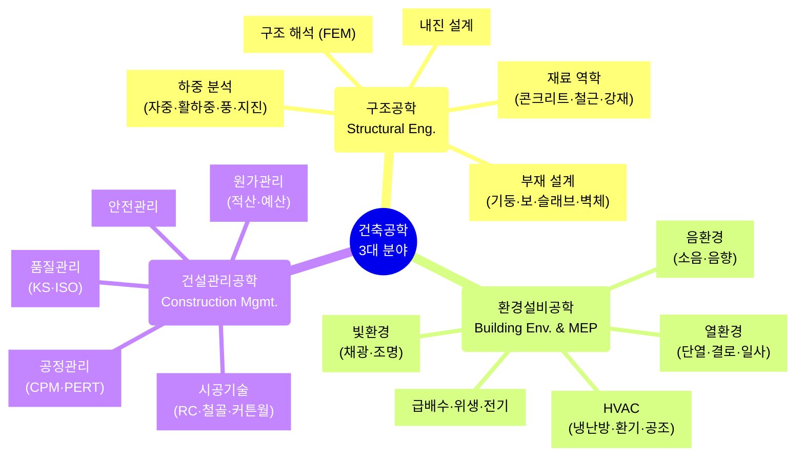
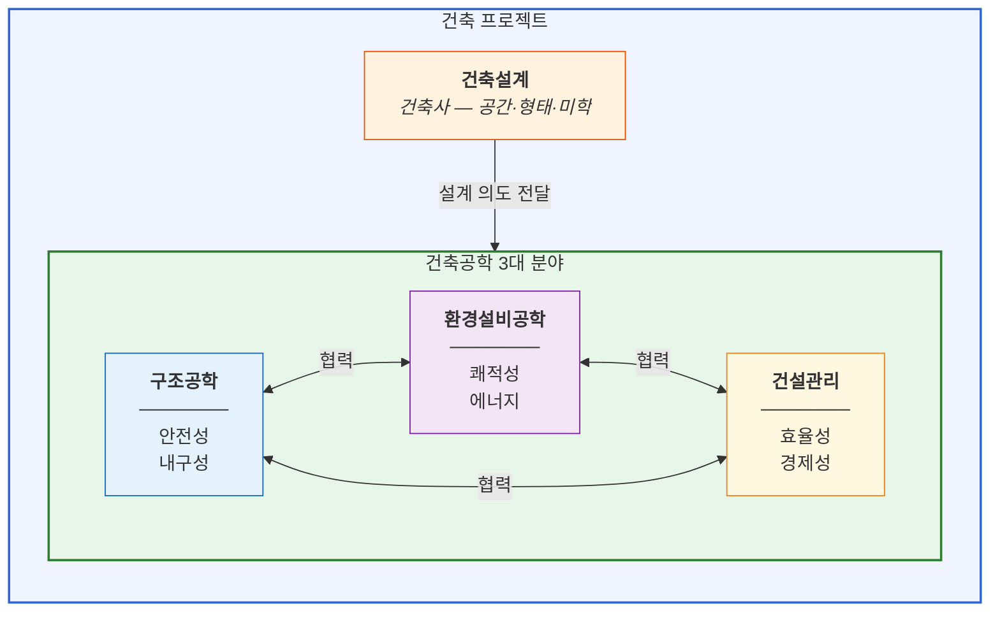
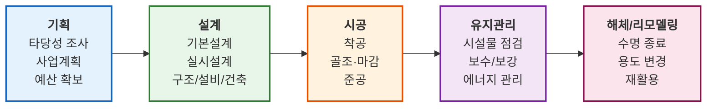
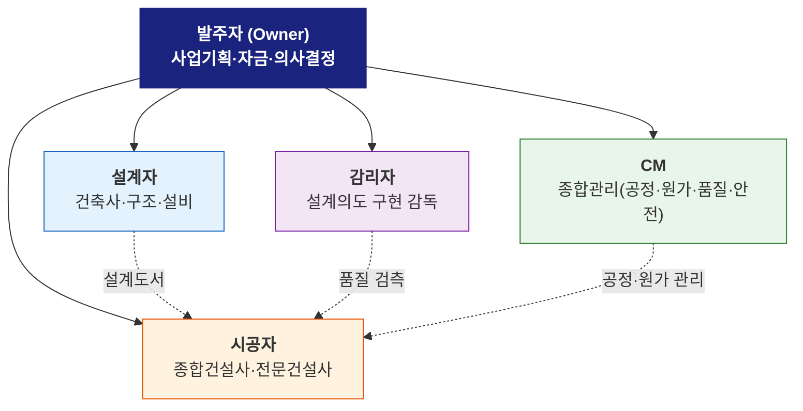
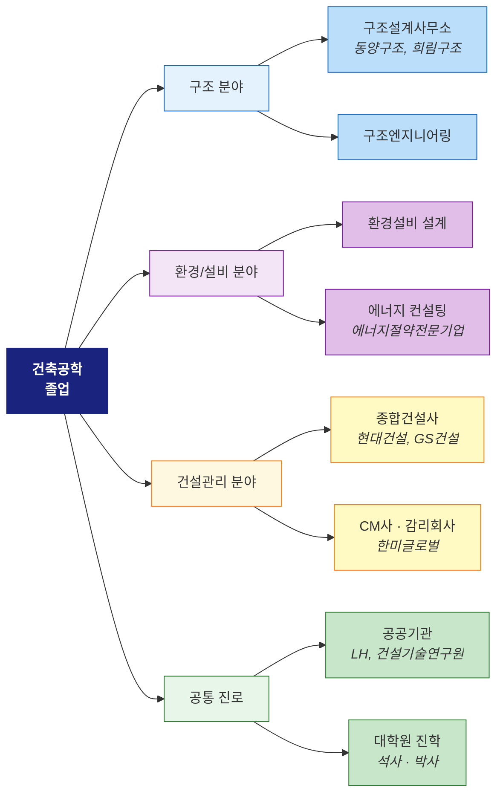
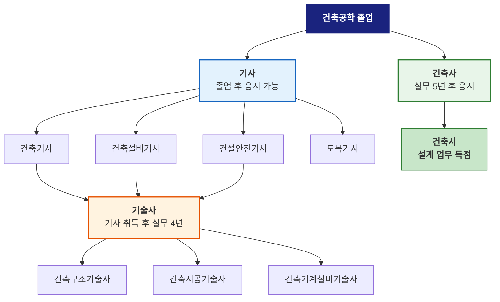

# L03. 건축공학의 현재 — "건설산업은 어떻게 돌아가는가"

> [!finding] 핵심 메시지
> 건설산업의 구조를 이해하고, 건축공학 3대 분야와 프로젝트 수행 체계를 파악한다.

## 강의 중점
- 건설산업의 정의와 범위
- 국내 건설산업 현황
- 건축공학 3대 분야(구조/환경설비/건설관리)와 협업 관계
- 건설 프로젝트 생애주기와 참여 주체
- 건축공학도의 진로

## 학습 목표
1. 건설산업의 정의, 범위, 규모를 설명할 수 있다.
2. 건축공학의 3대 분야(구조, 환경설비, 건설관리)와 각 분야의 역할을 이해한다.
3. 건설 프로젝트의 생애주기와 참여 주체의 역할을 설명할 수 있다.

## 강의 내용

---

### 도입 영상

> [!ref] 도입 영상 — 건설산업의 현재
> 
> - **구조엔지니어의 역할**: [What Structural Engineers Actually Do](https://www.youtube.com/watch?v=g246t5TrNXc) — 구조엔지니어가 건물을 설계하는 4단계 과정 (개념설계→상세설계→시공도서→현장감독, 7분)
> - **건설 프로젝트 발주 방식**: [Construction Delivery Methods — The Good, The Bad & The Ugly](https://www.youtube.com/watch?v=80_Ta2G3sQ8) — DBB·Design-Build·CM at Risk·IPD 등 발주 방식별 참여 주체와 장단점 비교 (9분)

> [!ref] 도입 영상 — 건축공학 전공 이해
> - **건축공학과 소개**: [건축학과 vs 건축공학과 — 진로가 다릅니다](https://www.youtube.com/watch?v=N1oKep9egsc) — 두 학과의 자격증·진로 차이를 명쾌하게 설명
> - **삼성물산 건설 현장**: [건설사 1위? 과연 연봉도 1위?! (ft. 네이버신사옥)](https://www.youtube.com/watch?v=1d4PsGkuLus) — 삼성물산 건설부문 신입사원의 하루 브이로그

> [!question] 생각해보기
> "건축물들을 만들기 위해 어떤 기술과 전문가가 필요할까?"

---

### 건설산업의 정의와 범위

- **건설산업**: 건축물, 토목구조물 등의 시설물을 설계, 시공, 유지관리하는 산업
- **건설산업기본법**에 의한 분류: 종합건설업, 전문건설업

#### 건축 vs 토목

| 구분 | 건축 (Building) | 토목 (Civil) |
|------|----------------|-------------|
| **대상** | 사람이 거주·활동하는 공간 | 사회 인프라 시설 |
| **예시** | 주택, 사무실, 학교, 병원 | 도로, 교량, 댐, 터널 |
| **관련법** | 건축법 | 시설물안전법 등 |
| **설계자** | 건축사 | 토목기술사 |

> [!ref] 법적 정의
> **건설산업기본법 제2조**: "건설업"이란 건설공사를 하는 업(業)으로서 종합공사를 시공하는 업종과 전문공사를 시공하는 업종을 말한다.

---

### 국내 건설산업 현황

| 지표 | 수치 | 비고 |
|------|------|------|
| **GDP 대비 비중** | 약 15% | 국가 경제의 핵심 산업 |
| **건설업 종사자** | 약 200만 명 | 전체 취업자의 약 7% |
| **건설투자 규모** | 약 300조 원/년 | 주거+비주거+토목 |
| **해외 건설 수주** | 약 300억 달러/년 | 중동·아시아 중심 |

#### 국내 주요 건설사 (2025 시공능력평가 상위)

| 순위 | 기업명 | 주요 분야 |
|------|--------|-----------|
| 1 | 삼성물산 | 초고층, 반도체 팹, 해외 플랜트 |
| 2 | 현대건설 | 인프라, 주택, 원자력 |
| 3 | 대우건설 | 주택, 토목, 해외 |
| 4 | GS건설 | 주택, 플랜트, 인프라 |
| 5 | 포스코이앤씨 | 주택, 플랜트 |
| 6 | HDC현대산업개발 | 주택 (아이파크) |
| 7 | DL이앤씨 | 주택 (e편한세상), 플랜트 |

> [!question] 생각해보기
> "건설산업이 GDP의 15%를 차지한다는 것은 어떤 의미일까? 건설이 멈추면 어떤 일이 벌어질까?"

---

### 건축공학의 학문 체계와 각 분야의 역할

건축공학은 크게 3대 분야로 구성되며, 각 분야가 유기적으로 협력하여 하나의 건축물을 완성한다.

#### 1) 건축구조공학 (Structural Engineering)

![[fem-building-analysis.png|500]]
*건물 구조의 유한요소해석(FEM) — 응력 분포 시각화 — 출처: JF.ag*

**"건물이 무너지지 않게 하는 것"** — 건축물의 안전성과 내구성을 책임지는 분야

| 세부 영역 | 내용 | 관련 과목 예시 |
|-----------|------|--------------|
| **하중 분석** | 건물에 작용하는 힘(자중, 활하중, 풍하중, 지진하중) 산정 | 구조역학, 동역학 |
| **부재 설계** | 기둥, 보, 슬래브, 벽체, 기초 등 각 부재의 단면 결정 | 철근콘크리트, 철골구조 |
| **재료 역학** | 콘크리트, 철근, 강재 등 건축 재료의 역학적 성질 이해 | 건축재료학 |
| **내진 설계** | 지진에 대한 구조물의 안전성 확보 | 내진공학 |
| **구조 해석** | 컴퓨터를 이용한 구조물의 거동 분석 (FEM 등) | 매트릭스구조해석 |

##### 세부 과목 소개

**구조역학 (Structural Mechanics)**

![[shear-moment-diagram.png|400]]
*보(beam)의 전단력·모멘트 다이어그램 — 출처: Penn State Mechanics Map*

구조역학은 구조공학의 가장 기초가 되는 과목으로, 건축물에 작용하는 하중이 부재 내부에서 어떻게 전달되는지를 이해한다. 자유물체도(free body diagram), 전단력-모멘트 다이어그램, 처짐·변형 해석 등을 학습하며, 이후 모든 설계 과목의 기반이 된다.

**철근콘크리트 (Reinforced Concrete)**

![[rc-beam-rebar.jpg|400]]
*철근콘크리트 보의 종방향 철근 배치 — 출처: Structural Basics*

콘크리트의 압축 강도와 철근의 인장 강도를 결합한 복합 재료의 역학적 거동과 설계 방법을 배운다. 한국 건축물의 대부분이 RC 구조이므로 가장 실무 활용도가 높은 과목이다. 보, 기둥, 슬래브, 기초의 단면 설계와 배근 상세를 학습한다.

**철골구조 (Steel Structure)**

![[steel-frame.jpg|400]]
*포털 프레임 철골 건물의 시공 현장 — 출처: SteelConstruction.info*

강재(Steel)를 이용한 건축물의 설계와 시공을 다룬다. H형강, 각형강관 등 다양한 강재 단면의 역학적 성질, 접합부(볼트·용접) 설계, 좌굴(Buckling) 현상을 학습한다. 초고층 건물, 대공간 구조물, 공장 건물 등에 주로 적용된다.

**내진공학 (Earthquake Engineering)**

![[shake-table-test.jpg|500]]
*5층 건물의 진동대(Shake Table) 내진 실험 — 출처: Phys.org / UCSD*

지진으로부터 건축물을 보호하기 위한 설계 이론과 기술을 배운다. 내진(Seismic Design), 면진(Base Isolation), 제진(Damping) 등 지진 저감 전략과 지진 하중 산정, 비선형 해석 방법을 학습한다. 한국도 경주 지진(2016) 이후 내진 설계 의무가 강화되었다.

**매트릭스구조해석 (Matrix Structural Analysis / FEM)**

![[fem-structure-analysis.png|500]]
*건축 구조물의 유한요소해석(FEM) 응력 분포 — 출처: Fundament Engineering*

컴퓨터를 이용한 구조 해석의 이론적 배경을 학습한다. 강성 행렬(Stiffness Matrix)의 조립, 유한요소법(Finite Element Method)의 원리를 이해하고, 상용 소프트웨어(MIDAS, SAP2000, ETABS 등)를 활용한 실무 해석 능력을 키운다.

**건축재료학 (Building Materials)**

![[concrete-cylinder-test.jpg|300]]
*콘크리트 원주 공시체 압축 시험 (ASTM C39) — 출처: Gilson Company*

콘크리트, 철근, 강재, 목재, 석재, 고분자 재료 등 건축에 사용되는 재료의 물리적·역학적·내구적 성질을 학습한다. 재료 시험(압축강도, 인장강도, 슬럼프 시험 등)을 직접 수행하며, 재료 선택이 구조 안전성과 내구성에 미치는 영향을 이해한다.

- **실무 예시**: 초고층 빌딩의 풍하중 해석, 면진·제진 장치 설계, 기존 건물 내진 보강
- **최신 트렌드**: AI 기반 구조 최적설계, 3D 프린팅 구조물, 고성능 콘크리트(UHPC)

#### 2) 건축환경설비공학 (Building Environment & MEP Engineering)

![[mep-hvac-system.jpg|500]]
*건물 HVAC(냉난방·환기·공조) 시스템 — 출처: NY Engineers*

![[mep-components.jpg|500]]
*MEP(기계·전기·배관) 엔지니어링의 주요 구성 요소 — 출처: Pinnacle Infotech*

**"건물 안에서 쾌적하게 생활할 수 있게 하는 것"** — 실내 환경의 질과 에너지 효율을 책임지는 분야

| 세부 영역 | 내용 | 관련 과목 예시 |
|-----------|------|--------------|
| **열환경** | 건물의 단열, 결로 방지, 일사 조절 | 건축환경학, 열전달 |
| **빛환경** | 자연채광, 인공조명, 조도 설계 | 건축조명설계 |
| **음환경** | 소음 제어, 실내 음향 설계 (강의실, 공연장) | 건축음향학 |
| **공기환경** | 실내 공기질(IAQ) 관리, 환기 설계 | 건축설비, 공기조화 |
| **HVAC** | 냉방·난방·환기·공기조화 시스템 설계 및 운영 | 공기조화설비 |
| **급배수·위생** | 급수, 배수, 오·폐수 처리, 소방설비 | 급배수위생설비 |
| **전기설비** | 전력 공급, 조명, 통신, 방재(화재 감지·경보) 설비 | 전기설비 |

##### 세부 과목 소개

**열환경 (Thermal Environment)**

![[thermal-bridge.png|400]]
*벽체 접합부의 열교(Thermal Bridge) 온도 분포 해석 — 출처: Wikimedia Commons / Zureks*

건물 외피(벽, 지붕, 창호)를 통한 열전달 현상을 이해하고, 단열·결로 방지·일사 조절 설계를 학습한다. 열교(Thermal Bridge) 해석, U-값 산정, 결로 판정 등을 통해 에너지 효율적인 건물 외피를 설계하는 능력을 키운다.

**빛환경 (Lighting & Daylighting)**

![[daylight-factor.jpg|400]]
*주광률(Daylight Factor) 분포 시뮬레이션 — 출처: Wikimedia Commons*

자연채광과 인공조명을 활용하여 쾌적하고 에너지 효율적인 빛환경을 설계한다. 조도(lux), 주광률, 글레어(눈부심) 평가 등을 학습하며, 시뮬레이션 도구(RADIANCE, DIALux 등)를 이용한 조명 설계 능력을 기른다.

**음환경 (Acoustics)**

소음 제어와 실내 음향 설계를 다룬다. 차음(Sound Insulation)과 흡음(Sound Absorption)의 원리, 잔향시간(Reverberation Time) 산정, 공연장·강의실·주거 공간의 음향 설계를 학습한다. CAD 모델 기반 음향 시뮬레이션(레이 트레이싱)으로 설계 검증을 수행한다.

**HVAC (냉난방·환기·공조)**

![[hvac-chilled-water.png|500]]
*냉수 시스템 계통도 — 냉동기, 냉각탑, AHU 등 구성 요소 — 출처: The Engineering Mindset*

냉방·난방·환기·공기조화 시스템의 원리와 설계 방법을 배운다. 열부하 계산, 장비 선정(냉동기, 보일러, AHU), 덕트·배관 설계, 자동제어(BAS) 등 건물의 온열환경을 쾌적하게 유지하기 위한 종합적인 기술을 학습한다.

**급배수·위생 (Plumbing)**

![[plumbing-riser.webp|400]]
*다층 건물의 급배수 라이저 다이어그램 — 출처: NY Engineers*

건물의 급수(상수), 배수(하수·오수), 위생설비, 소방설비의 설계를 다룬다. 수압 계산, 배관 경로 설계, 위생기구 선정, 옥내소화전·스프링클러 설계 등을 학습하며, 다층 건물에서의 수직 배관 시스템(라이저) 설계가 핵심이다.

**건축 에너지 (Building Energy)**

![[net-zeb-concept.png|400]]
*제로에너지건축물(Net ZEB)의 에너지 수지 개념 — 출처: Wikimedia Commons*

건축물의 에너지 소비 분석과 효율 향상 방안을 학습한다. 건물 에너지 시뮬레이션(EnergyPlus, ECO2 등), 신재생에너지 통합 설계(태양광, 지열), 에너지 성능 인증(에너지효율등급, ZEB 인증) 등을 다루며, 2025년부터 공공건축물에 의무화된 제로에너지건축물(ZEB) 설계의 핵심 과목이다.

- **실무 예시**: 제로에너지 건축물(ZEB) 설계, 스마트 빌딩 자동 제어(BAS), 데이터센터 냉각 시스템
- **최신 트렌드**: IoT 기반 실내환경 모니터링, 탈탄소 건축(Net-Zero), 히트펌프·지열 냉난방

> [!ref] 참고: 사람은 일생의 약 86%를 실내에서 보낸다
> 건축환경설비공학은 사람들이 가장 많은 시간을 보내는 실내 공간의 질을 결정한다. 온도, 습도, 조명, 소음, 공기질 — 이 모든 것이 건축환경설비 엔지니어의 영역이다. (출처: Penn State AE)

#### 3) 건설관리공학 (Construction Management & Engineering)

**"건물을 효율적으로, 안전하게, 제때 짓는 것"** — 건설 프로젝트의 기획부터 완공까지 전 과정을 관리하는 분야

| 세부 영역 | 내용 | 관련 과목 예시 |
|-----------|------|--------------|
| **시공기술** | 콘크리트·철골·커튼월 등 공종별 시공 방법 | 건축시공학 |
| **공정관리** | 전체 공사의 일정 계획 및 진도 관리 (CPM, PERT) | 건설공정관리 |
| **원가관리** | 공사비 산정(적산), 예산 관리, 원가 절감 | 건축적산학 |
| **품질관리** | 재료·시공 품질 확보 (KS, ISO 기준) | 건설품질관리 |
| **안전관리** | 현장 안전사고 예방, 안전 교육 | 건설안전공학 |
| **프로젝트 관리** | 발주, 계약, 설계관리, 리스크 관리 | 건설사업관리(CM) |

##### 세부 과목 소개

**건축시공학 (Construction Technology)**

![[column-formwork.jpg|400]]
*콘크리트 기둥의 목재 거푸집(Formwork) 설치 — 출처: Wikimedia Commons*

콘크리트 공사, 철골 공사, 조적 공사, 방수 공사, 커튼월 공사 등 각 공종별 시공 방법과 절차를 학습한다. 거푸집·동바리 설치, 콘크리트 타설·양생, 철골 세우기·접합 등 현장에서 실제로 수행하는 공정의 기술적 원리와 관리 방법을 익힌다.

**건설공정관리 (Schedule Management)**

![[cpm-network.svg|500]]
*CPM(Critical Path Method) Activity-on-Node 다이어그램 — 출처: Wikimedia Commons*

건설 프로젝트의 일정 계획 수립과 진도 관리 기법을 배운다. CPM(Critical Path Method), PERT, 간트 차트(Gantt Chart) 등의 공정관리 기법을 학습하고, 주공정(Critical Path)을 파악하여 공기 지연을 방지하는 관리 능력을 기른다. 실무에서는 Primavera P6, MS Project 등의 소프트웨어를 사용한다.

**건축적산학 (Cost Estimation)**

![[bim-section-cut.png|400]]
*BIM 기반 3D 모델의 단면 — 물량 산출의 기초 — 출처: Wikimedia Commons*

건축 공사비를 산정하는 적산(Quantity Surveying)의 이론과 실무를 학습한다. 설계 도면에서 물량(수량)을 산출하고, 단가를 적용하여 공사비를 산정하는 과정을 익힌다. 최근에는 BIM 모델에서 자동으로 물량을 추출하는 5D BIM 기술이 확산되고 있다.

**건설품질관리 (Quality Control)**

![[slump-test.jpg|400]]
*콘크리트 슬럼프 시험 — 현장 품질관리의 대표적 방법 — 출처: Wikimedia Commons*

건설 현장에서 재료와 시공의 품질을 확보하기 위한 관리 기법을 배운다. 콘크리트 슬럼프 시험, 압축강도 시험, 철근 배근 검사, 용접 비파괴 검사(NDT) 등 품질 검측 방법과 KS, ISO 9001 등 품질 기준을 학습한다.

**건설안전공학 (Safety Management)**

![[safety-harness.jpg|400]]
*건설현장 작업자의 안전 하네스(5점식) 착용 — 출처: Wikimedia Commons*

건설현장의 안전사고 예방과 안전 관리 체계를 학습한다. 추락, 낙하, 붕괴, 감전 등 주요 재해 유형별 예방 대책, 위험성 평가(Risk Assessment), 안전 교육·훈련을 다룬다. 2022년 시행된 **중대재해처벌법**으로 안전관리의 중요성이 한층 강조되고 있다.

- **실무 예시**: 대형 프로젝트 CM/PM, 공동주택 시공관리, 해외 건설 현장 관리
- **최신 트렌드**: BIM 기반 시공관리, 드론·로봇 활용 현장 모니터링, 모듈러·OSC(탈현장) 건설

#### 3대 분야의 협업 관계

> **협업 예시**: 구조 엔지니어가 기둥 위치를 정하면 → 설비 엔지니어가 배관/덕트 경로를 조율하고 → 시공 엔지니어가 시공 순서와 방법을 결정한다.

> [!action] 핵심 정리
> - **구조공학** = "무너지지 않게" (Safety)
> - **환경설비공학** = "쾌적하게" (Comfort & Sustainability)
> - **건설관리공학** = "제대로 짓게" (Efficiency & Quality)
> - 세 분야가 **동시에, 협력적으로** 작동해야 좋은 건축물이 탄생한다.

---

### 건설 프로젝트 생애주기 (Life Cycle)

건축물은 기획부터 해체까지 하나의 생애주기를 갖는다. 각 단계마다 다른 전문가가 주도적 역할을 한다.

| 단계 | 주요 활동 | 주도 주체 | 기간 (일반 건축물) |
|------|-----------|-----------|-------------------|
| **기획** | 타당성 조사, 사업계획 수립, 예산 확보, 부지 선정 | 발주자, 기획사 | 6개월~2년 |
| **설계** | 기본설계 → 실시설계, 구조/설비/건축 설계, 인허가 | 건축사, 구조/설비 엔지니어 | 6개월~1년 |
| **시공** | 착공 → 골조 → 마감 → 준공, 품질·안전·공정 관리 | 시공사, 감리자, CM | 1~3년 |
| **유지관리** | 시설물 점검, 보수/보강, 에너지 관리, 리모델링 | 시설관리사, FM사 | 30~100년 |
| **해체/리모델링** | 수명 종료 후 해체 또는 용도 변경 | 해체 전문업체 | 수개월 |

#### 생애주기별 참고 영상

> [!ref] 1단계: 기획
> - [사업 타당성 및 경제성 분석](https://www.youtube.com/watch?v=o3EHY-XB4Ig) — 교양동스쿨 (건설 프로젝트 기획의 경제성 분석 방법)
> - [The 5 Phases of a Construction Project](https://www.youtube.com/watch?v=jJkwkPkA0Is) — PM Principles (건설 프로젝트 5단계 전체 조망)

> [!ref] 2단계: 설계
> - [건축 설계 과정은 어떻게 이루어질까?](https://www.youtube.com/watch?v=ey3T2nURAjM) — 건축 노트 (계획설계→인허가→기본설계→실시설계)
> - [BIM 기술을 손쉽게 이해하는 방법](https://www.youtube.com/watch?v=O6Lmlf2hPY4) — BIM 프로세스와 시각화 기술 설명

> [!ref] 3단계: 시공
> - [아모레퍼시픽 본사 건축 타임랩스](https://www.youtube.com/watch?v=wJDAMCCRRmk) — 용산 본사 시공 3년(2014~2017) 압축 영상
> - [벌판에서 아파트까지 697일 타임랩스](https://www.youtube.com/live/xgL6zdrsmxY) — 나대지에서 아파트 단지 완성까지의 전 과정
> - [RC구조 2층주택 시공 타임랩스](https://www.youtube.com/watch?v=aIlhtaWpQwA) — 기초~완공까지 철근콘크리트 구조 시공 과정

> [!ref] 4단계: 유지관리
> - [시설물 안전관리 법규 및 안전점검](https://www.youtube.com/watch?v=BFZ0QKE73eM) — 국토안전관리원 (안전점검 법규와 절차)
> - [모두의 안전을 지키기 위한 건축물 정기점검](https://www.youtube.com/watch?v=6xrrd56xdPg) — 국토안전관리원 (정기점검 방법과 평가 기준)

> [!ref] 5단계: 해체/리모델링
> - [도심 한복판 건물 철거 — 컷앤다운 공법](https://www.youtube.com/watch?v=_OAy_MtMozA) — EBS 다큐프라임 (친환경 해체 기술)
> - [ㄱ자 콘크리트 구조 건물 정밀 해체](https://www.youtube.com/watch?v=2TdRbYYt1FQ) — 다큐프라임 (정밀 계산 기반 해체 공학)

> [!finding] 핵심 포인트
> 건설 프로젝트는 시공 단계뿐 아니라 **전체 생애주기**를 고려해야 한다. 유지관리 기간이 전체의 90% 이상을 차지하므로, 설계·시공 단계에서 유지관리를 고려한 의사결정이 중요하다.

---

### 건설산업의 참여 주체

| 참여 주체 | 역할 | 관련 자격 |
|-----------|------|-----------|
| **발주자** (Owner) | 사업 기획, 자금 조달, 의사결정 | — |
| **설계자** (Designer) | 건축/구조/설비 설계, 인허가 도서 작성 | 건축사, 기술사 |
| **시공자** (Contractor) | 현장 시공, 하도급 관리, 품질·안전 확보 | 건설기술인 |
| **감리자** (Supervisor) | 설계 의도 구현 감독, 품질 확인, 법적 검측 | 건축사, 기술사 |
| **CM** (Construction Manager) | 종합 관리 (공정, 원가, 품질, 안전) | 건설사업관리기술인 |

---

### 프로젝트 발주 방식

건설 프로젝트의 발주 방식에 따라 참여 주체의 역할과 책임이 달라진다.

| 발주 방식 | 설명 | 장점 | 단점 |
|-----------|------|------|------|
| **DBB** (설계-시공 분리) | 설계 완료 후 시공 입찰 | 설계 품질 확보, 경쟁 입찰 | 공기 길어짐, 설계-시공 간 갈등 |
| **DB/Turn-key** (설계-시공 일괄) | 하나의 업체가 설계+시공 | 공기 단축, 책임 명확 | 설계 품질 우려, 발주자 통제력 약화 |
| **CM at Risk** | CM이 비용 보증하며 관리 | 전문적 관리, 비용 예측 가능 | CM 역량에 의존, 비용 증가 |
| **IPD** (Integrated Project Delivery) | 발주자·설계자·시공자 통합 계약 | 협업 극대화, 낭비 최소화 | 복잡한 계약 구조, 신뢰 필요 |

> [!ref] 참고
> 국내에서는 **DBB(설계-시공 분리 발주)**가 가장 일반적이며, 공공 공사의 대부분이 이 방식을 따른다. 최근에는 BIM 기반 IPD 도입이 논의되고 있다.

---

### 건축공학도의 진로 (3대 분야별)

#### 분야별 구체적 직무 소개

##### 구조공학 분야

| 항목               | 내용                                    |
| ---------------- | ------------------------------------- |
| **주요 업무**        | 구조설계, 내진/내풍설계, 안전점검/정밀진단, 구조감리, 법원감정  |
| **대표 기업**        | 동양구조, 하중구조, 삼우구조, 에스디엔지니어링, 대형건설사 구조팀 |
| **초봉 (구조설계사무소)** | 3,000~3,500만 원                        |
| **경력 10년+**      | 5,000~7,000만 원                        |
| **구조기술사 취득 시**   | 평균 연봉 1억 원 이상                         |

##### 건축설비 분야

| 항목 | 내용 |
|------|------|
| **주요 업무** | 냉난방/공조설계, 급배수/위생설비, 소방설비, 에너지 효율 분석 |
| **대표 기업** | 삼성E&A, 현대엔지니어링, 희림종합건축, 설비전문 엔지니어링사 |
| **초봉** | 3,000~3,500만 원 (대형 엔지니어링사 4,000만 원+) |
| **전망** | 스마트홈, 제로에너지건축물 의무화로 수요 증가 |

##### 건설관리/시공 분야

| 항목                | 내용                                    |
| ----------------- | ------------------------------------- |
| **주요 업무**         | 현장시공관리, 공정관리, 품질관리, 안전관리, 감리          |
| **대표 기업 (시공)**    | 삼성물산, 현대건설, 대우건설, DL이앤씨, GS건설, 포스코이앤씨 |
| **대표 기업 (CM/감리)** | 한미글로벌, 건화, 삼우CM                       |
| **대형건설사 초봉**      | 계약연봉 4,500만 원 + 현장수당 → 실수령 7,000만 원+  |
| **공기업**           | LH(한국토지주택공사), SH(서울주택도시공사), 한국도로공사    |
| **특징**            | 현장 전국 순환근무가 일반적                       |

#### 건축 관련 자격증 체계

건축공학 전공자가 취득할 수 있는 주요 자격증의 경로를 이해한다.

| 자격증 | 응시 요건 | 역할/권한 | 난이도 | 합격률 | 비고 |
|--------|-----------|-----------|--------|--------|------|
| **건축기사** | 관련학과 졸업 | 설계·시공·감리 참여 | 중 | ~20%대 | 시공사 취업 필수. 국가기술자격 중 인기 상위 |
| **건축설비기사** | 관련학과 졸업 | 기계설비 설계·시공 | 중상 | 필기 61%, 실기 23% | 실기 난이도 높음 |
| **건설안전기사** | 관련학과 졸업 | 안전관리 업무 | 중 | 필기 50%, 실기 60% | 중대재해처벌법으로 수요 급증 |
| **건축구조기술사** | 기사 + 실무 4년 | 구조 설계 책임 | 최상 | 필기 2~5% | 국내 취득자 ~1,000명. 연봉 1억+ |
| **건축시공기술사** | 기사 + 실무 4년 | 시공 기술 총괄 | 상 | 낮음 | 현장소장·감리원 필수 |
| **건축기계설비기술사** | 기사 + 실무 4년 | 설비 설계 총괄 | 상 | 낮음 | 4대 건축기술사 중 하나 |
| **건축사** | 실무 5년 + 시험 | 건축물 설계 독점 권한 | 최상 | 낮음 | 건축학 5년제 또는 건축공학 졸업 + 실무 |

> [!action] 팁
> 재학 중 **건축기사** 취득을 목표로 준비하면 졸업 후 진로 선택의 폭이 넓어진다. 기사 자격은 이후 기술사·건축사로 가는 첫 관문이다.

#### 신흥 직무 (Emerging Careers)

| 직종 | 내용 |
|------|------|
| **BIM Manager** | 설계-시공-준공 전 과정의 BIM 총괄. 2030년까지 모든 공공공사 BIM 의무화 |
| **스마트건설 엔지니어** | AI, IoT, 로봇, 드론, 3D프린터, VR/AR 기술을 건설에 적용 |
| **건설 AI 엔지니어** | 구조해석 AI 자동화, 안전 모니터링, 품질검사 자동화, 공정 최적화 |
| **디지털 트윈 전문가** | BIM + IoT 데이터를 결합한 건축물 디지털 트윈 구축·운영 |
| **제로에너지건축 컨설턴트** | 에너지 효율 설계, 신재생에너지 통합, 에너지 성능 인증 |

#### 대학원 진학

| 항목 | 내용 |
|------|------|
| **석사 (2년)** | 구조, 시공, 재료, 설비, 건설관리 세부전공. 대형 건설사·연구소 취업 시 우대 |
| **박사 (3~4년)** | 대학 교수, 국책연구소(KICT, KISTEC 등), 기업 R&D센터 |
| **장점** | 기술사 응시자격 경력기간 단축, 건설기술인 등급 상향, 연봉 프리미엄 |

#### 진로 관련 참고 영상

> [!ref] 진로 탐색 영상
> - [건축학과 vs 건축공학과 — 진로가 다릅니다](https://www.youtube.com/watch?v=N1oKep9egsc) — 두 학과의 자격증·진로 차이
> - [건축 취업 현실 — 데이터 분석](https://www.youtube.com/watch?v=K14-aGAvbHw) — 구인공고 데이터 기반 취업 전망
> - [구조기술사가 알려주는 건축 취업전망](https://www.youtube.com/watch?v=OILpsLIy_hs) — 기문당 (40년 경력 구조기술사의 조언)
> - [삼성물산 현장 vs 본사 하루 비교](https://www.youtube.com/watch?v=9V5p2deiFco) — 현장 2년차 vs 본사 7년차 현직자 브이로그
> - [건설산업을 진화시킨 최신 기술들](https://www.youtube.com/watch?v=G9Aq7akqXJU) — 한국건설산업연구원 (4차산업혁명과 건설)

> [!action] 참고
> 건축공학 졸업 후 진로는 3대 분야에 한정되지 않는다. 최근에는 **BIM 매니저, 건설 데이터 분석가, 스마트 건설 엔지니어** 등 새로운 직무가 빠르게 등장하고 있다. → [[L04-건축공학의-미래|L04]]에서 상세히 다룸

---

## 실습/과제
- [ ] **과제 1**: 건축공학 3대 분야(구조, 환경설비, 건설관리) 중 관심 분야를 선택하고, 해당 분야의 최근 기술 동향을 **1분 숏폼 영상** 또는 **A4 1매**로 정리하여 제출
  - 제출 방식: 이메일 (조교)
  - 마감: W03 수업 전

## Notes
- 수업 중 질문/피드백:
- 다음 수업 준비사항: 건설산업 과제 관련 뉴스 검색

## 이미지 출처

| 파일명 | 설명 | 출처 |
|--------|------|------|
| `fem-building-analysis.png` | 건물 구조 FEM 해석 시각화 | [JF.ag Blog](https://www.blog.jf.ag/) |
| `shear-moment-diagram.png` | 전단력·모멘트 다이어그램 | [Penn State Mechanics Map](https://mechanicsmap.psu.edu/) |
| `rc-beam-rebar.jpg` | RC 보 종방향 철근 배치 | [Structural Basics](https://www.structuralbasics.com/reinforced-concrete-beam/) |
| `steel-frame.jpg` | 포털 프레임 철골 건물 | [SteelConstruction.info](https://steelconstruction.info/Framing_schematics) |
| `shake-table-test.jpg` | 5층 건물 진동대 내진 실험 | [Phys.org / UCSD](https://phys.org/news/2012-04-five-story-seismic-table-earthquake-readiness.html) |
| `fem-structure-analysis.png` | 건축 구조물 FEM 응력 분포 | [Fundament Engineering](https://fundament.com.au/services?service=finite-elements-and-structural-analysis-of-special-structures) |
| `concrete-cylinder-test.jpg` | 콘크리트 압축 시험 | [Gilson Company](https://www.globalgilson.com/blog/concrete-cylinder-test) |
| `mep-hvac-system.jpg` | HVAC 시스템 | [NY Engineers](https://www.ny-engineers.com/blog/what-does-mep-mean-in-construction) |
| `mep-components.jpg` | MEP 엔지니어링 구성요소 | [Pinnacle Infotech](https://pinnacleinfotech.com/mep-engineering-in-modern-construction/) |
| `thermal-bridge.png` | 벽체 열교 온도 분포 | [Wikimedia Commons / Zureks](https://en.wikipedia.org/wiki/Thermal_bridge) |
| `daylight-factor.jpg` | 주광률 분포 시뮬레이션 | [Wikimedia Commons](https://commons.wikimedia.org/wiki/Category:Daylighting) |
| `hvac-chilled-water.png` | 냉수 시스템 계통도 | [The Engineering Mindset](https://theengineeringmindset.com/chilled-water-schematics/) |
| `plumbing-riser.webp` | 급배수 라이저 다이어그램 | [NY Engineers](https://www.ny-engineers.com/mep-engineering-services/plumbing-services/plumbing-riser-diagram) |
| `net-zeb-concept.png` | Net ZEB 에너지 수지 개념 | [Wikimedia Commons](https://en.wikipedia.org/wiki/Zero-energy_building) |
| `column-formwork.jpg` | 콘크리트 기둥 거푸집 | [Wikimedia Commons](https://en.wikipedia.org/wiki/Formwork) (CC BY-SA 3.0) |
| `cpm-network.svg` | CPM Activity-on-Node 다이어그램 | [Wikimedia Commons](https://en.wikipedia.org/wiki/Critical_path_method) (CC BY-SA 3.0) |
| `bim-section-cut.png` | BIM 3D 모델 단면 | [Wikimedia Commons](https://en.wikipedia.org/wiki/Building_information_modeling) |
| `slump-test.jpg` | 콘크리트 슬럼프 시험 | [Wikimedia Commons](https://en.wikipedia.org/wiki/Concrete_slump_test) |
| `safety-harness.jpg` | 건설현장 안전 하네스 | [Wikimedia Commons](https://en.wikipedia.org/wiki/Safety_harness) |

> 모든 이미지는 교육 목적으로 사용되었으며, 저작권은 각 출처에 있습니다.

## Related
- **이전 강의**: [[L02-건축공학의-역사와 교훈]]
- **다음 강의**: [[L04-건축공학의-미래]]
- **강의일정**: [[00-Syllabus/강의일정_2026-1|강의일정표]]
- **MOC**: [[200-Lecture/_MOC]]
