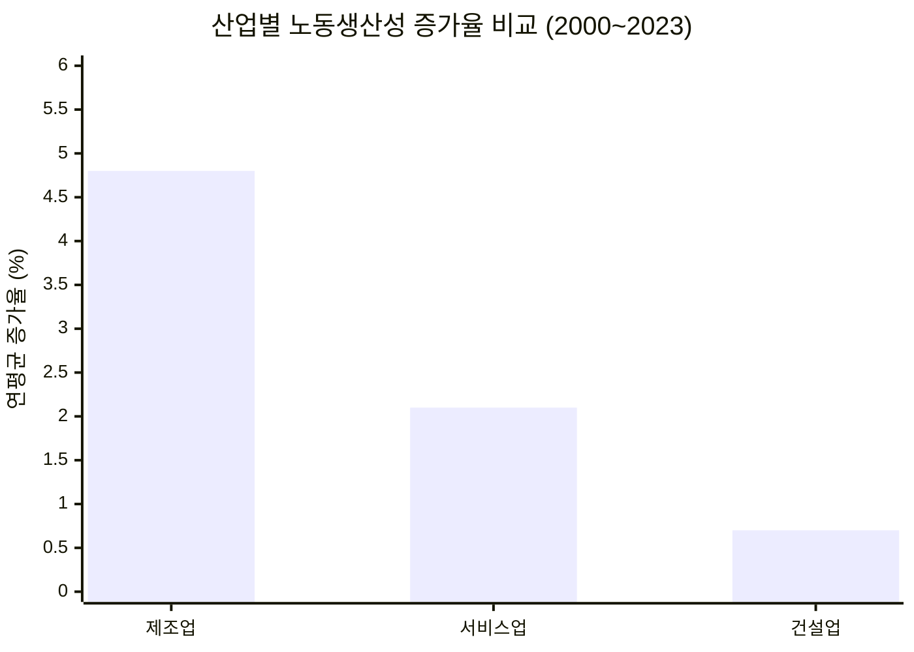
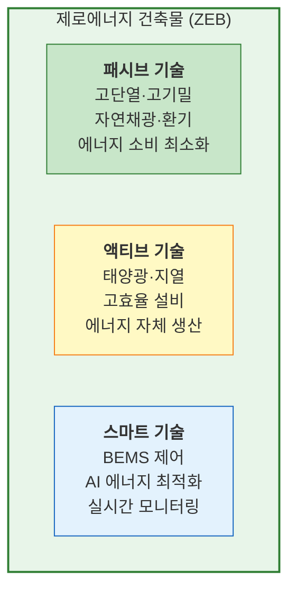
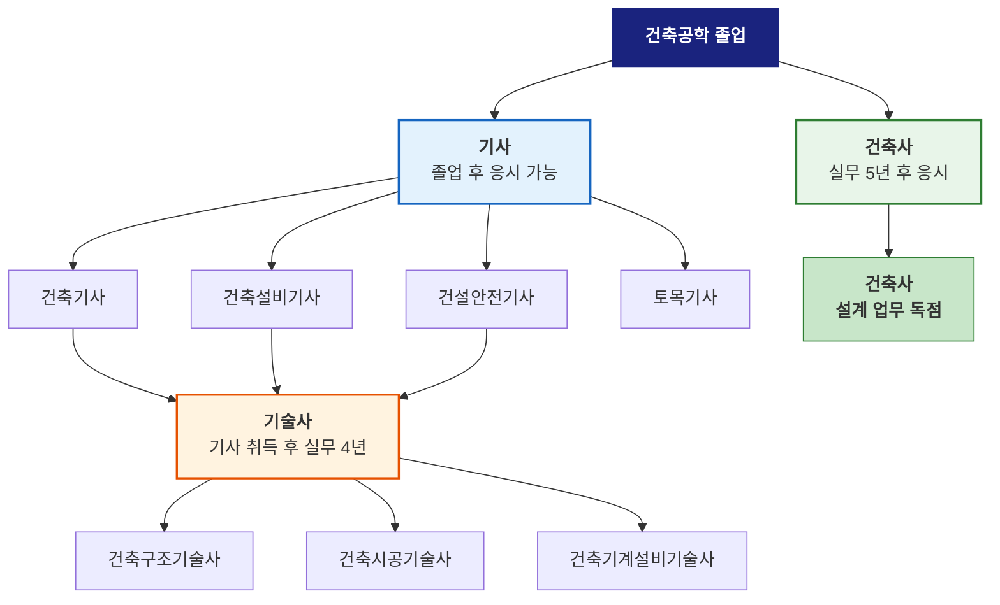
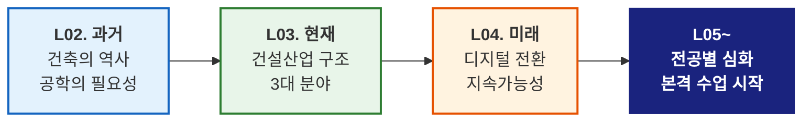

# L04. 건축공학의 미래 — "건설산업은 어디로 가는가"

> [!finding] 핵심 메시지
> 건설산업이 직면한 과제를 인식하고, 기술 혁신과 미래 변화 방향을 조망한다.

## 강의 중점
- 국내 건설산업의 과제 (인력, 생산성, 안전, 환경)
- 디지털 전환과 스마트 건설
- 모듈러/OSC, 자동화/로봇
- 지속가능성과 탄소중립
- 건축 관련 자격증 체계와 커리어 경로
- warming up 마무리 — 건축공학도에게 보내는 메시지

## 학습 목표
1. 국내 건설산업이 직면한 주요 과제를 설명할 수 있다.
2. 디지털 전환, 모듈러 건설, 지속가능성 등 미래 변화 방향을 이해한다.
3. 건축 관련 자격증 체계와 커리어 경로를 파악한다.

## 강의 내용

---

### 국내 건설산업의 과제

건설산업은 국가 경제의 핵심이지만, 구조적 문제가 심화되고 있다.

#### 1) 인력 부족 및 고령화

| 지표 | 현황 | 비고 |
|------|------|------|
| **건설 기능인력 평균 연령** | 약 52세 (2024) | 30대 이하 비율 급감 |
| **외국인 근로자 비율** | 약 15% | E-9 비자 기반 |
| **신규 유입 감소율** | 연 3~5% 감소 | 3D 업종 기피 현상 |

> [!ref] 참고 영상
> [건설현장 인력 부족, 어디까지 왔나](https://www.youtube.com/results?search_query=건설현장+인력부족+2024) — 주요 뉴스 보도

- 건설현장 기능인력의 고령화가 가속화되면서 숙련공 확보가 점점 어려워지고 있음
- 젊은 세대의 건설업 기피 → **자동화·로봇** 도입의 핵심 동인

#### 2) 생산성 정체

- 건설업 노동생산성 증가율은 **제조업의 1/7 수준**
- McKinsey (2017): "건설업은 생산성 측면에서 가장 뒤처진 산업 중 하나"
- 주요 원인: 현장 중심 생산 방식, 낮은 디지털화율, 파편화된 공급망

#### 3) 안전 문제

| 지표 | 수치 | 비고 |
|------|------|------|
| **건설업 사망사고 비율** | 전 산업 사망의 약 50% | 매년 약 400명 이상 사망 |
| **산업재해율** | 약 0.9% | 전 산업 평균의 약 2배 |
| **주요 사고 유형** | 떨어짐(46%), 깔림(15%), 부딪힘(11%) | 고용노동부 2023 |

> [!deadline] 중대재해처벌법 (2022.1 시행)
> 사업주·경영책임자에게 안전관리 의무 부과. 위반 시 **1년 이상 징역 또는 10억 원 이하 벌금**. 건설현장 안전관리 패러다임의 근본적 전환을 요구하고 있다.

#### 4) 환경 규제와 탄소 배출

- 건설·건물 부문 CO₂ 배출: 전 세계 탄소 배출의 **약 37%** (UNEP, 2023)
  - 건설 과정(시멘트 생산, 운반 등): 약 10%
  - 건물 운영(냉난방, 전기): 약 27%
- 한국 **2050 탄소중립** 선언 → 건축물 에너지 성능 기준 강화
- 건설 폐기물: 연간 약 7천만 톤 (전체 산업폐기물의 약 50%)

> [!question] 생각해보기
> "이 4가지 과제를 동시에 해결할 수 있는 방법은 없을까?"

---

### 디지털 전환 (Digital Transformation)

건설산업의 디지털 전환은 생산성 향상과 안전 확보의 핵심 전략이다.

#### BIM (Building Information Modeling)

- 건축물의 3D 모델에 **시간(4D), 비용(5D), 에너지(6D)** 등 다차원 정보를 통합
- 2025년부터 **공공 건축물 BIM 설계 의무화** (조달청)
- 설계 오류 사전 검토(Clash Detection), 시공 시뮬레이션, 유지관리 활용

> [!ref] 참고 영상
> [BIM이란 무엇인가? (8:32)](https://www.youtube.com/watch?v=G51IvNsQjEk) — 한국BIM학회

#### AI와 건설

| 적용 분야 | 활용 사례 | 효과 |
|-----------|-----------|------|
| **설계 최적화** | 생성형 AI 기반 구조 최적설계 | 재료비 10~30% 절감 |
| **안전 관리** | CCTV + AI 영상 분석 → 위험 행동 감지 | 사고 예방 |
| **공정 관리** | AI 기반 공정 예측 및 지연 분석 | 공기 단축 5~15% |
| **품질 관리** | 드론 + AI 이미지 분석 → 균열·결함 탐지 | 검측 시간 80% 절감 |

#### IoT와 스마트 건설

- **현장 모니터링**: 센서 기반 구조물 변형, 온·습도, 소음 실시간 측정
- **장비 관리**: GPS/IoT 기반 건설장비 위치·가동률 추적
- **안전 관리**: 스마트 안전모(낙하 감지), 웨어러블 기기(피로도 모니터링)

> [!ref] 참고 영상
> [스마트 건설 기술 — 국토교통부](https://www.youtube.com/results?search_query=스마트건설+국토교통부) — 스마트 건설 챌린지 소개

---

### 모듈러/OSC · 자동화/로봇

#### 모듈러 건축 (Modular Construction) & OSC

| 항목 | 기존 현장 시공 | 모듈러/OSC |
|------|---------------|-----------|
| **공기** | 기준 | 30~50% 단축 |
| **품질** | 현장 의존 | 공장 품질관리 (균일) |
| **폐기물** | 많음 | 80% 이상 감소 |
| **인력** | 대규모 현장 인력 | 공장 근로자 + 소규모 현장 인력 |
| **한계** | — | 운송 제약, 설계 자유도 제한, 초기 투자비 |

- **국내 사례**: 대학 기숙사, 군 막사, 임시 의료시설 (코로나19 대응)
- **해외 사례**: 싱가포르 공공주택 (PPVC 의무화), 영국 모듈러 호텔, 미국 Katerra

> [!ref] 참고 영상
> [모듈러 건축의 미래](https://www.youtube.com/results?search_query=modular+construction+future) — 다양한 해외 사례 영상

#### 건설 로봇과 자동화

| 분야 | 기술 | 현재 수준 |
|------|------|-----------|
| **측량** | 드론 자동 측량, 3D LiDAR 스캔 | 실용화 |
| **구조물 시공** | 3D 프린팅 (콘크리트, 금속) | 시범 적용 |
| **철근 작업** | 철근 절단/배근/결속 로봇 | 시범 적용 |
| **마감 작업** | 미장·도장 로봇, 타일 시공 로봇 | 연구/시범 |
| **안전 점검** | 벽면 등반 로봇, 수중 점검 드론 | 시범 적용 |
| **해체** | 원격 조종 해체 로봇 | 실용화 |

> [!ref] 참고 영상
> [건설 로봇 기술 총정리](https://www.youtube.com/results?search_query=construction+robot+2024) — 최신 건설 로봇 기술 소개

---

### 지속가능성 (Sustainability)

#### 제로에너지 건축물 (ZEB: Zero Energy Building)

- **정의**: 건물이 소비하는 에너지를 신재생에너지로 자체 생산하여 에너지 소비량을 최소화하는 건축물
- **국내 정책**: 2025년부터 공공 건축물 ZEB 의무화, 2030년 민간 확대 예정
- **5개 등급**: ZEB 1등급(에너지 자립률 100% 이상) ~ 5등급(20% 이상)

#### 탄소중립과 순환경제

| 전략 | 내용 | 기대 효과 |
|------|------|-----------|
| **저탄소 재료** | 저탄소 시멘트, 재활용 골재, 목구조 | 탄소 배출 30~50% 저감 |
| **DfD** (Design for Disassembly) | 해체·재조립 가능한 설계 | 건설 폐기물 최소화 |
| **CCUS** | 탄소 포집·활용·저장 기술 | 시멘트 산업 탄소 감축 |
| **LCA** (Life Cycle Assessment) | 건축물 전 생애주기 탄소 평가 | 의사결정 근거 |

---

### 글로벌 건설산업 트렌드

| 트렌드 | 주요 내용 | 선도 국가 |
|--------|-----------|-----------|
| **스마트 건설** | BIM 의무화, 디지털 트윈 | 싱가포르, 영국, 한국 |
| **DfMA** (Design for Manufacturing & Assembly) | 공장 제작 최적화 설계 | 싱가포르, 호주 |
| **건설 로봇** | 3D 프린팅, 자동화 시공 | 미국, 일본, 중국 |
| **탄소중립** | Net-Zero 건축물, ESG 경영 | EU, 미국, 한국 |
| **인프라 투자** | 대규모 인프라 현대화 | 미국(IRA), EU(Green Deal) |

> [!ref] 참고
> McKinsey Global Institute (2017), *"Reinventing Construction: A Route to Higher Productivity"* — 건설산업 생산성 혁신 로드맵. 디지털화, 규제 개혁, 공급망 혁신 등 7대 전략 제시.

---

### 건축 관련 자격증 체계

건축공학 전공자가 취득할 수 있는 주요 자격증의 경로를 이해한다.

| 자격증 | 응시 요건 | 역할/권한 | 난이도 |
|--------|-----------|-----------|--------|
| **건축기사** | 관련학과 졸업 | 설계·시공·감리 참여 | 중 |
| **건축설비기사** | 관련학과 졸업 | 기계설비 설계·시공 | 중 |
| **건축구조기술사** | 기사 + 실무 4년 | 구조 설계 책임 | 최상 |
| **건축시공기술사** | 기사 + 실무 4년 | 시공 기술 총괄 | 최상 |
| **건축사** | 실무 5년 + 시험 | 건축물 설계 독점 권한 | 최상 |

> [!action] 팁
> 재학 중 **건축기사** 취득을 목표로 준비하면 졸업 후 진로 선택의 폭이 넓어진다. 기사 자격은 이후 기술사·건축사로 가는 첫 관문이다.

---

### 건축공학도에게 보내는 메시지

> [!hypothesis] Warming Up을 마치며
> L02~L04의 3개 강의를 통해 건축공학의 **과거, 현재, 미래**를 살펴보았다.
>
> - **과거** ([[L02-건축공학의-역사와 교훈|L02]]): 건축은 인류 문명과 함께 발전해 왔고, 공학적 접근의 부재는 재앙을 초래했다.
> - **현재** ([[L03-건축공학의-현재|L03]]): 건설산업은 GDP 15%를 차지하는 거대 산업이며, 구조·환경설비·건설관리 3대 분야가 협력하여 건축물을 완성한다.
> - **미래** (이번 강의): 건설산업은 디지털 전환, 자동화, 지속가능성의 혁신을 통해 근본적으로 변화하고 있다.
>
> 다음 주부터는 각 교수님들의 **전공 분야별 심화 강의**가 시작된다. 오늘까지 배운 큰 그림을 기억하면서, 각 분야의 세부 내용을 배워 나가자.

---

## 실습/과제
- [ ] **과제 2**: 국내 건설산업의 최근 이슈(안전, 인력, 기술) 중 1개를 선택하여 현황과 해결방안을 A4 2매로 정리
  - 제출 방식: 이메일 (조교)
  - 마감: W04 수업 전

## Notes
- 수업 중 질문/피드백:
- 다음 수업 준비사항: 건축구조 기초 개념 예습 (홍원기 교수님 강의)

## Related
- **이전 강의**: [[L03-건축공학의-현재]]
- **다음 강의**: [[L05-건축구조-홍원기-1]]
- **관련 주제**: [[L29-건설산업-메가트렌드]], [[L30-미래-건축공학도의-역량]]
- **강의일정**: [[00-Syllabus/강의일정_2026-1|강의일정표]]
- **MOC**: [[400-Lab/_MOC]]
