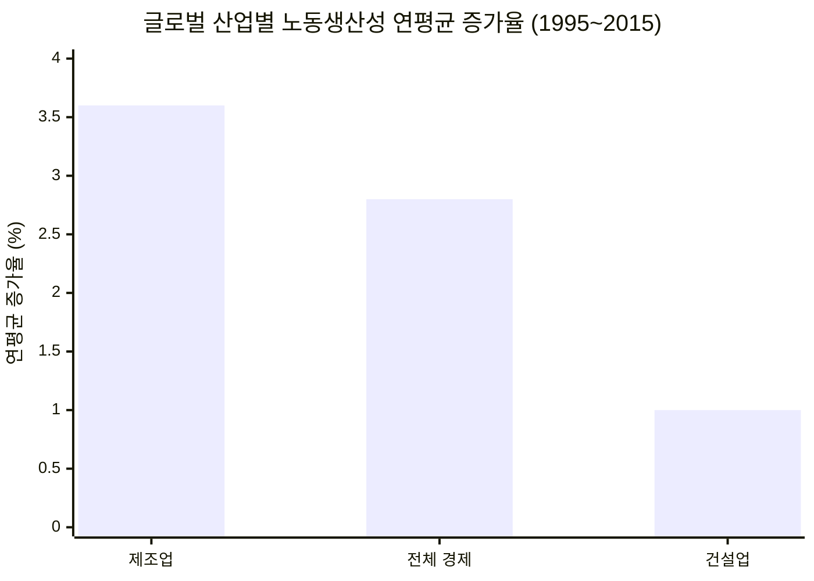
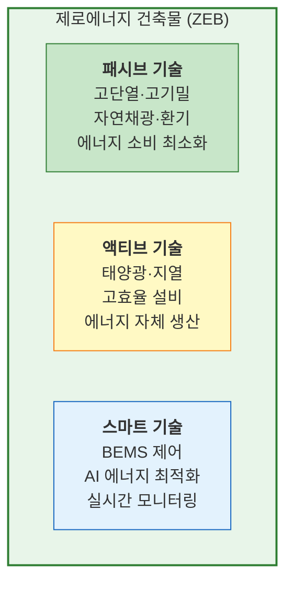
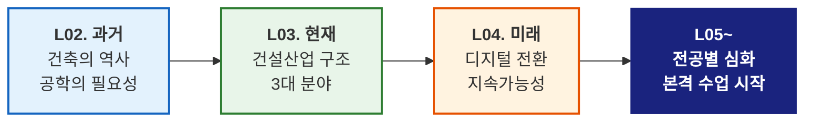

# L04. 건축공학의 미래 — "건설산업은 어디로 가는가"

> [!finding] 핵심 메시지
> 건설산업이 직면한 과제를 인식하고, 기술 혁신과 미래 변화 방향을 조망한다.

## 강의 중점
- 국내 건설산업의 과제 (인력, 생산성, 안전, 환경)
- 디지털 전환과 스마트 건설
- 모듈러/OSC, 자동화/로봇
- 지속가능성과 탄소중립
- warming up 마무리 — 건축공학도에게 보내는 메시지

## 학습 목표
1. 국내 건설산업이 직면한 주요 과제를 설명할 수 있다.
2. 디지털 전환, 모듈러 건설, 지속가능성 등 미래 변화 방향을 이해한다.
3. 디지털 트윈, VR/AR, 3D 프린팅 등 신기술의 개념을 파악하고 심화 학습 방향을 인식한다.

## 강의 내용

---

### 국내 건설산업의 과제

건설산업은 국가 경제의 핵심이지만, 구조적 문제가 심화되고 있다.

#### 1) 인력 부족 및 고령화

| 지표 | 현황 | 비고 |
|------|------|------|
| **건설 기능인력 평균 연령** | 약 52세 (2024) | 30대 이하 비율 급감 |
| **외국인 근로자 비율** | 약 15% | E-9 비자 기반 |
| **신규 유입 감소율** | 연 3~5% 감소 | 3D 업종 기피 현상 |

![[aging-construction-workers.jpg|500]]
*한국 건설현장의 고령화 현실 — 60대 이상 비중이 40대를 처음 추월 (2024) — 출처: Korea Bizwire*

> [!ref] 참고 영상
> ["현장 전문가 없어요"‥건설 인력 노령화](https://www.youtube.com/watch?v=ppMNVKB0y5s) — MBC 뉴스데스크

- 건설현장 기능인력의 고령화가 가속화되면서 숙련공 확보가 점점 어려워지고 있음
- 젊은 세대의 건설업 기피 → **자동화·로봇** 도입의 핵심 동인

#### 2) 생산성 정체

**글로벌 현황** — McKinsey Global Institute (2017), *Reinventing Construction*

- 건설업 노동생산성 증가율은 **제조업의 약 1/4 수준** (1.0% vs 3.6%)
- 41개국(세계 GDP의 96%) 대상 분석 — 출처: OECD, WIOD, World Bank, BEA, BLS
- McKinsey (2024) 후속 분석: 건설업 생산성은 약 25년간 **총 10% 개선에 불과** (연평균 0.4%)
- 미국의 경우 제조업·농업 등은 1950년대 이후 생산성이 10~15배 증가했으나, 건설업은 1968년 수준에서 정체

> [!ref] 참고 그래프 — 제조업 대비 건설업 생산성 격차
> **미국 산업별 누적 생산성 변화 (1947~2010)** — 제조업 760% 성장 vs 건설업 6% 성장
> 
> 출처: McKinsey Global Institute (2017), *Reinventing Construction* / Global Housing Watch Newsletter 인용
>
> **미국 건설업 vs 전체 경제 생산성 추이 (1950~2020)** — 50년간 전체 경제 생산성은 2배 증가, 건설업은 오히려 40% 하락
> 
> 출처: Goolsbee & Syverson (2023), *"The Strange and Awful Path of Productivity in the US Construction Sector"*, Becker Friedman Institute, University of Chicago

**국내 현황** — 한국건설산업연구원 (CERIK, 2022), *한국 건설산업 생산성 분석*

| 지표 | 건설업 | 전산업 | 비고 |
|------|--------|--------|------|
| **부가가치 노동생산성지수** (2011→2021) | 104.1 → 94.5 ↓ | 98.8 → 113.5 ↑ | 건설업만 하락 |
| **OECD 노동생산성 순위** (2010→2019) | 22위 → 26위 ↓ | 23위 → 22위 ↑ | 건설업 순위 하락 |
| **총요소생산성 기여율** (2001~2020) | **−47%** | +15% | 기술혁신 기여 미흡 |
| **부가가치 증가율** (2001~2020) | 1.53%/년 | 3.57%/년 | 절반 이하 수준 |

- 주요 원인: 현장 중심 생산 방식, 낮은 디지털화율, 파편화된 공급망, 민간 R&D 투자 감소(2011년 5,868억 → 2020년 2,374억, 연평균 −9.6%)
- 건설업의 생산성은 건설경기와 높은 상관관계를 보이며, 호황기에 향상되고 불황기에 하락하는 경기순환적 특성이 뚜렷함

#### 3) 안전 문제

| 지표              | 수치                          | 비고              |
| --------------- | --------------------------- | --------------- |
| **건설업 사망사고 비율** | 전 산업 사망의 약 50%              | 매년 약 400명 이상 사망 |
| **산업재해율**       | 약 0.9%                      | 전 산업 평균의 약 2배   |
| **주요 사고 유형**    | 떨어짐(46%), 깔림(15%), 부딪힘(11%) | 고용노동부 2023      |

> [!deadline] 중대재해처벌법 (2022.1 시행)
> 사업주·경영책임자에게 안전관리 의무 부과. 위반 시 **1년 이상 징역 또는 10억 원 이하 벌금**. 건설현장 안전관리 패러다임의 근본적 전환을 요구하고 있다.

![[construction-site-safety.jpg|500]]
*AI와 IoT 센서를 활용한 건설현장 안전관리 시스템 — 출처: GI Hub*

#### 4) 환경 규제와 탄소 배출

- 건설·건물 부문 CO₂ 배출: 전 세계 탄소 배출의 **약 37%** (UNEP, 2023)
  - 건설 과정(시멘트 생산, 운반 등): 약 10%
  - 건물 운영(냉난방, 전기): 약 27%
- 한국 **2050 탄소중립** 선언 → 건축물 에너지 성능 기준 강화
- 건설 폐기물: 연간 약 7천만 톤 (전체 산업폐기물의 약 50%)

![[building-carbon-emissions.png|500]]
*건물 부문 CO₂ 배출 현황 (2022) — 건설·건물 부문이 전 세계 탄소 배출의 약 37% 차지 — 출처: GlobalABC / UNEP*

> [!question] 생각해보기
> "이 4가지 과제를 동시에 해결할 수 있는 방법은 없을까?"

---

### 디지털 전환 (Digital Transformation)

건설산업의 디지털 전환은 생산성 향상과 안전 확보의 핵심 전략이다.

#### BIM (Building Information Modeling)

- 건축물의 3D 모델에 **시간(4D), 비용(5D), 에너지(6D)** 등 다차원 정보를 통합
- 2025년부터 **공공 건축물 BIM 설계 의무화** (조달청)
- 설계 오류 사전 검토(Clash Detection), 시공 시뮬레이션, 유지관리 활용

![[bim-3d-model.png|500]]
*BIM 기반 Clash Detection — 구조·설비·배관의 간섭 사전 검토 — 출처: United BIM*

> [!ref] 참고 영상
> [What is BIM? (7:29)](https://www.youtube.com/watch?v=sZygHGWiHc8) — Civil Mentors, BIM 개념과 활용을 시각적으로 설명

#### AI와 건설

| 적용 분야 | 활용 사례 | 효과 |
|-----------|-----------|------|
| **설계 최적화** | 생성형 AI 기반 구조 최적설계 | 재료비 10~30% 절감 |
| **안전 관리** | CCTV + AI 영상 분석 → 위험 행동 감지 | 사고 예방 |
| **공정 관리** | AI 기반 공정 예측 및 지연 분석 | 공기 단축 5~15% |
| **품질 관리** | 드론 + AI 이미지 분석 → 균열·결함 탐지 | 검측 시간 80% 절감 |

![[ai-cctv-construction.jpg|500]]
*AI 기반 CCTV 건설현장 안전 모니터링 — 안전모 미착용, 위험구역 침입 자동 감지 — 출처: Hubble.build*

#### IoT와 스마트 건설

- **현장 모니터링**: 센서 기반 구조물 변형, 온·습도, 소음 실시간 측정
- **장비 관리**: GPS/IoT 기반 건설장비 위치·가동률 추적
- **안전 관리**: 스마트 안전모(낙하 감지), 웨어러블 기기(피로도 모니터링)

![[smart-safety-helmet.jpg|500]]
*IoT 센서가 내장된 스마트 안전모 — 낙하 감지, 위치 추적, 피로도 모니터링 기능 — 출처: Lansitec*

> [!ref] 참고 영상
> [스마트 건설기술 — 포스코이앤씨 (6:09)](https://www.youtube.com/watch?v=bWo5fDzqUUo) — 신기술·신공법의 실제 현장 적용 사례

#### 국내 적용 사례

| 기업/기관    | 적용 기술        | 내용                                          |
| -------- | ------------ | ------------------------------------------- |
| **현대건설** | AI CCTV 안전관리 | 현장 CCTV 영상을 AI로 분석하여 안전모 미착용, 위험구역 침입 자동 감지 |
| **삼성물산** | 로봇 시공        | 용접·자재 운반 등 반복 작업에 로봇 투입, 스마트 팩토리 개념 적용      |
| **세종시**  | 스마트시티        | 자율주행, 에너지 관리, 통합 플랫폼 기반 국가 시범도시             |

#### 국내 스마트 건설 정책

- **스마트건설기술 활용촉진법** (2023): 스마트 건설 기술의 정의, 활용 촉진 및 지원 근거 마련
- **국토부 스마트건설 로드맵**: BIM 의무화, 드론 측량, AI 안전관리 등 단계별 도입 계획
- **스마트 건설 챌린지**: 현장 적용 가능한 스마트 기술 발굴·시상 (연 1회)

#### 디지털 트윈 미리 보기

- **개념**: BIM 모델 + IoT 센서 데이터를 결합하여 건축물의 **실시간 가상 복제본** 구축
- **활용**:
  - 에너지 소비 최적화 (냉난방, 조명 자동 제어)
  - 설비 예방정비 (고장 징후 사전 감지)
  - 재난 시뮬레이션 (화재 대피, 지진 응답 예측)
- **사례**: 싱가포르 Virtual Singapore — 도시 전체의 디지털 트윈 구축

![[digital-twin-building.jpg|500]]
*도시 스케일의 디지털 트윈 — 건물·인프라·환경 데이터의 3D 통합 시각화 — 출처: GIM International*

> [!info] 심화 학습
> 디지털 트윈과 AR/VR의 상세 내용은 [[L24-디지털-트윈과-신기술|L24. 디지털 트윈과 신기술]]에서 다룬다.

> [!ref] 참고 영상
> [5분만에 이해하는 디지털 트윈 핵심 사례 (7:11)](https://www.youtube.com/watch?v=gLUuiu9NtfQ) — 스케일TV, 건축·도시 계획 분야 디지털 트윈 사례 소개

#### VR/AR/XR 미리 보기

| 기술 | 건설 분야 활용 | 효과 |
|------|---------------|------|
| **VR** (가상현실) | 설계 리뷰 — 완성 전 건물 내부를 가상 체험 | 설계 오류 조기 발견 |
| **AR** (증강현실) | 현장 검측 — 실제 현장에 BIM 모델 오버레이 | 시공 정확도 향상 |
| **MR** (혼합현실) | 원격 협업 — 3D 홀로그램 기반 설계 회의 | 의사소통 효율화 |

> [!info] 심화 학습
> VR/AR/XR 기술의 건설 적용 사례는 [[L24-디지털-트윈과-신기술|L24. 디지털 트윈과 신기술]]에서 자세히 다룬다.

> [!ref] 참고 영상
> [스마트한 건축의 미래 — 한국기술교육대학교 (8:12)](https://www.youtube.com/watch?v=y3VOWKegu5k) — 이진강 교수, VR/AR 등 첨단기술의 건설 적용과 체험 시연

> [!question] 생각해보기
> "BIM, AI, IoT가 결합되면 건설현장은 어떻게 달라질까?"

---

### 모듈러/OSC · 자동화/로봇

#### 모듈러 건축 (Modular Construction) & OSC

| 항목 | 기존 현장 시공 | 모듈러/OSC |
|------|---------------|-----------|
| **공기** | 기준 | 30~50% 단축 |
| **품질** | 현장 의존 | 공장 품질관리 (균일) |
| **폐기물** | 많음 | 80% 이상 감소 |
| **인력** | 대규모 현장 인력 | 공장 근로자 + 소규모 현장 인력 |
| **한계** | — | 운송 제약, 설계 자유도 제한, 초기 투자비 |

![[modular-construction.jpg|500]]
*모듈러 유닛의 공장 제조 — 공장에서 완성된 모듈을 현장으로 운반하여 조립 — 출처: Vertex CAD*

- **국내 사례**: 대학 기숙사, 군 막사, 임시 의료시설 (코로나19 대응)
- **해외 사례**: 싱가포르 공공주택 (PPVC 의무화), 영국 모듈러 호텔, 미국 Katerra

> [!ref] 참고 영상
> [국내 1호 모듈러 프로젝트 — 삼성물산 (5:52)](https://www.youtube.com/watch?v=qvTdlhE5HzY) — 스마트건설지원센터 모듈러 건축 과정

#### 건설 로봇과 자동화

| 분야 | 기술 | 현재 수준 |
|------|------|-----------|
| **측량** | 드론 자동 측량, 3D LiDAR 스캔 | 실용화 |
| **구조물 시공** | 3D 프린팅 (콘크리트, 금속) | 시범 적용 |
| **철근 작업** | 철근 절단/배근/결속 로봇 | 시범 적용 |
| **마감 작업** | 미장·도장 로봇, 타일 시공 로봇 | 연구/시범 |
| **안전 점검** | 벽면 등반 로봇, 수중 점검 드론 | 시범 적용 |
| **해체** | 원격 조종 해체 로봇 | 실용화 |

![[construction-robot.jpg|500]]
*Boston Dynamics Spot 로봇의 건설현장 3D 레이저 스캐닝 — 자동화된 현장 문서화 — 출처: Boston Dynamics*

> [!ref] 참고 영상
> [건설로봇 끝판왕, 현대건설 로보틱스 (7:50)](https://www.youtube.com/watch?v=z43TWQj3PBM) — Spot, 앙카링 로봇, 물류로봇, 드론 등 현장 적용 사례

#### 3D 프린팅 건설

대형 3D 프린터로 건축물을 직접 출력하는 기술이 급속히 발전하고 있다.

| 항목 | 내용 |
|------|------|
| **주요 기업** | ICON (미국), Apis Cor (미국), COBOD (덴마크) |
| **사용 재료** | 특수 배합 콘크리트, 섬유보강 모르타르 |
| **장점** | 인건비 절감, 공기 단축(24시간 내 벽체 출력), 설계 자유도 |
| **한계** | 구조 안전성 검증, 대형화 한계, 건축법 규정 미비 |
| **국내 동향** | KICT(한국건설기술연구원) 실증, 군 시설물 적용 연구 |

![[3d-printed-house.jpg|500]]
*ICON의 Vulcan 3D 프린터로 시공 중인 주택 — 24시간 내 벽체 출력 가능 — 출처: VoxelMatters*

> [!ref] 참고 영상
> [3D프린터로 집까지 짓는다고? — KICT (4:17)](https://www.youtube.com/watch?v=OT4SJ1dTjCE) — 한국건설기술연구원, 3D 프린팅 건축 기술과 특수 재료 소개

> [!question] 생각해보기
> "로봇과 3D 프린팅이 보편화되면 건축공학도의 역할은 어떻게 변할까?"

---

### 지속가능성 (Sustainability)

#### 제로에너지 건축물 (ZEB: Zero Energy Building)

- **정의**: 건물이 소비하는 에너지를 신재생에너지로 자체 생산하여 에너지 소비량을 최소화하는 건축물
- **국내 정책**: 2025년부터 공공 건축물 ZEB 의무화, 2030년 민간 확대 예정
- **5개 등급**: ZEB 1등급(에너지 자립률 100% 이상) ~ 5등급(20% 이상)

![[zero-energy-building.jpg|500]]
*BedZED(Beddington Zero Energy Development), 런던 — 태양광 패널과 자연환기 시스템을 갖춘 제로에너지 단지 — 출처: Encyclopaedia Britannica*

#### 탄소중립과 순환경제

| 전략 | 내용 | 기대 효과 |
|------|------|-----------|
| **저탄소 재료** | 저탄소 시멘트, 재활용 골재, 목구조 | 탄소 배출 30~50% 저감 |
| **DfD** (Design for Disassembly) | 해체·재조립 가능한 설계 | 건설 폐기물 최소화 |
| **CCUS** | 탄소 포집·활용·저장 기술 | 시멘트 산업 탄소 감축 |
| **LCA** (Life Cycle Assessment) | 건축물 전 생애주기 탄소 평가 | 의사결정 근거 |

#### 녹색 건축 인증 미리 보기

| 인증 제도 | 국가 | 주요 평가 항목 |
|-----------|------|---------------|
| **G-SEED** (녹색건축인증) | 한국 | 에너지, 재료, 수자원, 생태환경 등 8개 분야 |
| **LEED** | 미국 | 에너지 성능, 실내환경, 지속가능 부지 등 |
| **BREEAM** | 영국 | 에너지, 건강, 재료, 폐기물, 생태 등 |

- 국내: 공공 건축물 G-SEED 인증 의무화 (2020~)
- 건설사 ESG 경영 확대 → 녹색 인증 취득이 수주 경쟁력으로 부상

![[green-building-leed.jpg|500]]
*LEED 인증 녹색 건축물 — 에너지 효율, 친환경 재료, 실내환경 품질 등 종합 평가 — 출처: Advanced Control Corp*

> [!info] 심화 학습
> 녹색 건축 인증 제도와 스마트 시티의 상세 내용은 [[L28-스마트-시티와-그린-빌딩|L28. 스마트 시티와 그린 빌딩]]에서 다룬다.

> [!question] 생각해보기
> "건축물의 운영 단계 탄소 배출(27%)을 줄이기 위한 구체적 방법은 무엇일까?"

---

### 글로벌 건설산업 트렌드

| 트렌드                                            | 주요 내용                | 선도 국가                   |
| ---------------------------------------------- | -------------------- | ----------------------- |
| **스마트 건설**                                     | BIM 의무화, 디지털 트윈      | 싱가포르, 영국, 한국            |
| **DfMA** (Design for Manufacturing & Assembly) | 공장 제작 최적화 설계         | 싱가포르, 호주                |
| **건설 로봇**                                      | 3D 프린팅, 자동화 시공       | 미국, 일본, 중국              |
| **탄소중립**                                       | Net-Zero 건축물, ESG 경영 | EU, 미국, 한국              |
| **인프라 투자**                                     | 대규모 인프라 현대화          | 미국(IRA), EU(Green Deal) |

> [!ref] 참고
> McKinsey Global Institute (2017), *"Reinventing Construction: A Route to Higher Productivity"* — 건설산업 생산성 혁신 로드맵. 디지털화, 규제 개혁, 공급망 혁신 등 7대 전략 제시.

![[smart-construction-overview.jpg|500]]
*스마트 건설 기술의 미래 — 드론, IoT, 디지털 트윈이 결합된 건설현장 — 출처: Construction Placements*

> [!question] 생각해보기
> "한국 건설산업이 글로벌 경쟁에서 강점을 가질 수 있는 분야는 무엇이고, 이를 위해 어떤 준비가 필요할까?"

---

### 건축공학도에게 보내는 메시지

> [!hypothesis] Warming Up을 마치며
> L02~L04의 3개 강의를 통해 건축공학의 **과거, 현재, 미래**를 살펴보았다.
>
> - **과거** ([[L02-건축공학의-역사와 교훈|L02]]): 건축은 인류 문명과 함께 발전해 왔고, 공학적 접근의 부재는 재앙을 초래했다.
> - **현재** ([[L03-건축공학의-현재|L03]]): 건설산업은 GDP 15%를 차지하는 거대 산업이며, 구조·환경설비·건설관리 3대 분야가 협력하여 건축물을 완성한다.
> - **미래** (이번 강의): 건설산업은 디지털 전환, 자동화, 지속가능성의 혁신을 통해 근본적으로 변화하고 있다.
>
> 다음 주부터는 각 교수님들의 **전공 분야별 심화 강의**가 시작된다. 오늘까지 배운 큰 그림을 기억하면서, 각 분야의 세부 내용을 배워 나가자.

![[future-engineer-vr.jpg|500]]
*VR/AR 기술을 활용한 건설 현장 — 미래 건축공학도의 새로운 도구 — 출처: Pepper Construction*

---

## 실습/과제
- [ ] **과제 1: 국내 건설산업의 최근 이슈(안전, 인력, 기술) 중 1개를 선택하여 현황과 해결방안을 A4 2매로 정리
  - 제출 방식: 이메일 (조교)
  - 마감: W04 수업 전

## Notes
- 수업 중 질문/피드백:
- 다음 수업 준비사항: 건축구조 기초 개념 예습 (홍원기 교수님 강의)

## 이미지 출처

| 파일명 | 설명 | 출처 |
|--------|------|------|
| `aging-construction-workers.jpg` | 건설현장 고령 근로자 | [Korea Bizwire](http://koreabizwire.com/south-koreas-construction-workforce-faces-rapid-aging-crisis-youth-participation-declines/300585) |
| `construction-site-safety.jpg` | AI 기반 건설현장 안전관리 | [GI Hub](https://www.gihub.org/infrastructure-technology-use-cases/case-studies/ai-and-sensors-for-safe-construction/) |
| `building-carbon-emissions.png` | 건물 부문 CO₂ 배출 비율 | [GlobalABC / UNEP](https://globalabc.org/news/globalabc-releases-2022-global-status-report-buildings-and-construction) |
| `bim-3d-model.png` | BIM Clash Detection 화면 | [United BIM](https://www.united-bim.com/what-is-clash-detection-in-bim-process-benefits-and-future-scope-in-modern-day-aec-industry/) |
| `ai-cctv-construction.jpg` | AI CCTV 건설현장 안전 모니터링 | [Hubble.build](https://hubble.build/newsroom/enhancing-workplace-safety-in-construction-the-power-of-video-surveillance-camera-with-advanced-ai-capabilities-and-hubble-s-digital-construction-management-platform) |
| `smart-safety-helmet.jpg` | 스마트 안전모 IoT 센서 | [Lansitec](https://www.lansitec.com/blogs/smart-helmet-tracker-sensor-for-industrial-workers/) |
| `digital-twin-building.jpg` | 도시 디지털 트윈 시각화 | [GIM International](https://www.gim-international.com/content/article/geospatial-digital-twins-will-make-cities-smarter) |
| `modular-construction.jpg` | 모듈러 유닛 공장 제조 | [Vertex CAD](https://vertexcad.com/bd/2024/09/30/what-is-modular-building-design/) |
| `construction-robot.jpg` | Spot 로봇 건설현장 3D 스캔 | [Boston Dynamics](https://bostondynamics.com/blog/automated-construction-site-documentation/) |
| `3d-printed-house.jpg` | ICON Vulcan 3D 프린팅 건축 | [VoxelMatters](https://www.voxelmatters.com/icon-vulcan-3d-printer-house-zero-project/) |
| `zero-energy-building.jpg` | BedZED 제로에너지 단지 | [Encyclopaedia Britannica](https://www.britannica.com/technology/zero-energy-building) |
| `green-building-leed.jpg` | LEED 인증 녹색 건축물 | [Advanced Control Corp](https://www.advancedcontrolcorp.com/leed-certification-requirements/) |
| `smart-construction-overview.jpg` | 스마트 건설 기술 개요 | [Construction Placements](https://www.constructionplacements.com/smart-construction-technology/) |
| `future-engineer-vr.jpg` | VR 활용 건설 엔지니어 | [Pepper Construction](https://www.pepperconstruction.com/blog/when-augmented-reality-becomes-reality) |

> 모든 이미지는 교육 목적으로 사용되었으며, 저작권은 각 출처에 있습니다.

## Related
- **이전 강의**: [[L03-건축공학의-현재]]
- **다음 강의**: [[L05-건축구조-홍원기-1]]
- **관련 주제**: [[L29-건설산업-메가트렌드]], [[L30-미래-건축공학도의-역량]]
- **강의일정**: [[00-Syllabus/강의일정_2026-1|강의일정표]]
- **MOC**: [[200-Lecture/_MOC]]
