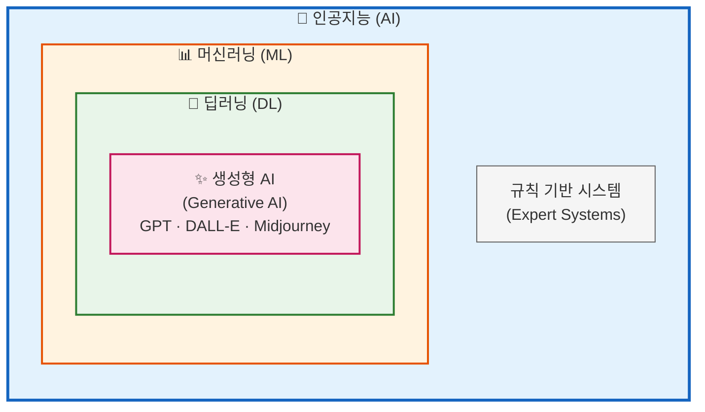
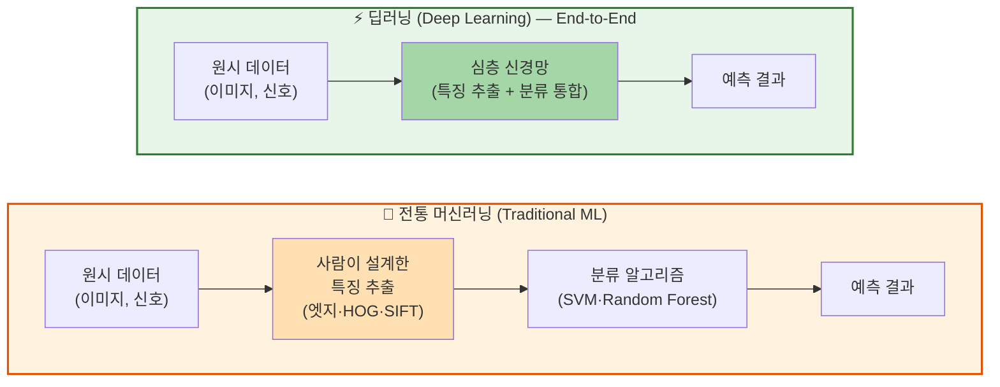
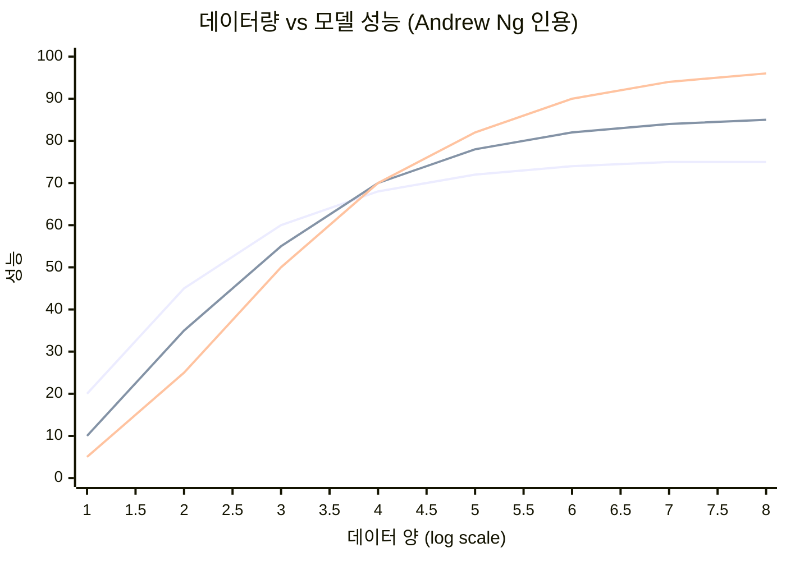
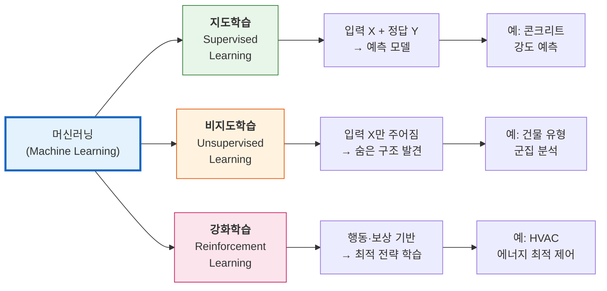
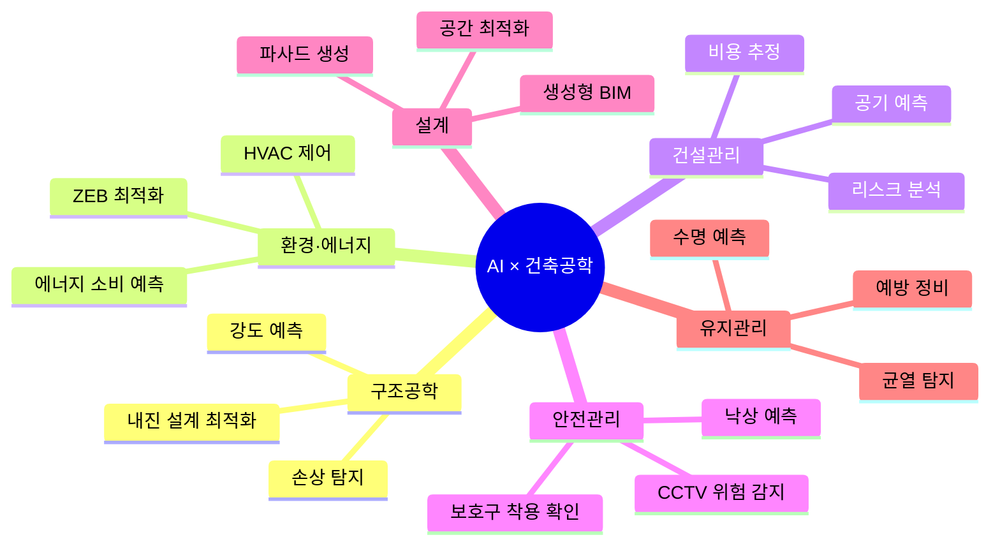

# L17. AI 기초 개념

> [!finding] 핵심 메시지
> 인공지능은 데이터로부터 패턴을 학습하는 공학 도구이며, 건축공학 전반에 빠르게 응용되고 있다.

## 강의 중점
- AI의 기본 개념과 발전 과정
- 머신러닝/딥러닝 기초 개념
- Strong AI vs Weak AI, Consumer AI vs Industrial AI 등 AI의 분류 체계

## 학습 목표
1. 인공지능의 기본 개념(머신러닝, 딥러닝)을 설명할 수 있다.
2. 전통 ML과 딥러닝의 차이를 Feature Extraction 관점에서 설명할 수 있다.
3. 건축공학이 Industrial AI에 속하며, 표준 모델만으로 부족한 이유를 설명할 수 있다.

## 강의 내용

---

> [!ref] 이전 강의에서
> **L04 (건축공학의 미래)** 에서 예고된 "AI와 건설산업의 만남"을 본격적으로 학습할 시점이다. 중간고사(L16)로 전반부 건설산업·구조·환경·관리 기초를 마치고, 이번 L17부터는 **후반부 기술 블록**이 시작된다. 이번 강의는 AI의 개념과 종류를 이해하는 것이 목표이며, 다음 강의(L18)에서 구체적인 건축공학 응용 사례로 확장한다.

---

### 도입 영상

AI의 개념을 처음 접하는 학생들을 위해, 본격 강의에 앞서 다음 영상들을 시청하며 전체 흐름을 잡아보자.

> [!ref] 도입 영상 — 한국어 (필수 시청)
> [이 영상 하나면 '인공지능·머신러닝·딥러닝' 이해가 됩니다 (6:00)](https://www.youtube.com/watch?v=jPs3n9Vou9c) — 서울대 AI 박사과정의 6분 개념정리. 본 강의 섹션 2(AI·ML·DL의 포함관계)와 정확히 같은 주제를 짧고 직관적으로 정리.

> [!ref] 도입 영상 — 영어 자막 지원 (선택)
> [AI, Machine Learning, Deep Learning and Generative AI Explained (10:00)](https://www.youtube.com/watch?v=qYNweeDHiyU) — IBM Technology, Jeff Crume가 AI/ML/DL/Generative AI의 차이를 화이트보드로 명쾌하게 설명. 본 강의 섹션 2 학습 목표와 1:1 대응.

> [!question] 생각해보기
> "AI는 인간 지능을 '대체'하는가, '보완'하는가? 건축공학 분야에서 AI가 대체할 수 없는 영역은 무엇일까?"

---

### 섹션 1: AI의 정의와 역사 — 70년의 발전

#### 인공지능이란 무엇인가

**인공지능(Artificial Intelligence, AI)** 이란 인간의 **학습, 추론, 인식, 의사결정** 능력을 컴퓨터로 구현하는 기술이다. 1956년 Dartmouth 학회에서 John McCarthy가 처음 용어를 제안한 이후, AI는 약 70년에 걸쳐 발전과 정체(AI Winter)를 반복해 왔다.

**AI 연구의 두 가지 접근**
- **규칙 기반 AI (Symbolic AI)**: 전문가의 지식을 IF-THEN 규칙으로 명시적으로 표현 — 1950~1980년대 주류
- **학습 기반 AI (Machine Learning)**: 데이터로부터 스스로 패턴 학습 — 2000년대 이후 주류

> [!info] 전문가 시스템(Expert System) — 규칙 기반 AI의 대표 사례
> 1970~80년대 의료 진단 시스템 **MYCIN**(스탠퍼드, 1972)은 600여 개 IF-THEN 규칙으로 세균 감염 진단을 수행했다. 의사 수준의 진단 능력을 보였지만 **새로운 규칙을 일일이 사람이 입력해야 하는 한계**가 있었다. 이 한계가 곧 **데이터로부터 규칙을 스스로 학습하는 머신러닝**의 등장으로 이어진다.
> - 건축 분야 사례: 1980년대 **HI-RISE**(고층건물 구조 설계 자문 시스템), **SACON**(구조해석 자문) 등 규칙 기반 시스템이 시도되었으나 규모 한계로 상용화 실패

#### Strong AI vs Weak AI — 능력에 따른 분류

AI는 **능력 수준**에 따라 두 가지로 분류한다. 이 구분은 1980년 철학자 John Searle이 제안했으며, 오늘날 AI 논의에서 핵심 개념이다.

| 구분 | **Weak AI (약인공지능)** | **Strong AI (강인공지능, AGI)** |
|------|------------------------|-------------------------------|
| **정의** | 특정 과업에 특화된 AI | 인간 수준의 범용 지능 |
| **자의식** | 없음 | 있음 (이론적) |
| **사고 범위** | 학습된 영역에만 작동 | 모든 영역에서 자율적 사고 |
| **현재 수준** | **모든 상용 AI가 여기 속함** | 미구현 (연구 단계) |
| **대표 예시** | ChatGPT, AlphaGo, 자율주행 | 영화 속 AI(터미네이터, HER) |
| **대표 인물** | Andrew Ng, Yann LeCun (실용주의) | Ray Kurzweil (특이점 주창) |

> [!info] 우리가 사용하는 모든 AI는 Weak AI
> ChatGPT가 놀라운 능력을 보여도, 본질은 **언어 패턴을 통계적으로 학습한 Weak AI**이다. AGI(Artificial General Intelligence) 도달 시점에 대한 전망은 전문가마다 5년~50년+로 매우 다르며, 학계에서도 합의가 없다.

> [!question] 생각해보기
> "ChatGPT-5는 Strong AI에 가까울까, 정교한 Weak AI일까? 어떤 기준으로 판단할 수 있을까? (힌트: 학습 영역 밖에서의 일반화, 자기 인식, 새로운 목표 설정 능력)"

#### AI 발전의 주요 이정표

![[ai-history-timeline.jpg]]
*AI 발전 타임라인 (1900~2025) — 1950년대 Turing Test·Dartmouth 학회를 시작으로, 두 차례의 AI Winter, 2012년 AlexNet의 딥러닝 혁명, 2016년 AlphaGo, 2017년 Transformer, 2022년 ChatGPT, 2024년 멀티모달 AI까지의 75년 흐름을 한눈에 정리. 강의에서는 ① Symbolic AI 시대(1950~80) → ② ML 부흥기(2000~2010) → ③ 딥러닝 혁명(2012~) → ④ 생성형 AI 시대(2022~)의 4단계로 나누어 설명한다 — 출처: Wikimedia Commons (CC BY-SA 4.0, Tarjomyar, 2025)*

##### 본 강의가 다루는 핵심 마일스톤

| 연도 | 사건 | 의미 |
|------|------|------|
| **1950** | Turing Test (Alan Turing) | "기계가 생각할 수 있는가?"의 출발점 |
| **1956** | Dartmouth 학회 | "Artificial Intelligence" 용어 공식 탄생 |
| **1958** | Perceptron (Rosenblatt) | 최초의 학습 가능한 인공뉴런 |
| **1969** | 1차 AI Winter | Minsky의 *Perceptrons* 책이 단층 신경망 한계 증명 |
| **1986** | 역전파(Backpropagation) | Rumelhart·Hinton, 다층 신경망 학습 가능 |
| **1997** | LSTM (Hochreiter·Schmidhuber) | RNN 장기 기억 한계 극복 |
| **1997** | Deep Blue vs 카스파로프 | 체스 챔피언 첫 격파 (탐색 기반) |
| **1998** | LeNet-5 (LeCun) | 최초의 실용적 CNN — 우편번호 인식 |
| **2012** | **AlexNet @ ImageNet** | **딥러닝 혁명의 시작점** — top-5 error 26%→16% |
| **2014** | **GAN** (Goodfellow) | 생성형 AI 시대 개막 (Generator vs Discriminator) |
| **2015** | ResNet | 152층 신경망, 사람 수준 이미지 분류 (error 3.57%) |
| **2016** | **AlphaGo vs 이세돌** | 강화학습+딥러닝의 정점, 바둑 제패 |
| **2017** | **Transformer** ("Attention Is All You Need") | LLM·ViT·AlphaFold의 공통 토대 |
| **2018** | BERT, GPT-1 | Transformer 사전학습 시대 |
| **2020** | **GPT-3** (175B 파라미터) | LLM Scale Law 입증 |
| **2020** | **ViT** (Vision Transformer) | "이미지도 단어처럼" — Transformer가 비전 정복 |
| **2020** | **DDPM** (Diffusion Models) | GAN을 대체할 새 이미지 생성 패러다임 |
| **2020** | **AlphaFold 2** | 단백질 구조 50년 난제 해결 |
| **2021** | **CLIP** (OpenAI) | 텍스트·이미지 공동 임베딩 — VLM 시대 개막 |
| **2022** | **Stable Diffusion / DALL·E 2** (8월) | 텍스트→이미지 대중화 |
| **2022** | **ChatGPT 공개** (11월) | 생성형 AI 대중화 (출시 5일 100만 사용자) |
| **2023** | **GPT-4 / GPT-4V** | 멀티모달 LLM 본격화 |
| **2024** | **GPT-4o, Gemini 2** | 텍스트·이미지·음성·영상 통합 멀티모달 |
| **2024** | **Sora** (OpenAI, 2월) | 텍스트→고품질 영상 생성 |
| **2024** | **AlphaFold 3** + 노벨 화학상 | AI 과학 발견의 정점 |
| **2024** | **OpenAI o1** (9월) | Reasoning Model 시대 — Test-time Compute |
| **2024** | **Computer Use** (Anthropic, 10월) | AI Agent의 실용화 시작 |
| **2025** | **OpenAI o3, Claude Opus 4** | 추론·코딩 능력 인간 전문가 수준 |
| **2026~** | **AI Agent 일상화** | Claude Code·Devin 등 자율 업무 수행 |

> [!info] AI Winter란?
> AI에 대한 기대가 너무 높았던 시기 이후 실제 성과가 미치지 못해 연구 투자가 급격히 줄어든 시기. 1969년(1차), 1987년(2차) 두 차례 있었다. 2012년 이후의 AI 붐은 **빅데이터, GPU, 알고리즘 혁신**이라는 세 가지 조건이 동시에 갖춰지면서 이전 Winter와는 질적으로 다른 양상을 보인다.

#### 시기별 주요 사건 요약

| 시기 | 주요 사건 | 특징 |
|------|----------|------|
| **태동기** (1950~70) | Turing Test, Perceptron, Dartmouth 학회 | 이론적 기반 구축 |
| **1차 AI Winter** (1970~80) | Minsky의 Perceptron 한계 증명 | 연구 자금 축소 |
| **전문가 시스템** (1980~90) | MYCIN, 규칙 기반 시스템 | 실용 적용 시도 |
| **2차 AI Winter** (1990~2000) | 전문가 시스템 한계 | 기술 정체 |
| **ML 부흥** (2000~2010) | SVM, Random Forest, 빅데이터 | 통계적 학습 |
| **딥러닝 혁명** (2012~2020) | AlexNet, AlphaGo, GAN | GPU + 빅데이터 |
| **생성형 AI** (2022~ ) | GPT, DALL-E, Gemini | 멀티모달·에이전트 |

![[lee-sedol-alphago-divine-move.jpg|500]]
*AlphaGo vs 이세돌 9단 — Game 4 (2016.3.13)의 백 78수 "신의 한 수(Divine Move)" — 5번기 중 인간이 거둔 유일한 1승의 결정적 장면. 이 한 수는 당시 AlphaGo의 승률 추정치를 70%에서 50% 이하로 떨어뜨려, 딥러닝 시대에도 인간의 직관과 창의성이 여전히 의미를 가짐을 상징적으로 보여주었다 — 출처: Wikimedia Commons (CC BY-SA 4.0, Axd, 2019)*

> [!ref] 참고 영상
> [인공지능의 역사 — AI는 어떻게 발전했나 (14:22)](https://www.youtube.com/watch?v=dpcwGTAQNzg) — EBS, AI 70년 발전사 다큐멘터리 압축본

---

### 섹션 2: AI · ML · DL · Generative AI의 관계

많은 학생들이 AI, 머신러닝, 딥러닝, 생성형 AI를 혼동한다. 이 네 가지는 **포함관계**이다.

![[ai-ml-dl-venn.png|500]]
*AI ⊃ ML ⊃ DL의 포함관계 — 딥러닝(DL)은 머신러닝(ML)의 한 분야이며, 머신러닝은 인공지능(AI)의 한 분야다. 위 mermaid 도식과 동일한 개념을 학생에게 친숙한 Venn diagram 형식으로 시각화 — 출처: Wikimedia Commons (CC BY-SA 4.0, Avimanyu786 / Tukijaaliwa, 2020)*

#### 각 개념의 정의

- **AI (인공지능)**: 인간의 지능을 모방하는 **모든 기술의 총칭** — 규칙 기반 + 학습 기반 포함
- **ML (머신러닝)**: 데이터로부터 **패턴을 학습**하여 예측·판단하는 AI의 한 분야
- **DL (딥러닝)**: 다층 신경망(Deep Neural Network)을 사용하는 **ML의 한 부분집합**
- **Generative AI (생성형 AI)**: 텍스트·이미지·코드 등 **새로운 콘텐츠를 생성**하는 DL의 한 응용

#### Feature Extraction의 역할 — 전통 ML vs 딥러닝의 핵심 차이

ML과 DL을 가르는 가장 중요한 차이는 **"특징(feature)을 누가 추출하는가"** 이다.

| 단계 | 전통 ML | 딥러닝 |
|------|--------|--------|
| **입력** | 원시 데이터 | 원시 데이터 |
| **특징 추출** | 사람이 수동 설계 (도메인 전문가 필수) | 신경망이 자동 학습 |
| **모델** | 분류 알고리즘 (SVM, RF) | 심층 신경망(다층) |
| **출력** | 예측·분류 결과 | 예측·분류 결과 |
| **개발 시간** | 특징 설계에 수개월 | 데이터·모델 학습에 집중 |

> [!tip] 교육 포인트 — 딥러닝의 본질
> 딥러닝의 핵심 혁신은 **"feature engineering의 자동화"**이다. 전통 ML 시대에는 박사급 도메인 전문가가 수년간 "이미지에서 균열을 표현하는 최적의 특징은 무엇인가?"를 고민했지만, 딥러닝은 신경망이 데이터로부터 스스로 발견한다. 이것이 2012년 이후 컴퓨터 비전·음성·언어 분야가 폭발적으로 발전한 근본 이유이다.

> [!info] End-to-End 학습이란?
> 원시 입력 → 최종 출력까지 **모든 중간 단계를 하나의 신경망이 학습**하는 방식. 음성인식(음성 → 텍스트), 자율주행(카메라 → 핸들 조작), 기계번역(영어 → 한국어) 모두 End-to-End 학습으로 패러다임이 전환되었다. 건축공학에서도 "설계 도면 → 구조 안전성 평가" 같은 End-to-End 응용이 시도되고 있다.

#### 4가지 개념 비교표

| 구분 | AI | ML | DL | Generative AI |
|------|-----|-----|-----|---------------|
| **등장 시기** | 1950s | 1990s | 2010s | 2020s |
| **핵심 방법** | 규칙·탐색·학습 | 통계·패턴학습 | 다층 신경망 | Transformer·Diffusion |
| **데이터 요구** | 적거나 없음 | 중간 (수천~수만) | 매우 많음 (수백만) | 초대규모 (수십억) |
| **Feature Extraction** | 전문가 규칙 | **수동 설계** | **자동 학습** | 자동 학습 |
| **대표 기술** | 전문가 시스템 | 결정트리, SVM | CNN, RNN | GPT, DALL-E |
| **건축 응용 예** | 설계 규정 체크 | 강도 예측 | 균열 탐지 | BIM 자동 생성 |

#### 데이터량과 성능 — 딥러닝이 우위에 서는 시점

데이터가 적을 때는 전통 ML이 효율적이지만, 데이터가 늘어날수록 딥러닝의 성능이 압도적으로 우월해진다.

> [!finding] 빅데이터 시대에 딥러닝이 폭발한 이유
> Andrew Ng 교수가 즐겨 인용하는 도식이다. **데이터가 적을 때**는 전통 ML이 유리하지만, **데이터가 많아질수록** 대형 신경망(딥러닝)의 성능 상승이 멈추지 않는다. 이것이 ImageNet(2012), 음성인식(2014), 기계번역(2016), 자연어처리(2018~)에서 차례로 딥러닝이 정복한 패턴이다. 즉, **GPU(연산력) + 빅데이터(인터넷 시대)** 가 모이자 비로소 딥러닝의 잠재력이 발현되었다.

> [!tip] 교육 포인트 — AI와 ML의 차이 쉽게 설명하기
> - **AI**: "스마트한 기계를 만들자"는 **목표**
> - **ML**: "데이터로 학습시켜서" **방법**을 택한 AI의 접근
> - 비유: AI는 "요리사가 되겠다"는 꿈, ML은 "수많은 레시피를 맛보며 배우겠다"는 방법, DL은 "신경망이라는 특별한 방식으로 배우겠다"는 세부 방법

> [!question] 생각해보기
> "건축 설계에서 규정 검토는 '규칙 기반 AI'가 적합할까, '머신러닝'이 적합할까? 각각의 장단점은?"

---

### 섹션 3: 머신러닝의 3대 학습 방법

머신러닝은 **학습 방식**에 따라 크게 3가지로 나뉜다. 각 방법은 해결 문제와 데이터 형태가 다르다.

#### 3가지 학습 방법 비교

| 구분 | 지도학습 | 비지도학습 | 강화학습 |
|------|---------|-----------|---------|
| **데이터 형태** | (X, Y) 쌍 | X만 존재 | (상태, 행동, 보상) |
| **목표** | Y 예측 | 숨은 구조 발견 | 누적 보상 최대화 |
| **대표 알고리즘** | 선형회귀, 결정트리, CNN | K-means, PCA, Autoencoder | Q-Learning, PPO |
| **평가 방법** | 정확도·오차 | 군집 품질 지표 | 누적 보상 |
| **건축 적용** | 강도·에너지 예측 | 건물 분류·이상 탐지 | 공정·설비 최적화 |

#### 각 학습 방법 상세

##### ① 지도학습 (Supervised Learning)

- **원리**: "문제(X)와 정답(Y)을 쌍으로 주고" 컴퓨터가 X → Y 규칙을 스스로 발견
- **예시**: 콘크리트 배합비(X: 시멘트량, 물/시멘트비, 양생기간) → 압축강도(Y) 예측
- **건축 적용**:
  - 구조물 강도 예측 (FEM 시뮬레이션 대체)
  - 에너지 소비 예측 (건물 특성 → 연간 에너지)
  - 균열 탐지 (이미지 → 균열 유무 분류)

##### ② 비지도학습 (Unsupervised Learning)

- **원리**: "정답 없이 입력만 주고" 컴퓨터가 스스로 구조·패턴 발견
- **예시**: 수천 개 건물 데이터 → AI가 자동으로 5개 유형으로 군집화
- **건축 적용**:
  - 건물 유형 자동 분류
  - 센서 이상 탐지 (평소 패턴과 다른 값 감지)
  - 고객 세분화 (주거 패턴별 그룹화)

##### ③ 강화학습 (Reinforcement Learning)

- **원리**: "행동에 대한 보상을 주면서" 누적 보상을 최대화하는 전략 학습
- **예시**: AlphaGo는 수많은 바둑 대국에서 승리(+보상)·패배(-보상)를 통해 전략 습득
- **건축 적용**:
  - HVAC 제어 (쾌적도 유지 + 에너지 절감)
  - 공정 스케줄 최적화
  - 로봇 경로 계획 (건설 현장 자재 이송)

![[mnist-examples.png|500]]
*MNIST 손글씨 숫자 데이터셋 샘플 — 지도학습의 대표 예제 (이미지 X → 숫자 Y 쌍 70,000개로 분류 모델 학습) — 출처: Wikimedia Commons (CC BY-SA 4.0, Josef Steppan, 2017)*

> [!ref] 참고 영상
> [Supervised vs Unsupervised vs Reinforcement Learning (6:48)](https://www.youtube.com/watch?v=1FZ0A1QCMWc) — IBM Technology, 3가지 학습 방법 직관적 비교

> [!ref] 브라우저에서 직접 신경망을 학습시켜보기
> [**TensorFlow Playground**](https://playground.tensorflow.org) — Google이 제공하는 신경망 시각화 도구. 코딩 없이 학습 데이터·은닉층 수·활성화 함수를 마우스로 조작하며 학습 곡선과 결정 경계가 실시간으로 변화하는 과정을 관찰할 수 있다. 섹션 6의 Teachable Machine과 함께 가장 추천되는 입문 도구.

> [!question] 생각해보기
> "AI가 '지도학습'으로 구조물 파괴를 예측하려면 어떤 입력과 출력 데이터가 필요할까? (힌트: 부재 치수, 재료, 하중 → 파괴 하중 또는 파괴 모드)"

---

### 섹션 4: 딥러닝 핵심 구조 — MLP부터 AI Agents까지의 등장 순서

딥러닝은 여러 층(layer)으로 구성된 **인공신경망(Artificial Neural Network)** 기반 학습 기법이다. 신경망의 구조에 따라 여러 종류가 있으며, 각각 적합한 데이터 유형이 다르다. 본 섹션은 **기술의 등장 순서**(1958 MLP → 2024 AI Agents)를 따라 학습한다 — 후속 기술이 어떤 한계를 극복하고 등장했는지를 이해하면 전체 지형이 자연스럽게 그려진다.

#### Multi-Modal Neural Network — 입력 유형별 신경망 선택

건축공학 데이터는 **다양한 형식이 동시에 존재**한다. BIM은 그래프, 센서는 시계열, 도면은 이미지, 강도 시험은 표 데이터다. 따라서 어떤 신경망을 선택할지는 곧 **데이터 유형을 이해하는 일**과 같다.

| 데이터 유형 | 적합 모델 | 핵심 원리 | 건축 데이터 예시 |
|------------|----------|----------|-------------------|
| **벡터 (표 데이터)** | MLP (다층 퍼셉트론) | 완전연결 신경망 | 콘크리트 배합비 → 강도 |
| **이미지 (2D 격자)** | CNN | 국소 패턴 합성곱 | 균열 사진, 안전모 CCTV |
| **시계열 (순차 데이터)** | RNN/LSTM/Transformer | 시간 의존성 학습 | 에너지 사용량, 진동 센서 |
| **그래프 (관계 데이터)** | GNN (Graph NN) | 노드·엣지 메시지 전달 | BIM 객체 관계, 도시 도로망 |
| **혼합 (멀티모달)** | Multi-Modal NN | 각 인코더 결합 | 도면+사양서+사진 통합 분석 |

> [!info] 멀티모달 AI는 건축공학의 미래
> 한 건물에 대해 **도면 이미지 + BIM 그래프 + 사양서 텍스트 + 센서 시계열**을 동시에 입력받아 통합 평가하는 AI가 차세대 건축 설계 어시스턴트의 모습이다. GPT-4o(2024)가 텍스트·이미지·음성을 동시에 처리하는 멀티모달의 대중화 사례.

#### 인공신경망의 기본 구조

![[neural-network-basic.png|450]]
*인공신경망의 기본 구조 — 입력층(Input) → 은닉층(Hidden) → 출력층(Output). 각 원이 뉴런(neuron), 선이 가중치(weight)이며, 학습이란 곧 가중치 값을 조정하는 과정이다 — 출처: Wikimedia Commons (Public Domain, Glosser.ca)*

- **입력층 (Input Layer)**: 원시 데이터(이미지 픽셀, 센서 값)를 받는 층
- **은닉층 (Hidden Layer)**: 데이터를 추상화·변환하며 특징(feature)을 추출
- **출력층 (Output Layer)**: 최종 예측 결과 출력 (분류, 회귀값)
- **"딥(Deep)"의 의미**: 은닉층이 3층 이상이면 "심층 신경망(Deep Neural Network)"

##### 뉴런은 어떻게 "결정"하는가 — 활성화 함수(Activation Function)

각 뉴런은 입력값들의 가중합(weighted sum)을 받아 **활성화 함수**를 거쳐 출력을 생성한다. 활성화 함수는 신경망에 **비선형성(non-linearity)** 을 부여하는 핵심 요소로, 이것이 없으면 아무리 층을 쌓아도 단순 선형회귀와 같다.

![[activation-functions.png|600]]
*대표적 활성화 함수 비교 — **Sigmoid**(0~1, 확률 표현, 1980년대 기본), **Tanh**(-1~1, sigmoid 개선), **ReLU**(음수→0, 양수→그대로 통과; **2012년 AlexNet 이후 딥러닝의 표준**), **Leaky ReLU**(음수도 살림). ReLU의 단순성이 깊은 신경망의 학습을 가능하게 만든 결정적 요인 — 출처: Wikimedia Commons (Public Domain, Laughsinthestocks)*

> [!tip] 교육 포인트 — "왜 ReLU가 딥러닝을 폭발시켰나"
> Sigmoid는 미분 시 최대값이 0.25라서 층을 깊게 쌓으면 **gradient가 0으로 소실(vanishing gradient)** 되어 학습이 멈춘다. ReLU는 양수 영역의 미분이 항상 1이므로 gradient가 살아남아, **수십~수백 층의 신경망 학습**을 처음으로 가능하게 했다. 이것이 2012년 AlexNet 이후 딥러닝이 폭발한 숨은 원동력 중 하나다.

#### 주요 신경망 구조 비교

아래 표는 본 강의에서 다룰 신경망 구조를 **등장 순서**대로 정리한 것이다. 화살표(→)는 "후속 모델이 토대로 삼은 관계"를 나타낸다.

| 등장 | 구조 | 핵심 아이디어 | 적합한 데이터 | 대표 모델 | 건축 적용 예 |
|------|------|-------------|--------------|----------|------------|
| 1958 | **MLP** (다층 퍼셉트론) | 완전연결 신경망 | 표 형식 데이터 | Perceptron, MLP | 강도 예측, 비용 추정 |
| 1986 | **RNN/LSTM** (순환 신경망) | 시간 순서 처리 | 시계열·문장 | LSTM, GRU | 구조물 건전성 모니터링, 에너지 예측 |
| 1998 | **CNN** (합성곱 신경망) | 국소 특징 감지 | 이미지·영상 | LeNet → AlexNet → ResNet → YOLO | 균열 탐지, 안전모 착용 확인 |
| 2014 | **GAN** (생성적 적대신경망) | 두 네트워크의 경쟁 | 이미지 생성 | StyleGAN, Pix2Pix | 건물 파사드 생성, 데이터 증강 |
| 2017 | **Transformer** | Self-Attention | 텍스트·이미지·멀티모달 | Vaswani et al. (원논문) | BIM 자동 생성의 근간 |
| 2020 | **ViT** (Vision Transformer) | Transformer를 이미지에 | 이미지 (충분한 데이터) | ViT, Swin, DeiT | 클라우드 BIM 분석, 도면 이해 |
| 2020 | **Diffusion Models** | 노이즈 점진적 제거 | 이미지·영상 생성 | DDPM, Stable Diffusion, DALL·E, Sora | 컨셉 이미지, 인테리어 시안 |
| 2020~ | **LLM** (대규모 언어 모델) | Transformer를 초대규모로 | 텍스트(인터넷 전체) | GPT-4·5, Claude, Gemini, LLaMA | 설계 어시스턴트, 사양서·법규 검토 |
| 2021~ | **VLM** (시각-언어 모델) | 텍스트·이미지 공동 임베딩 | 멀티모달 | CLIP, GPT-4V, GPT-4o, Gemini 2 | 도면+사진 통합 분석, 시공 모니터링 |
| 2024 | **Reasoning Models** | 추론 시간(test-time compute)을 키운 LLM | 복잡 추론 문제 | OpenAI o1·o3, Claude Extended Thinking | 구조 검증, 법규 충돌 분석 |
| 2024 | **AI Agents** | 도구 사용 + 계획 + 자기 수정 | 다단계 자율 업무 | Computer Use, Devin, Claude Code | 시방서 자동 작성, 입찰 분석 |

#### CNN (Convolutional Neural Network)

![[cnn-typical.png|650]]
*CNN의 전형적 구조 — Convolution(특징 추출) + Pooling(차원 축소) 블록을 반복한 후, Fully Connected 층으로 분류 결정. 입력 이미지(좌측)에서 점진적으로 추상화된 특징(우측)으로 변환된다 — 출처: Wikimedia Commons (Aphex34, CC BY-SA 4.0)*

- **핵심 원리**: 이미지의 국소 패턴(엣지, 텍스처)을 **합성곱 필터(Convolutional Filter)** 로 감지
- **층이 깊어질수록**: 저수준 특징(엣지) → 중수준(모양) → 고수준(객체) 학습
- **2012년 AlexNet**: ImageNet 대회에서 CNN이 기존 방법을 압도 → **딥러닝 혁명의 시작점**
- **건축 적용**: 드론 영상 → 균열·결함 자동 탐지, 현장 CCTV → 안전모 미착용 감지

![[lenet-architecture.png|650]]
*LeNet-5 (Yann LeCun, 1998) — 최초로 실용화된 CNN 아키텍처. 32×32 손글씨 숫자 입력 → C1(합성곱) → S2(풀링) → C3(합성곱) → S4(풀링) → C5(완전연결) → F6 → 출력층의 7-layer 구조. 미국 우편국 우편번호 자동 인식에 실제 사용됨. CNN의 모든 핵심 패턴(Conv → Pool 반복 후 FC로 분류)이 이미 1998년에 정립되었으며, 2012년 AlexNet은 이 구조를 GPU·빅데이터로 **확장**한 것 — 출처: Wikimedia Commons (CC BY-SA 4.0, Cmglee 외)*

> [!finding] ImageNet Challenge 2012 — 딥러닝 혁명의 변곡점
> 2012년 ImageNet Large Scale Visual Recognition Challenge(ILSVRC)에서 **Geoffrey Hinton 그룹의 AlexNet**이 top-5 error **16.4%** 를 달성하여 직전 우승팀(26%)을 압도적으로 제쳤다. 이 사건은 다음 두 가지를 증명했다:
> 1. **GPU 학습이 가능해진 시점**에서 다층 신경망이 전통 ML(SVM 기반)을 능가한다
> 2. **데이터·연산력·알고리즘** 세 조건이 모두 갖춰지자 딥러닝이 폭발한다
>
> 이후 5년간 ResNet(2015, error 3.57%), DenseNet, EfficientNet으로 발전하며 이미지 인식 정확도가 사람을 추월했다. 건축공학에서 CNN 기반 균열 탐지가 가능해진 출발점도 이 시점이다.

#### RNN (Recurrent Neural Network)

![[rnn-unfolded.png|650]]
*RNN의 "펼친(unfolded)" 구조 — 매 시점 t의 입력 X_t와 함께 직전 시점의 hidden state h_(t-1)이 함께 들어와 새로운 h_t를 만든다. 이 재귀(recurrent) 구조가 시계열·문장 같은 순차 데이터를 학습하는 원리 — 출처: Wikimedia Commons (Public Domain, fdeloche)*

- **핵심 원리**: 이전 시점의 **출력을 다시 입력으로** 사용 → 시간 의존성 학습
- **한계 극복**: 기본 RNN은 장기 기억이 어려움 → **LSTM/GRU** 개발
- **건축 적용**: 센서 시계열 → 구조물 건전성 예측, 연간 에너지 소비 시계열 예측

#### GAN (Generative Adversarial Network) — 생성형 AI의 출발점 (2014)

2014년 Ian Goodfellow가 제안한 **GAN**은 두 신경망을 **서로 경쟁(adversarial)** 시켜 학습하는 혁신적 구조다. Transformer보다 3년 앞서 등장한 GAN은 오늘날 우리가 보는 "AI가 만든 이미지/영상"의 기술적 출발점이며, 2022년 Diffusion Models이 등장하기 전까지 **이미지 생성의 표준**이었다.

![[gan-architecture.webp|650]]
*GAN의 작동 원리 — **Generator(생성자)** 는 랜덤 노이즈로부터 가짜 이미지를 만들고, **Discriminator(판별자)** 는 진짜·가짜를 구분하려 한다. 두 네트워크가 서로 속이고 잡아내는 경쟁 속에서 Generator는 점점 진짜와 구분 불가능한 이미지를 생성하게 된다 — 출처: Wikimedia Commons*

> [!finding] GAN이 가져온 충격 — "이 사람은 존재하지 않습니다"
> 2018년 NVIDIA가 공개한 **StyleGAN**은 70,000장의 실제 얼굴 사진으로 학습 후, 이 세상에 존재하지 않는 가상 인물의 사진을 무한히 생성한다. 아래 이미지는 학습된 GAN이 만들어낸 **가상 인물**로, 어떤 실재 인물과도 일치하지 않는다.

![[stylegan-face.jpg|400]]
*StyleGAN으로 생성된 가상 인물 — 실재하지 않는 사람의 얼굴. 머리카락·피부 질감·미세 표정까지 인간 수준의 정밀도. 이 기술이 현재의 **딥페이크(Deepfake)**, **AI 생성 광고 모델**, **건축 파사드 자동 생성**의 기반이다 — 출처: Wikimedia Commons (Public Domain, Owlsmcgee, 2020)*

| 항목 | 일반 분류 모델 | GAN |
|------|--------------|------|
| **목표** | 입력 → 정답 분류 | 새로운 데이터 **생성** |
| **구조** | 단일 네트워크 | Generator + Discriminator |
| **학습 신호** | 정답 레이블 | 두 네트워크의 경쟁 |
| **출력** | 클래스/숫자 | 이미지·음성·텍스트 |
| **건축 적용** | 균열 분류 | **건물 파사드 생성, 도면 자동화, 부족한 학습 데이터 증강** |

> [!info] 건축공학에서의 GAN 응용
> - **Pix2Pix** (2017): 손스케치 → 사실적 건물 렌더링 자동 변환
> - **Facade Generation**: 도시 컨텍스트를 입력하면 어울리는 파사드 디자인 생성
> - **Data Augmentation**: 균열·결함 데이터가 부족할 때, GAN으로 합성 데이터 생성하여 인식 모델 성능 향상
> - **3D 모델 생성**: 평면도 + 사양 → 3D 매스 자동 제안 (생성형 BIM의 토대)

---

#### Transformer — AI의 게임 체인저 (2017)

GAN이 이미지 생성을 풀고 있을 무렵, **Google Brain**의 Vaswani 등이 발표한 *"Attention Is All You Need"* 논문(2017)은 자연어처리부터 시작해 결국 **AI 전 분야의 표준 아키텍처**가 되었다.

![[transformer-architecture.png|450]]
*Transformer 원본 구조(Vaswani et al., 2017) — 좌측 **Encoder**(입력 이해)와 우측 **Decoder**(출력 생성)로 구성. 핵심은 RNN의 순차 처리 대신 **Self-Attention**으로 모든 토큰 간 관계를 한 번에 계산하는 것. 이 단순한 변경이 GPU 병렬화를 가능하게 하여 모델을 1000배 이상 키울 수 있게 했다 — 출처: Wikimedia Commons (Yuening Jia, CC BY-SA 3.0)*

- **핵심 원리**: **Self-Attention** — 문장의 모든 토큰이 서로 "얼마나 관련 있는가"를 계산
- **결정적 장점**: 병렬 처리 가능 (RNN의 순차 처리 한계 극복), 장거리 의존성 학습, 확장성 우수
- **직계 후손**: BERT(2018), GPT(2018~), T5(2019)
- **다른 분야 정복**: ViT(2020, 이미지), AlphaFold 2(2020, 단백질), Whisper(2022, 음성), Sora(2024, 영상)
- **건축 적용**: LLM 기반 설계 어시스턴트, BIM 자동 생성, 구조 설계 보고서 자동화

> [!info] End-to-End 학습 — Transformer 시대의 패러다임
> Transformer는 **입력 토큰 → 출력 토큰**을 하나의 신경망에서 한 번에 학습하는 End-to-End 구조의 정점이다. 과거에는 음성인식이 "음향 모델 + 언어 모델 + 디코더"의 분리된 파이프라인이었지만, 이제는 단일 Transformer가 모든 단계를 처리한다. 건축 분야에서도 "BIM 그래프 + 설계 요구사항 텍스트 → 구조 평가 결과"를 하나의 신경망이 직접 학습하는 시도가 등장하고 있다.

---

#### ViT (Vision Transformer) — Transformer로 이미지를 처리하다 (2020)

2020년 Google이 발표한 **ViT**는 *"이미지도 단어처럼 처리할 수 있다"*는 충격적 결과를 보여주었다. 이미지를 **16×16 픽셀 패치(patch)** 로 잘라 각 패치를 토큰으로 취급하면, **CNN 없이 순수 Transformer만으로** ImageNet에서 CNN을 능가하는 성능이 나온다.

![[vit-architecture.png|650]]
*ViT (Vision Transformer, 2020) 구조 — 입력 이미지를 16×16 패치로 분할 → 각 패치를 선형 임베딩 → 위치 정보(Position Embedding) 추가 → **표준 Transformer Encoder**에 투입 → MLP Head로 분류. 충격적인 점은 합성곱(Convolution) 연산이 전혀 없다는 것 — 출처: Wikimedia Commons (Khanrc, CC BY-SA 4.0)*

##### ViT의 의의

- **CNN의 종말?**: 충분한 데이터(3억 장 이상)만 있으면 ViT가 CNN을 압도
- **통합 아키텍처의 가능성**: 텍스트·이미지·음성·영상이 모두 Transformer 한 가지로 처리 가능 → **멀티모달 AI의 토대**
- **건축 응용**: 도면 이미지 분석, BIM 뷰포트 캡처 → 자동 검토. CNN보다 **장거리 컨텍스트**(예: 평면 전체의 동선)를 더 잘 파악

> [!tip] CNN vs ViT 언제 무엇을 쓸까
> - **CNN**: 데이터가 적을 때(수만 장 이하), 작은 모바일·엣지 디바이스, 실시간 추론 필요 → **건축 현장 IoT/CCTV 권장**
> - **ViT**: 데이터가 많을 때(수십만 장 이상), 클라우드 GPU, 장거리 패턴 중요 → **클라우드 기반 BIM 분석 권장**
> - 현재 추세: **ViT가 점진적으로 CNN을 대체하나, 건축 현장처럼 데이터가 적은 영역에서는 CNN이 여전히 실용적**

---

#### Diffusion Models — GAN을 넘어선 이미지 생성 (2020 DDPM, 2022 Stable Diffusion)

2020년 *DDPM*(Denoising Diffusion Probabilistic Models) 논문 이후, **Diffusion Models**은 GAN을 빠르게 대체하며 이미지 생성의 새로운 표준이 되었다. 2022년 공개된 **Stable Diffusion**(Stability AI)과 **DALL·E 2**(OpenAI), **Midjourney**가 모두 Diffusion 기반이다.

![[stable-diffusion-arch.png|700]]
*Stable Diffusion (2022) 구조 — 텍스트 인코더(CLIP)가 prompt를 벡터로 변환 → **U-Net** 기반 노이즈 예측 신경망이 잠재 공간(Latent Space)에서 점진적으로 노이즈를 제거 → VAE Decoder로 최종 이미지 복원. 잠재 공간에서 작업하므로 GAN보다 **고해상도·고품질** 이미지 생성 가능 — 출처: Wikimedia Commons (CompVis, CC BY 4.0)*

##### Diffusion이 GAN을 대체한 이유

| 항목 | GAN (2014~) | Diffusion (2020~) |
|------|------------|-------------------|
| **학습 안정성** | 불안정 (mode collapse 빈번) | **안정적** (수학적으로 깔끔) |
| **이미지 품질** | 좋음 (한정적 다양성) | **매우 좋음** (다양성·해상도) |
| **생성 속도** | 빠름 (1회 forward) | 느림 (수십~수백 step) |
| **텍스트 조건화** | 어려움 | **자연스러움** (CLIP 임베딩 결합) |
| **현재 위상** | 특수 용도(StyleGAN 등) | **메인스트림** |

![[stable-diffusion-output.webp|400]]
*Stable Diffusion 3.5가 생성한 "Astronaut riding a horse" — 2022년 이전엔 불가능했던 자연어 prompt → 사실적 이미지 변환. 건축 컨셉 비주얼라이제이션, 실내 디자인 시안 생성에 광범위 활용 — 출처: Wikimedia Commons (Stability AI, CC BY-SA 4.0)*

##### 건축공학에서의 Diffusion 응용

- **컨셉 디자인**: "한옥 양식의 도서관" 같은 자연어로 즉시 시각화
- **실내 인테리어 시안**: ControlNet으로 도면을 제약 조건으로 주고 인테리어 이미지 자동 생성
- **파사드 변형 탐색**: 같은 매스에 수백 개 파사드 시안 생성 → 클라이언트와 옵션 공유
- **시공 단계 시뮬레이션**: 텍스트 → 영상(Sora 계열)로 시공 단계 시각화

> [!finding] 2022년이 "AI 이미지 생성 대중화"의 해인 이유
> 2022년 한 해에 **Stable Diffusion(8월) → DALL·E 2 베타(7월) → Midjourney 공개(7월) → ChatGPT(11월)** 가 연달아 공개되며, AI가 처음으로 **누구나 쓸 수 있는 도구**가 되었다. 건축업계에서는 같은 해부터 *Veras*, *Stability for Architects* 등 Diffusion 기반 건축 전문 도구가 등장하기 시작했다.

---

#### LLM (Large Language Model) — 언어를 학습한 AI

**LLM**은 Transformer 구조를 **수천억~수조 개 파라미터** 규모로 확장하여, 인터넷 전체 텍스트로 학습시킨 **대규모 언어 모델**이다. 2022년 ChatGPT 공개 이후 AI 패러다임의 중심이 LLM으로 이동했다.

![[gpt-architecture.png|550]]
*GPT(Generative Pre-trained Transformer)의 전체 아키텍처 — **Transformer Decoder**를 12~96층 쌓아, 입력 토큰 시퀀스의 다음 토큰을 예측하도록 학습. 이 단순한 학습 목표(next-token prediction)에서 **글쓰기·번역·요약·코딩·추론** 등 모든 능력이 자연 발현(emergent ability) 한다 — 출처: Wikimedia Commons (CC BY-SA 4.0, Marxav, 2024)*

##### LLM의 핵심 특성

- **Scale Law (규모의 법칙)**: 파라미터·데이터·연산을 키우면 성능이 **예측 가능하게** 향상 (OpenAI, 2020)
- **Pre-training + Fine-tuning**: 인터넷 전체로 사전학습 → 특정 작업에 미세조정
- **In-context Learning**: 예시 몇 개만 주면 새 작업을 즉시 수행 (Few-shot)
- **Emergent Ability**: 일정 규모 이상에서 갑자기 나타나는 능력 (수학·논리·코딩)

##### 대표 LLM 비교 (2026년 기준)

| 모델 | 개발사 | 파라미터 규모 | 주요 특징 |
|------|--------|------------|----------|
| **GPT-4 / GPT-5** | OpenAI | 1조+ (추정) | 범용 추론, ChatGPT 기반 |
| **Claude Opus 4** | Anthropic | 비공개 | 긴 문맥(200K+ 토큰), 코딩 강점 |
| **Gemini 2 Pro** | Google DeepMind | 비공개 | 멀티모달 통합, Google 검색 연동 |
| **LLaMA 3 / 4** | Meta | 7B~405B | 오픈소스, 자체 호스팅 가능 |
| **HyperCLOVA X** | NAVER | 한국어 특화 | 국내 산업 적용 |

> [!info] LLM의 건축공학 응용 (L21 심화 학습 예정)
> - **설계 어시스턴트**: 자연어로 "지진하중 0.18g, 30층 RC 건물 설계 검토" → 코드 점검 보고서 생성
> - **사양서 자동화**: BIM 모델 → 시방서 텍스트 자동 생성
> - **법규 검토 자동화**: 건축법·소방법·녹색건축 인증 기준을 LLM이 해석하여 설계도 검토
> - **Code Generation**: 구조해석 Python 스크립트, FEM 입력 파일 자동 작성
> - 자세한 내용: [[L21-LLM-기본-개념]]

---

#### VLM (Vision-Language Model) — 멀티모달의 시대

**VLM**은 텍스트뿐 아니라 **이미지·영상·도면**을 동시에 이해하는 멀티모달 AI다. 2021년 OpenAI의 **CLIP**(Contrastive Language-Image Pre-training)이 출발점이며, 2024년 GPT-4o·Gemini 2가 대중화했다.

##### VLM의 작동 원리

- **이미지 인코더 (CNN/ViT)**: 사진을 벡터로 변환
- **텍스트 인코더 (Transformer)**: 문장을 벡터로 변환
- **공동 임베딩 공간(Joint Embedding Space)**: 두 벡터를 같은 공간에 매핑하여 "이미지의 의미"와 "텍스트의 의미"를 직접 비교

이를 통해 **"이 도면에서 비상계단의 위치는?"** 같은 자연어 질문에 이미지를 보고 답할 수 있게 된다.

![[state-of-ai-art.png|650]]
*AI 생성 모델 발전 지도 (2014~2025) — GAN(2014) → VAE → Diffusion → CLIP(2021) → DALL·E(2022) → Stable Diffusion(2022) → GPT-4V(2023) → Sora(2024). 텍스트·이미지·영상·3D를 자유롭게 오가는 통합 멀티모달 시대로 진입 중 — 출처: Wikimedia Commons (CC BY-SA 4.0)*

##### 대표 VLM 비교

| 모델 | 입력 양식 | 출력 양식 | 건축 적용 가능성 |
|------|---------|---------|-----------------|
| **CLIP** (2021) | 이미지 + 텍스트 | 유사도 점수 | 도면 검색, 이미지 분류 |
| **DALL·E 3** (2023) | 텍스트 | 이미지 | 컨셉 비주얼라이제이션, 파사드 시안 |
| **GPT-4V/4o** (2023~24) | 이미지 + 텍스트 | 텍스트 | **현장 사진 → 결함 분석 보고서**, 도면 이해 |
| **Gemini 2** (2024~) | 이미지·영상·음성·텍스트 | 텍스트·이미지 | 멀티모달 시공 모니터링 |
| **Sora** (2024) | 텍스트 | 영상 | 시뮬레이션, 시공 단계별 시각화 |

> [!finding] VLM이 건축공학에 가져올 변화
> 기존 딥러닝은 **"균열만 본다"**, **"안전모만 본다"**처럼 단일 작업에 묶여 있었다. VLM은 **하나의 모델이 도면·사진·사양서·법규 텍스트를 동시에 이해**하므로, 다음과 같은 통합 작업이 가능해진다:
> - 시공 사진 + "이 부재는 도면 D-15와 일치하는가?" → 자동 검증
> - 균열 사진 + "이 균열의 원인과 보수 방법은?" → 진단 보고서
> - 평면도 + "비상시 대피 동선의 문제점" → 안전 분석
> 
> 즉, **단일 작업 AI 시대에서 통합 어시스턴트 AI 시대로의 전환**이 진행 중이다.

> [!question] 생각해보기
> "VLM이 건축 도면을 '이해'할 수 있게 된다면, 향후 건축사·구조기술사의 역할은 어떻게 변할까? AI가 대체하기 어려운 건축공학 영역은 무엇일까?"

---

#### Reasoning Models — "더 오래 생각하는 AI" (2024 OpenAI o1 → 2025 o3, Claude Extended Thinking)

2024년 9월 OpenAI가 공개한 **o1**과 그 후속 **o3**(2025), Anthropic의 **Claude Extended Thinking**(2024.10)은 *"답을 즉시 내지 말고, 내부적으로 추론 과정(chain-of-thought)을 길게 거친 뒤에 답하라"* 는 새로운 패러다임을 제시했다.

##### 무엇이 다른가 — Test-time Compute

기존 LLM(GPT-4 등)은 prompt를 받으면 곧바로 토큰을 생성한다. Reasoning Model은 답을 내기 전에 **수십 초~수 분간** 자기 검토·역추적·여러 접근법 시도를 거친다. 이 추가 연산(**test-time compute**)이 곧 성능 향상으로 이어진다.

| 항목 | 기존 LLM (GPT-4 등) | Reasoning Model (o1·o3) |
|------|--------------------|--------------------------|
| **응답 방식** | 즉답 (1~5초) | 깊은 사고 후 응답 (10초~5분) |
| **수학·코딩 정확도** | AIME 13% | **AIME 83%** (o1, 6배 향상) |
| **PhD급 과학 문제** | GPT-4: 56% | **o1: 78%** (PhD 평균 69%) |
| **건축 응용** | 일반 자문 | **구조 계산 검증, 법규 충돌 분석, 다단계 설계 검토** |

> [!finding] Scale Law의 새로운 차원
> 2020년 OpenAI는 *"파라미터·데이터·연산을 키우면 성능이 향상된다"*는 **Scale Law**를 제시했다. 2024년 o1은 여기에 **"추론 시간을 키워도 성능이 향상된다"**는 새 차원을 추가했다. 즉 학습 단계뿐 아니라 **추론 단계에서도** 더 많은 연산을 투자하면 더 똑똑해진다는 발견. 건축 분야의 복잡한 다단계 의사결정(예: 내진·내화·동선·법규를 동시에 만족하는 설계안)에 특히 유용.

##### 건축공학 응용 시나리오

- **구조해석 검증**: "이 캔틸레버 보의 처짐량 계산을 검토하고, 사용성 한계를 만족하는지 확인" → o1이 단계별 검산
- **법규 충돌 자동 발견**: 건축법·소방법·녹색건축 인증기준을 동시에 적용하며 모순 추적
- **장기 시뮬레이션 해석**: FEM 결과의 신뢰도 검토, 가정의 타당성 분석
- **설계 대안 비교**: 비용·내진·에너지·시공성을 종합하여 5개 대안의 우열 정렬

---

#### AI Agents — 도구를 쓰는 AI (2024 Computer Use, 2024 Devin, 2025 Claude Code)

Reasoning Model이 *"더 깊이 생각하는 AI"* 라면, **AI Agents**는 *"실제로 행동하는 AI"* 다. 2024년 10월 Anthropic의 **Computer Use**, 2024년 3월 Cognition의 **Devin**(자율 SW 엔지니어), 2025년 Anthropic **Claude Code**가 이 흐름을 주도한다.

##### Agent의 4대 능력

1. **Tool Use (도구 사용)**: 검색, 코드 실행, API 호출, 파일 읽기/쓰기를 자율 결정
2. **Memory (기억)**: 세션을 넘어 대화·작업 맥락을 유지
3. **Planning (계획)**: 큰 작업을 세분화하여 순서대로 실행
4. **Self-Correction (자기 수정)**: 실행 결과를 보고 오류 시 재시도·전략 변경

##### 단순 LLM ↔ AI Agent

| 항목 | 단순 LLM (ChatGPT 등) | AI Agent |
|------|----------------------|----------|
| **상호작용** | 한 번 묻고 한 번 답함 | **여러 단계 자율 수행** |
| **외부 자원 접근** | 없음 (텍스트만) | **컴퓨터·웹·DB·도구 자유 사용** |
| **작업 단위** | 단일 응답 | **수십 분~수시간 작업** |
| **인간 개입** | 매 단계 필요 | **목표만 주면 자율 진행** |
| **건축 응용** | 사양서 텍스트 작성 | **자료 수집 → BIM 모델 분석 → 보고서 작성 → 이메일 발송 전 과정 자율 수행** |

> [!info] 건축공학에서의 AI Agent 시나리오 (2026~)
> - **자율 시방서 작성**: BIM 파일 입력 → Agent가 부재별 사양·재료 정보 추출 → 표준 시방서 검색·인용 → 최종 시방서 PDF 생성
> - **경쟁 입찰 분석**: 입찰 공고 URL 입력 → Agent가 공고문 분석 → 우리 회사 과거 유사 프로젝트 DB 검색 → 견적 초안 작성
> - **현장 안전 모니터링**: CCTV 영상 + LLM Agent → 위험 패턴 감지 시 관리자 SMS 자동 발송
> - **법규 자동 모니터링**: 건축법 개정 공고 자동 추적 → 진행 중인 프로젝트에 영향 분석 → 알림

> [!question] 생각해보기
> "AI Agent가 시방서 작성·법규 검토를 자율 수행한다면, 건축사사무소의 기술인력 구조는 어떻게 바뀔까? '사람만 할 수 있는 영역'은 무엇이 남을까?"

---

#### 사이드바: AlphaFold — AI 과학 발견의 정점 (2020 AlphaFold 2 → 2024 AlphaFold 3, **2024 노벨 화학상**)

> [!finding] AI가 50년 난제를 풀다
> **AlphaFold**(DeepMind)는 단백질 3D 구조 예측 문제를 해결한 AI다. AlphaFold 2(2020)는 CASP14 대회에서 GDT 92점을 달성하여 **수십 년의 실험적 연구를 며칠로 단축**시켰다. 그 공로로 Demis Hassabis와 John Jumper는 **2024년 노벨 화학상**을 수상했다.

![[alphafold-architecture.png|700]]
*AlphaFold 2 구조 — Transformer 기반 **Evoformer**(다중 서열 정렬 + 진화적 관계 학습) + **Structure Module**(3D 좌표 예측). 본 강의의 Transformer 개념이 그대로 단백질 도메인에 응용된 사례 — 출처: Wikimedia Commons (CC BY 4.0)*

**왜 건축공학과 연관이 있는가?**
- **방법론 전이**: AlphaFold가 사용한 *"진화적 관계 데이터로 3D 구조 예측"* 패러다임은, 건축에서 *"유사 구조물 데이터로 거동 예측"* 으로 응용 가능 (PINN과 결합)
- **Materials Discovery**: DeepMind의 후속 *GNoME*(2023)은 **220만 개 신규 결정 구조**를 발견하여 신소재 개발에 적용 → 차세대 콘크리트·복합재료 후보 발굴
- **시사점**: 충분한 데이터·도메인 지식·연산력이 모이면 AI가 **수십 년 난제를 단축**할 수 있다 → 건축공학에서도 내진·에너지·재료 분야에 동일한 가능성

---

> [!ref] 심화 학습 영상
> - [CNN 한번에 이해하기 (16:30)](https://www.youtube.com/watch?v=YRhxdVk_sIs) — 혁펜하임, CNN 수식 포함 완전정복
> - [Transformer 논문 리뷰 (20:14)](https://www.youtube.com/watch?v=mxGCEWOxfe8) — 동빈나, "Attention is All You Need" 코드 포함
> - [Attention and Transformer Neural Networks (26:10)](https://www.youtube.com/watch?v=TQQlZhbC5ps) — StatQuest with Josh Starmer, 시각적 설명
> - [How GANs work (10:30)](https://www.youtube.com/watch?v=Sw9r8CL98N0) — Computerphile, GAN 작동 원리
> - [How LLMs work (35:00)](https://www.youtube.com/watch?v=zjkBMFhNj_g) — Andrej Karpathy (전 OpenAI), GPT 내부 동작 직관 설명

---

### 섹션 5: AI가 건축공학과 만날 때 (미리 보기)

AI 원리를 이해했다면, 다음 질문은 "이것이 건축공학에서 어떻게 활용되는가?"이다. L18에서 상세히 다루지만, 여기서 큰 그림을 미리 본다.

#### Consumer AI vs Industrial AI — 건축은 어디 속하는가

AI는 적용 영역에 따라 두 가지로 크게 분류한다. 건축공학은 **Industrial AI** 영역에 속하며, 이는 단순히 ChatGPT 같은 일반 AI를 가져다 쓰는 것이 다른 산업과 본질적으로 다른 접근이 필요함을 의미한다.

> [!finding] Andrew Ng의 핵심 인용
> *"소비자 소프트웨어에서는 수백만 사용자를 위해 머신러닝 모델 수백 개를 훈련시킬 수 있다. 그러나 제조업에서는 1만 개 제조사가 각각 1만 개의 맞춤 AI 모델을 필요로 한다."*
> — Andrew Ng (전 Google Brain, 전 Baidu Chief Scientist)

| 구분 | **Consumer AI** | **Industrial AI** |
|------|----------------|--------------------|
| **사용자** | 일반 대중 (수억 명) | 특정 산업 (수십~수천 기업) |
| **데이터 규모** | 매우 큼 (검색 로그, 클릭) | 상대적 적음 (현장 측정) |
| **도메인 지식** | 낮은 의존도 | **필수** (건축·기계·의학 등) |
| **규제** | 가벼움 (개인정보 정도) | **엄격** (건축법·KS·내진 기준) |
| **실패 비용** | 낮음 (검색 결과 부정확) | **매우 높음** (구조 붕괴, 인명) |
| **모델 표준화** | 가능 (GPT 하나로 다수 처리) | **불가** (현장마다 별도 모델) |
| **대표 사례** | ChatGPT, 검색, 추천, 번역 | AI CCTV, 균열 탐지, HVAC 제어 |

> [!info] 왜 건축은 "현장마다 별도 모델"이 필요한가?
> 같은 균열 탐지 모델이라도 **콘크리트 종류·노후도·조명·촬영각도**에 따라 성능이 크게 달라진다. 한국 아파트 학습 모델을 동남아 공장에 적용하면 정확도가 폭락한다. 이것이 Andrew Ng가 지적한 **"1만 제조사가 1만 모델을 가져야 하는"** 산업의 특성이다.

> [!question] 생각해보기
> "건축공학의 AI는 ChatGPT 같은 표준 모델 하나로 충분할까? 왜 현장·재료·국가별로 별도의 모델이 필요한가? (힌트: 데이터 분포 차이, 규제 차이, 안전 책임)"

#### AI 건축공학 적용 맵

#### 건축공학 분야별 대표 AI 기법

| 분야 | AI 기법 | 대표 사례 | 기대 효과 |
|------|---------|----------|----------|
| **구조** | CNN + 전이학습 | 드론·CCTV 기반 균열 탐지 | 점검 시간 80% 절감 |
| **환경설비** | RNN/강화학습 | HVAC 최적 제어 | 에너지 15~30% 절감 |
| **시공** | CNN + 객체 탐지 | 안전모·추락 위험 감지 | 사고 사전 예방 |
| **설계** | Generative AI | 생성형 BIM, 파사드 자동화 | 대안 탐색 10배 확대 |
| **유지관리** | 이상 탐지 | 센서 기반 예방 정비 | LCC 20% 절감 |

![[cnn-crack-detection.png|500]]
*CNN 기반 콘크리트 균열 자동 탐지 — 드론/CCTV 이미지를 입력으로 받아 균열 영역을 픽셀 단위로 분할하는 건축 응용 사례 — 출처: L18 참고문헌 (Nature Scientific Reports, 2024, 교육 목적 재활용)*

![[spot-boston-dynamics.jpg|500]]
*Boston Dynamics Spot — 4족 자율보행 로봇으로, Foster + Partners·Pomerleau·HS Hyundai 등 글로벌 건설사가 **현장 자율 점검**(공정 진척률 스캔, 360° 사진 기록, 위험 구역 측량)에 실제 도입한 사례. CNN 기반 시각 인식 + SLAM 기반 자율 주행 + 강화학습 기반 보행 제어가 결합된 멀티-AI 통합 응용의 대표 사례 — 출처: Wikimedia Commons (CC BY-SA 4.0, Jonte, 2023)*

#### 건축 데이터의 특수성과 도전 과제

건축공학에서 AI 적용은 몇 가지 **데이터 특수성**을 이해해야 한다:

- **소량 데이터**: 구조 실험은 비용이 크고 시간이 오래 걸림 → 데이터 부족
- **고차원 데이터**: 3D 형상, 시공 영상, 센서 다채널 데이터 → 전처리 복잡
- **도메인 지식 필수**: 순수 데이터만으로는 물리 법칙 위반 가능
- **안전 중요성**: 잘못된 예측이 인명 사고로 직결 → 해석 가능성(XAI) 필요

**대응 전략**:
- **시뮬레이션 데이터 증강**: FEM·CFD 결과로 학습 데이터 보완
- **전이학습(Transfer Learning)**: 사전 학습된 모델을 건축 데이터에 미세조정
- **물리 정보 신경망(PINN)**: 물리 법칙을 신경망 학습에 제약으로 포함
- **소규모 데이터 학습 기법**: Few-shot Learning, Meta-Learning 활용

> [!info] 심화 학습
> AI의 구체적 건축공학 적용 사례(현대건설 AI CCTV, 삼성물산 로봇, KICT AI 기반 균열 탐지 등)는 [[L18-건축공학에서의-AI-활용|L18. 건축공학에서의 AI 활용]]에서 자세히 다룬다.

> [!question] 생각해보기
> "데이터가 부족한 건축 분야에서 AI를 어떻게 활용할 수 있을까? (힌트: 시뮬레이션 데이터, 전이학습, 소규모 데이터 학습 기법)"

---

### 섹션 6: AI 직접 체험 — Teachable Machine

이론만으로는 AI를 실감하기 어렵다. Google이 제공하는 [Teachable Machine](https://teachablemachine.withgoogle.com/)은 **코딩 없이 웹에서 AI 모델을 학습**시킬 수 있는 도구이다.

![[teachable-machine-ui.jpg|500]]
*Teachable Machine 공식 인터페이스 — 웹캠으로 클래스별 샘플을 수집하고 "Train Model" 버튼 한 번으로 전이학습 기반 분류기 생성 — 출처: Google Teachable Machine 공식 사이트 (https://teachablemachine.withgoogle.com)*

**체험 흐름**:
1. 클래스 3개 생성 (예: 콘크리트 / 철근 / 타일)
2. 각 클래스별로 웹캠 또는 이미지 업로드 (10장 이상 권장)
3. "Train Model" 클릭 → 수십 초 내 학습 완료
4. 새로운 이미지로 테스트 → AI가 실시간 분류

> [!action] 수업 중 실습 안내
> 강의 중 브라우저에서 Teachable Machine을 직접 열어 **"건설 재료 3종 분류기"** 를 함께 만들어본다. 이는 딥러닝의 **전이학습(Transfer Learning)** 원리를 체험하는 과정이며, 소수의 데이터로도 실용적 AI가 가능함을 확인할 수 있다.

---

> [!info] 다음 강의 예고
> 다음 강의 **L18. 건축공학에서의 AI 활용**에서는 L17에서 배운 AI 원리가 **구조·환경·시공·설계 전 분야**에 어떻게 실제 적용되고 있는지, 국내외 사례(현대건설, 삼성물산, KICT, Autodesk 등)를 중심으로 살펴본다. 오늘의 원리 이해를 바탕으로, 다음 시간은 "실무 AI 적용"에 집중하자.

---

## 실습/과제

### 📌 과제 1: AI 개론 정리 (e-campus 공식 과제)

> [!important] 공식 과제 안내
> **주제**: 인공지능, 기계학습과 딥러닝의 핵심 개념 및 건축공학 적용 사례 요약
>
> **형식**: 개인별 제출 / A4 1장 이내 (한글호환문서 또는 PDF) / **최소 800자**
>
> **제출**: e-campus 과제 제출란 / **마감 2026-05-30(금) 23:59**
>
> **평가 (100점)**:
> - 개념 이해도 (40점) — AI/ML/DL의 정의·관계·차이를 정확히 설명했는가
> - 핵심 내용 정리 (30점) — 강의 내용을 논리적으로 구조화했는가
> - 건축공학 연관성 (30점) — 건축 분야의 구체적 응용 가능성을 제시했는가

### 🧪 자율 보충 실습

- [ ] **체험 실습**: [Google Teachable Machine](https://teachablemachine.withgoogle.com/)에서 건설 재료 이미지(콘크리트 / 철근 / 타일 등) 3종을 각각 **10장 이상 수집·업로드**하여 **분류 모델 1개**를 학습시키고, 새로운 이미지로 테스트한 뒤 **스크린샷 2장**(학습 과정 + 테스트 결과)을 `학번_이름_L17_체험.png` 로 저장
- [ ] **신경망 시각화 체험**: [TensorFlow Playground](https://playground.tensorflow.org)에서 은닉층 수를 1→3→5로 늘리며 학습 곡선과 결정 경계 변화를 관찰하고 1줄 소감 작성
- [ ] **AI 기법 심화 정리**: 관심 있는 AI 기법 1개(CNN, GAN, Transformer, 강화학습 등)를 선정하여 **작동 원리 + 건축공학 적용 가능성**을 A4 1매로 요약 (자율 학습용)

## Notes
- 수업 중 질문/피드백:
- 다음 수업 준비사항: 건축공학 분야 AI 활용 사례 예습 (L18 대비) — 현대건설·삼성물산 AI 사례 검색

## 이미지 출처

| 파일명 | 설명 | 출처 |
|--------|------|------|
| `lee-sedol-alphago-divine-move.jpg` | AlphaGo vs 이세돌 Game 4, 백 78수 "Divine Move" | [Wikimedia Commons](https://commons.wikimedia.org/wiki/File:Lee-sedol-alphago-divine-move.jpg) — Axd, CC BY-SA 4.0, 2019 |
| `ai-history-timeline.jpg` | AI 발전사 타임라인 (1900~2025) | [Wikimedia Commons](https://commons.wikimedia.org/wiki/File:AI-History-Timeline-300dpi.jpg) — Tarjomyar, CC BY-SA 4.0, 2025 |
| `ai-ml-dl-venn.png` | AI ⊃ ML ⊃ DL 포함관계 Venn diagram | [Wikimedia Commons](https://commons.wikimedia.org/wiki/File:AI-ML-DL.svg) — Avimanyu786 / Tukijaaliwa, CC BY-SA 4.0, 2020 |
| `mnist-examples.png` | MNIST 손글씨 숫자 데이터셋 샘플 | [Wikimedia Commons](https://commons.wikimedia.org/wiki/File:MnistExamples.png) — Josef Steppan, CC BY-SA 4.0, 2017 |
| `activation-functions.png` | Sigmoid·Tanh·ReLU·Leaky ReLU 활성화 함수 비교 | [Wikimedia Commons](https://commons.wikimedia.org/wiki/File:ActivationFunctions.svg) — Laughsinthestocks, Public Domain |
| `lenet-architecture.png` | LeNet-5 (1998) — 최초의 실용적 CNN 아키텍처 | [Wikimedia Commons](https://commons.wikimedia.org/wiki/File:LeNet-5_architecture.svg) — CC BY-SA 4.0 |
| `gan-architecture.webp` | GAN 작동 원리 (Generator vs Discriminator) | [Wikimedia Commons](https://commons.wikimedia.org/wiki/File:GANs_Technique.webp) |
| `stylegan-face.jpg` | StyleGAN 생성 가상 인물 (실재하지 않는 얼굴) | [Wikimedia Commons](https://commons.wikimedia.org/wiki/File:This_Person_Does_Not_Exist_example.jpg) — Owlsmcgee, Public Domain, 2020 |
| `gpt-architecture.png` | GPT (Transformer Decoder) 전체 아키텍처 | [Wikimedia Commons](https://commons.wikimedia.org/wiki/File:Full_GPT_architecture.png) — Marxav, CC BY-SA 4.0, 2024 |
| `state-of-ai-art.png` | AI 생성 모델 발전 지도 (GAN→Diffusion→VLM) | [Wikimedia Commons](https://commons.wikimedia.org/wiki/File:State_of_AI_Art_Machine_Learning_Models.svg) — CC BY-SA 4.0 |
| `neural-network-basic.png` | 인공신경망 기본 구조 (입력·은닉·출력층) | [Wikimedia Commons](https://commons.wikimedia.org/wiki/File:Colored_neural_network.svg) — Glosser.ca, Public Domain |
| `cnn-typical.png` | CNN 전형적 구조 (Conv+Pool+FC) | [Wikimedia Commons](https://commons.wikimedia.org/wiki/File:Typical_cnn.png) — Aphex34, CC BY-SA 4.0 |
| `rnn-unfolded.png` | RNN 펼친(unfolded) 구조 | [Wikimedia Commons](https://commons.wikimedia.org/wiki/File:Recurrent_neural_network_unfold.svg) — fdeloche, Public Domain |
| `transformer-architecture.png` | Transformer 원본 구조 (Vaswani et al., 2017) | [Wikimedia Commons](https://commons.wikimedia.org/wiki/File:The-Transformer-model-architecture.png) — Yuening Jia, CC BY-SA 3.0 |
| `vit-architecture.png` | Vision Transformer 구조 (이미지 패치 + Transformer) | [Wikimedia Commons](https://commons.wikimedia.org/wiki/File:Vision_Transformer.png) — Khanrc, CC BY-SA 4.0 |
| `stable-diffusion-arch.png` | Stable Diffusion 구조 (Latent Diffusion + U-Net) | [Wikimedia Commons](https://commons.wikimedia.org/wiki/File:Stable_Diffusion_architecture.png) — CompVis, CC BY 4.0 |
| `stable-diffusion-output.webp` | Stable Diffusion 3.5 생성 예시 | [Wikimedia Commons](https://commons.wikimedia.org/wiki/Category:Stable_Diffusion) — Stability AI, CC BY-SA 4.0 |
| `alphafold-architecture.png` | AlphaFold 2 구조 (Evoformer + Structure Module) | [Wikimedia Commons](https://commons.wikimedia.org/wiki/File:AlphaFold_2.png) — CC BY 4.0 |
| `cnn-crack-detection.png` | CNN 기반 콘크리트 균열 탐지 | L18 참고 이미지 재활용 (Nature Scientific Reports, 2024) |
| `spot-boston-dynamics.jpg` | Boston Dynamics Spot — 건설 현장 자율 점검 로봇 | [Wikimedia Commons](https://commons.wikimedia.org/wiki/File:Spot_by_Boston_Dynamics.jpg) — Jonte, CC BY-SA 4.0, 2023 |
| `teachable-machine-ui.jpg` | Google Teachable Machine 공식 인터페이스 | [Google Teachable Machine 공식](https://teachablemachine.withgoogle.com/) |

> 모든 이미지는 교육 목적으로 사용되었으며, 저작권은 각 출처에 있습니다. Wikimedia Commons 자료는 원본 페이지의 CC 라이선스를 준수하며, Google Teachable Machine UI 이미지는 공식 홈페이지에서 제공하는 소개 자료입니다.
>
> **개정 이력**
> - 2026-04-22: 장식용 Unsplash 이미지 9개 제거·교체
> - 2026-04-29 (1차): ① 이세돌 인물 사진을 AlphaGo Game 4 Divine Move 장면으로 교체, ② 섹션 2에 AI-ML-DL Venn diagram 추가, ③ 섹션 5에 Boston Dynamics Spot 추가
> - 2026-04-29 (2차): ① 안 보이던 외부 SVG/JPG URL을 모두 로컬 파일로 다운로드하여 wikilink 참조로 변경, ② mermaid timeline을 AI 발전사 이미지+표로 대체, ③ **활성화 함수**·**LeNet-5** 추가, ④ **GAN**·**LLM**·**VLM** 신규 서브섹션 추가
> - 2026-04-29 (3차, 시대순 재구성): ① 깨진 alt 구문(`![CNN Architecture\|89]`)·외부 SVG URL 4개(NN·CNN·RNN·Transformer)를 모두 로컬 파일로 교체하여 렌더링 100% 보장, ② **기술 등장 순서를 chronological order로 재배치** — 종전 GAN(2014)이 Transformer(2017) 뒤에 잘못 놓여 있던 순서를 바로잡음 (MLP 1958 → RNN 1986 → CNN 1998 → GAN 2014 → Transformer 2017 → ViT/Diffusion/AlphaFold 2020 → LLM 2020~ → VLM 2021~ → Reasoning 2024 → AI Agents 2024), ③ 누락되어 있던 **ViT(Vision Transformer, 2020)**, **Diffusion Models(DDPM 2020, Stable Diffusion 2022)**, **Reasoning Models(o1·o3, Claude Extended Thinking)**, **AI Agents(Computer Use, Devin, Claude Code)** 4개 SOTA 기술 신규 서브섹션 추가, ④ **AlphaFold(2020/2024 노벨 화학상)** 사이드바를 추가하여 Transformer가 자연어를 넘어 과학 발견까지 응용된 사례를 소개, ⑤ AI 발전 마일스톤 표를 12개에서 28개로 확장하여 LeNet·ResNet·BERT·GPT-3·CLIP·Stable Diffusion·Sora·o1·Computer Use 등 누락 마일스톤 보강, ⑥ 주요 신경망 구조 비교 표에 등장 연도 컬럼 추가 + ViT·Diffusion·Reasoning·Agent 4개 행 추가.

## Related
- **이전 강의**: [[L16-중간고사]]
- **다음 강의**: [[L18-건축공학에서의-AI-활용]]
- **관련 주제**: [[L18-건축공학에서의-AI-활용]], [[L21-LLM-기본-개념]], [[L23-BIM-기본-개념]]
- **강의일정**: [[00-Syllabus/강의일정_2026-1|강의일정표]]
- **MOC**: [[400-Lab/_MOC]]
