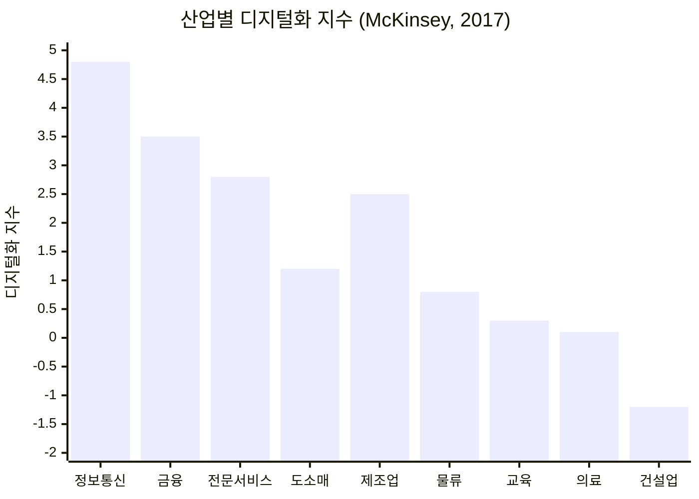
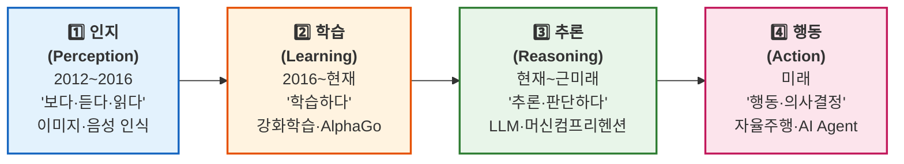
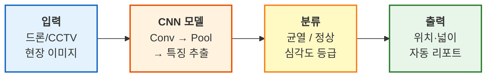
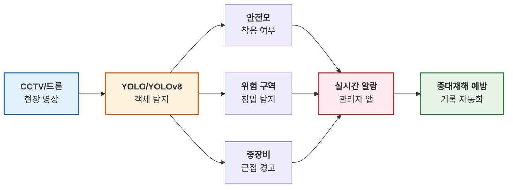
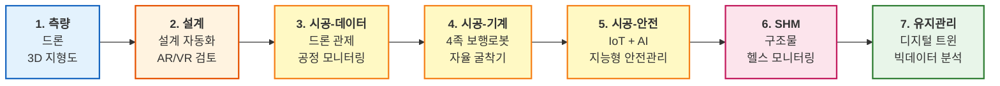
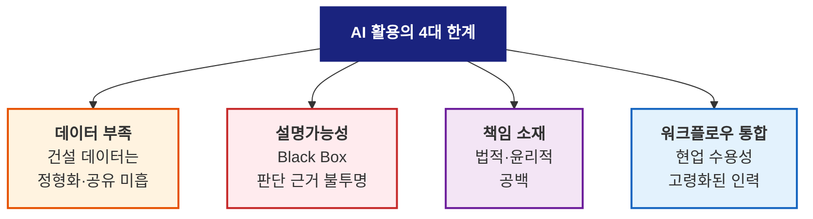
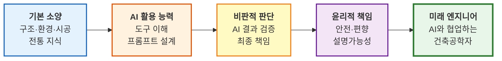

# L18. 건축공학에서의 AI 활용

> [!finding] 핵심 메시지
> AI는 구조·환경·시공·설계 전 분야에서 **이미 실무에 적용되고 있다**. 그러나 데이터 부족·설명가능성(XAI)·책임 소재라는 **한계와 함께** 이해해야 한다. 오늘 배우는 사례들은 모두 L17에서 배운 ML/DL/Generative AI 개념의 구체적 응용이며, 2주 뒤 L21의 LLM으로 이어진다.

## 강의 중점
- 건축공학 분야에서의 AI 활용 사례
- AI 기반 건축 설계 및 구조 해석 사례
- 건설산업의 디지털화 수준과 AI 4단계 진화 이해 (McKinsey · LG경제연구원)
- 건축공학 AI 적용 7단계 프레임워크 (측량 → 설계 → 시공 → 유지관리)

## 학습 목표
1. 건축공학 분야에서 AI가 활용되는 구체적 사례를 3가지 이상 설명할 수 있다.
2. AI 기술이 건축공학에 가져올 변화와 한계를 논의할 수 있다.
3. 건축공학 7단계 생애주기에서 각 AI 기술의 위치를 매핑할 수 있다.
4. 데이터 편향·비용편익·책임소재 등 AI 도입의 실무적 한계를 설명할 수 있다.

## 강의 내용

---

> [!ref] 이전 강의에서
> **L17 (AI 기초 개념)**에서 배운 **AI·ML·DL·Generative AI**의 원리가 실제 건축공학의 어느 분야에, 어떤 방식으로 적용되는지 구체적 사례를 통해 살펴본다. 특히 **구조·환경·시공·설계 4대 분야**별로 대표 사례를 정리하고, 마지막에 "AI가 만능이 아닌 이유" — 즉 현업 도입의 한계와 윤리 문제도 함께 다룬다.

---

### 도입 영상

먼저 국내·해외 현장에서 AI가 실제로 어떻게 쓰이고 있는지를 영상을 통해 확인한다.

> [!ref] 도입 영상 — 국내 사례
> 1. [AI가 건설현장을 바꾼다 — 현대건설 스마트 건설 (5:42)](https://www.youtube.com/watch?v=CrrJWzgxr6o) — 현대건설 공식 채널
> 2. [삼성물산 AI 안전관리 플랫폼 S-TBM (4:18)](https://www.youtube.com/watch?v=kzkLjvtpxGs) — 스마트 CCTV·사물 인식
> 3. [KICT 건설 AI 기술 R&D (5:00)](https://www.youtube.com/watch?v=tpvQp4f-cBY) — 한국건설기술연구원
> 4. [포스코이앤씨 스마트건설 혁신 (6:09)](https://www.youtube.com/watch?v=bWo5fDzqUUo) — IoT·AI 통합 플랫폼

> [!ref] 도입 영상 — 해외·글로벌 사례
> 1. [Autodesk Generative Design in Architecture (3:51)](https://www.youtube.com/watch?v=R8dCqtQJpSE) — MaRS Discovery District 사무실 사례
> 2. [AI-Powered Construction Site Safety — Smartvid.io (2:45)](https://www.youtube.com/watch?v=9xE9ZK7aeYA) — OSHA 준수 자동 모니터링
> 3. [MIT Crack Detection with CNN (3:32)](https://www.youtube.com/watch?v=BQY6OP2kC_Y) — 딥러닝 기반 구조물 균열 탐지

> [!question] 생각해보기
> 영상에서 본 AI 활용 사례 중, 10년 후에도 **인간 엔지니어가 반드시 개입해야 할 판단**은 무엇이고, **AI에 맡겨도 되는 판단**은 무엇일까? 어떤 기준으로 나누어야 할까?

---

### 왜 지금 건축공학에 AI인가 — 두 가지 정량 데이터

본 강의의 모든 사례에 들어가기 전에, "**왜 하필 지금**, 건축공학에서 AI가 폭발적으로 다뤄지는가?"를 두 개의 정량 데이터로 먼저 짚는다.

#### 데이터 ① — McKinsey 산업별 디지털화 지수

| 산업 | 디지털화 지수 | 생산성 증가율(연) |
|------|-------------|-------------------|
| **정보통신** | **+4.5 ~ +4.8** (선두) | 2.5% |
| 금융 | +3.5 | 2.0% |
| 제조업 | +2.5 | 1.8% |
| **건설업** | **-1.5 ~ 0** (최하위) | **<1.0%** (정체) |

> [!finding] 건설업은 디지털화 후발주자 = AI 도입 잠재 효과 최대
> McKinsey Global Institute(2017) 분석에 따르면 건설업의 **디지털화 지수는 전 산업 중 최하위**이며, 생산성 증가율도 1% 이하로 50년간 정체되어 있다. 이는 곧 **AI·BIM·디지털 트윈 도입의 잠재 효과가 가장 큰 산업**이 건설업이라는 의미다. 정보통신 분야의 풍부한 디지털화 노하우가 건설로 이전되는 시기가 바로 지금이다.

#### 데이터 ② — AI의 4단계 진화 로드맵

LG경제연구원(이승준, 2017.12) 「최근 인공지능 개발 트렌드와 미래의 진화방향」에 따르면 AI는 4단계로 진화한다.

| 단계 | 시기 | 핵심 능력 | 건축공학 응용 단계 |
|------|------|----------|-------------------|
| **1. 인지** | 2012~2016 | 이미지·음성 인식 | 균열 탐지, CCTV 안전모 인식 |
| **2. 학습** | 2016~현재 | 강화학습·전략 발견 | HVAC 최적 제어, 공정 스케줄 최적화 |
| **3. 추론** | 현재~근미래 | 텍스트·맥락 이해 | LLM 기반 설계 어시스턴트, Text-to-BIM |
| **4. 행동** | 미래 | 자율 의사결정 | AI 자율 굴착기, 자율 시공 로봇 |

> [!info] 본 강의의 사례 매핑
> 섹션 1(균열 탐지) = 1단계 인지, 섹션 2(HVAC 강화학습) = 2단계 학습, 섹션 4(Text-to-BIM) = 3단계 추론, 섹션 6(미래) = 4단계 행동. 즉 오늘 다루는 모든 사례는 이 4단계 로드맵 위에 위치 지을 수 있다.

---

### 섹션 1: 구조공학 분야의 AI

구조공학은 **안전성**이 최우선이므로 AI 도입이 가장 신중한 분야이다. 그러나 동시에 **데이터 기반 의사결정**이 가장 큰 효과를 낼 수 있는 분야이기도 하다.

#### 1.1 균열·결함 탐지 (CNN 기반)

콘크리트 균열, 강재 부식, 용접 결함 등을 **CNN(Convolutional Neural Network)**이 이미지 분류 문제로 자동 탐지한다. 사람 눈의 정확도를 이미 넘어섰다.

![[cnn-crack-detection.png|550]]
*CNN 기반 콘크리트 균열 탐지 — 원본 이미지(좌) → 특징 맵(중) → 탐지 결과(우) — 출처: Nature Scientific Reports (2024)*

![[crack-detection-cnn-block.png|550]]
*CNN-Block 기반 균열·표면 종류 인식 — 블록별 특징 추출 구조 — 출처: Nature Scientific Reports (2025)*

> [!tip] 교육 포인트
> **CNN이 균열 탐지에 효과적인 이유**: 균열은 "선(line)"이라는 공간적 패턴을 가진다. CNN의 합성곱(convolution) 연산이 이 국소적 공간 패턴을 매우 잘 잡아낸다. 전통적 이미지처리(Sobel edge detection 등)는 조명·노이즈에 취약하지만, CNN은 **수만 장의 이미지로 학습**하여 다양한 환경에서도 robust하게 작동한다.

#### 1.2 구조 최적설계 (Topology Optimization + AI)

![[topology-optimization.png|550]]
*Topology Optimization + 생성형 AI — 구조 성능을 만족하면서 재료 사용을 최소화하는 자유 형상 도출 — 출처: Medium / Engineering Design*

- **전통 방식**: 엔지니어가 단면/재료를 선택 → 해석 → 조정 (반복)
- **AI 방식**: 제약조건(하중, 경계, 변형) 입력 → AI가 **수천 가지 대안**을 자동 생성 → 최적안 선별

![[mit-human-ai-structural.jpg|550]]
*MIT: Human-AI Interactive Structural Design — 엔지니어와 AI가 실시간으로 협업하며 구조 대안을 탐색 — 출처: MIT News (2023)*

#### 1.3 구조 건전성 모니터링 (SHM, Structural Health Monitoring)

건축물·교량에 부착된 IoT 센서가 수집한 진동·변위 데이터를 **RNN/LSTM**이 실시간 분석하여 이상 징후를 감지한다.

![[shm-bridge-sensor.png|550]]
*교량 구조 건전성 모니터링 시스템 — 가속도·변위·변형률 센서 데이터를 AI가 실시간 분석 — 출처: Dewesoft*

#### 1.4 구조공학 분야 AI 적용 요약

| 응용 분야 | 주요 AI 기법 | 입력 데이터 | 효과 |
|-----------|-------------|-------------|------|
| **균열 탐지** | CNN (이미지 분류) | 드론·CCTV 사진 | 검측 시간 80% ↓, 균일한 품질 |
| **구조 최적설계** | Generative Design, 강화학습 | 하중·재료·경계조건 | 재료비 10~30% ↓, 대안 다양화 |
| **내진 응답 예측** | RNN/LSTM (시계열) | 지진 가속도 이력 | 전통 해석 대비 계산시간 99% ↓ |
| **SHM** | LSTM, Autoencoder (이상탐지) | 진동·변형 센서 | 이상 징후 24시간 자동 감시 |
| **용접 결함 검사** | CNN + YOLO | X-ray·초음파 이미지 | 숙련공 수준 정확도 도달 |

> [!ref] 본 섹션 참고문헌 (정책·산업 보고서)
> - **McKinsey Global Institute (2017)** — *Reinventing Construction: A Route to Higher Productivity* (산업별 디지털화 지수 출처)
> - **LG경제연구원 (2017.12)** — 이승준, *최근 인공지능 개발 트렌드와 미래의 진화방향* (AI 4단계 진화 출처)
> - **과학기술정보통신부** — *I-Korea 4.0 실현을 위한 인공지능(AI) R&D 전략*
> - **대한건설정책연구원 (2020)** — *디지털 기반 건축공학 및 건설기술 R&D 기획 최종보고서*

> [!question] 생각해보기
> 만약 AI가 "이 건물의 균열은 **정상 범위**다"라고 판정했는데, 3년 뒤 실제로 붕괴가 일어났다면 **책임은 누구에게** 있는가? 엔지니어? AI 개발사? 건축주? 판례는 아직 없다.

---

### 섹션 2: 건축환경·에너지 분야의 AI

건축환경 분야는 **데이터가 풍부하게 축적된 분야**(BEMS 로그, 스마트미터 데이터)이기에 ML/DL 적용 성과가 빠르게 나타난다.

#### 2.1 건물 에너지 소비 예측

딥러닝(LSTM, Transformer)으로 건물의 시간대별·요일별·계절별 에너지 소비를 예측하여 피크 부하를 관리한다.

![[energy-forecast-deep-learning.png|600]]
*딥러닝 기반 건물 전력 소비 예측 모델 — 과거 사용량·날씨·재실자 데이터 입력 → 24~72시간 예측 — 출처: Nature Scientific Reports (2024)*

#### 2.2 HVAC 강화학습 제어

![[rl-hvac-control.png|600]]
*강화학습(RL) 기반 HVAC 최적 제어 — 에이전트가 실내 온도·쾌적성·에너지 비용 사이에서 최적 제어 정책 학습 — 출처: Nature Scientific Reports (2025)*

- **전통 제어 (PID)**: 설정 온도 중심의 단순 피드백 제어
- **강화학습 제어**: **보상 함수** = (쾌적성 유지 + 에너지 절감) → 장기적으로 학습하여 최적 운전 정책 발견
- **실증 결과**: Google DeepMind가 자사 데이터센터에 적용 → **냉방 에너지 40% 절감** (2016)

#### 2.3 BEMS 대시보드

![[bems-energy-dashboard.jpg|600]]
*AI 기반 건물 에너지 관리 대시보드(BEMS) — 실시간 에너지 소비 시각화와 이상 패턴 알람 — 출처: TMBA*

#### 2.4 환경·에너지 분야 AI 적용 요약

| 응용 분야 | 주요 AI 기법 | 기대 효과 |
|-----------|-------------|-----------|
| **에너지 수요 예측** | LSTM, Transformer | 피크 부하 15~25% ↓ |
| **HVAC 최적 제어** | 강화학습 (DDPG, PPO) | 냉난방 에너지 20~40% ↓ |
| **자연채광 최적화** | 시뮬레이션 + ML | 조명 에너지 30~50% ↓ |
| **실내 쾌적성 예측** | 회귀 ML (XGBoost) | 만족도 10% ↑ |
| **이상 탐지** | Autoencoder | 설비 고장 사전 감지 |

> [!ref] 참고 자료
> [Google DeepMind AI Reduces Data Centre Cooling Bill (2016)](https://deepmind.google/discover/blog/deepmind-ai-reduces-google-data-centre-cooling-bill-by-40/) — 강화학습으로 Google 데이터센터 냉방 에너지 40% 절감한 대표 사례

---

### 섹션 3: 건설관리 분야의 AI

건설현장은 "**데이터의 블랙홀**"이라 불릴 만큼 정형화된 데이터가 부족했지만, **CCTV·드론·IoT**가 보급되면서 AI 적용이 폭발적으로 늘어나고 있다.

#### 3.1 AI CCTV 안전관리 (YOLO 기반 객체 탐지)

![[yolo-hardhat-detection.png|600]]
*YOLO 기반 안전모·안전조끼 미착용 자동 탐지 — 실시간 현장 CCTV 분석 — 출처: Nature Scientific Reports (2025)*

#### 3.2 국내 건설사 AI 사례

![[korean-construction-ai.jpg|600]]
*한국 3대 건설사의 AI·로봇 협력 — 현장 자동화·안전 관리 통합 — 출처: Chosun Biz (2025)*

![[hyundai-ai-excavator.jpg|600]]
*현대건설 AI 자율 굴착기 — 2026년 하반기 현장 투입 — 출처: 서울경제 (2026)*

| 기업 | 적용 AI 기술 | 적용 현장/성과 |
|------|-------------|---------------|
| **삼성물산** | AI CCTV (S-TBM), 로봇 용접·물류 | 스마트 팩토리 개념 건설 적용 |
| **현대건설** | AI 자율 굴착기 (2026), 디지털 혁신팀 | 무인 토공 작업 |
| **GS건설** | GSIL 스마트 안전관리 플랫폼 | 근로자 생체신호 + 환경 데이터 |
| **포스코이앤씨** | IoT+AI 통합 스마트건설 플랫폼 | 조선 신도시 등 대형 현장 |
| **대우건설** | AI 콘크리트 품질 예측 + **드론 관제 시스템** | 타설 전 강도 예측 / **국내 최초 드론 관제 도입** |
| **롯데건설 / DIAGRO** | VR·3D 시공 데이터 처리 | **롯데월드타워** 시공·검토 단계 가상현실 활용 |
| **NeoDAS** | AI 영상인식 + 4D 안전 시뮬레이션 | 스마트 안전솔루션 (장비 충돌·근접 경고) |

#### 3.3 드론·AI 기반 품질 점검

![[drone-facade-inspection.webp|600]]
*AI 드론 기반 건물 외벽 점검 — 균열·탈락·누수 자동 탐지 — 출처: Inspekt AI*

- 고층 건물 외벽 점검: 기존 로프 작업 → 드론 20분으로 단축
- AI가 이미지에서 균열·박락·오염을 자동 분류 → PDF 리포트 자동 생성
- 중대재해처벌법 시행 이후 국내 도입 급증

#### 3.4 공정·원가 예측

- **공정 지연 예측**: 과거 프로젝트 데이터로 ML 모델 학습 → 현재 공정에서 지연 가능성 점수 산출
- **개산견적 자동화**: 유사 프로젝트 DB + 회귀 모델로 **기본계획 단계** 공사비 자동 추정 (기존 2주 → 2일)

> [!question] 생각해보기
> AI CCTV가 근로자를 24시간 감시한다면, 이것은 **'안전'인가 '감시'인가**? 한국 **중대재해처벌법(2022)** 맥락에서 균형점은 어디인가? 근로자의 프라이버시와 안전 사이의 경계선을 어떻게 설정해야 할까?

#### 3.5 건축공학 AI 적용 7단계 — 본 강의의 핵심 프레임워크

지금까지 살펴본 사례들을 **건설 프로젝트의 생애주기(Life Cycle)** 7단계에 맵핑하면 다음과 같다. 이 프레임워크는 본 강의의 핵심 정리이며, 이후 L23(BIM) · L26(디지털 트윈)으로 직결된다.

![[constructionplacements-lifecycle-7phases.webp|600]]
*건설 프로젝트 생애주기 7단계 — 측량·설계·시공·유지관리의 통합 흐름 — 출처: [Construction Placements](https://www.constructionplacements.com/phases-of-the-construction-project-life-cycle/)*

| # | 단계 | 핵심 기술 | 대표 사례 | 효과 |
|---|------|----------|----------|------|
| **1** | **측량** | 카메라 탑재 드론 + Photogrammetry | KICT 자동측량, 3D 지형도 생성 | 측량 정확도 ↑, 인력 80% ↓ |
| **2** | **설계** | BIM + Generative Design + AR/VR | Autodesk Forma, **Touch2 VR 검토** | 설계 오류·공사비·공기 동시 ↓ |
| **3** | **시공 (데이터 수집)** | 드론 관제, 4D 모니터링 | **대우건설 국내 최초 드론 관제** | 진도 파악 자동화, 육안 한계 극복 |
| **4** | **시공 (기계 운용)** | 자율 굴착기, 4족 보행로봇 | **현대건설 자율 굴착기 (2026)** | 무인 토공·반복 작업, 인력 위험 ↓ |
| **5** | **시공 (안전 관리)** | IoT 센서 + AI 영상인식 | **NeoDAS 4D 시뮬레이션**, S-TBM | 사전 위험 감지, 중대재해 ↓ |
| **6** | **구조물 헬스 모니터링** | 센서 시계열 + LSTM/Autoencoder | 교량·고층건물 상시 감시 | 인력 점검 → 자동 24시간 감시 |
| **7** | **유지관리** | 디지털 트윈 + 빅데이터 플랫폼 | 가상 모델로 예방적 유지관리 | LCC 20% ↓, 시설 리스크 최소화 |

> [!info] 핵심 프레임워크 — L23·L26과의 연결
> 이 7단계는 **백장운 교수 강의의 핵심 분류 체계**이다. 단계 2(설계)는 **L23 BIM 기본 개념**, 단계 7(유지관리)은 **L26 디지털 트윈과 신기술**으로 직접 이어진다. 학생들은 본 강의의 사례를 7단계 위에 위치 지으며, 다음 강의들에서 각 단계가 어떻게 심화되는지 확인할 수 있다.

#### 3.6 3D 프린팅 기반 자동축조 — 미래 시공의 한 축

7단계 프레임워크 중 단계 4(시공-기계 운용)의 미래 형태로 **3D 프린팅 기반 자동축조**가 주목받고 있다.

- **두바이 사례 (2019)**: 세계 최초 3D 프린팅 사무실 건축, 건축비 50% ↓, 공사기간 70% ↓
- **국내 R&D**: 한국건설기술연구원(KICT)이 콘크리트 3D 프린팅 노즐·재료·로봇팔 통합 시스템 연구 중
- **AI와의 결합**: Generative Design으로 설계된 자유 곡면 → 3D 프린팅으로 직접 출력 → 거푸집 없는 시공

![[3dprint-dubai-office.jpg|600]]
*Dubai 세계 최초 3D 프린팅 사무실 (2019) — 건축비 50% ↓, 공사기간 70% ↓ — 출처: [3DPrint.com (2016)](https://3dprint.com/146273/dubai-office-furnished/)*

> [!info] AI와 3D 프린팅의 시너지
> 전통 시공은 거푸집·철근 작업의 **직선·반복 형태에 최적화**되어 있다. 그러나 3D 프린팅은 **자유 곡면을 추가 비용 없이** 만들 수 있다. 따라서 Generative Design + Topology Optimization이 도출한 "재료 최소·강도 최대"의 자유 곡면 구조가 비로소 실제 건축물로 구현 가능해지는 것이다. 미래 건축 형태의 패러다임 전환이 예상되는 영역이다.

---

### 섹션 4: 설계 분야의 AI — Generative Design

설계 분야는 L17에서 배운 **Generative AI**가 가장 혁신적으로 적용되는 영역이다. 사람이 "조건(constraints)"만 주면 AI가 수백 가지 설계안을 자동 생성한다.

#### 4.1 Autodesk Generative Design

![[autodesk-generative-mars.jpg|600]]
*Autodesk MaRS Toronto Office Generative Design 사례 — 300명 직원 선호도 + 팀 인접성 + 자연채광 조건으로 AI가 10,000+ 레이아웃 대안 생성 — 출처: Autodesk Research*

![[autodesk-generative-space-planning.jpeg|600]]
*Generative Design 워크플로우 — 조건 입력 → 대안 생성 → 시각적 비교 → 최적안 선택 — 출처: Autodesk University*

**사례: MaRS Discovery District 사무실 (Toronto)**
- 조건: 직원 300명, 팀 간 인접성·자연광 접근성·교통 소음 회피·프라이버시
- AI가 **10,000+ 레이아웃 대안** 생성
- 엔지니어가 상위 10개 검토 → 최종 선택
- 결과: 기존 수동 설계 대비 **설계 시간 30% ↓, 직원 만족도 ↑**

#### 4.2 GAN 기반 평면도 자동 생성

![[archigan-floorplan.png|600]]
*ArchiGAN — Pix2Pix GAN 기반 아파트 평면도 자동 생성 (외곽선 → 방 분할 → 가구 배치) — 출처: NVIDIA Developer Blog (2019)*

![[house-gan-layout.png|600]]
*House-GAN — 방들의 관계 그래프로부터 평면 레이아웃 자동 생성 — 출처: Synced Review (2020)*

- **Pix2Pix GAN**: 대지 외곽선 이미지 → 평면도 이미지 변환
- **Graph-based GAN**: 방 간 관계(인접/연결) → 평면도 생성
- 주택업체 DB 수만 건으로 학습 → **아파트 기본 평면 자동 생성** (중국 벤카이 부동산 등 실무 도입)

#### 4.3 Scan-to-BIM (Point Cloud → 3D 모델)

![[scan-to-bim-lidar.jpg|600]]
*Point Cloud → BIM 자동 변환 — LiDAR 스캔 데이터를 AI가 벽·기둥·바닥으로 자동 인식 — 출처: TrueCADD*

- **전통 방식**: 리모델링 시 실측 → CAD 수동 작도 (수주)
- **AI 방식**: 3D 레이저 스캔 → AI가 요소 자동 분류 → BIM 모델 생성 (수일)
- 노후 건축물 리노베이션·문화재 보존에 핵심 기술

#### 4.4 Generative Design 도구 비교

| 도구 | 제공사 | 특징 | 적용 분야 |
|------|--------|------|-----------|
| **Generative Design** | Autodesk Revit | BIM 통합, 파라메트릭 | 공간 계획, 구조 |
| **Grasshopper + Galapagos** | Rhino3D | 시각적 스크립팅 | 형태 최적화 |
| **Spacemaker (AI Form)** | Autodesk | 도시 스케일 AI | 단지 계획, 일조 분석 |
| **TestFit** | TestFit | 부동산 개발 특화 | 아파트 평면 자동 생성 |
| **Hypar** | Hypar | 코드 기반 생성 | 프로토타이핑 |
| **ChatGPT / Claude + Revit API** | OpenAI / Anthropic | 자연어 → BIM 명령 | 실험적 Text-to-BIM |

> [!tip] 교육 포인트
> **Generative Design ≠ "AI가 마법처럼 설계"**: Generative Design의 본질은 "**최적화 알고리즘 + 제약조건**"이다. 엔지니어의 역할은 **어떤 조건을 줄 것인가**를 정의하는 일로 바뀐다. "AI를 잘 쓰는 엔지니어"란 **좋은 조건을 설계하는 엔지니어**이다. 이는 L21에서 배울 LLM의 "**프롬프트 엔지니어링**"과 정확히 같은 원리이다.

#### 4.5 Text-to-BIM의 등장 (2024~2026 최신 동향)

- **자연어 → BIM 명령**: "25m 스팬의 3층 사무실을 설계해 줘" → LLM이 Revit/IFC 명령 자동 생성
- 대표 시도: **Autodesk Forma AI**, **Hypar** + LLM 플러그인, 국내 **큐픽스(Cupix)** AI
- 2026년 현재 **Prototype 단계** — 단순 객체 생성은 가능, 구조 해석 통합은 연구 중
- 이 기술은 L21-L22에서 배울 **LLM (대규모 언어 모델)**을 건축에 적용한 직접적 사례이다.

![[autodesk-forma-generative-design.jpg|600]]
*Autodesk Forma — Generative Design + AI 기반 사이트 계획 인터페이스 (2025) — 출처: [Autodesk Forma Blog](https://blogs.autodesk.com/forma/2025/04/24/how-to-use-generative-design-ai-and-3d-modeling-for-improved-site-planning/)*

---

### 섹션 5: AI 활용의 한계와 과제

AI는 강력하지만 **만능이 아니다**. 건축공학도라면 AI의 한계를 명확히 알고 있어야 한다.

#### 5.1 데이터 부족 문제

- **건설 산업의 특수성**: 프로젝트마다 조건이 다르고, 기업 간 데이터 공유가 제한적
- **정형 데이터 부족**: BIM 표준화 미완성, 과거 2D 도면 중심
- **편향(Bias) 위험**: 학습 데이터가 특정 지역·건축물에만 치우치면 다른 조건에서 오작동

##### 데이터 편향(Bias)의 건축 특화 사례 — 무엇이 잘못될 수 있는가

이론적 "편향 위험"은 추상적이다. 실제 건설 현장에서 어떻게 나타나는지 3가지 사례로 구체화한다.

> [!important] 사례 1 — CCTV 안전모 탐지의 학습 편향
> 동남아 현장 데이터(2만 장)로 학습한 안전모 탐지 모델을 한국 현장에 적용했더니 **정확도가 92% → 67% 로 폭락**한 사례가 있다. 원인: ① 한국 안전모 색상·로고 차이, ② 조명 환경(자연광 vs 가림막), ③ 작업복 색상 분포. **결론**: 학습 데이터의 지역·환경적 분포가 운용 환경과 일치해야 한다.

> [!important] 사례 2 — 균열 탐지의 노후도 편향
> 학습 데이터가 **노후 건물(준공 30년+) 위주**로 수집된 균열 탐지 모델은 **신축 콘크리트의 미세 균열을 놓치는** 경향이 있다. 노후 건물의 굵은 균열 패턴에 적응한 모델이 0.1mm 이하 헤어크랙을 "정상"으로 오분류한다. **결론**: 안전 관련 모델은 다양한 사용 단계의 데이터로 학습해야 한다.

> [!important] 사례 3 — 에너지 예측의 용도 편향
> 사무용 빌딩 BEMS 데이터로 학습한 에너지 소비 예측 모델을 **공동주택**에 적용하면 30% 이상의 오차가 발생한다. 원인: 사무용은 평일 9-6시 피크, 주거는 저녁·주말 피크로 패턴이 정반대. **결론**: 건축물 용도별 별도 학습이 필요하다 — 이것이 L17에서 배운 "Industrial AI는 1만 모델"의 의미다.

> [!question] 생각해보기
> 당신이 학생 연구자로서 AI 모델을 학습시킬 데이터를 수집한다고 가정하자. **편향을 미리 발견하기 위해** 어떤 절차를 거쳐야 할까? (힌트: 데이터 분포 시각화, 메타데이터 기록, 외부 검증 데이터셋 분리, 도메인 전문가 리뷰)

#### 5.2 설명가능성 (Explainable AI, XAI)

![[black-box-xai.png|600]]
*Black Box vs Explainable AI — 판단 근거가 투명한 모델이 구조공학·안전 분야에서 필수 — 출처: Medium / XAI Research*

- 딥러닝 모델은 수백만 파라미터를 가진 **Black Box**
- "이 구조는 안전하다"고 AI가 말해도, **왜?**를 설명하지 못하면 엔지니어가 책임지기 어려움
- **XAI (Explainable AI)** 분야 활발: Grad-CAM, SHAP, LIME 등으로 판단 근거 시각화

#### 5.3 책임 소재

| 시나리오 | 현행 법적 공백 |
|----------|---------------|
| AI 설계안을 엔지니어가 승인 → 붕괴 | 엔지니어 책임? AI 책임? |
| AI CCTV가 위험을 놓침 → 사고 | 공급업체? 발주처? |
| Generative Design 결과가 특허 침해 | 설계자? AI 학습 데이터? |
| AI 학습 데이터 편향으로 오판 | 데이터 제공자? 알고리즘 개발자? |

- 2026년 현재 AI 관련 건설 판례는 **전 세계적으로 매우 부족**
- EU AI Act (2024 발효)가 고위험 AI에 **사람 감독 의무** 부과 — 건축 분야도 영향 예상

#### 5.4 워크플로우 통합

- 현장 기능공 평균 연령 52세 → 디지털 도구 수용성 낮음
- 기존 업무 프로세스와 AI 도구 연동 어려움
- "AI 도입 = 일자리 위협"이라는 저항 존재

#### 5.5 비용-편익 분석 — AI 도입의 ROI

AI 도입은 무조건 이익이 아니다. **언제, 어떤 방식으로 도입해야 ROI(Return on Investment)가 발생하는지** 정량적 판단이 필요하다.

| 항목 | **비용 (Cost)** | **편익 (Benefit)** |
|------|----------------|--------------------|
| **초기 투자** | SW 라이선스, GPU 서버, 클라우드 | 설계 시간 30~50% ↓ |
| **데이터** | 수집·라벨링·정제 (수억 원 규모) | 자동 점검·자동 리포트 |
| **인력** | AI 전문가 채용·재교육 | 안전사고 ↓ → 보험료·과징금 ↓ |
| **통합** | 기존 시스템과 API 연동 | 품질 ↑ → 재시공·하자보수 ↓ |
| **운영** | 모델 모니터링·재학습 | 데이터 자산화 → 차기 프로젝트 가속 |
| **리스크** | Black Box 오판 → 사고 책임 | 경쟁사 대비 수주 우위 |

> [!info] ROI는 어떤 프로젝트에서 가장 클까
> **반복성이 큰 프로젝트일수록** AI 도입 ROI가 크다. 단일 랜드마크 빌딩보다 ① **동일 평면 아파트 단지 시리즈**, ② **표준화된 모듈러 주택**, ③ **반복 점검이 필요한 시설물 포트폴리오**에서 효과가 명확하다. 단발성 프로젝트는 도입 비용을 회수하기 어렵다.

> [!question] 생각해보기
> 중소 건설사가 AI를 도입할 때 합리적 경로는 무엇일까?
> - **(a) 자체 개발**: 내부 전문가 채용 + 데이터 자산화 — 장기 우위, 초기 비용 ↑
> - **(b) SaaS 구독**: 외부 솔루션 월 단위 사용 — 즉시 도입, 데이터 종속 위험
> - **(c) 컨소시엄 참여**: 동종 기업 공동 R&D — 비용 분담, 의사결정 지연
> 당신이 영업이익 200억 규모 중소 건설사 임원이라면 어떤 선택을 할 것인가?

> [!important] 주의사항
> - AI 출력은 **반드시 전문가 검증** 필요 (최종 책임은 엔지니어)
> - 구조 안전성 결정은 **엔지니어 최종 책임** 원칙 불변
> - 학습 데이터의 **편향(Bias) 확인** 필수
> - **사람 감독 (Human-in-the-Loop)** 원칙 준수
> - AI 결정에 대한 **로그 기록·추적성 확보**

> [!question] 생각해보기
> AI 구조 설계에서 **붕괴 사고**가 발생했다면, 책임은 누구에게 있는가? (a) 엔지니어 (승인자), (b) AI 개발사 (알고리즘), (c) 건축주 (발주), (d) 학습 데이터 제공자. 현행법 하에서 당신의 답은?

> [!question] 생각해보기
> AI가 'Black Box'로 내린 설계 결정을 **건축주에게 어떻게 설명**할 수 있을까? "AI가 그렇게 하랬어요"라고 말할 수 있을까? XAI 기술이 해답이 될까?

---

### 섹션 6: AI 시대의 건축공학도에게

AI가 엔지니어를 대체하지는 않는다. 그러나 **"AI를 잘 쓰는 엔지니어"가 "AI를 모르는 엔지니어"를 대체할 것**이다.

![[designcollaborative-ai-coworkers.jpg|600]]
*AI와 협업하는 미래 엔지니어 — 동료와 모니터를 보며 함께 작업하는 모습 — 출처: [Design Collaborative (2025)](https://designcollaborative.com/the-future-of-ai-in-architecture/)*

**미래 건축공학도가 갖춰야 할 4가지 역량**

| 역량 | 내용 | 본 학과에서 연결되는 과목 |
|------|------|---------------------------|
| **도메인 전문성** | 구조·환경·시공 원리 — AI가 틀렸을 때 알아챌 안목 | 구조역학, 건축환경, 건설관리 |
| **데이터 리터러시** | 데이터 수집·정제·편향 인식 | 건축공학프로그래밍 (Python) |
| **AI 도구 활용** | Generative Design, BIM+AI, LLM 코딩 보조 | LLM활용 건축공학AI구현 |
| **비판적·윤리적 판단** | Black Box 결과를 신뢰할 것인가? 사람 개입 시점? | AI 윤리, 공학윤리 |

> [!action] 실천 권장
> - AI 기반 BIM·시뮬레이션 도구 **1개 이상** 익히기 (Revit Generative Design, Rhino Grasshopper 등)
> - **프로그래밍 기초 (Python) 학습** — L08 건축공학프로그래밍 강의 수강
> - 본 전공에서 AI를 활용한 **졸업 설계·논문 프로젝트** 시도
> - AI 한계를 이해하고 **비판적으로 활용**

---

> [!info] 다음 강의 예고
> 2주 뒤 L21부터 후반부 **신기술 블록**이 이어진다. 고전 AI(ML/DL)가 **Generative AI로 진화한 최신 형태 = LLM(Large Language Model)**을 L21-22에서 집중적으로 다루며, 이는 L17-18에서 배운 AI의 자연스러운 연장이다. 그 사이 L19-L20은 **김곤 교수님의 건축환경** 강의가 진행된다 — 오늘 섹션 2에서 본 "건축환경+AI" 응용이 전공 차원에서 어떻게 확장되는지 이어서 체험하게 된다.

---

## 실습/과제

### 📌 과제 2: 건설산업 적용 기술 분석 (e-campus 공식 과제)

> [!important] 공식 과제 안내
> **주제**: 건설산업에 적용되는 특정 딥러닝 기술 1건을 선정하여 **기술 적용 방안을 검토**
>
> **형식**: 개인별 제출 / **A4 2장 이내** (한글호환문서 또는 PDF)
>
> **필수 포함 4요소**:
> 1. **AI 기술적 필요성** — 왜 이 분야에 AI가 필요한가? 기존 방법의 한계는?
> 2. **적용 기술의 특징** — 어떤 AI 기법(CNN/RNN/강화학습/LLM/GAN 등)인가? 작동 원리는?
> 3. **기술 적용의 파급효과** — 기존 대비 시간·비용·정확도·안전 측면에서 어떤 개선이 있는가? (가능하면 정량 수치)
> 4. **기술적 한계 및 보완방안** — 데이터 편향·설명가능성·책임소재 등 주의점과 해결 방향
>
> **제출**: e-campus 과제 제출란 / **마감 2026-05-30(금) 23:59**
>
> **평가 (100점)**:
> - 주제 선택의 적절성 (20점) — 건설산업 실무와의 연관성, 최신성
> - 기술 이해도 (30점) — AI 기법의 원리·구조 정확성
> - 현실성 검토 (20점) — 한국 현장 적용 가능성, 비용·인력·규제 고려
> - 종합 평가 및 미래전망 (30점) — 비판적 통찰, 한계 분석, 향후 발전 방향
>
> **평가 보강 루브릭 (운영 보조)**: 적용 기술 명확성 / 효과 정량성 / 한계 비판적 통찰 / 출처 명시 — 각 측면이 위 4영역에 분산 반영됨

### 🧪 자율 보충 실습

- [ ] **체험 실습** (3개 중 1개 선택):
  1. **Teachable Machine 확장**: 건설 안전 이미지(안전모 착용/미착용, 안전화/운동화) 분류 모델 학습 및 테스트 → https://teachablemachine.withgoogle.com/
  2. **Autodesk Generative Design 영상 분석**: 설계 대안 생성 영상 중 1개 감상 후 **300자 이상** 요약 + 핵심 기술 정리
  3. **Hubble.build AI 건설 안전 플랫폼 데모 영상 분석**: 어떤 AI 기술이 쓰였는지, 한국 현장에 적용할 때 주의점은 무엇인지 300자 이상 기술
  - 제출 (자율): 실습 결과 캡처 + 3줄 소감 (조교 이메일 kh1819@khu.ac.kr)
- [ ] **AI 사례 인포그래픽** (자율 학습용): 관심 AI 사례 1건을 인포그래픽 1장으로 정리 (적용 기술 / 효과 / 한계 3요소)

## Notes
- 수업 중 질문/피드백:
- 다음 수업 준비사항: 2주 뒤 **L21 LLM 기초** 예습 — ChatGPT / Claude / Gemini 중 **1개 이상을 실제로 사용**해보고, "건축공학에 어떻게 쓸 수 있을까?"를 10줄 정도 메모해 올 것

## 이미지 출처

| 파일명 | 설명 | 출처 |
|--------|------|------|
| `cnn-crack-detection.png` | CNN 콘크리트 균열 탐지 | [Nature Scientific Reports (2024)](https://www.nature.com/articles/s41598-024-54494-y) |
| `crack-detection-cnn-block.png` | CNN-Block 기반 균열 인식 | [Nature Scientific Reports (2025)](https://www.nature.com/articles/s41598-025-25956-8) |
| `topology-optimization.png` | Topology Optimization + Generative AI | [Medium — Engineering Design](https://medium.com/@hession520/topology-optimization-and-generative-ai-1f9e7718d75b) |
| `mit-human-ai-structural.jpg` | MIT Human-AI 구조 설계 | [MIT News (2023)](https://news.mit.edu/2023/integrating-humans-ai-structural-design-0302) |
| `shm-bridge-sensor.png` | 구조 건전성 모니터링 센서 | [Dewesoft](https://dewesoft.com/applications/bridge-health-monitoring) |
| `energy-forecast-deep-learning.png` | 딥러닝 기반 에너지 소비 예측 | [Nature Scientific Reports (2024)](https://www.nature.com/articles/s41598-024-56602-4) |
| `rl-hvac-control.png` | 강화학습 HVAC 제어 | [Nature Scientific Reports (2025)](https://www.nature.com/articles/s41598-025-91326-z) |
| `bems-energy-dashboard.jpg` | BEMS 에너지 대시보드 | [TMBA](https://www.tmba.com/blog/get-the-most-out-of-your-bms-energy-dashboard) |
| `yolo-hardhat-detection.png` | YOLO 안전모 탐지 | [Nature Scientific Reports (2025)](https://www.nature.com/articles/s41598-025-12468-8) |
| `korean-construction-ai.jpg` | 한국 건설사 AI 협력 | [Chosun Biz (2025)](https://www.chosun.com/english/industry-en/2025/07/07/NV5D4TBQNZDPZAXVE43HKNUHFU/) |
| `hyundai-ai-excavator.jpg` | 현대건설 AI 자율 굴착기 | [서울경제 (2026)](https://en.sedaily.com/news/2026/04/08/hyundai-ec-to-deploy-ai-equipped-excavators-in-second-half) |
| `drone-facade-inspection.webp` | AI 드론 외벽 점검 | [Inspekt AI](https://inspektai.com/ai-powered-drone-inspections/) |
| `autodesk-generative-mars.jpg` | Autodesk MaRS Generative Design | [Autodesk Research](https://www.research.autodesk.com/projects/autodesk-mars/) |
| `autodesk-generative-space-planning.jpeg` | Generative Design Space Planning | [Autodesk University](https://www.autodesk.com/autodesk-university/article/Generative-Design-Architectural-Space-Planning) |
| `archigan-floorplan.png` | ArchiGAN 평면도 생성 | [NVIDIA Developer Blog (2019)](https://developer.nvidia.com/blog/archigan-generative-stack-apartment-building-design/) |
| `house-gan-layout.png` | House-GAN 평면 레이아웃 | [Synced Review (2020)](https://syncedreview.com/2020/05/09/house-gan-relational-generative-adversarial-networks-for-graph-constrained-house-layout-generation/) |
| `scan-to-bim-lidar.jpg` | Point Cloud → BIM 변환 | [TrueCADD](https://www.truecadd.com/news/scan-to-bim-an-emerging-trend-transforming-the-aec-industry) |
| `black-box-xai.png` | Black Box vs Explainable AI | [Medium — XAI Research](https://medium.com/@khandelwallubhit10/explainable-ai-xai-opening-the-black-box-of-artificial-intelligence-24920df98eb2) |
| `constructionplacements-lifecycle-7phases.webp` | 건설 프로젝트 생애주기 7단계 인포그래픽 | [Construction Placements](https://www.constructionplacements.com/phases-of-the-construction-project-life-cycle/) |
| `3dprint-dubai-office.jpg` | Dubai 세계 최초 3D 프린팅 사무실 (2019) | [3DPrint.com (2016)](https://3dprint.com/146273/dubai-office-furnished/) |
| `autodesk-forma-generative-design.jpg` | Autodesk Forma — Generative Design AI 사이트 계획 | [Autodesk Forma Blog (2025)](https://blogs.autodesk.com/forma/2025/04/24/how-to-use-generative-design-ai-and-3d-modeling-for-improved-site-planning/) |
| `designcollaborative-ai-coworkers.jpg` | AI와 협업하는 미래 엔지니어 | [Design Collaborative (2025)](https://designcollaborative.com/the-future-of-ai-in-architecture/) |

> 모든 이미지는 교육 목적으로 사용되었으며, 저작권은 각 출처에 있습니다.

## Related
- **이전 강의**: [[L17-AI-기초-개념]]
- **다음 강의**: [[L19-건축환경-김곤-1]]
- **관련 주제**: [[L17-AI-기초-개념]], [[L21-LLM-기본-개념]]
- **강의일정**: [[00-Syllabus/강의일정_2026-1|강의일정표]]
- **MOC**: [[400-Lab/_MOC]]
