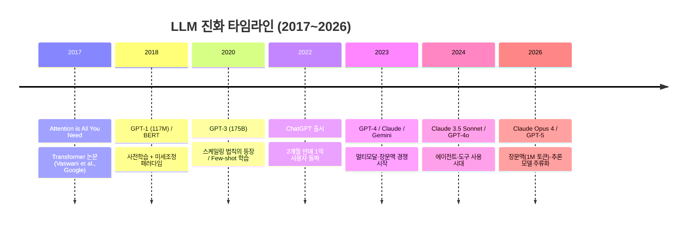
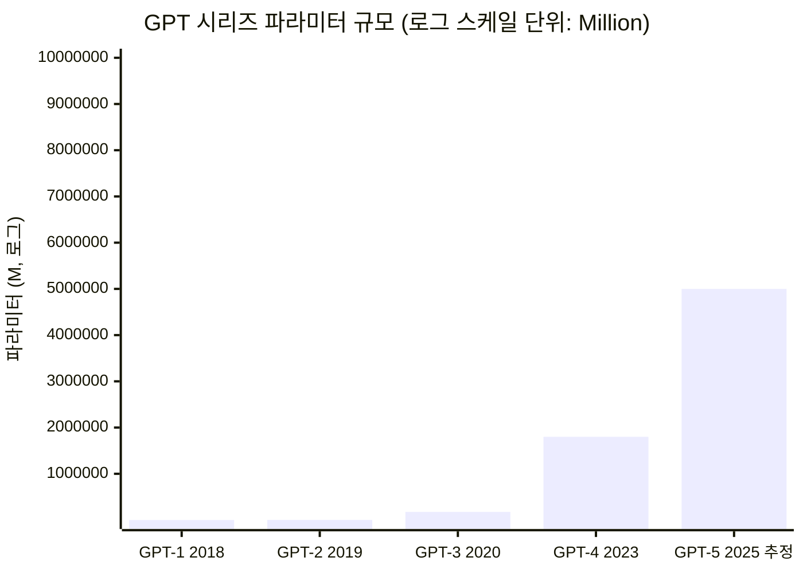
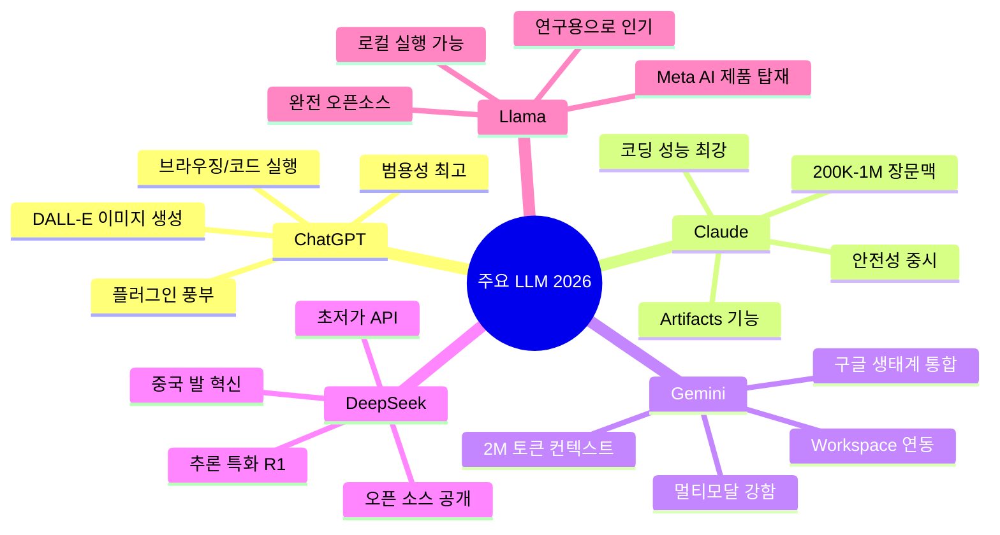
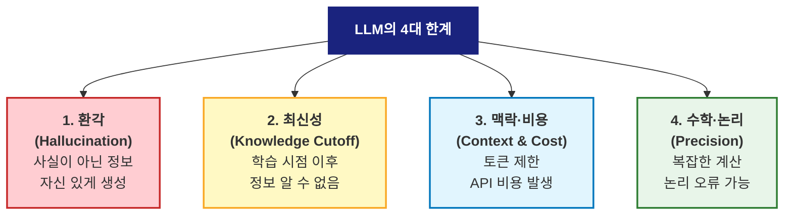

# L21. LLM 기본 개념

> [!finding] 핵심 메시지
> LLM(Large Language Model)은 L17의 AI가 Generative 시대로 진화한 결과이며, **Transformer 아키텍처**를 기반으로 한다. 강력한 능력(글쓰기·코딩·추론)과 본질적 한계(환각·검증·최신성)를 함께 이해해야 건축공학 실무에 안전하게 적용할 수 있다.

## 강의 중점
- 대형언어모델(LLM)의 기본 원리와 발전
- 프롬프트 엔지니어링 기초

## 학습 목표
1. 대형언어모델(LLM)의 기본 원리와 주요 모델(GPT, Claude 등)을 설명할 수 있다.

## 강의 내용

---

> [!ref] 이전 강의에서
> **L17-18**에서 배운 AI·ML·DL이 Generative AI로 진화한 최신 형태가 **LLM(Large Language Model)**이다. L19-20(건축환경, 김곤 교수)으로 학기 중반 블록이 끝나고, 이번 주부터 다시 이어지는 **후반부 기술 블록**의 첫 주제이다. 이번 강의에서 원리를 이해하고, 다음 [[L22-LLM의-건축공학-활용|L22]]에서 건축 실무 활용을 다룬다.

---

### 도입 영상

LLM은 2022년 ChatGPT 등장 이후 3년 만에 세상을 바꿨다. 먼저 최근까지 많이 시청된 한국어 입문·활용 영상 3편(10분 안팎, 긴 영상은 도입부만)과, 원리를 시각적으로 보여주는 영어 영상 2편을 감상해보자.

> [!ref] 한국어 입문 영상 (최신·짧게 보기 3편)
> - [ChatGPT의 핵심개념인 '생성형 AI'를 쉽게 이해시켜드립니다 — 메타코드M (7:06)](https://www.youtube.com/watch?v=3dEzMRL5VMk) — LLM·Transformer·Self-Attention 핵심만 빠르게 정리
> - [대부분은 모르는 챗GPT '제대로' 쓰는 법 — 알린 ALINN (10:40)](https://www.youtube.com/watch?v=WBdtG97V-T8) — 프롬프트를 역할·상황·목적·방법으로 구체화하는 실전 입문
> - [AI 20년 연구한 뇌과학자가 챗GPT 쓰는 법 — 머니인사이드/KAIST 김대식 교수 (앞 10분 권장)](https://www.youtube.com/watch?v=vDZ0ryuiYfg) — GPT의 G·P·T 의미, Transformer, 환각 개념을 최신 사례와 연결

> [!ref] 영어 시각화 영상 (2편)
> - [But what is a GPT? Visual intro to Transformers — 3Blue1Brown (27:14)](https://www.youtube.com/watch?v=wjZofJX0v4M) — 세계 최고 수준의 시각적 설명
> - [Intro to Large Language Models — Andrej Karpathy (59:48)](https://www.youtube.com/watch?v=zjkBMFhNj_g) — 전(前) OpenAI·Tesla AI 책임자의 LLM 종합 강의

> [!question] 생각해보기
> ChatGPT에 건축 관련 질문을 해본 경험이 있는가? 답변이 "그럴듯하게 들렸지만 실제로는 틀렸던" 경우를 생각해보자. 왜 LLM은 **자신 있게 틀린 답**을 내놓을 수 있을까?

---

### 섹션 1. LLM의 정의와 등장 배경

#### LLM이란 무엇인가

**Large Language Model (LLM)** — 수십억~수조 개의 파라미터를 갖는 대규모 언어 모델로, 인터넷·도서·논문 등 방대한 텍스트로 학습되어 자연어를 이해하고 생성한다.

| 구분 | 전통적 AI (L17) | 딥러닝 (L17-18) | **LLM (L21)** |
|------|-----------------|------------------|---------------|
| **입력** | 구조화된 데이터 | 이미지·음성 | 자연어 텍스트 |
| **출력** | 분류·예측 | 이미지·음성 인식 | **텍스트 생성** |
| **파라미터** | 수천~수만 | 수백만~수억 | **수십억~수조** |
| **학습 데이터** | 특정 도메인 | 대규모 전문 데이터 | **인터넷 전체** |
| **능력** | 단일 태스크 | 다중 태스크 | **범용 대화·추론** |

#### LLM의 진화 타임라인



![[chatgpt-screenshot.png|500]]
*ChatGPT 실제 사용 화면 — 2022년 11월 출시 후 5일 만에 100만 사용자, 2개월 만에 1억 사용자 돌파 — 출처: Wikimedia Commons*

#### ChatGPT 충격: 왜 세상이 바뀌었나

- **2022년 11월 30일**: OpenAI가 ChatGPT를 무료 공개
- **2023년 1월**: 월간 활성 사용자 **1억 명 돌파** (인류 역사상 가장 빠른 서비스 성장)
- **비교**: TikTok(9개월), Instagram(2.5년), Facebook(4.5년)
- **파급 효과**: 교육·연구·소프트웨어 개발·디자인·법률 등 지식 노동 전 분야 재편

> [!info] L17 복습 연결
> [[L17-AI-기초-개념|L17]]에서 다룬 "Generative AI"의 대표 사례가 바로 LLM이다. 이미지 생성 AI(DALL·E, Stable Diffusion)와 함께 **생성형 AI 혁명**의 양대 축을 이룬다.

---

### 섹션 2. Transformer 아키텍처 쉽게 이해하기

#### 2017년, 모든 것을 바꾼 논문

> [!ref] 역사적 논문
> **Vaswani, A. et al. (2017), "Attention Is All You Need"**, NeurIPS 2017.
> 구글 브레인 연구진 8명이 발표한 이 논문은 RNN·LSTM의 순차 처리 한계를 **Self-Attention** 메커니즘으로 극복했다. 이 논문 이후 모든 현대 LLM(GPT·BERT·Claude·Gemini)이 Transformer를 기반으로 한다.

![[transformer-architecture.png|450]]
*Transformer 아키텍처 원 논문 그림 — 좌측 Encoder(파랑), 우측 Decoder(주황) — 출처: Vaswani et al. (2017), Wikimedia Commons*

#### Transformer의 핵심: Self-Attention

**Attention**이란 문장의 각 단어가 **다른 단어와 얼마나 관련 있는지**를 계산하는 메커니즘이다.

예시: "건축공학과 학생이 구조해석 수업을 듣는다"
- "학생"이라는 단어는 "건축공학과"와 강한 관계 → Attention 가중치 ↑
- "학생"이라는 단어는 "수업을"과 중간 관계 → Attention 가중치 중
- "학생"이라는 단어는 "듣는다"와 약한 관계 → Attention 가중치 ↓

![[self-attention-diagram.png|500]]
*Self-Attention 상세 다이어그램 — 각 토큰이 Query·Key·Value로 변환되어 다른 토큰과 가중 합산 — 출처: Wikimedia Commons (Transformer deep learning)*

#### Encoder vs Decoder — GPT는 어느 쪽인가

| 구조 | 대표 모델 | 주요 용도 | 원리 |
|------|-----------|-----------|------|
| **Encoder-only** | BERT, RoBERTa | 이해·분류·검색 | 문장 전체를 한 번에 읽어 의미 파악 |
| **Decoder-only** | **GPT, Claude, Gemini, Llama** | **생성·대화** | 왼쪽에서 오른쪽으로 다음 단어 예측 |
| **Encoder-Decoder** | T5, 원조 Transformer | 번역·요약 | 원문 이해 후 새 문장 생성 |

> [!important] 핵심 포인트
> 우리가 쓰는 ChatGPT·Claude·Gemini는 모두 **Decoder-only 구조**이다. 문장을 왼쪽부터 한 토큰씩 생성하며, 각 단계에서 "다음에 올 가장 그럴듯한 토큰"을 확률적으로 선택한다.

![[encoder-attention-block.png|550]]
*Encoder Self-Attention 블록 도식 — 입력 시퀀스가 Multi-Head Attention과 Feed-Forward Network를 통과 — 출처: Wikimedia Commons*

> [!ref] 참고 영상
> [Transformer 아키텍처 완전 정복 — 3Blue1Brown (26:09)](https://www.youtube.com/watch?v=eMlx5fFNoYc) — Self-Attention의 수학적 원리를 시각적으로 설명

---

### 섹션 3. Tokenization · Embedding · Attention

LLM이 텍스트를 처리하는 3단계를 살펴보자.

#### 1) Tokenization: 텍스트 → 토큰

LLM은 단어가 아닌 **토큰(token)** 단위로 텍스트를 처리한다. 토큰은 단어·부분 단어·글자·공백 등 다양하다.

**영어 예시**:
```
입력 문장: "Architectural engineering is fascinating."
토큰 분할: ["Arch", "itectural", " engineering", " is", " fascinating", "."]
토큰 ID:   [27570, 122580, 14811, 374, 27902, 13]
```

**한국어 예시**:
```
입력 문장: "건축공학은 매우 흥미롭다."
토큰 분할: ["건축", "공학", "은", " 매우", " 흥미롭", "다", "."]
토큰 ID:   [118832, 96996, 38251, 22484, 117543, 21121, 13]
```

> [!info] OpenAI Tokenizer 체험
> [https://platform.openai.com/tokenizer](https://platform.openai.com/tokenizer) 에서 본인 문장이 어떻게 토큰화되는지 직접 확인할 수 있다. 한국어는 영어 대비 **약 2~3배 많은 토큰**이 필요하다 (→ 비용도 그만큼 증가).

| 언어 | "안녕하세요" → 토큰 수 | "Hello" → 토큰 수 |
|------|-------------------------|--------------------|
| **GPT-3.5 (2022)** | 5 토큰 | 1 토큰 |
| **GPT-4 (2023)** | 3 토큰 | 1 토큰 |
| **GPT-4o (2024)** | 1 토큰 | 1 토큰 (한국어 효율 3배 개선) |

#### 2) Embedding: 토큰 → 벡터 공간의 점

각 토큰은 고차원 벡터(보통 768~12,288 차원)로 변환된다. 의미가 비슷한 단어는 벡터 공간에서 **가까운 위치**에 놓인다.

![[word-embedding.png|450]]
*Word Embedding 개념도 — 단어가 고차원 벡터로 변환되고, 의미 유사도가 거리로 표현됨 — 출처: Wikimedia Commons*

**고전적 예**: `king - man + woman ≈ queen` (벡터 산술)

![[tsne-word-embedding.png|550]]
*t-SNE 기법으로 2차원 투영한 실제 Word Embedding — 의미가 비슷한 단어끼리 군집을 형성 — 출처: Wikimedia Commons*

#### 3) Attention: 토큰 간 관계 계산

각 토큰 벡터는 Multi-Head Self-Attention을 통과하면서 **문맥 정보**를 받는다. 같은 단어 "은행"이라도 주변 단어에 따라 의미가 달라진다.

| 예문 | "은행"의 맥락 | Attention 집중 대상 |
|------|---------------|----------------------|
| "한강 **은행**에 앉았다" | 강가 | "한강", "앉았다" |
| "**은행**에서 대출받았다" | 금융기관 | "대출", "받았다" |

> [!question] 생각해보기
> 같은 문장을 한국어와 영어로 각각 입력하면 어느 쪽이 더 적은 토큰을 쓸까? 이것이 **LLM 사용 비용**에 어떤 영향을 미칠지 생각해보자.

---

### 섹션 4. Scaling Law와 모델 규모 변천

#### 2020년, OpenAI의 결정적 발견

> [!ref] 역사적 논문
> **Kaplan, J. et al. (2020), "Scaling Laws for Neural Language Models"**, OpenAI.
> **모델 크기·데이터량·계산량**을 늘릴수록 언어 모델 성능이 **예측 가능한 멱함수 법칙**을 따라 향상된다는 사실을 실증. 이 논문은 GPT-3(2020) → GPT-4(2023)의 대형화 경쟁을 촉발했다.

![[scaling-law-kaplan.jpg|650]]
*Kaplan et al. (2020) 스케일링 법칙 그래프 — 모델 크기(N)·데이터량(D)·계산량(C)이 커질수록 Test Loss가 멱함수 법칙으로 감소 — 출처: OpenAI / gwern.net*

#### 파라미터 폭발 — GPT 시리즈의 성장



| 모델 | 출시 | 파라미터 | 학습 데이터 | 주요 특징 |
|------|------|----------|-------------|-----------|
| **GPT-1** | 2018 | 1.17억 (117M) | BookCorpus 5GB | 사전학습 + Fine-tuning 개념 |
| **GPT-2** | 2019 | 15억 (1.5B) | WebText 40GB | Zero-shot 가능성 보임 |
| **GPT-3** | 2020 | 1,750억 (175B) | 570GB 필터링 | Few-shot 학습, API 공개 |
| **GPT-3.5** | 2022 | ~175B | + RLHF | ChatGPT의 기반 모델 |
| **GPT-4** | 2023 | 추정 ~1.8T (MoE) | 멀티모달 | 이미지 이해 + 고급 추론 |
| **Claude Opus 4** | 2025 | 비공개 | 웹+도서+코드 | 200K 컨텍스트, 코딩 최강 |

> [!hypothesis] Scaling Law의 의미
> 2020년 이전에는 "알고리즘 혁신"이 AI 발전의 핵심이었다. 스케일링 법칙은 "**그냥 더 크게 만들면 된다**"는 경험적 공식을 제공했고, 이는 수조 원 규모의 GPU 투자 경쟁(H100, A100 등)을 낳았다.

---

### 섹션 5. 현재 주요 LLM 비교 (2026년 4월 기준)

현재 전 세계에서 실무 수준으로 사용되는 주요 LLM을 비교해보자.

| 모델           | 개발사            | 최신 버전               | 컨텍스트   | 주요 강점              | 가격 (1M 토큰)  |
| ------------ | -------------- | ------------------- | ------ | ------------------ | ----------- |
| **ChatGPT**  | OpenAI (미국)    | GPT-5 / GPT-4o      | 128K   | 범용성, 플러그인 생태계      | $5~$30      |
| **Claude**   | Anthropic (미국) | Opus 4 / Sonnet 4.5 | **1M** | 코딩, 장문 이해, 안전성     | $3~$15      |
| **Gemini**   | Google (미국)    | Gemini 2.5 Pro      | 2M     | 구글 서비스 통합, 멀티모달    | $1.25~$10   |
| **DeepSeek** | DeepSeek (중국)  | V3 / R1             | 128K   | 오픈소스, 저비용, 추론 특화   | $0.14~$0.28 |
| **Llama**    | Meta (미국)      | Llama 4             | 1M     | **완전 오픈소스**, 로컬 실행 | 무료 (자체 호스팅) |

#### 주요 LLM의 공식 로고

![[chatgpt-logo.png|120]] ![[claude-ai-logo.png|120]] ![[gemini-logo.png|120]] ![[llama-logo.png|120]] ![[gpt-4-logo.png|120]]

*좌측부터 ChatGPT / Claude / Gemini / Llama / GPT-4 — 모두 Wikimedia Commons 공식 로고*

#### 각 모델의 특징적 포지셔닝



#### 건축공학 실무 관점 선택 가이드

| 사용 목적 | 추천 모델 | 이유 |
|-----------|-----------|------|
| **논문 읽기·요약** | Claude Opus 4 | 200K 장문 이해, 정확한 인용 |
| **코드 작성 (Python)** | Claude Opus 4 / GPT-5 | 건축 구조해석 스크립트 작성 |
| **이미지 설명 (도면·사진)** | GPT-4o / Gemini 2.5 | 멀티모달 성능 |
| **한국어 설계 문서 작성** | GPT-4o / Claude Sonnet 4.5 | 한국어 품질 우수 |
| **로컬 프라이버시 보장** | Llama 4 (자체 호스팅) | 데이터 외부 유출 없음 |
| **저비용 대량 처리** | DeepSeek V3 | 가격이 1/30 수준 |

![[chatgpt-interface.png|500]]
*ChatGPT 웹 인터페이스 (2023) — 대화형 AI 서비스의 대중화를 이끈 UI 스타일 — 출처: Wikimedia Commons*

> [!ref] 참고 영상
> [ChatGPT vs Claude vs Gemini 비교 — 테크몽 (11:42)](https://www.youtube.com/watch?v=Kfn38e1RVuc) — 한국어 실사용 비교 리뷰

> [!question] 생각해보기
> 만약 학교 정보자산(학생 개인정보·설계 도면)을 LLM에 입력해야 한다면 어떤 모델을 선택해야 할까? **데이터 프라이버시** 관점에서 클라우드 API(ChatGPT·Claude)와 로컬 모델(Llama)의 트레이드오프를 생각해보자.

---

### 섹션 6. LLM의 한계 — 반드시 알아야 할 4가지

LLM은 강력하지만 **근본적 한계**가 있다. 건축공학 실무에서 이 한계를 모르면 **안전사고·법적 책임**으로 이어질 수 있다.



#### 1) 환각 (Hallucination) — 가장 위험한 한계

LLM은 **"그럴듯한 다음 단어"**를 확률적으로 예측할 뿐, 진위를 검증하지 않는다.

**실제 환각 사례** (건축 분야):
```
[질문] KDS 41 17 00 (건축구조기준)에서 풍하중 계산 공식을 알려줘.

[잘못된 ChatGPT 답변 예]
"KDS 41 17 00 5.3항에 따르면, 풍하중 P = 0.5 × ρ × V² × Cd이며
허용오차는 ±15%입니다. 이는 한국시설안전공단(KISTEC)의 2019년 고시에
명시되어 있습니다."

[문제점]
- 조항 번호 허구 (5.3항 존재하지 않음)
- 공식 형태는 비슷하나 실제 KDS 계수와 다름
- "허용오차 ±15%" 출처 없음 (환각)
- "한국시설안전공단 2019년 고시" 존재하지 않음
```

> [!deadline] 실제 법정 사건
> **2023년 미국 변호사 환각 사건**: 한 변호사가 ChatGPT로 작성한 법률 문서에 **존재하지 않는 판례 6건**이 인용되어 있어 법원에 제출됨. 해당 변호사는 $5,000 벌금과 공식 경고를 받았다. 건축설계·구조계산서도 같은 위험에 노출될 수 있다.

#### 2) 최신성 (Knowledge Cutoff)

LLM은 학습 데이터 시점까지의 지식만 안다.

| 모델 | Knowledge Cutoff | 2026년 4월 기준 모르는 것 |
|------|-------------------|----------------------------|
| GPT-4o | 2023년 10월 | 최근 2년 반의 KBC 개정 |
| Claude Opus 4 | 2025년 초 | 2025~2026년 학회 논문 |
| Gemini 2.5 | 2024년 12월 | 최근 1년 정책·제도 |

**대응 방안**: Web Search 도구·RAG(Retrieval-Augmented Generation)·사용자가 최신 문서 직접 제공

#### 3) 맥락 길이와 비용

| 항목 | 한계 |
|------|------|
| **컨텍스트 윈도** | GPT-4o 128K / Claude 1M / Gemini 2M — 그래도 유한 |
| **토큰 비용** | 긴 문서 분석 시 1회 $0.5~$5 발생 가능 |
| **응답 속도** | 긴 컨텍스트 → 응답 지연 (5~30초) |
| **한국어 불리** | 같은 내용도 영어보다 2배 많은 토큰 소비 |

#### 4) 수학·논리 정확성

LLM은 **계산기가 아니라 패턴 예측기**다. 복잡한 구조해석 계산은 여전히 신뢰하기 어렵다.

| 작업 유형 | LLM 신뢰도 | 권장 방식 |
|-----------|------------|-----------|
| 간단한 사칙연산 | ★★★☆☆ | 검증 필요 |
| 단위 변환 (kN→tf) | ★★★★☆ | 교차 확인 |
| 모멘트·전단 계산 | ★★☆☆☆ | **전용 소프트웨어 사용** |
| 유한요소 해석 | ★☆☆☆☆ | **ABAQUS·MIDAS 사용** |
| 코드·스크립트 생성 | ★★★★☆ | 실행 후 검증 |

> [!important] 건축공학도의 3대 원칙
> 1. **검증 필수** — LLM의 모든 수치·법령·공식은 반드시 원문·교재로 확인
> 2. **출처 확인** — "~에 따르면" 이라는 답변은 해당 출처가 실제 존재하는지 확인
> 3. **전문가 판단 우선** — 최종 판단은 반드시 면허 있는 건축사·구조기술사가 수행

> [!question] 생각해보기
> LLM이 "환각"을 만드는 근본 원리는 무엇일까? 섹션 3의 Tokenization·Embedding·Attention 설명을 바탕으로, LLM이 "진실"을 모르고 "통계적으로 그럴듯한 단어"를 뱉을 뿐이라는 사실을 어떻게 이해할 수 있을까?

---

### 섹션 7. 프롬프트 엔지니어링 기초

같은 LLM이라도 **프롬프트**를 어떻게 쓰느냐에 따라 결과 품질이 크게 달라진다.

#### 5가지 기본 기법

| 기법 | 설명 | 예시 |
|------|------|------|
| **역할 지정** | LLM에 특정 전문가 역할 부여 | "당신은 20년 경력의 건축구조 전문가입니다" |
| **맥락 제공** | 배경·제약 조건 상세 명시 | "KBC 2022 기준, 내진등급 Ⅱ인 5층 RC 건물..." |
| **출력 형식 지정** | 표·목록·보고서 등 형태 지정 | "답변을 5개 항목 표로 작성해주세요" |
| **Chain-of-Thought** | 단계적 추론 유도 | "단계별로 생각하면서 설명해주세요" |
| **Few-shot** | 2~3개 예시 제공 후 요청 | "예시: Q: ... A: ... / 이제 이 문제를 풀어보세요" |

#### 나쁜 프롬프트 vs 좋은 프롬프트

**나쁜 예**:
```
"철근 배근 알려줘"
```

**좋은 예**:
```
당신은 15년 경력의 건축구조기술사입니다.
다음 조건의 RC 보 철근 배근 기준을 KDS 14 20 50 기준으로 설명해주세요.

[조건]
- 단면: 400mm(폭) × 600mm(높이)
- 설계 모멘트: Mu = 250 kN·m
- 콘크리트: fck = 24 MPa
- 철근: SD400

[요청]
1. 주철근(인장) 필요 단면적 (As)을 계산식과 함께 제시
2. 주철근 배근 (본수 × 직경) 제안 2안 비교
3. 배근 시 유의사항 3가지

출력은 표와 계산식을 포함한 마크다운 형식으로 작성해주세요.
```

> [!info] 다음 강의 예고
> [[L22-LLM의-건축공학-활용|L22]]에서는 이 LLM 원리를 **건축공학 실무**(설계·시공·연구·교육)에 어떻게 적용하는지, 프롬프트 엔지니어링 고급 기법(역할·맥락·형식·사슬·예시)을 건축 실무 시나리오로 다룬다.

---

## 실습/과제

- [ ] **체험 실습** (수업 중 15분)
  ChatGPT 무료 버전([chat.openai.com](https://chat.openai.com)) 또는 Claude 무료 버전([claude.ai](https://claude.ai))에 동일한 프롬프트를 입력하고 결과를 비교해보자.
  **프롬프트**: "Transformer의 Self-Attention 메커니즘을 중학생에게 비유로 설명해줘"
  → 답변을 스크린샷으로 저장해 다음 수업에 제출

- [ ] **과제: LLM 비교 분석 (A4 1매)**
  ChatGPT · Claude · Gemini **중 2개**에 동일한 건축 관련 질문을 하고, 답변 차이를 분석한다.

  **질문 예시 (택 1)**:
  - "한국의 2022년 건축물 내진설계기준에서 특수모멘트골조의 핵심 조항 5가지를 요약해줘"
  - "모듈러 건축의 장단점을 공기·품질·비용·인력 측면에서 비교해줘"
  - "BIM의 LOD(Level of Development) 100~500을 한 문장씩 설명해줘"

  **평가** (총 8점):
  - 답변 내용 비교 분석 **3점**
  - 정확성 검증 (원문·교재·법령 대조) **3점**
  - 본인 의견·결론 **2점**

  **제출**: 이메일 `kh1819@khu.ac.kr`, 제목 `[AE개론_L21] 학번_이름_LLM비교`
  **마감**: W12 수업 전 (5월 20일 수요일 12시)

## Notes
- 수업 중 질문/피드백:
- 다음 수업 준비사항: [[L22-LLM의-건축공학-활용|L22]]에서 다룰 "실제 건축 실무에서 AI로 해보고 싶은 것" 1가지 생각해오기

## 이미지 출처

| 파일명 | 설명 | 출처 |
|--------|------|------|
| `transformer-architecture.png` | Transformer 원 논문 아키텍처 그림 | [Wikimedia Commons — Transformer model architecture](https://commons.wikimedia.org/wiki/File:The-Transformer-model-architecture.png) (Vaswani et al., 2017) |
| `transformer-full-architecture.png` | Transformer 전체 아키텍처 상세도 | [Wikimedia Commons — Transformer full architecture](https://commons.wikimedia.org/wiki/File:Transformer,_full_architecture.png) |
| `self-attention-diagram.png` | Encoder Self-Attention 상세 도식 | [Wikimedia Commons — Encoder self-attention detailed](https://commons.wikimedia.org/wiki/File:Encoder_self-attention,_detailed_diagram.png) |
| `encoder-attention-block.png` | Encoder Self-Attention 블록 다이어그램 | [Wikimedia Commons — Encoder self-attention block](https://commons.wikimedia.org/wiki/File:Encoder_self-attention,_block_diagram.png) |
| `word-embedding.png` | Word Embedding 개념 일러스트 | [Wikimedia Commons — Word embedding illustration](https://commons.wikimedia.org/wiki/File:Word_embedding_illustration.svg) |
| `tsne-word-embedding.png` | t-SNE 단어 임베딩 시각화 | [Wikimedia Commons — t-SNE word embeddings](https://commons.wikimedia.org/wiki/File:T-SNE_visualisation_of_word_embeddings_generated_using_19th_century_literature.png) |
| `scaling-law-kaplan.jpg` | Kaplan et al. (2020) 스케일링 법칙 그래프 | [Gwern.net — Scaling Hypothesis / OpenAI](https://gwern.net/scaling-hypothesis) |
| `chatgpt-screenshot.png` | ChatGPT 실제 대화 화면 | [Wikimedia Commons — ChatGPT screenshot](https://commons.wikimedia.org/wiki/File:ChatGPT_screenshot.png) |
| `chatgpt-interface.png` | ChatGPT 웹 인터페이스 | [Wikimedia Commons — ChatGPT](https://commons.wikimedia.org/wiki/File:ChatGPT.png) |
| `chatgpt-logo.png` | ChatGPT 공식 로고 | [Wikimedia Commons — ChatGPT logo](https://commons.wikimedia.org/wiki/File:ChatGPT_logo.svg) |
| `openai-logo.png` | OpenAI 공식 로고 | [Wikimedia Commons — OpenAI Logo](https://commons.wikimedia.org/wiki/File:OpenAI_Logo.svg) |
| `claude-ai-logo.png` | Claude AI 공식 로고 | [Wikimedia Commons — Claude AI logo](https://commons.wikimedia.org/wiki/File:Claude_AI_logo.svg) |
| `anthropic-logo.png` | Anthropic 공식 로고 | [Wikimedia Commons — Anthropic logo](https://commons.wikimedia.org/wiki/File:Anthropic_logo.svg) |
| `gemini-logo.png` | Google Gemini 공식 로고 | [Wikimedia Commons — Google Gemini icon](https://commons.wikimedia.org/wiki/File:Google-gemini-icon.svg) |
| `llama-logo.png` | Meta Llama 공식 로고 | [Wikimedia Commons — Llama mark](https://meta.wikimedia.org/wiki/File:Llama_mark.svg) |
| `gpt-4-logo.png` | GPT-4 공식 이미지 | [Wikimedia Commons — GPT-4](https://commons.wikimedia.org/wiki/File:GPT-4.jpg) |

> 모든 이미지는 Wikimedia Commons의 공개 라이선스(CC BY-SA 등) 자료이며, 교육 목적으로 사용되었습니다. 저작권은 각 출처에 있습니다.

## Related
- **이전 강의**: [[L20-건축환경-김곤-2]]
- **다음 강의**: [[L22-LLM의-건축공학-활용]]
- **관련 주제**: [[L17-AI-기초-개념]], [[L22-LLM의-건축공학-활용]]
- **강의일정**: [[00-Syllabus/강의일정_2026-1|강의일정표]]
- **MOC**: [[400-Lab/_MOC]]
