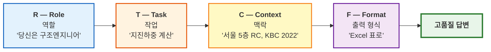
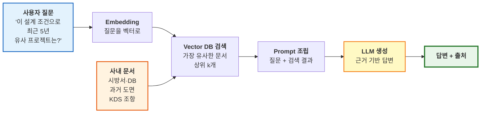
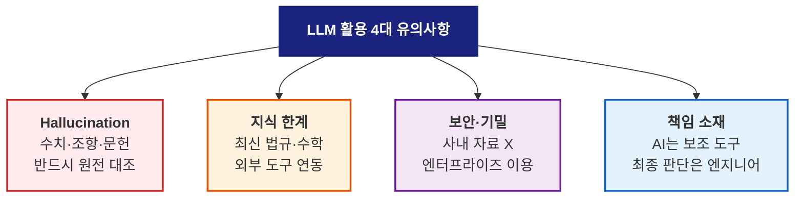

# L22. LLM의 건축공학 활용

> [!finding] 핵심 메시지
> LLM은 건축공학의 **설계·시공·연구·교육** 전 영역에 보조 도구로 쓸 수 있다. 그러나 "무엇을 시킬 것인가(프롬프트)"와 "**결과를 어떻게 검증할 것인가**"는 AI 시대 건축공학도의 두 축이다. 좋은 프롬프트는 좋은 설계 조건서와 같고, 검증은 구조 엔지니어의 최종 승인과 같다. LLM이 바꾸는 것은 **도구**이지 **책임**이 아니다.

## 강의 중점
- LLM의 건축공학 분야 활용 가능성
- AI 코파일럿 시대의 건축공학도 역량

## 학습 목표
1. LLM을 건축공학 실무(설계, 시공, 연구)에 활용하는 방법을 이해한다.
2. 프롬프트 엔지니어링의 기본 원리를 이해하고 간단한 프롬프트를 작성할 수 있다.

## 강의 내용

---

> [!ref] 이전 강의에서
> **L21 (LLM 기본 개념)**에서 Transformer·Self-Attention·Scaling Law 등 LLM의 내부 원리를 살펴보았다. 이번 강의에서는 이 LLM이 **건축공학 실무(설계·시공·연구·교육)**에 **어떻게 쓰이는가**를 구체적인 프롬프트와 실제 화면으로 체험한다. 단순히 "ChatGPT 쓰는 법"이 아니라, **엔지니어로서 어떻게 써야 하는가**에 초점을 둔다.

---

### 도입 영상

먼저 국내·해외에서 LLM(ChatGPT/Claude)이 건축·토목·건설 실무에 실제로 어떻게 쓰이고 있는지를 영상으로 확인한다.

> [!ref] 도입 영상 — 국내 사례
> 1. [현직 건축가가 알려주는 AI 활용 10가지 방법 (13:42)](https://www.youtube.com/watch?v=10WSnwQOV5k) — 건축 설계에 ChatGPT 적용, 실무와 한계
> 2. [챗GPT를 활용한 토목실무, 어디까지 가능할까? (12:34)](https://www.youtube.com/watch?v=bZ7gLjRT4-4) — AI건설실무, 보고서 자동화·법규 검색
> 3. [공사 기사를 위한 ChatGPT 활용법](https://m.youtube.com/watch?v=rjimXholP4o) — GS건설 실무 시나리오, RFI·검측
> 4. [ChatGPT를 활용한 건축적 아이디어 만들기 (7:20)](https://www.youtube.com/watch?v=JvZJ9IVyxD0) — 설계 컨셉 발산, 레퍼런스 정리
> 5. [프롬프트 엔지니어링 기초 — Chat GPT (14:02)](https://www.youtube.com/watch?v=7WZU45FSaNU) — 효과적인 프롬프트 작성법

> [!ref] 도입 영상 — 해외·글로벌 사례
> 1. [How to learn AI in AEC in 2024 — Future Architecture (26:44)](https://www.youtube.com/watch?v=dBAX_JmQvbg) — 건축가·엔지니어를 위한 ChatGPT 실전 프롬프트
> 2. [Enhancing Architects' Workflow with AI — AEC-tech talk #12](https://www.youtube.com/watch?v=ns2ZVWyZhdY) — AI가 바꾸는 설계 워크플로
> 3. [Building an AI adoption strategy for Architects, Engineers](https://www.youtube.com/watch?v=4-ZqNOfEx7o) — 조직 차원의 AI 도입 전략
> 4. [ChatGPT for Construction Managers — COMPLETE Guide](https://www.youtube.com/watch?v=4j_QxJJsSwk) — 건설관리자용 프롬프트 템플릿

> [!question] 생각해보기
> 영상 속 사례 중 **"내가 내일부터 바로 시도할 수 있는 것"** 1가지를 고른다면? 반대로 **"LLM에 맡기면 위험하다고 느낀 것"** 1가지는? 기준은 무엇인가? — 책임? 정확성? 데이터?

---

### 섹션 1: 설계 단계의 LLM 활용

설계 단계는 **텍스트·기준·계산·코드**가 뒤섞인 작업이다. LLM은 그 사이를 연결하는 **조수(copilot)** 역할을 맡는다.

#### 1.1 설계 기준(KDS/KBC) 조회·해석 보조

LLM은 방대한 기준서 본문을 **요약하거나 조문 사이 관계를 정리**하는 데 강하다. 그러나 **수치·조항 번호는 반드시 원전 대조**가 필요하다 (hallucination 위험).


*건축도시공간연구원(AURI)이 개발한 ChatGPT 기반 건축법령 해석 시스템 — 출처: [KHARN (2024)](https://www.kharn.kr/news/article.html?no=24000)*


*ChatGPT 기반 Building Code 질의 보조 예시 — 조항 해석·요약 대화 인터페이스 — 출처: r/askarchitects (Reddit)*

> [!tip] 교육 포인트
> **LLM은 조문을 "검색"하지 않고 "생성"한다.** 즉, 그럴듯해 보여도 **실제로는 존재하지 않는 조항 번호**를 만들어 낼 수 있다. 반드시 [국가법령정보센터](https://www.law.go.kr) · [KDS·KBC](https://www.kcsc.re.kr)에서 **원전 대조** 필수.

#### 1.2 구조 해석 코드 생성 (Python/MATLAB)

단순 보의 반력·모멘트, BMD/SFD 도시, 슬래브 하중분배 등 **정형화된 계산**은 LLM이 Python 코드로 빠르게 초안 작성한다.


*Python으로 구현한 단순보 해석 스크립트 — 반력·BMD·SFD 자동 출력 (LLM 생성 코드 활용 예) — 출처: [Flocode](https://flocode.substack.com/p/022-a-simply-supported-beam-in-python)*

**전형적 워크플로**


#### 1.3 보고서·검토서 초안 작성

구조계산서의 **서술부**(설계 개요, 하중 산정 근거, 재료 사양 등)는 LLM이 빠르게 초안을 만든다. 수치·도면은 엔지니어가 확정·검증한다.

#### 1.4 설계 단계 LLM 적용 요약

| 업무 | LLM 활용 수준 | 위험도 | 필수 검증 |
|------|--------------|-------|-----------|
| **기준/법규 요약** | 매우 유용 | 중 | 원전 조항 대조 |
| **개념 발산·레퍼런스 정리** | 매우 유용 | 낮음 | 상호 일관성 |
| **구조 해석 코드 초안** | 매우 유용 | 중 | 손계산·단위 |
| **구조계산서 서술부** | 유용 | 중 | 수치·조항 번호 |
| **하중·내력 직접 계산** | **주의** | **매우 높음** | 엔지니어 재계산 |
| **도면·상세도 생성** | 제한적 | 중 | 도면 표준 적합성 |

---

### 섹션 2: 시공·관리 단계의 LLM 활용

시공 단계의 핵심 문서는 **시방서·RFI·회의록·안전계획서**이다. 모두 "**텍스트 대량 가공**"이 필요하며, LLM이 가장 큰 효과를 내는 영역이다.

#### 2.1 시방서 요약·핵심 조항 추출

수백 페이지 시방서에서 "**내 공종에 해당하는 조항**"만 뽑아낸다. 긴 문서 전체를 Claude에 붙여 넣고 **"이 시방서에서 철근 배근 허용오차 조항만 표로 정리해줘"** 식으로 질의하면 수 초 내에 추출된다.

#### 2.2 RFI(Request for Information) 작성 보조


*AI 에이전트 기반 건설 RFI 워크플로 자동화 — 문서 검색 + 드래프트 생성 + 승인 라우팅 — 출처: [Datagrid (2025)](https://datagrid.com/blog/ai-agents-improve-rfi-process)*

- **전통 방식**: 현장 기사가 수동 작성 → 설계사 회신까지 평균 7~14일
- **LLM 보조**: 도면 부분 캡처 + 시방서 조항 → 초안 자동 작성 (수분)
- **효과**: 초안 작성 시간 70~90% ↓, 품질 편차 ↓

#### 2.3 회의록·안전계획서 자동화

- **음성 → 텍스트(STT)** + **LLM 요약** → 회의록 자동 생성
- **재해 사례 DB + 공정 정보** → **TBM(Tool Box Meeting) 스크립트** 자동 작성
- 대표 도구: MS Teams Copilot, Otter.ai, 네이버 Clova Note + GPT

#### 2.4 Text-to-BIM / BIM-LLM 연동 (신기술)


*LLM 기반 BIM 자동 법규 적합성 검토 파이프라인 — IFC 모델 파싱 + LLM이 자연어 조항 해석 + 충돌 보고 — 출처: [Automation in Construction (2025)](https://www.sciencedirect.com/science/article/pii/S0926580525007472)*


*LLM이 자연어 설계 요구사항을 해석하여 BIM 객체·파라미터 생성으로 매핑하는 개념도 — 출처: [Artificial Intelligence Review (2025)](https://link.springer.com/article/10.1007/s10462-025-11241-7)*

- **Text2BIM**: "RC 구조 3층 사무소, 경간 8m, 층고 3.5m" → LLM이 Revit API / IFC 명령 생성
- **Autodesk Assistant for Revit (2025)**: Revit 안에서 대화로 설계 수정 가능


*Autodesk Assistant for Revit — 자연어로 Revit 조작·파라미터 수정·BIM 질의 — 출처: [Autodesk (2025)](https://www.autodesk.com/solutions/autodesk-ai/autodesk-assistant)*

#### 2.5 시공 단계 LLM 적용 요약

| 업무 | 기존 소요 시간 | LLM 활용 후 | 효과 |
|------|---------------|-------------|------|
| **시방서 요약** | 2~3일 | 수 시간 | 90% ↓ |
| **RFI 초안 작성** | 1~2일 | 30분~1시간 | 80% ↓ |
| **회의록 작성** | 2~3시간 | 10분 | 90% ↓ |
| **안전계획서 초안** | 3~5일 | 수 시간 | 80% ↓ |
| **공정 지연 원인 분석** | 1일 | 수 시간 | 70% ↓ |

---

### 섹션 3: 연구·교육 단계의 LLM 활용

연구·교육 영역은 LLM의 **텍스트 이해·추론 능력**이 가장 직접적으로 활용되는 분야다. 특히 학부 4학년·대학원생에게 **가장 먼저 체감되는 생산성 향상**이 일어난다.

#### 3.1 논문 요약·문헌 조사


*Google NotebookLM — 본인이 업로드한 논문 PDF 집합에 대해서만 답변 (RAG 기반, hallucination 최소화) — 출처: [Leon Furze (2024)](https://leonfurze.com/2024/09/16/hands-on-with-google-notebooklm/)*


*Elicit — 학술 DB 전체에서 질의 기반 문헌 검색·요약·데이터 추출 — 출처: [Elicit](https://elicit.com/)*


*Consensus — 학술 논문 합의(consensus)를 질의 단위로 요약하는 AI 검색엔진 — 출처: [EduCraft (2025)](https://educraft.tech/consensus-ai-tool-to-take-your-research-to-the-next-level/)*

**연구용 LLM 도구 비교**

| 도구 | 특징 | 적합 용도 | 한계 |
|------|------|-----------|------|
| **ChatGPT (GPT-4/5)** | 범용·코드·플러그인 | 아이디어 발산, 초안 | 일반 웹 지식, 출처 부정확 |
| **Claude** | 장문 분석, 코드 | 논문 전체 요약, 비교 | 최신 웹 연결 제한 |
| **NotebookLM** | 내 업로드 자료만 | 강의자료·논문 집합 Q&A | 일반 웹 검색 X |
| **Elicit** | 학술 DB 연동 | 체계적 문헌 조사 | 영어 중심 |
| **Consensus** | 논문 합의 요약 | "A는 B에 효과적인가?" 질의 | 질문 형태 제한 |
| **Scholar GPT / Paper QA** | ChatGPT 플러그인 | 구글스칼라 연동 | 플러그인 안정성 |

#### 3.2 데이터 분석·시뮬레이션 코드 작성

- **실험 데이터 처리**: CSV 정리, 통계 분석, 그래프 자동화 (pandas, matplotlib)
- **수치해석 스크립트**: 유한요소 전·후처리, OpenSees 예제 수정
- **논문 Figure 재현**: 기존 그래프를 본인 데이터에 맞춰 스타일 수정

#### 3.3 학습 보조 — "1:1 튜터"로서의 LLM

학부 강의·자격시험 준비에 특히 효과적이다.

- **개념 설명**: "RC 보의 ρ, ρ_b 차이를 고1 수준으로 설명해줘"
- **문제 풀이 안내**: 답을 알려주는 게 아니라 **풀이 절차**를 단계별로
- **오답 진단**: 본인 풀이를 보여주고 "어디가 틀렸는지" 질의
- **심화 질문 생성**: 시험 예상문제 자동 생성


*Claude Artifacts — 대화 중 생성된 코드·표·문서를 우측 패널에 실시간 렌더링, 연구·학습용 자료 작성에 유용 — 출처: [ZDNet (2025)](https://www.zdnet.com/article/anthropic-launches-new-ai-feature-to-build-your-own-customizable-chatbots/)*

> [!question] 생각해보기
> "답"을 얻는 것과 "풀이 절차"를 얻는 것 중 **학습 효과가 큰 것**은? 시험 하루 전 LLM 사용 방법과 평소 학습 LLM 사용 방법은 어떻게 달라야 하는가?

---

### 섹션 4: 프롬프트 엔지니어링 원리 — RTCF 구조

**프롬프트(prompt)** = LLM에게 주는 지시문. 같은 질문도 **어떻게 묻느냐**에 따라 답변 품질이 극적으로 달라진다. 가장 널리 쓰이는 구조는 **RTCF**이다.


*RTF (Role-Task-Format) 프롬프트 패턴 — Role: 역할 / Task: 작업 / Format: 출력 형식 — 출처: [Christian Bernecker, Medium](https://christianbernecker.medium.com/prompt-design-pattern-part-1-role-task-format-prompt-rtf-44297b8bd38e)*




*Anthropic 공식 프롬프트 엔지니어링 가이드 — 명확성·구조·예시의 3요소 강조 — 출처: [01cloud Engineering (2025)](https://engineering.01cloud.com/2025/06/02/become-a-prompt-engineering-pro-with-anthropics-free-interactive-guide/)*

#### 4.1 프롬프트 예시 3종 — **Bad / Good / Great**

> [!example] **Bad 프롬프트**
> ```
> KBC 계산해줘.
> ```
> **문제점**: 역할·대상·조건·출력 전부 불명. LLM은 "KBC가 Korean Building Code인지, Kansas Business Club인지"도 모름 → 막연하고 틀릴 가능성 높은 답변.

> [!example] **Good 프롬프트**
> ```
> KBC 2022에 따라 지진하중을 계산해줘.
> 건물은 서울 강남구, 5층 RC 구조.
> ```
> **개선점**: 기준(KBC 2022), 지역, 규모, 구조형식을 명시 → 답변이 훨씬 구체화됨. 그러나 **중요도·풍하중 조건·출력 포맷**이 여전히 없음.

> [!example] **Great 프롬프트 (RTCF 완성형)**
> ```
> [Role]
> 당신은 KBC 2022에 숙련된 한국 구조 엔지니어입니다.
>
> [Task]
> 다음 건물의 층별 지진 전단력(Vx)과 총 기저전단력(V)을 등가정적
> 해석법으로 계산해 주세요.
>
> [Context]
> - 위치: 서울 강남구 (지역계수 S = 0.22)
> - 지반: S4 (관입시험 결과 N=15)
> - 구조: RC 모멘트저항 골조 (중간모멘트 골조)
> - 건물: 5층, 각 층고 3.5 m, 총 높이 17.5 m
> - 중요도: 일반 사무소 (I = 1.0)
> - 각 층 중량: 1, 2층 = 2,000 kN, 3~5층 = 1,800 kN
>
> [Format]
> 1) 설계 가속도 스펙트럼 SDS, SD1을 먼저 유도
> 2) 반응수정계수 R, 주기 T 산정 근거 명시
> 3) 층별 Vx를 Markdown 표로 출력 (층 | 높이 | 중량 | Cvx | Vx)
> 4) 마지막에 총 기저전단력 V와 KBC 2022 조항 번호 병기
> 5) 수치는 kN 단위, 소수점 2자리
> ```
> **결과**: LLM이 **엔지니어링 보고서 형식**으로, **조항 번호 포함**, **표 형태**로 답변. 검증이 훨씬 쉬움.

#### 4.2 기법 — Few-shot, CoT, Self-Consistency


*Few-shot prompting — 예시 몇 개를 제공하여 출력 패턴 유도 — 출처: [Analytics Vidhya (2024)](https://www.analyticsvidhya.com/blog/2024/07/few-shot-prompting/)*


*Chain-of-Thought / Tree-of-Thought / Graph-of-Thought — 추론 과정을 단계적으로 노출하여 정확도 향상 — 출처: [Weights & Biases](https://wandb.ai/sauravmaheshkar/prompting-techniques/reports/Chain-of-thought-tree-of-thought-and-graph-of-thought-Prompting-techniques-explained---Vmlldzo4MzQwNjMx)*

| 기법 | 설명 | 건축 예시 |
|------|------|-----------|
| **Zero-shot** | 예시 없이 지시 | "이 RC 보를 설계해줘" |
| **Few-shot** | 2~3개 예시 제공 | "예시: [그림1→답1], [그림2→답2], 이제 [그림3]은?" |
| **Chain-of-Thought (CoT)** | "단계별로 생각해줘" | "단계별로 하중을 나누어 계산해줘" |
| **Self-Consistency** | 여러 번 생성 후 다수결 | 같은 질문 3회 → 가장 자주 나온 답 채택 |
| **Role-play** | 역할 부여 | "당신은 한국 KISTEC 구조 심사관" |
| **Refinement** | 반복 수정 지시 | "이 답변에서 가정 부분만 다시 설명해줘" |

#### 4.3 프롬프트 패턴 비교

| 패턴 | 길이 | 초보자 | 전문가 | 추천 용도 |
|------|------|-------|-------|-----------|
| **RTF** (Role/Task/Format) | 짧음 | ★★★ | ★★ | 일반 질문 |
| **RTCF** (+ Context) | 중간 | ★★★ | ★★★ | 건축·엔지니어링 |
| **RTCROS** (+ Reasoning/Output/Success) | 길음 | ★★ | ★★★ | 보고서·코드 |
| **ReAct** (Reasoning + Acting) | 길음 | ★ | ★★★ | Agent·Tool 사용 |

> [!tip] 교육 포인트
> **프롬프트 엔지니어링 = 설계 조건서 작성**. 건축 설계에서도 "집 지어줘"가 아니라 "대지·용도·예산·기후·동선"을 명시한 **설계 조건서**가 좋은 설계를 만든다. LLM도 똑같다. **"무엇을 원하는가"를 명확히 할 수 있는 사람**만이 AI를 잘 쓴다.

---

### 섹션 5: RAG — 건축 도메인 특화 LLM

일반 LLM은 **학습 시점 이후 정보**와 **사내 자료**(KDS 최신판, 회사 설계 DB, 과거 프로젝트 시방서)를 모른다. 이를 해결하는 것이 **RAG(Retrieval-Augmented Generation)**이다.

#### 5.1 RAG 원리


*RAG 워크플로 — 질문 → Retriever(검색) → LLM(생성)의 2단계 — 출처: [LangChain / Towards AI](https://pub.towardsai.net/introduction-to-retrieval-augmented-generation-rag-using-langchain-and-lamaindex-bd0047628e2a)*



#### 5.2 건축 도메인 RAG 활용

| 활용 | 내부 DB | 기대 효과 |
|------|---------|-----------|
| **사내 설계기준 QA** | 회사 구조설계 매뉴얼 | 신입 교육 시간 ↓ |
| **과거 프로젝트 유사사례 검색** | 준공 도면·시방서 DB | 견적·공정 계획 정확도 ↑ |
| **법규 상시 자문** | KDS·KBC 원본 + 유권해석 | 오해석 ↓, 원전 링크 제공 |
| **품질 사고 DB 질의** | 하자 DB, 보수 이력 | 반복 사고 예방 |
| **안전 사고 사례 조회** | 중대재해 DB | TBM 스크립트 자동화 |

#### 5.3 왜 RAG인가?

- **일반 ChatGPT**: "2024 이후 개정된 KDS는 모름" / "우리 회사 매뉴얼 당연히 모름"
- **RAG**: "업로드한 문서에서만 답변" → **Hallucination 대폭 감소**, **출처 추적 가능**
- **Fine-tuning**과 비교: RAG는 **실시간 갱신** 가능, fine-tuning은 무거움

> [!info] 참고
> L23부터 시작되는 **BIM 강의 블록**과 연결된다 — BIM의 구조화된 데이터는 RAG의 **좋은 입력**이 된다. 즉, **LLM + BIM + RAG**의 삼각형이 앞으로의 건축 AI 핵심 축이다.

---

### 섹션 6: LLM 활용 시 주의사항

LLM은 강력하지만, 건축공학의 **안전·책임·비밀유지** 맥락에서는 반드시 알아야 할 한계가 있다.


*AI가 생성한 가짜 참고문헌 — 한 학회에서 수락된 51편 논문에서 100개의 hallucinated citation이 발견됨 — 출처: [r/MachineLearning (Reddit)](https://www.reddit.com/r/MachineLearning/comments/1qjz88r/d_100_hallucinated_citations_found_in_51_accepted/)*

#### 6.1 Hallucination (환각)

- **정의**: 사실이 아닌 정보를 **자신 있게** 생성
- **건축 사례**:
  - 존재하지 않는 KDS 조항 번호 생성
  - 저자·연도·논문 제목이 **그럴듯하지만 실제 없는** 참고문헌
  - 실제 공식과 다른 "그럴듯한" 공식 유도
- **대응**: 숫자·조항·참고문헌은 **반드시 원전 대조**

#### 6.2 정확성·최신성 한계

| 한계 | 설명 | 회피 전략 |
|------|------|-----------|
| **지식 절단점** | 학습 데이터 이후는 모름 | 웹 검색 연동(ChatGPT web, Perplexity) |
| **수학 계산** | 복잡한 수치 계산 오류 | **코드 실행** 기능 사용 |
| **세밀한 전문지식** | 한국 KDS의 최신 개정 등 | RAG + 원전 확인 |
| **단위 오류** | kN / MPa / mm 혼동 | 프롬프트에 단위 명시 |

#### 6.3 보안·개인정보

> [!important] 절대 금지
> - **사내 도면·시방서·발주처 자료**를 무단으로 public ChatGPT에 업로드 X
> - **개인정보**(성명, 주민번호, 주소)를 포함한 문서 업로드 X
> - 민감 프로젝트는 **기업용 Claude / Azure OpenAI / 사내 구축** 활용
> - 로그가 **학습 데이터에 포함되는지** 약관 확인 필수

#### 6.4 책임 소재

- LLM은 **도구**이다. **최종 판단·승인은 인간 엔지니어**.
- AI가 산출한 코드·보고서·설계안을 그대로 제출 → **엔지니어 책임**이 면제되지 않는다.
- **서명 전 검토(review before sign)** 원칙은 AI 시대에도 불변.



> [!question] 생각해보기
> LLM이 생성한 구조계산서를 바탕으로 건물을 시공했는데 붕괴가 발생했다. 엔지니어는 "LLM이 그렇게 계산했다"고 주장할 수 있는가? 당신이 판사라면 어떤 기준으로 책임을 배분하겠는가?

---

### 섹션 7: AI 시대 건축공학도의 역량

AI는 엔지니어를 **대체**하지 않는다. 그러나 **AI를 잘 쓰는 엔지니어가 그렇지 않은 엔지니어를 대체**할 것이다. L18(AI 활용)에서 언급한 4대 역량을 LLM 시대에 맞게 구체화한다.


*건설에 AI를 입힌 '콘테크(ConTech)' 성장 — 2030년까지 시장 규모 약 18조 원 전망 — 출처: [KoIT (2025)](https://www.koit.co.kr/news/articleView.html?idxno=129332)*


*Autodesk Forma AI — 생성형 AI 기반 부지 계획, 자연어 조건 입력 → 수백 개 대안 생성 — 출처: [Autodesk Forma Blog (2025)](https://blogs.autodesk.com/forma/2025/04/24/how-to-use-generative-design-ai-and-3d-modeling-for-improved-site-planning/)*


| 역량 | 구체 스킬 | 본 학과 연계 과목 |
|------|-----------|-------------------|
| **기본기** | 구조역학, 철근콘크리트, 건축환경, 시공법, 법규 | L05~L20 전 과목 |
| **디지털 리터러시** | BIM(Revit), Python, Excel 자동화 | 건축공학프로그래밍, L23~ BIM 블록 |
| **AI 활용** | RTCF 프롬프트, RAG, LLM+BIM 연동 | LLM활용 건축공학AI구현 |
| **비판적 사고** | Hallucination 식별, 원전 대조, 단위 검증 | 공학윤리, 본 강의 L18·L22 |
| **융합·윤리** | 책임소재 이해, 보안, Human-in-the-Loop | L18 섹션 5, L22 섹션 6 |

> [!action] 실천 권장
> **오늘부터 100일 챌린지**
> 1. 매일 **건축 관련 질문 1개**를 ChatGPT 또는 Claude에 던져본다.
> 2. 답변을 받으면 **반드시 1개 수치/조항**을 원전에서 확인한다.
> 3. 주 1회 RTCF 구조로 **프롬프트를 다시 써서** 결과 차이를 기록한다.
> 4. 한 달 후 자신의 **"건축용 프롬프트 템플릿 5종"**을 정리한다.

> [!info] 다음 강의 예고
> 지금까지 살펴본 LLM·RAG·AI가 **학습할 데이터**가 건축 분야에서 가장 구조화되어 있는 곳이 바로 **BIM(Building Information Modeling)**이다. L23부터 시작되는 BIM 블록은 "**건축 정보의 언어**"를 배우는 과정이다. LLM과 BIM이 만나는 지점에서 앞으로의 AI 건축이 열린다.

---

## 실습/과제

- [ ] **실습+과제 (통합)**: ChatGPT 또는 Claude를 활용하여 아래 **4개 중 2개 이상**을 수행하고 **대화 스크린샷 + 결과 검증 코멘트**를 제출한다.

  1. **단순보 반력·모멘트 계산 (구조)**
     - 조건: span 6 m, 등분포하중 w = 10 kN/m, 양단 핀지점
     - LLM에 계산 요청 → 손계산(Ra = Rb = 30 kN, Mmax = 45 kN·m)과 대조
     - RTCF 구조로 프롬프트 작성할 것 (섹션 4 참조)

  2. **건축 Python 코드 생성 및 실행 검증 (프로그래밍)**
     - 예: 일사량 계산기, BMD/SFD 자동 도시, 콘크리트 배합 계산기 등 1개 주제 선정
     - LLM에 Python 코드 요청 → Colab 또는 로컬에서 **직접 실행** → 결과 검증

  3. **KDS·KBC 2022 법규 질의 및 정확성 검증 (법규)**
     - 예: "KBC 2022에서 바닥 활하중 기준은 용도별로 어떻게 되나?"
     - LLM 답변을 [KCSC 기준 원전](https://www.kcsc.re.kr)과 **조항 단위**로 대조
     - **어긋난 부분·hallucination**이 있다면 구체적으로 지적

  4. **건축공학 실무/연구 시나리오 제안 (심화)**
     - 본인이 상상하는 LLM 활용 시나리오 1개 (예: "모듈러 아파트 현장 RFI 자동화")
     - LLM과의 대화를 통해 가능성과 한계 분석
     - "어디까지 자동화 가능한가 / 어디부터 인간 엔지니어가 필요한가"를 논의

  **제출 형식**: 대화 스크린샷(2개 항목 × 각 1~2장) + 검증/분석 코멘트 (A4 2매 내외, 자유 형식 — Word / PDF 모두 가능)

  **평가 루브릭 (총 8점)**
  - **프롬프트 구성 (RTCF 적용 수준)**: 2점 — 역할·작업·맥락·출력형식이 명시되었는가?
  - **LLM 답변 검증 (정확성·출처 확인)**: 3점 — 수치·조항·참고문헌을 원전과 대조했는가?
  - **본인 분석 (가능성·한계 의견)**: 2점 — 단순 전사(轉寫)가 아닌 **자신의 해석**이 있는가?
  - **건축 전공 연관성**: 1점 — 건축공학 맥락과의 연결이 뚜렷한가?

  **제출 방법**: 이메일 kh1819@khu.ac.kr, 제목 `[AE개론_L22] 학번_이름_LLM활용`
  **마감**: **W12 수업 전** — **5/20(수) 12:00**

- [ ] **선택 실습 (보너스 1점)**: 본인 질문에 대해 Bad / Good / Great(RTCF 완성형) 프롬프트 3종을 **직접 작성**하고, 각 답변 품질을 비교한 **프롬프트 진화 노트** 1매 추가 제출.

## Notes
- 수업 중 질문/피드백:
- 다음 수업 준비사항: L23 BIM 기본 개념 예습 — Autodesk Revit Student 라이선스 신청 (무료), [BIM 소개 영상 (7:29)](https://www.youtube.com/watch?v=sZygHGWiHc8) 시청

## 이미지 출처

| 파일명 | 설명 | 출처 |
|--------|------|------|
| `auri-chatgpt-building-law.png` | AURI 건축법령 ChatGPT | [KHARN (2024)](https://www.kharn.kr/news/article.html?no=24000) |
| `building-code-chatgpt.png` | Building Code Assistant (ChatGPT) | [r/askarchitects (Reddit)](https://www.reddit.com/r/askarchitects/comments/12b9rpp/building_code_assistant_powered_by_chatgpt/) |
| `python-beam-analysis.png` | Python 단순보 해석 스크립트 | [Flocode](https://flocode.substack.com/p/022-a-simply-supported-beam-in-python) |
| `ai-rfi-construction.png` | AI 기반 건설 RFI 자동화 | [Datagrid (2025)](https://datagrid.com/blog/ai-agents-improve-rfi-process) |
| `llm-bim-compliance-ga.jpg` | LLM+BIM 자동 법규 적합성 | [Automation in Construction (2025)](https://www.sciencedirect.com/science/article/pii/S0926580525007472) |
| `llm-aec-review.png` | LLM in AEC 리뷰 논문 | [AI Review (2025)](https://link.springer.com/article/10.1007/s10462-025-11241-7) |
| `autodesk-assistant-revit.jpg` | Autodesk Assistant for Revit | [Autodesk (2025)](https://www.autodesk.com/solutions/autodesk-ai/autodesk-assistant) |
| `notebooklm-interface.png` | Google NotebookLM 인터페이스 | [Leon Furze (2024)](https://leonfurze.com/2024/09/16/hands-on-with-google-notebooklm/) |
| `elicit-research.png` | Elicit 학술 AI | [Elicit](https://elicit.com/) |
| `consensus-ai-interface.jpg` | Consensus AI 학술 검색 | [EduCraft (2025)](https://educraft.tech/consensus-ai-tool-to-take-your-research-to-the-next-level/) |
| `claude-artifacts-interface.png` | Claude Artifacts | [ZDNet (2025)](https://www.zdnet.com/article/anthropic-launches-new-ai-feature-to-build-your-own-customizable-chatbots/) |
| `rtf-prompt-pattern.png` | RTF 프롬프트 패턴 | [Christian Bernecker / Medium](https://christianbernecker.medium.com/prompt-design-pattern-part-1-role-task-format-prompt-rtf-44297b8bd38e) |
| `anthropic-prompt-guide.webp` | Anthropic 프롬프트 가이드 | [01cloud Engineering (2025)](https://engineering.01cloud.com/2025/06/02/become-a-prompt-engineering-pro-with-anthropics-free-interactive-guide/) |
| `few-shot-example.jpg` | Few-shot prompting | [Analytics Vidhya (2024)](https://www.analyticsvidhya.com/blog/2024/07/few-shot-prompting/) |
| `chain-of-thought.png` | Chain-of-Thought Prompting | [Weights & Biases](https://wandb.ai/sauravmaheshkar/prompting-techniques/reports/Chain-of-thought-tree-of-thought-and-graph-of-thought-Prompting-techniques-explained---Vmlldzo4MzQwNjMx) |
| `rag-workflow-langchain.jpeg` | RAG 워크플로 (LangChain) | [Towards AI](https://pub.towardsai.net/introduction-to-retrieval-augmented-generation-rag-using-langchain-and-lamaindex-bd0047628e2a) |
| `llm-hallucination-citations.png` | AI 가짜 참고문헌 사례 | [r/MachineLearning (Reddit)](https://www.reddit.com/r/MachineLearning/comments/1qjz88r/d_100_hallucinated_citations_found_in_51_accepted/) |
| `korean-contech-ai.png` | 한국 콘테크(ConTech) | [KoIT (2025)](https://www.koit.co.kr/news/articleView.html?idxno=129332) |
| `autodesk-forma-ai.jpg` | Autodesk Forma AI | [Autodesk Forma Blog (2025)](https://blogs.autodesk.com/forma/2025/04/24/how-to-use-generative-design-ai-and-3d-modeling-for-improved-site-planning/) |

> 모든 이미지는 교육 목적으로 사용되었으며, 저작권은 각 출처에 있습니다.

## Related
- **이전 강의**: [[L21-LLM-기본-개념]]
- **다음 강의**: [[L23-BIM-기본-개념]]
- **관련 주제**: [[L17-AI-기초-개념]], [[L21-LLM-기본-개념]], [[L23-BIM-기본-개념]]
- **강의일정**: [[00-Syllabus/강의일정_2026-1|강의일정표]]
- **MOC**: [[400-Lab/_MOC]]
