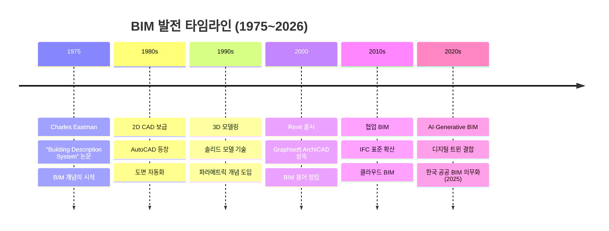
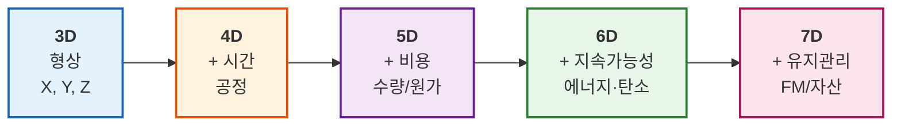
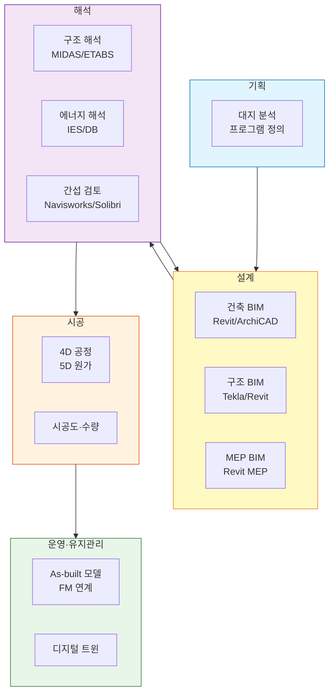
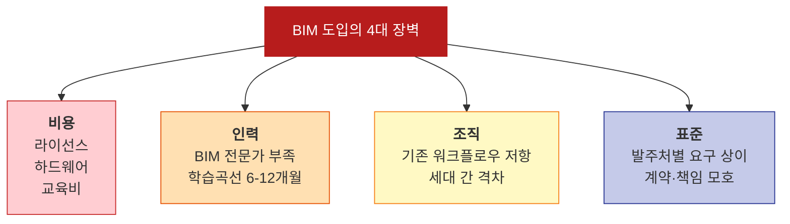

# L23. BIM 기본 개념

> [!info] 📄 강의자료
> [[건공개론 L23-L24.pdf|건공개론 L23–L24 강의자료 다운로드 (PDF)]]

> [!finding] 핵심 메시지
> BIM은 단순한 3D CAD가 아니라 **건축물의 물리적·기능적 정보를 통합 관리하는 프로세스**다. 2D CAD와 근본적으로 다른 객체 기반 정보 모델로, AI·디지털 트윈의 데이터 기반이 된다.

## 강의 중점
- BIM(Building Information Modeling)의 정의와 개념
- BIM 소프트웨어와 실무 워크플로우

## 학습 목표
1. BIM의 정의, 특징, 기존 CAD와의 차이를 설명할 수 있다.

## 강의 내용

---

> [!ref] 이전 강의에서
> **L17-22 (AI/LLM)** 에서 배운 AI 기법들은 강력하지만 **학습할 구조화된 건축 데이터가 필요**하다. 그 데이터의 원천이 바로 이번 강의의 주제 **BIM(Building Information Modeling)** 이다. 2D CAD 시대의 한계를 근본적으로 극복한 객체 기반 모델링의 원리를 배운다.

---

### 도입 영상

본격적인 강의에 앞서, BIM이 무엇이고 왜 건설산업에 필수가 되었는지 감을 잡기 위해 아래 영상을 준비했다. 한국어·영어 영상을 함께 제시하니 편한 것부터 시청해 보자.

> [!ref] 참고 영상 1 — BIM 개념 (한국어)
> [BIM 기술을 손쉽게 이해하는 방법](https://www.youtube.com/watch?v=O6Lmlf2hPY4) — 건설산업 디지털 전환의 핵심 기술 BIM 소개

> [!ref] 참고 영상 2 — Revit MEP 왕초보 (한국어)
> [01. [Revit MEP 왕초보 탈출작전] BIM과 Revit의 기본개념](https://www.youtube.com/watch?v=w8ivzT5ngpI) — 오토데스크코리아, BIM·Revit 기초 개념 10분 요약

> [!ref] 참고 영상 3 — 한국 BIM 전개 (한국어)
> [건설산업 디지털화의 핵심! LH 단지토목분야 BIM을 소개합니다](https://www.youtube.com/watch?v=ANHGlZdNcBQ) — LH 한국토지주택공사, 공공 분야 BIM 적용 사례

> [!ref] 참고 영상 4 — What is BIM (영어)
> [What is BIM? | Introduction to Building Information Modeling](https://www.youtube.com/watch?v=-hXhyBjpRSo) — BIM의 정의와 개념을 영어로 간결하게 설명

> [!ref] 참고 영상 5 — Revit 기초 (영어)
> [Learn Revit in 23 minutes — Complete Tutorial for Beginners](https://www.youtube.com/watch?v=Yo2ySOpdqUU) — 전 세계에서 가장 널리 쓰이는 BIM 도구 Revit의 기초 튜토리얼

> [!question] 생각해보기
> "왜 건설산업은 2D CAD에서 BIM으로 전환하는 데 10년 이상 걸렸을까? 기술 문제인가, 조직 관성 문제인가?"

---

### 1. BIM의 정의와 등장 배경

#### 1.1 BIM이란 무엇인가

**BIM(Building Information Modeling)** 은 건축물의 물리적·기능적 특성을 **디지털 방식으로 표현하고 관리하는 프로세스**다.

- **핵심 포인트**: BIM은 "소프트웨어"가 아니라 "프로세스(Process)"
- **미국 NBIMS-US 정의**: "시설물의 물리적·기능적 특성을 공유 가능한 지식 자원으로 표현한 디지털 모델이며, 시설물 생애주기(Life-cycle) 전반에 걸쳐 의사결정을 위한 신뢰할 수 있는 기반을 제공"
- **ISO 19650 정의**: 건설 환경의 정보 관리(Information management)를 위한 표준 프로세스

BIM은 **3D 형상 + 속성 정보(재료·비용·시간·에너지 등) + 협업 프로세스**가 결합된 통합 체계이며, 이 세 요소가 모두 있어야 비로소 BIM이라 부를 수 있다.

![[revit-interface.jpg|600]]
*Autodesk Revit 2025 인터페이스 — 3D 모델과 평면·입면·단면이 실시간으로 연동되는 대표적 BIM 저작 환경 — 출처: [Autodesk](https://www.autodesk.com/products/revit/features)*

> [!info] 용어 정리 — BIM의 세 글자
> - **B** (Building): 건축물뿐 아니라 인프라·교량·터널까지 포함 (2020년대 이후 "Built environment" 전반으로 확장)
> - **I** (Information): 형상뿐 아니라 재료·성능·비용·시간·유지관리 정보까지 망라
> - **M** (Modeling): Model(명사)이 아니라 **Modeling(동사)** — 모델을 만들고 공유·활용하는 **프로세스**를 강조

#### 1.2 BIM의 역사 — 40년의 여정

BIM의 개념은 하루아침에 등장하지 않았다. 약 50년에 걸친 기술·산업 발전의 누적이다.

![[bim-history-timeline.webp|600]]
*BIM의 역사 — 1960년대 CAD 태동부터 2020년대 Generative/AI BIM까지 — 출처: [RIB Software](https://www.rib-software.com/en/blogs/bim-history-evolution)*

> [!hypothesis] 역사의 교훈
> BIM의 아이디어(1975)와 실제 실무 보급(2010년대) 사이에는 약 35년의 시차가 있다. **기술이 아니라 컴퓨팅 파워·네트워크·산업 문화**가 준비되기까지 걸린 시간이다. 지금의 AI/디지털 트윈 기술도 유사한 성숙 곡선을 따를 것이다.

#### 1.3 왜 BIM인가 — 건설산업의 5대 고질병

[[L04-건축공학의-미래]] 에서 배운 건설산업의 문제들이 BIM이 필요한 이유다.

| 고질병 | 내용 | BIM의 해법 |
|--------|------|-----------|
| **낮은 생산성** | 50년간 정체 (제조업의 1/4) | 자동 도면 생성, 수량 산출 자동화 |
| **정보 단절** | 설계↔시공↔유지관리 간 정보 소실 | 생애주기 단일 데이터 |
| **설계 오류** | 2D 도면 간 불일치, 간섭 미발견 | Clash Detection으로 사전 검토 |
| **재작업 비용** | 현장 재시공 비용이 원가의 10-30% | 가상 시공으로 재작업 최소화 |
| **협업 비효율** | 각 분야(건축·구조·MEP) 별도 작업 | 통합 모델(Federated Model) |

---

### 2. CAD vs BIM — 근본적 차이

#### 2.1 "선(Line) vs 객체(Object)"의 차이

**2D CAD**와 **BIM**의 차이는 "2D인가 3D인가"의 문제가 아니다. **무엇을 그리는가**의 문제다.

| 질문 | 2D CAD | BIM |
|-----|--------|-----|
| 벽을 그릴 때 | 2개의 평행한 **선** | 두께·재료·층 구조를 가진 **벽(Wall) 객체** |
| 문을 그릴 때 | 호(arc) + 선으로 **기호**를 그림 | 문 객체 배치 → 벽에 자동 개구부 생성 |
| 창을 옮길 때 | 해당 도면만 수정 | 모델 수정 → 평면·입면·단면 **자동 업데이트** |
| 면적 산출 | 수작업으로 계산 | 모델에서 **자동 추출** |

![[cad-vs-bim-comparison.jpg|600]]
*2D CAD vs 3D BIM — 같은 건축물을 표현하는 근본적으로 다른 방식 — 출처: [Hitech CAD Services](https://www.hitechcaddservices.com/news/from-2d-to-3d-why-architects-switching-to-bim/)*

#### 2.2 4가지 관점에서의 비교

```mermaid
flowchart LR
    subgraph CAD["2D CAD (선 기반)"]
        direction TB
        C1["표현: 선·호·텍스트"]
        C2["정보: 도형만"]
        C3["연동: 수동"]
        C4["활용: 도면 출력"]
    end

    subgraph BIM["BIM (객체 기반)"]
        direction TB
        B1["표현: 객체 (Wall, Door...)"]
        B2["정보: 재료·비용·시간·성능"]
        B3["연동: 자동 (모델→도면)"]
        B4["활용: 생애주기 전반"]
    end

    CAD -.진화.-> BIM

    style CAD fill:#ffebee,stroke:#c62828,stroke-width:2px
    style BIM fill:#e8f5e9,stroke:#2e7d32,stroke-width:2px
    style C1 fill:#ffcdd2
    style C2 fill:#ffcdd2
    style C3 fill:#ffcdd2
    style C4 fill:#ffcdd2
    style B1 fill:#c8e6c9
    style B2 fill:#c8e6c9
    style B3 fill:#c8e6c9
    style B4 fill:#c8e6c9
```

| 관점 | 2D CAD | BIM |
|------|--------|-----|
| **표현 방식** | 선(Line), 호(Arc), 텍스트 — 2D 도형의 집합 | 객체(Object) — 벽·기둥·문·창 등 실제 건축 요소 |
| **정보 담김** | 도면의 형상 정보만 — 나머지는 범례·사양서에 별도 | 객체에 재료·비용·성능·일정 등 **속성(Parameter)** 내장 |
| **도면 간 연동** | 수동 — 평면 수정 시 입면·단면도 개별 수정 | 자동 — 모델 한 번 수정하면 모든 도면·단면·리스트 즉시 반영 |
| **활용 범위** | 도면 출력 중심 (설계 단계에 국한) | 설계·해석·시공·유지관리 **전 생애주기** |

> [!finding] 핵심
> BIM의 본질은 "3D로 그렸다"가 아니라 "**객체가 자기 자신에 대한 정보를 알고 있다**"는 것. 벽은 자기 두께·재료·내화성능·단열값을 스스로 기억한다.

#### 2.3 구체적 예시 — 창문 1개의 변경

어떤 건물의 창문 1개 크기를 변경한다고 하자.

**2D CAD에서는**:
1. 평면도에서 창문 기호 수정
2. 입면도 4장에서 각각 해당 창문 수정
3. 단면도 2장에서 해당 위치 수정
4. 창호 일람표(Window Schedule)에서 해당 창 사양 수정
5. 수량 산출서에서 유리 면적 재계산
6. **총 수정 파일 수: 7~10개, 누락 위험 큼**

**BIM에서는**:
1. 3D 모델에서 창문 객체 속성 수정 (1회)
2. **모든 평면·입면·단면·일람표·수량서가 자동 업데이트**
3. 간섭 여부 자동 재검토

이 한 가지 예만으로도 BIM의 생산성 우위가 드러난다.

---

### 3. BIM의 차원 (nD) — 3D를 넘어

#### 3.1 nD BIM의 개념

BIM의 "차원(Dimension)"은 공간 차원이 아니라 **어떤 정보가 추가로 결합되는가**를 뜻한다. 3D 형상에 시간·비용·에너지·시설관리 등의 정보가 차례로 결합된다.

![[bim-dimensions-wikimedia.png|600]]
*BIM의 6가지 차원 — 3D 형상에서 7D 시설관리까지의 정보 확장 — 출처: [Wikimedia Commons](https://commons.wikimedia.org/wiki/File:6_BIM_DIMENSIONS.png)*

#### 3.2 차원별 정의와 용도

| 차원 | 결합 정보 | 주요 활용 | 대표 도구 |
|------|-----------|-----------|-----------|
| **3D** | X, Y, Z — 형상 모델 | 설계, 시각화, 간섭 검토 | Revit, ArchiCAD |
| **4D** | + 시간(Time) — 공정 일정 | 시공 시뮬레이션, 공기 예측 | Navisworks, Synchro |
| **5D** | + 비용(Cost) — 물량·단가 | 견적, 원가 관리, VE 분석 | Vico Office, Cubicost |
| **6D** | + 지속가능성(Sustainability) | 에너지 해석, 탄소 발자국 | IES VE, DesignBuilder, Ecotect |
| **7D** | + 시설관리(FM) | 운영·유지보수, 자산 관리 | ArchiBus, Ecodomus |

**중요**: 각국·기관마다 5D~7D의 순서가 다르게 정의되기도 한다 (예: 일부 기관은 6D=시설관리, 7D=지속가능성). 핵심은 **3D 형상에 다양한 시간·비용·성능 정보가 결합된다**는 개념이다.

![[bim-dimensions-infographic.png|600]]
*BIM 차원별 정보 결합 인포그래픽 — 2D 도면부터 7D 시설관리까지 — 출처: [BuildEXT](https://buildext.com/en/bim-dimensions/)*

#### 3.3 4D BIM의 실제 — 공정 시뮬레이션

![[4d-bim-schedule.jpg|600]]
*4D BIM 공정 시뮬레이션 — 3D 모델에 공정 일정이 결합되어 시공 순서를 시각적으로 재현 — 출처: [United-BIM](https://www.united-bim.com/the-4d-way-collaboration-of-schedule-with-3d-bim-model/)*

4D BIM에서는 각 객체에 **시공 시작/종료 일자**가 연결된다. 시간축을 드래그하면 건물이 순차적으로 "세워지는" 애니메이션이 재생된다.

**활용 효과**:
- 공정 간섭 사전 발견 (예: 철근 배근 후 거푸집 설치 순서)
- 크레인 동선·가설 계획 시뮬레이션
- 착공 전 이해관계자 합의 (건축주·감리·협력업체)
- 공기 지연 리스크 사전 식별

> [!tip] 실무 팁
> 4D BIM은 단순히 "예쁜 애니메이션"이 아니다. 시공 순서 최적화로 **공기 5-15% 단축**, 가설비 10-20% 절감이 가능하다.

#### 3.4 LOD — 정보의 상세 수준

BIM 모델의 **정보 상세도**를 단계적으로 정의한 것이 **LOD(Level of Development, 또는 Level of Detail)** 이다.

![[lod-stages.jpg|600]]
*LOD 단계 — 같은 객체(예: 기둥)가 LOD 100에서 LOD 500으로 갈수록 정보가 풍부해짐 — 출처: [United-BIM](https://www.united-bim.com/bim-level-of-development-lod-100-200-300-350-400-500/)*

| LOD | 단계 | 상세도 | 대표 시점 |
|-----|------|--------|-----------|
| **LOD 100** | 개념 설계 | 덩어리(Massing) — 볼륨만 표현 | 기본 계획 |
| **LOD 200** | 기본 설계 | 대략적 형상·크기 (±오차 허용) | 계획 설계 |
| **LOD 300** | 실시 설계 | 정확한 형상·크기·위치 | 실시 설계 |
| **LOD 350** | 시공 상세 | + 타 객체와의 관계 (접합부 등) | 시공도 |
| **LOD 400** | 제작·시공 | + 제작·설치 정보 (볼트·용접 등) | 시공 단계 |
| **LOD 500** | 준공·FM | + 실측 정보 (As-built) | 유지관리 |

> [!warning] 자주 하는 오해
> "BIM은 무조건 LOD 500이어야 한다"는 오해가 많다. 그러나 **과잉 상세화는 오히려 생산성을 떨어뜨린다**. 설계 단계에 맞는 LOD를 사용하는 것이 원칙이다 (예: 기본 계획 단계에서 볼트까지 모델링하는 것은 낭비).

---

### 4. 주요 BIM 소프트웨어 (2026년 기준)

#### 4.1 BIM 소프트웨어 지도

BIM은 단일 소프트웨어가 아니다. 각 단계·분야별로 특화된 도구들이 있다.

| 소프트웨어 | 용도 | 개발사 | 주요 시장 | 특장점 |
|-----------|------|--------|-----------|--------|
| **Autodesk Revit** | 건축·구조·MEP 통합 설계 | Autodesk (미국) | 북미·한국·글로벌 | 시장 점유율 1위, 방대한 패밀리 라이브러리 |
| **Graphisoft ArchiCAD** | 건축 설계 (의장 강점) | Graphisoft (헝가리, Nemetschek 계열) | 유럽·아시아 | 직관적 UI, OS X 지원, 오픈 BIM 친화적 |
| **Trimble Tekla Structures** | 구조 상세 (철골·RC) | Trimble (미국) | 글로벌 (구조) | 상세도 강력, 철골 제작 데이터 생성 |
| **Autodesk Navisworks** | 모델 통합·간섭검토·4D | Autodesk | 글로벌 | Clash Detection의 표준, 4D 시뮬레이션 |
| **Solibri Office** | 모델 품질 검토·규정 검증 | Nemetschek (독일) | 유럽·한국 | IFC 기반 검증, 한국 공공 BIM 표준 검증 |
| **Nemetschek Allplan** | 건축·토목 (BIM+GIS) | Allplan (독일) | 유럽 | 토목·교량 강점 |
| **Vectorworks** | 건축·인테리어·조경 | Nemetschek 계열 | 북미·유럽 | 창의적 디자인, 조경 특화 |
| **Bentley MicroStation / OpenBuildings** | 인프라·플랜트 BIM | Bentley (미국) | 토목·플랜트 | 대규모 인프라 특화 |

![[archicad-interface.jpg|600]]
*Graphisoft ArchiCAD — Revit과 쌍벽을 이루는 건축 BIM의 양대 도구 — 출처: [Graphisoft](https://www.graphisoft.com/en-us/plans-and-products/archicad/)*

![[tekla-structures.webp|600]]
*Trimble Tekla Structures — 철골·RC 상세 설계에서 세계 표준, 국내 건설사의 구조 BIM에도 널리 사용 — 출처: [Technostruct Academy](https://www.technostructacademy.com/blog/)*

#### 4.2 모델 통합과 간섭 검토

단일 도구로 모든 것을 다루지 않는다. 건축·구조·MEP 각 분야가 서로 다른 도구로 모델링한 뒤, 통합 모델을 만들어 **간섭 검토(Clash Detection)** 를 수행한다.

![[federated-bim-model.jpg|600]]
*Federated Model — 건축·구조·MEP가 각자 작성한 모델을 통합한 연합 모델 — 출처: [QECAD](https://www.qecad.com/cadblog/federated-bim-model-concept-and-its-sustaining-benefits/)*

![[clash-detection-navisworks.jpg|600]]
*Clash Detection 실제 화면 — Navisworks가 자동으로 구조-MEP 간섭을 식별 (빨강=경성 충돌) — 출처: [United-BIM](https://www.united-bim.com/get-to-know-all-about-clash-detection-with-navisworks/)*

![[clash-detection-mep.jpg|600]]
*구조-배관 간섭 사례 — 보(Beam)를 배관이 관통하려는 충돌. 착공 전 발견 시 재작업 비용 0원, 시공 중 발견 시 수백만~수천만 원 — 출처: [United-BIM](https://www.united-bim.com/get-to-know-all-about-clash-detection-with-navisworks/)*

> [!tip] 실무에서 Clash Detection의 가치
> 일반적으로 대형 프로젝트에서 수백~수천 건의 간섭이 발견된다. 이를 **착공 전** 발견해 해결하면 현장에서의 재시공·재발주·공기 지연 비용을 막대하게 절감할 수 있다. 싱가포르·영국의 조사에 의하면 Clash Detection이 건설 원가의 3-10% 절감 효과를 가져온다.

#### 4.3 Solibri — 품질·규정 검증의 표준

![[solibri-model-checker.png|600]]
*Solibri Office — BIM 모델의 품질·규정 준수를 자동 검증 (예: 방화 요건, 피난 경로, 객실 면적) — 출처: [Solibri](https://www.solibri.com/)*

Solibri는 "Clash만이 아니라 **품질·규정**을 검증한다"는 점에서 차별화된다:
- 누락된 객체 탐지 (예: 방화벽이 천장까지 연결되었는가?)
- 법규 위반 탐지 (예: 피난 동선이 최대 거리 초과?)
- 객체 속성 누락 탐지 (예: 방음 등급이 입력되지 않은 벽?)

한국의 조달청 BIM 검증·LH 설계 검토에서도 Solibri가 사용된다.

#### 4.4 개방형 BIM(openBIM)과 IFC

어떤 건축주는 Revit을 쓰고, 어떤 협력업체는 ArchiCAD를 쓴다면? 상호 호환을 위한 국제 표준이 **IFC(Industry Foundation Classes)** 다.

![[ifc-openbim.png|600]]
*IFC 기반 openBIM — 서로 다른 BIM 도구 간 정보를 중립 포맷(IFC)으로 교환 — 출처: [buildingSMART](https://www.buildingsmart.org/)*

- **IFC**: BIM 데이터의 **중립 교환 포맷** (ISO 16739)
- **buildingSMART International**: IFC를 관리하는 국제 비영리 기관 (한국 빌딩스마트협회 있음)
- **COBie**: 시설관리 정보 교환 표준 (7D BIM에 자주 사용)
- **BCF**: 이슈·코멘트 교환 포맷 (협업 중 발견된 문제 공유)

> [!info] 용어 정리 — 4대 BIM 표준
> - **IFC** (Industry Foundation Classes): 모델 데이터 교환
> - **COBie** (Construction-Operations Building information exchange): FM 정보 교환
> - **BCF** (BIM Collaboration Format): 이슈·코멘트 교환
> - **IDS** (Information Delivery Specification): 정보 요구사항 명세

---

### 5. BIM 워크플로우 — 설계부터 유지관리까지

#### 5.1 전 생애주기 관점

BIM의 진가는 **건축물의 전 생애주기(Life-cycle)** 를 관통하는 단일 정보 기반이다.

![[bim-lifecycle.jpeg|600]]
*BIM 생애주기 — 기획·설계·시공·운영·철거에 이르기까지 동일 모델이 계승·확장됨 — 출처: [QE BIM Services](https://www.qebimservices.co.uk/blog/explain-the-different-stages-of-the-bim-lifecycle/)*

#### 5.2 단계별 BIM 활용

| 단계 | BIM 활용 | 담당자 | 주요 산출물 |
|------|----------|--------|-------------|
| **기획** | 매스 스터디, 대지 분석, 프로그램 검토 | 건축주·기획 PM | 개념 모델(LOD 100), 사업 타당성 |
| **설계** | 건축·구조·MEP 협업 설계 | 건축사·구조·MEP | LOD 200~300 모델, 설계 도서 |
| **해석** | 구조·에너지·일조·동선 분석 | 엔지니어 | 해석 결과, 성능 검증 |
| **검토** | 간섭 검토(Clash), 규정 검증 | BIM 코디네이터 | Clash 리포트, 수정 지시서 |
| **시공** | 4D 공정·5D 원가·시공도 | 시공사·협력업체 | 공정표, 수량서, 시공도 |
| **준공** | As-built 모델, FM 연계 | 감리·건축주 | LOD 500 모델, FM 데이터 |
| **운영** | 디지털 트윈, 예방정비 | 시설관리자 | 유지관리 이력, 에너지 리포트 |

#### 5.3 Revit UI로 배우는 BIM 실무

![[revit-ui-learn.png|400]]
*Revit UI의 핵심 구성 — Ribbon(상단 메뉴), Project Browser(좌측), View Area(중앙), Properties(좌하단) — 출처: [Autodesk Learn](https://www.autodesk.com/learn/ondemand/module/revit-user-interface-tour)*

처음 Revit을 열면 중요한 3요소를 확인해야 한다:
1. **Project Browser**: 평면·입면·단면·3D 뷰가 모두 같은 모델을 참조
2. **Properties**: 선택한 객체의 속성(재료·치수·성능) 확인·수정
3. **Family**: 문·창·가구 등 재사용 가능한 객체 라이브러리

> [!tip] 학습 전략
> BIM 소프트웨어는 메뉴 클릭으로 배우는 것이 아니다. **실제 건물 하나를 처음부터 끝까지 모델링**해 보는 것이 가장 빠르다. 수업에서 Autodesk Viewer로 샘플 모델을 탐색해 보자.

---

### 6. BIM 도입의 한계와 과제

BIM이 만능은 아니다. 도입에는 분명한 장벽이 있다.

![[bim-adoption-barriers.jpg|600]]
*BIM 도입의 장벽 — 비용·학습곡선·조직 저항·표준 부재 — 출처: [United-BIM](https://www.united-bim.com/bim-adoption-aec-industry-barriers-common-mistakes-focus-areas-successful-implementation/)*

#### 6.1 4대 장벽

| 장벽 | 구체적 이슈 | 대응 방향 |
|------|-------------|-----------|
| **비용** | Revit 라이선스 연 약 300만원/시트, 고성능 PC 필요 | 클라우드 BIM, 교육용 무료 라이선스 활용 |
| **인력** | 학습곡선 6-12개월, BIM 매니저 부족 | 대학·교육기관 BIM 과정 확대 |
| **조직** | 기존 CAD 프로세스와의 마찰, 팀 구조 개편 필요 | 점진적 도입, 파일럿 프로젝트 |
| **표준** | LOD 요구, 제출 포맷, 모델 책임 소재 모호 | ISO 19650, 국가별 BIM 가이드라인 |

#### 6.2 BIM Washing — 흔한 실패 패턴

- **"BIM 도입 = Revit 구매"라는 착각**: 도구만 도입하고 프로세스는 기존 그대로
- **3D 모델만 만들고 속성 정보 미입력**: 자동 수량 산출 불가
- **설계 단계에만 사용하고 시공에 단절**: 4D·5D·7D 활용 실패
- **발주처 요구에 맞추기 위한 "형식적 BIM"**: 실제 현장에선 여전히 2D 도면 사용

> [!warning] 교육 포인트 — BIM의 본질
> BIM은 "3D 모델링 도구"가 아니라 **정보 관리 프로세스**다. 소프트웨어만 바꾸는 것이 아니라 **팀 구조·계약·워크플로우 전체를 바꾸는 일**이다. 따라서 BIM 도입은 기술 이슈가 아니라 **경영·조직 이슈**에 가깝다.

> [!question] 생각해보기
> "한국 중소 설계사무소가 BIM 도입을 망설이는 가장 큰 이유는 무엇일까? 정부가 의무화하면 자동으로 해결될 문제일까?"

#### 6.3 BIM의 미래 — AI·디지털 트윈과의 결합

BIM은 이제 정적인 "모델"을 넘어 동적인 "정보 기반"으로 진화 중이다.

- **Generative BIM**: AI가 요구 조건으로부터 다수 대안 자동 생성 (예: Spacemaker, Autodesk Forma)
- **Digital Twin**: BIM + IoT 센서 + 실시간 데이터 → 실제 건물과 실시간 동기화
- **AI 기반 자동 모델링**: 도면 사진에서 BIM 모델 자동 생성 (연구 단계)
- **LLM + BIM**: 자연어 질의 ("이 건물의 철근량 알려줘") → BIM에서 자동 추출 (L22 참고)

이 모든 것의 **기반 데이터**가 BIM이다. [[L17-AI-기초-개념|L17-22 AI]] 강의에서 본 "학습 데이터가 필요하다"는 주제의 해답이 여기에 있다.

> [!question] 생각해보기
> "BIM이 있으면 AI 시대에 건축사의 역할이 축소될까, 확장될까? BIM은 AI의 대체재인가 보완재인가?"

> [!info] 다음 강의 예고
> L24에서는 BIM이 **실제 프로젝트의 설계·시공·유지관리**에 어떻게 쓰이는지, 그리고 한국의 **2025년 공공건축물 BIM 의무화 정책**과 현업 적용 실태(LH·조달청·서울시 사례)를 다룬다. 또한 국내 BIM 시장의 현황과 한국만의 특수성·과제를 살펴볼 것이다.

---

## 실습/과제

- [ ] **체험 실습**: [Autodesk Viewer](https://viewer.autodesk.com) (무료) 접속 → Autodesk가 제공하는 샘플 BIM 파일 (Revit, IFC 등) 업로드 → 3D 회전·단면 자르기·객체 속성 확인 → 스크린샷 3장 (외관/단면/객체 속성) 제출
  - 또는 [BIMcollab ZOOM Free](https://www.bimcollab.com/), [Trimble Connect Free](https://connect.trimble.com/) 활용 가능
  - 샘플 IFC 파일: buildingSMART의 공식 샘플, [KBIMS 한국형 BIM 표준 샘플](http://www.kbims.or.kr/) 등
- [ ] **과제**: 다음 중 1개 선택
  1. **BIM 소프트웨어 비교**: Revit / ArchiCAD / Tekla 중 2개를 선정하여 용도·가격·장단점을 A4 1매 표로 정리 (공식 홈페이지 기반, 개인 블로그 인용 지양)
  2. **BIM 용어 정리**: LOD / IFC / COBie / BCF 4개 용어를 그림·예시 포함 A4 1매로 설명
  - 제출: 이메일 kh1819@khu.ac.kr, 제목 `[AE개론_L23] 학번_이름_BIM과제`
  - 마감: **W13 수업 전** (5/27 수요일 12시)

## Notes
- 수업 중 질문/피드백:
- 다음 수업 준비사항: BIM 활용 사례 및 국내 정책 동향 자료 준비

## 이미지 출처

| 파일명 | 설명 | 출처 |
|--------|------|------|
| `revit-interface.jpg` | Autodesk Revit 2025 UI | [Autodesk](https://www.autodesk.com/products/revit/features) |
| `bim-history-timeline.webp` | BIM 역사 타임라인 | [RIB Software](https://www.rib-software.com/en/blogs/bim-history-evolution) |
| `cad-vs-bim-comparison.jpg` | 2D CAD vs 3D BIM 비교 | [Hitech CAD Services](https://www.hitechcaddservices.com/news/from-2d-to-3d-why-architects-switching-to-bim/) |
| `bim-dimensions-wikimedia.png` | BIM 6개 차원 인포그래픽 | [Wikimedia Commons](https://commons.wikimedia.org/wiki/File:6_BIM_DIMENSIONS.png) |
| `bim-dimensions-infographic.png` | BIM 차원별 결합 정보 | [BuildEXT](https://buildext.com/en/bim-dimensions/) |
| `4d-bim-schedule.jpg` | 4D BIM 공정 시뮬레이션 | [United-BIM](https://www.united-bim.com/the-4d-way-collaboration-of-schedule-with-3d-bim-model/) |
| `lod-stages.jpg` | LOD 100-500 단계별 비교 | [United-BIM](https://www.united-bim.com/bim-level-of-development-lod-100-200-300-350-400-500/) |
| `archicad-interface.jpg` | Graphisoft ArchiCAD UI | [Graphisoft](https://www.graphisoft.com/en-us/plans-and-products/archicad/) |
| `tekla-structures.webp` | Trimble Tekla Structures | [Technostruct Academy](https://www.technostructacademy.com/blog/) |
| `federated-bim-model.jpg` | Federated BIM Model | [QECAD](https://www.qecad.com/cadblog/federated-bim-model-concept-and-its-sustaining-benefits/) |
| `clash-detection-navisworks.jpg` | Navisworks Clash Detection | [United-BIM](https://www.united-bim.com/get-to-know-all-about-clash-detection-with-navisworks/) |
| `clash-detection-mep.jpg` | 구조-MEP 간섭 사례 | [United-BIM](https://www.united-bim.com/get-to-know-all-about-clash-detection-with-navisworks/) |
| `solibri-model-checker.png` | Solibri 모델 품질 검증 | [Solibri](https://www.solibri.com/) |
| `ifc-openbim.png` | IFC·openBIM 표준 | [buildingSMART](https://www.buildingsmart.org/) |
| `bim-lifecycle.jpeg` | BIM 생애주기 | [QE BIM Services](https://www.qebimservices.co.uk/blog/explain-the-different-stages-of-the-bim-lifecycle/) |
| `revit-ui-learn.png` | Revit UI 핵심 구성 | [Autodesk Learn](https://www.autodesk.com/learn/ondemand/module/revit-user-interface-tour) |
| `bim-adoption-barriers.jpg` | BIM 도입 장벽 | [United-BIM](https://www.united-bim.com/bim-adoption-aec-industry-barriers-common-mistakes-focus-areas-successful-implementation/) |

> 모든 이미지는 교육 목적으로 사용되었으며, 저작권은 각 출처에 있습니다.

## Related
- **이전 강의**: [[L22-LLM의-건축공학-활용]]
- **다음 강의**: [[L24-BIM-활용과-국내-동향]]
- **관련 주제**: [[L17-AI-기초-개념]], [[L22-LLM의-건축공학-활용]], [[L25-건축공학과-IT-기술]]
- **주차 노트**: [[W12-건축공학BIM]]
- **강의일정**: [[00-Syllabus/강의일정_2026-1|강의일정표]]
- **MOC**: [[400-Lab/_MOC]]
