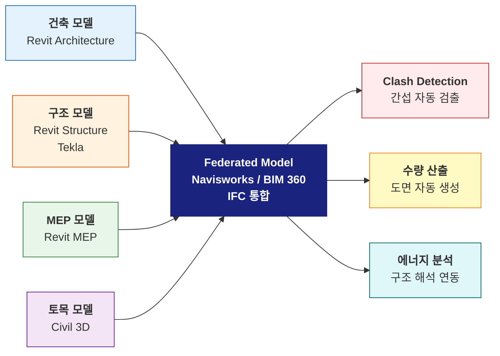
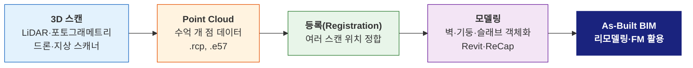
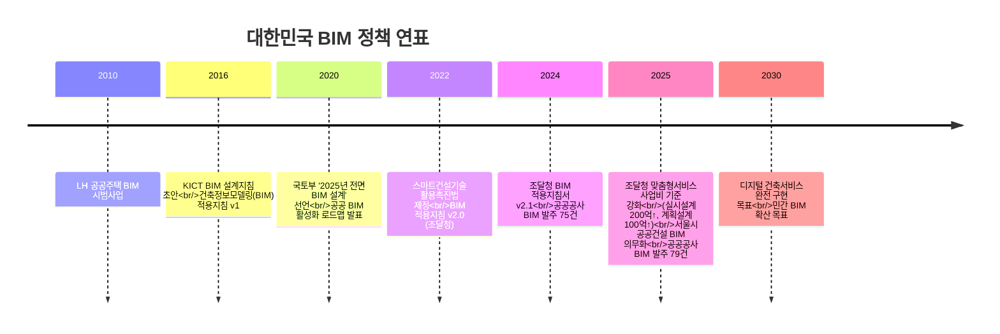
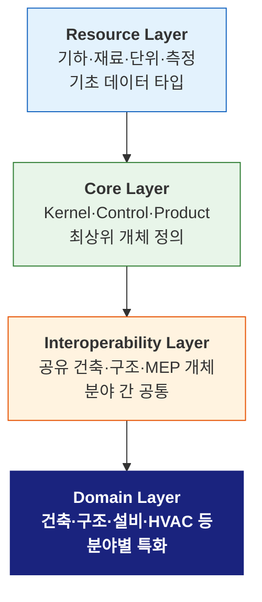
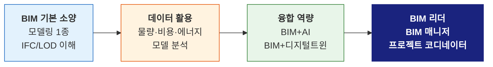

# L24. BIM 활용과 국내 동향

> [!info] 📄 강의자료
> [[건공개론 L23-L24.pdf|건공개론 L23–L24 강의자료 다운로드 (PDF)]]

> [!warning] 공휴일 안내 — 5/25(월)은 부처님 오신날
> 2026년 5월 25일(월)은 **부처님 오신날(공휴일)** 입니다. 이 강의는 별도 보강 일정으로 대체됩니다.
> **보강 일정은 강의지원시스템 공지 및 수업 시작 전 이메일로 별도 안내**하니 반드시 확인해 주세요.

> [!finding] 핵심 메시지
> BIM은 설계·시공·유지관리 **전 생애주기 도구**이다. 한국은 2025년부터 **조달청 맞춤형서비스(사업비 200억 원 이상 실시설계, 100억 원 이상 계획설계)** 와 공공건축물 BIM 적용이 본격화되면서 전환점에 진입했고, 2030년 디지털 건축서비스 완전 구현을 목표로 확산 중이다. 글로벌 경쟁력 확보를 위한 **민간 확산**과 **openBIM 기반 데이터 표준화**가 다음 과제다.

## 강의 중점
- BIM의 발전 과정과 국내외 동향
- BIM 기반 설계/시공/유지관리 활용

## 학습 목표
1. BIM의 설계-시공-유지관리 전 생애주기 활용 방법을 이해한다.
2. 국내 BIM 의무화 정책 동향과 실무 적용 현황을 파악한다.

## 강의 내용

---

> [!ref] 이전 강의에서
> **L23 (BIM 기본 개념)** 에서 CAD와 BIM의 근본적 차이, 객체 기반 모델링, nD 개념(3D→7D)을 배웠다. 이번 강의는 BIM이 **실제 프로젝트의 설계·시공·유지관리** 에 어떻게 쓰이는지, 그리고 한국의 **조달청 BIM 적용 확산과 2030 로드맵**, 실무 적용 현황을 살펴본다.

---

### 도입 영상 — BIM이 실제 현장에서 어떻게 쓰이는가

> [!ref] 참고 영상 (국내)
> - [조달청 시설사업 BIM 적용지침서 (1) — 공공 건축분야 BIM 국가지침](https://www.youtube.com/watch?v=Uc_--AUbP0o) — BIMinKorea, 조달청 지침 개요
> - [조달청 시설사업 BIM 적용지침서 (2) — 설계단계 BIM 적용지침](https://www.youtube.com/watch?v=Anq80ND7Ygw) — BIMinKorea, 계획설계/실시설계 BIM 제출물
> - [스마트건설 챌린지 — BIM 분야 개회식](https://www.youtube.com/watch?v=MzkacCthh8I) — 국토교통부, 한국도로공사 주관
> - [혁신적인 스마트 건설기술 — 포스코이앤씨 (6:09)](https://www.youtube.com/watch?v=bWo5fDzqUUo) — BIM 기반 스마트 컨스트럭션

> [!ref] 참고 영상 (해외)
> - [buildingSMART's openBIM workflow explained — Léon van Berlo](https://www.youtube.com/watch?v=g4yu2s3Wp7Y) — buildingSMART International 기술이사
> - [Unveiling CORENET X — Multi-Agency Collaboration](https://www.youtube.com/watch?v=WwEuQBuYoG0) — 싱가포르 BCA
> - [4D Simulation — BIM Projects and Construction](https://www.youtube.com/watch?v=QSUMpDOOQHE) — 4D 공정 개념
> - [BIM LOD Explained (Level 100~500)](https://www.youtube.com/watch?v=wplq-K6gvsc) — AEC 업계 LOD 체계

> [!question] 생각해보기
> "한국 건설산업은 BIM을 '도면 작성 도구'로 활용하는 단계인가, 아니면 '프로세스 혁신 도구'로 쓰는 단계인가? 실제 현장의 한계는 무엇일까?"

---

### 섹션 1. 설계 단계 BIM 활용 — Federated Model과 Clash Detection

설계 단계 BIM의 핵심은 **분야별 모델을 하나의 통합 모델(federated model)로 결합**하여 물리적/기능적 충돌을 사전 검토하는 것이다.

#### 1.1 분야별 모델링과 통합

| 분야 | 주요 BIM 소프트웨어 | 모델링 대상 |
|------|---------------------|-------------|
| **건축 (Architecture)** | Revit, ArchiCAD | 벽, 바닥, 천장, 문, 창, 계단 |
| **구조 (Structure)** | Revit Structure, Tekla Structures | 기둥, 보, 슬래브, 철근 상세 |
| **MEP (Mechanical-Electrical-Plumbing)** | Revit MEP, MagiCAD | 덕트, 배관, 전력, 조명, 소방 |
| **토목/부지 (Civil/Site)** | Civil 3D, InfraWorks | 부지, 도로, 하수, 옹벽 |

![[federated-bim-model.jpg|600]]
*Federated BIM Model — 건축·구조·MEP 모델을 IFC 또는 Navisworks에서 통합하여 간섭과 설계 일관성을 검토 — 출처: QECAD*

#### 1.2 Clash Detection (간섭 검토)

설계 단계에서 **배관-덕트 충돌, 구조-설비 간섭** 등을 자동으로 탐지한다. 과거 현장에서 발견하던 오류를 설계 단계에서 해결하므로 **재시공(rework) 비용을 크게 줄인다.**

![[clash-detection-navisworks.jpg|600]]
*Navisworks Clash Detection — 배관(파랑)과 전기 트레이(노랑)의 충돌을 색상으로 시각화 — 출처: United BIM*

| Clash 유형 | 설명 | 사례 |
|-----------|------|------|
| **Hard Clash (물리적 충돌)** | 두 객체가 공간상 겹침 | 덕트와 보가 같은 위치 |
| **Soft Clash (공차 간섭)** | 유지보수/시공 공간 부족 | 밸브 주변 작업 공간 미확보 |
| **4D Clash (시간 간섭)** | 공정상 작업 순서 충돌 | 동일 시점에 타설·배근 충돌 |

> [!finding] 실무 효과
> McGraw-Hill Construction(2014) 보고서: Clash Detection을 활용한 프로젝트는 **RFI(Request for Information) 수 40~60% 감소, 재시공 비용 7~10% 절감**으로 측정되었다. 설계 후기(실시설계)보다 **설계 초기(계획설계)에 Clash Detection을 조기 적용**할수록 수정 비용이 급격히 감소한다(MacLeamy Curve).

#### 1.3 자동 도면·수량 산출

BIM 모델이 변경되면 평면/입면/단면, 물량표, 상세도가 **자동으로 업데이트**된다. 2D CAD의 반복 수정 작업이 사라진다.

---

### 섹션 2. 시공 단계 BIM 활용 — 4D·5D·AR

#### 2.1 4D BIM — 공정 시뮬레이션 (3D + 시간)

공정표(Gantt Chart, MS Project, Primavera)를 3D 모델에 연결하여 **일·주 단위로 시공 진행을 시각화**한다.

![[4d-bim-schedule.jpg|600]]
*4D BIM — 공정표와 3D 모델을 결합한 시공 시뮬레이션. 시간의 흐름에 따라 구조물이 세워지는 과정을 시각화 — 출처: United BIM*

| 활용 영역 | 효과 |
|----------|------|
| **공정 최적화** | 공종 중첩, 병목 구간 사전 식별 |
| **가설 계획** | 타워크레인·거푸집·비계 배치 시뮬레이션 |
| **이해관계자 커뮤니케이션** | 발주자/주민에게 시공 과정 시각적 설명 |
| **안전 계획** | 고위험 공종 사전 시뮬레이션 |

#### 2.2 5D BIM — 물량 산출·공사비 자동화

모델 객체에 비용 정보를 연결하여 **실시간 공사비 추정과 Value Engineering**이 가능하다.

![[5d-bim-cost.jpg|600]]
*5D BIM — 3D 모델에서 자동 추출된 물량과 단가를 연결하여 실시간 공사비 산출 — 출처: Conserve Solution*

- **QTO (Quantity Take-Off)**: 모델에서 직접 콘크리트 m³, 철근 ton, 거푸집 m² 자동 산출
- **설계변경 영향 분석**: 기둥 단면 변경 시 물량·비용·일정에 미치는 영향 즉시 파악
- **국내 현실**: 일위대가 연동, 표준품셈 적용은 아직 **BIM-전산원가 연계 자동화** 과제

#### 2.3 시공성 검토와 AR/MR 현장 활용

![[ar-hololens-bim.jpg|600]]
*AR/MR을 활용한 현장 시공 검측 — HoloLens/iPad로 BIM 모델을 현장에 중첩(overlay)하여 시공 정확도 확인 — 출처: INCIDE*

| 기술 | 장비 | 현장 활용 |
|------|------|----------|
| **AR (Augmented Reality)** | iPad, Trimble SiteVision | 도면 위 BIM 모델 중첩, 철근 배근 검측 |
| **MR (Mixed Reality)** | Microsoft HoloLens 2, Trimble XR10 | 설비 매립 위치 확인, 3D 홀로그램 협업 |
| **모바일 BIM** | BIM 360, Procore, Bluebeam | 현장에서 태블릿으로 모델 확인, 이슈 등록 |

> [!ref] 참고 영상
> [4D Construction Simulation Explained (CM Builder)](https://www.youtube.com/watch?v=QSUMpDOOQHE) — 4D BIM의 개념과 기대 효과

---

### 섹션 3. 유지관리 단계 BIM — FM과 Scan-to-BIM

건축물의 **전체 수명주기 비용(Life Cycle Cost)에서 유지관리가 70~80%** 를 차지한다. BIM은 이 단계에서 가장 큰 경제적 가치를 창출할 잠재력이 있다.

#### 3.1 FM (Facility Management)

![[facility-management-bim.jpg|600]]
*BIM 기반 FM 대시보드 — 건물 운영 단계에서 에너지 소비, 설비 이력, 유지보수 일정을 통합 관리 — 출처: Constructing Excellence*

| FM 활용 | 내용 |
|---------|------|
| **As-Built BIM** | 준공 상태 BIM 모델을 유지관리 자산으로 활용 |
| **설비 이력 관리** | AHU, 펌프, 엘리베이터 제조사·설치일·정비 이력 저장 |
| **에너지 모니터링** | BIM + IoT 센서 → BEMS(Building Energy Management System) |
| **공간 관리** | 사무실 배치, 임대 현황 관리 (대기업 본사) |

#### 3.2 Scan-to-BIM — 노후 건물의 BIM 변환

기존 건물(도면 없음/부정확)을 3D 스캐너(LiDAR, 포토그래메트리)로 측량하여 점군(point cloud)을 생성 → BIM 모델로 변환한다. 리모델링·문화재 보존에 필수.

![[scan-to-bim-united.jpg|600]]
*Scan-to-BIM 프로세스 — 3D 레이저 스캐너로 취득한 점군(point cloud)을 BIM 객체로 모델링 — 출처: United BIM*

> [!info] 심화 학습
> BIM + IoT + 실시간 데이터 = **디지털 트윈**. 상세 내용은 [[L26-디지털-트윈과-신기술|L26. 디지털 트윈과 신기술]] 에서 다룬다.

---

### 섹션 4. LOD (Level of Development) — 단계별 상세도 기준

**LOD**는 BIM 모델의 상세도와 신뢰도를 정의하는 체계다. 프로젝트 단계별로 어느 수준까지 모델링할지 **발주자-수급자 간 명확한 기준**을 제공한다.

![[lod-levels-comparison.jpg|600]]
*LOD 100→500 단계별 모델 상세도 비교 — 같은 부재가 단계별로 점점 구체화되는 과정 — 출처: United BIM (AIA LOD Specification 기반)*

| LOD | 단계 | 모델 상세도 | 정보 신뢰도 | 사용 시점 | 담당 주체 |
|-----|------|------------|-------------|----------|----------|
| **100** | 개념 설계 | 매스, 대략 형상 | 면적·볼륨 대략치 | 기획/타당성 | 발주자, 기획 |
| **200** | 기본 설계 | 주요 부재 형상, 개략 치수 | 수량 ±30% | 기본설계 | 건축/구조 설계자 |
| **300** | 실시 설계 | 정확한 치수·위치, 재료 | 수량 ±10% | 실시설계 | 설계자 |
| **350** | 시공 상세 | 접합 상세, 시공 정보 | 연결부 확정 | 시공도 작성 | 시공사·전문업체 |
| **400** | 제작/시공 | 제작도 수준, 패브리케이션 정보 | 직접 발주 가능 | 공장 제작 | 제작사·철골업체 |
| **500** | 준공/운영 | As-built, 실측 반영 | 100% 현장 일치 | 준공·FM | 시공사·FM 업체 |

> [!method] LOD 적용 원칙 (AIA LOD Specification 2023/2025)
> - **LOD는 "최대" 가 아니라 "필요 수준"** — 모든 부재를 LOD 500까지 모델링하면 불필요하게 비용 증가
> - **부재별 다른 LOD 허용** — 구조 기둥은 LOD 400, 천장 마감은 LOD 200 식으로 부재별 차별 적용
> - **BEP(BIM Execution Plan)** — 프로젝트 착수 시 단계별·부재별 LOD 매트릭스를 명시

> [!question] 생각해보기
> "발주자가 '모든 부재 LOD 500'을 요구한다면? 실무적으로 어떤 문제가 발생하고, 설계자는 어떻게 대응해야 할까?"

---

### 섹션 5. 국내 BIM 정책·동향 (2025~2026)

#### 5.1 주요 정책 연표

#### 5.2 주요 기관과 역할

| 기관 | 역할 | 주요 산출물 |
|------|------|------------|
| **조달청 (PPS)** | 공공건축물 발주 BIM 지침 | 조달청 시설사업 BIM 적용지침서 v2.1 (2024) |
| **국토교통부** | 건축 BIM 활성화 로드맵 총괄 | 2030 디지털 건축서비스 비전 |
| **한국건설기술연구원 (KICT)** | BIM 표준·기술 검증 | BIM 설계지침, 표준 라이브러리 |
| **빌딩스마트협회 (bSK)** | openBIM·IFC 표준, BIM Awards | IFC 인증, BIM 어워즈 (연 1회) |
| **한국토지주택공사 (LH)** | 공동주택 BIM 시범·확대 | LH BIM 가이드라인 |
| **서울시** | 지자체 최초 공공건설 BIM 의무화 (2025) | 서울형 스마트 건설 기준 |

![[korea-bim-mandate-news.jpg|600]]
*정부 "2025년 전면 BIM 설계 추진" — 스마트 건설 본격화 발표 (2020.12) — 출처: 뉴시스 / 국토교통부*

> [!important] 조달청 맞춤형서비스 BIM 적용 기준 (2025 현재)
> - **계획설계 BIM**: 사업비 **100억 원 이상**
> - **실시설계 BIM**: 사업비 **200억 원 이상** (일부 500억 이상 기준은 초기 시범안)
> - 실제 기준은 조달청 「시설사업 BIM 적용지침서 v2.1」 에 따르며 매년 조정될 수 있음
> - 발주 건수: 2023년 62건 → 2024년 75건 → 2025년 79건 (3년 연속 증가)

#### 5.3 국내 적용 현황

| 부문 | 현재 수준 | 과제 |
|------|----------|------|
| **공공 대형 프로젝트** | 설계 단계 BIM 활용 보편화 | 시공·FM 단계 연계 미흡 |
| **민간 초고층·랜드마크** | 구조·MEP 통합 BIM 필수 | 중소 규모 확산 저조 |
| **공동주택(APT)** | LH 시범 중심, 민간은 제한적 | 표준화·원가 연동 과제 |
| **중소 건축사무소** | 도입률 저조 (인력·비용 부담) | 정부 지원, 교육 필요 |
| **FM·유지관리** | 극히 일부 대형 시설(공항·초고층) | **가장 큰 미개척 영역** |

---

### 섹션 6. 국내외 BIM 적용 대표 사례

#### 6.1 국내 사례

![[lotte-world-tower-bim.jpg|600]]
*롯데월드타워 (555m, 2017) — Tekla BIM Awards 2018 최우수상. 초고층 메가칼럼·아우터리거·중량 철골의 복잡한 구조를 전 공종 BIM으로 관리 — 출처: Tekla / Trimble*

| 프로젝트 | 년도 | BIM 활용 | 성과 |
|----------|------|---------|------|
| **롯데월드타워 (555m)** | 2010~2017 | 설계·구조·MEP·철골 제작 | 국내 초고층 BIM 대표, Tekla Awards 2018 |
| **인천공항 제2여객터미널** | 2018, 3단계 확장 2024 | 계획~시공, 대규모 공간 MEP | 대형 인프라 BIM 선도 |
| **서울 동북권 복합 공공청사** | 2023~ | 조달청 BIM 의무화 시범 | 공공 의무화 초기 사례 |
| **현대건설 GBC/국내 현장** | 진행 중 | 설계·시공·로봇·AI 통합 | BIM Awards 2024 최고상 수상 |
| **삼성물산 주요 해외현장** | 진행 중 | 국내 최초 ISO 19650 BIM 인증 (2021) | 글로벌 BIM 표준 인증 |

![[incheon-t2-bim.jpg|600]]
*인천공항 제2여객터미널 3단계 확장 BIM — 대규모 공항 시설의 건축·구조·MEP 통합 모델 — 출처: 파이낸셜뉴스 / KCIM*

![[hyundai-bim-award.jpg|600]]
*현대건설, 국내 최고 권위 BIM 경연대회 최고상 2관왕 (2024) — 설계·시공 통합 BIM 역량 — 출처: 현대자동차그룹 뉴스룸*

![[samsung-bim-iso.jpg|600]]
*삼성물산, 국내 건설사 최초 BIM 국제표준(ISO 19650) 인증 획득 (2021) — 출처: 한국건설신문*

#### 6.2 해외 사례

![[corenet-x-singapore.jpg|600]]
*싱가포르 CORENET X — 정부 전자 인허가 시스템. 건축허가 신청을 IFC-SG 표준 BIM 파일로 전자 제출 — 출처: Singapore BCA / CORENET X 공식*

![[uk-bim-mandate.jpg|600]]
*영국 BIM Level 2 Mandate (2016~) — 모든 공공발주 건축물에 BIM Level 2 의무화, 유럽 BIM 확산 촉매 — 출처: e-architect*

| 국가 | 정책/시스템 | 특징 |
|------|------------|------|
| **싱가포르** | CORENET X (2026 전면 전자 제출) | IFC-SG 표준, BIM 파일 자동 검증 |
| **영국** | BIM Mandate Level 2 (2016~) | 공공 발주 의무화, ISO 19650 주도 |
| **미국** | GSA BIM Guide (2007~) | 정부시설관리청, LOD 체계 선도 |
| **노르웨이** | Statsbygg BIM Manual | 국가 공공건축 BIM 의무 (유럽 선도) |
| **핀란드** | COBIM 요구사항 (2012~) | 민·관 공동 표준 |
| **독일** | BIM Master Plan (2021~) | 연방 인프라 BIM 단계적 의무화 |

> [!ref] 참고 영상
> - [Unveiling CORENET X — Multi-Agency Collaboration](https://www.youtube.com/watch?v=WwEuQBuYoG0) — 싱가포르 BCA 공식
> - [Archicad for CORENET X — Fast-track BIM Submission](https://www.youtube.com/watch?v=y5yVnqcHhdw) — buildingSMART Singapore

#### 6.3 국내 vs 해외 비교

| 항목 | 한국 | 싱가포르 | 영국 | 미국 |
|------|------|---------|------|------|
| **의무화 주체** | 조달청·국토부·서울시 | BCA (정부) | Cabinet Office | GSA (연방) |
| **공공 의무 수준** | 일부 사업비 기준, 확대 중 | 전면 의무(모든 전자 허가) | 모든 공공 Level 2 | 연방 시설 설계 |
| **민간 BIM 수준** | 대형 건설사 중심 | 전반적 성숙 | 높음 | 프로젝트별 편차 |
| **국제 표준(ISO 19650)** | 삼성물산 최초 인증('21) | 전면 적용 | 주도 국가 | 부분 적용 |
| **BIM 연계 규제 검증** | 도입 초기 | 자동 검증 운영 중 | 도입 확대 | 일부 |

---

### 섹션 7. openBIM과 IFC 표준 — 벤더 중립적 생태계

BIM 소프트웨어(Revit, ArchiCAD, Tekla 등)는 각사 고유 파일 포맷을 쓴다(.rvt, .pln, .dwg). 여러 회사가 **다른 소프트웨어로 협업**하려면 **공통 언어(표준)** 가 필요하다.

![[openbim-workflow.png|600]]
*openBIM 워크플로우 — IFC, BCF, IDS 등 buildingSMART 표준으로 벤더 중립 협업 실현 — 출처: buildingSMART International*

#### 7.1 buildingSMART International과 주요 표준

| 표준 | 약자 | 용도 |
|------|-----|------|
| **Industry Foundation Classes** | IFC | BIM 객체·속성 표준 데이터 모델 (핵심) |
| **BIM Collaboration Format** | BCF | 이슈/Clash 커뮤니케이션 표준 |
| **Construction Operations Building Information Exchange** | COBie | FM 정보 교환 (스프레드시트) |
| **Model View Definition** | MVD | IFC 부분집합 정의(용도별) |
| **Information Delivery Specification** | IDS | 발주자 정보요구사항 기계검증 표준 |

#### 7.2 IFC 계층 구조

![[ifc-layered-architecture.png|500]]
*IFC 4 계층 구조 — Resource → Core → Interoperability → Domain 4계층의 표준 데이터 모델 — 출처: buildingSMART 공식 IFC 4.1 문서*

#### 7.3 BIM 성숙도 단계 (UK BIM Levels)

![[bim-maturity-levels.jpg|600]]
*BIM 성숙도 단계 — Level 0 (2D 도면) → Level 1 (2D+3D) → Level 2 (분야별 3D 협업) → Level 3 (단일 공유 모델, openBIM) — 출처: United BIM*

| Level | 특징 |
|-------|------|
| **0** | 종이 도면, 2D CAD (분산된 파일) |
| **1** | 2D + 일부 3D, 개별 파일 기반 |
| **2** | 분야별 3D 모델 + Federated Model, 정부 의무화 수준 (UK Mandate 2016) |
| **3** | 단일 공유 모델(iBIM), 실시간 협업, 완전한 openBIM |

> [!important] 핵심 원칙
> BIM 도입은 **기술이 아니라 워크플로우 혁신**이다. 성공한 프로젝트에는 공통적으로 ① 발주자의 명확한 요구사항(EIR, Employer's Information Requirements), ② 전사적 표준(BEP, BIM Execution Plan), ③ 교육 투자가 있었다. 이 셋이 없으면 "비싼 3D 뷰어"에 그치고 만다.

> [!ref] 참고 영상
> [buildingSMART's openBIM workflow — Léon van Berlo](https://www.youtube.com/watch?v=g4yu2s3Wp7Y) — openBIM의 정의·필요성

---

### 섹션 8. BIM 뷰어 체험 가이드 — 직접 해보자

#### 8.1 무료 BIM 뷰어 목록

| 도구 | 가격 | 특징 | 링크 |
|------|------|------|------|
| **Autodesk Viewer** | 무료 | 웹 기반, 60+ 포맷 (RVT, IFC, DWG, NWD 등) | https://viewer.autodesk.com |
| **Trimble Connect** | 무료(용량 제한) | 팀 협업, IFC·TEKLA 지원 | https://connect.trimble.com |
| **BIMcollab ZOOM** | 무료 | BCF 이슈 관리, IFC 뷰어 | https://www.bimcollab.com/en/zoom |
| **Revit Viewer** | 무료 | Revit 파일 전용 열람 | https://www.autodesk.com/products/revit/free-trial |
| **공공BIM 포털** | 무료 | 국내 공공 BIM 샘플 다운로드 | https://www.publicbim.or.kr |

![[autodesk-viewer-screenshot.png|600]]
*Autodesk Viewer — 웹 브라우저에서 바로 실행. RVT·IFC 파일 업로드 후 3D 탐색·객체 속성 확인·단면·측정 가능 — 출처: BIM Chapters*

#### 8.2 체험 단계 (Autodesk Viewer 예시)

1. https://viewer.autodesk.com 접속 (Autodesk ID 또는 Google 계정 로그인)
2. **Upload your file** → 샘플 RVT/IFC 파일 업로드
3. **3D 뷰** 로테이트/줌/팬 조작
4. 객체 클릭 → **Properties 패널**에서 재료, 치수, 분야 정보 확인
5. **단면(Sectioning)**, **측정(Measure)** 도구 체험
6. **Markups** 로 이슈·질문 표기

#### 8.3 샘플 파일 구하기

- Autodesk 공식: `Snowdon Towers Sample.rvt` (Revit 설치 시 Samples 폴더)
- Trimble Connect 공식 샘플 프로젝트
- buildingSMART IFC 샘플: https://github.com/buildingSMART/Sample-Test-Files
- 공공BIM 포털: 시설공사 BIM 샘플 모델 다운로드

> [!ref] 참고 영상
> [BIM LOD Explained — Level 100~500](https://www.youtube.com/watch?v=wplq-K6gvsc) — 뷰어로 LOD 체계 이해

---

### 섹션 9. BIM 도입의 한계와 과제

BIM은 만능이 아니다. 국내외 실무 현장에서 지속적으로 지적되는 한계를 정리한다.

| 영역 | 한계/과제 |
|------|----------|
| **비용** | 소프트웨어 라이선스(Revit 연 ~280만 원), 고사양 하드웨어, 교육 비용 |
| **인력** | BIM 매니저·코디네이터 희소, 경력 3~5년 숙련자 부족 |
| **표준화** | LOD·명명 규칙·라이브러리 표준 미흡 (발주자마다 상이) |
| **법제도** | 계약/대가 기준 미정립 (설계 대가에 BIM 반영 부분적) |
| **Vendor Lock-in** | Revit 편중 → openBIM(IFC) 실적용 부족 |
| **중소 건축사** | 대기업/대형 설계사와 BIM 역량 격차 |
| **FM 연계** | 준공 BIM이 실제 운영에 활용되는 사례 적음 |

> [!question] 생각해보기
> "조달청 BIM 의무화가 3년 차에 접어든 2025년, 실제로 **시공 품질이 개선되었는가**? 아니면 형식적 제출에 그치는가? 어떤 지표(공기 단축률, RFI 수, 재시공 비용 등)로 측정해야 할까?"

> [!question] 생각해보기
> "openBIM(IFC) 표준이 있는데도 왜 여전히 **Revit 파일(.rvt)을 그대로 주고받는 관행**이 강할까? 벤더 lock-in과 표준 사이의 균형점은 어디일까?"

> [!question] 생각해보기
> "중소 건축설계사가 BIM을 도입하지 못하는 구조적 원인은 무엇이고, 정부·학계·대기업은 각각 어떤 역할을 해야 할까?"

---

### 섹션 10. 건축공학도에게 — BIM 시대의 역량

> [!hypothesis] BIM 시대, 건축공학도는 무엇을 준비해야 하는가
> BIM은 도구일 뿐이다. 진짜 필요한 것은 **협업 능력, 데이터 리터러시, 문제 정의 능력**이다.
> - **도구(Tool)**: Revit, Navisworks, Tekla 중 최소 하나는 사용 가능 수준
> - **표준(Standard)**: IFC·LOD·ISO 19650·조달청 지침 문해력
> - **데이터(Data)**: BIM에서 뽑은 정보를 Python/Excel로 분석할 수 있는 역량
> - **워크플로우(Workflow)**: BIM이 바꾸는 설계-시공-FM의 관계 이해
> - **영역 확장(Domain)**: BIM + AI, BIM + 디지털트윈, BIM + 자동화 융합

> [!info] 다음 강의 예고
> BIM은 강력하지만 **정적 모델**에 가깝다. 실제 현장 센서 데이터, 실시간 진도, 드론 측량, 현장 IoT 등 **"살아있는" 데이터**를 어떻게 결합할까? 다음 강의 [[L25-건축공학과-IT-기술]] 에서 IoT·클라우드·드론·AR/VR 등 건축공학 IT 인프라와 이들이 BIM과 어떻게 결합되는지 다룬다.

---

## 실습/과제

> [!deadline] 제출 마감
> **W14 수업 전** — 2026년 6월 3일(수) 12:00 KST
> (단, 6/3은 공휴일 예정일 확인 필요. 공휴일이면 6/8(월)로 변경, 강의지원시스템 공지 확인)

### 실습 (수업 중/직후)

- [ ] **BIM 뷰어 체험** (다음 중 1개 선택, 수업 중 및 자율 실습)
  1. **Autodesk Viewer** (https://viewer.autodesk.com) — 샘플 RVT/IFC 업로드, 3D 탐색, 객체 속성 확인, 단면·측정 도구
  2. **Trimble Connect** (https://connect.trimble.com) — 무료 계정, BIM 협업 플랫폼
  3. **공공BIM 포털** (https://www.publicbim.or.kr) — 국내 공공 BIM 샘플 모델 탐색
  - 실습 결과물: **스크린샷 2~3장 + 체험 소감 3줄** (과제에 포함)

### 과제 (택 1, A4 1~2매 PDF)

**(A) BIM 뷰어 체험 보고서** — 뷰어 도구를 직접 실행하고 결과를 정리
- 선택한 뷰어 도구명과 접속 방법
- 탐색한 샘플 모델 개요 (용도·규모·분야)
- 체험 과정 스크린샷 3장 이상 (3D 뷰·객체 속성·단면 또는 측정)
- 느낀 점: CAD 대비 장점, 어려웠던 점, 개선 희망사항

**(B) 국내 BIM 사례 조사 보고서** — 실제 프로젝트 1건 조사
- 프로젝트 개요 (이름, 발주처, 설계/시공사, 규모, 완공 시기)
- 적용한 BIM 기술 (설계/시공/FM 단계별)
- 도입 효과 (정량적 수치가 있으면 인용)
- 본인의 분석·소감 (5줄 이상)
- **참고 자료 출처** (조달청 BIM 포털, 현대건설·삼성물산·포스코이앤씨 BIM 블로그, 빌딩스마트협회 BIM Awards, 언론보도 등)

### 평가 루브릭 (총 8점)

| 항목 | 배점 | 평가 기준 |
|------|-----|----------|
| **내용 충실성** | 3점 | 요구 항목(개요·기술·효과 또는 도구·모델·스크린샷·소감) 모두 포함 |
| **기술적 이해도** | 3점 | BIM 용어(LOD·IFC·Clash 등) 정확 사용, 기술적 정확성 |
| **본인 소감·분석** | 2점 | 단순 요약이 아닌 자기 생각·통찰 포함, 출처 명시 |

### 제출 방법

- **이메일**: `kh1819@khu.ac.kr` (조교)
- **제목**: `[AE개론_L24] 학번_이름_BIM활용`
- **파일명**: `L24_학번_이름_BIM보고서.pdf`
- **마감**: **W14 수업 전 (6/3 수요일 12:00)** *(6/3 공휴일 확인 시 6/8 월요일로 연장 가능 — 별도 공지)*

---

## Notes

- 수업 중 질문/피드백:
- 다음 수업 준비사항: 건축공학 IT 관련 자료 준비 (IoT, 클라우드, 드론, AR/VR)
- 보강 일정 확정 후 학생 공지 필요 (5/25 부처님 오신날 공휴일 대체)
- 실습 실시간 지원: TA 대기, 계정 문제 발생 시 구글 로그인 권장

## 이미지 출처

| 파일명 | 설명 | 출처 |
|--------|------|------|
| `federated-bim-model.jpg` | Federated BIM Model 개념 | [QECAD](https://www.qecad.com/cadblog/federated-bim-model-concept-and-its-sustaining-benefits/) |
| `clash-detection-navisworks.jpg` | Navisworks Clash Detection 색상 시각화 | [United BIM](https://www.united-bim.com/get-to-know-all-about-clash-detection-with-navisworks/) |
| `4d-bim-schedule.jpg` | 4D BIM 공정 시뮬레이션 | [United BIM](https://www.united-bim.com/the-4d-way-collaboration-of-schedule-with-3d-bim-model/) |
| `5d-bim-cost.jpg` | 5D BIM 물량·공사비 자동화 | [Conserve Solution](https://www.conservesolution.com/blog/roles-and-benefits-of-5d-bim-cost-estimation-and-quantity-take-offs/) |
| `ar-hololens-bim.jpg` | AR/MR 현장 BIM 활용 | [INCIDE](https://www.incide.it/en/the-construction-site-management-between-simulation-and-virtualization/) |
| `facility-management-bim.jpg` | BIM FM 대시보드 | [Constructing Excellence](https://constructingexcellence.org.uk/digital-twins-for-effective-facilities-management/) |
| `scan-to-bim-united.jpg` | Scan-to-BIM 프로세스 | [United BIM](https://www.united-bim.com/walk-through-of-point-cloud-to-bim-process/) |
| `lod-levels-comparison.jpg` | LOD 100~500 단계별 모델 비교 | [United BIM](https://www.united-bim.com/bim-level-of-development-lod-100-200-300-350-400-500/) |
| `korea-bim-mandate-news.jpg` | "2025년 전면 BIM 설계" 정책 발표 | [뉴시스 / 국토교통부](https://mobile.newsis.com/view/NISX20201228_0001285013) |
| `lotte-world-tower-bim.jpg` | 롯데월드타워 Tekla BIM 모델 | [Tekla / Trimble](https://www.tekla.com/bim-awards/lotte-world-tower-south-korea) |
| `incheon-t2-bim.jpg` | 인천공항 T2 BIM 3단계 확장 | [파이낸셜뉴스 / KCIM](https://www.fnnews.com/news/202411291323242932) |
| `hyundai-bim-award.jpg` | 현대건설 BIM 경연대회 최고상 (2024) | [현대자동차그룹 뉴스룸](https://www.hyundaimotorgroup.com/ko/news/CONT0000000000165021) |
| `samsung-bim-iso.jpg` | 삼성물산 ISO 19650 BIM 국제표준 인증 | [한국건설신문](http://www.conslove.co.kr/news/articleView.html?idxno=69223) |
| `corenet-x-singapore.jpg` | 싱가포르 CORENET X 전자 허가 시스템 | [BCA / CORENET X](https://info.corenet.gov.sg/overview/about-corenet-x/overview-of-corenet-x) |
| `uk-bim-mandate.jpg` | 영국 BIM Level 2 Mandate 2016 | [e-architect](https://www.e-architect.com/articles/bim-level-2-mandate-uk-2016) |
| `openbim-workflow.png` | openBIM 워크플로우 | [buildingSMART](https://www.buildingsmart.org/clarifying-the-openbim-workflow/) |
| `ifc-layered-architecture.png` | IFC 4 계층 구조 | [buildingSMART IFC 4.1 공식 문서](https://standards.buildingsmart.org/IFC/RELEASE/IFC4_1/FINAL/HTML/introduction.htm) |
| `bim-maturity-levels.jpg` | BIM 성숙도 Level 0~3 | [United BIM](https://www.united-bim.com/bim-maturity-levels-explained-level-0-1-2-3/) |
| `autodesk-viewer-screenshot.png` | Autodesk Viewer 화면 | [BIM Chapters](https://bimchapters.blogspot.com/2021/09/free-autodesk-cloud-based-file-viewer.html) |

> 모든 이미지는 교육 목적으로 사용되었으며, 저작권은 각 출처에 있습니다.

## Related
- **이전 강의**: [[L23-BIM-기본-개념]]
- **다음 강의**: [[L25-건축공학과-IT-기술]]
- **관련 주제**: [[L17-AI-기초-개념]], [[L22-LLM의-건축공학-활용]], [[L25-건축공학과-IT-기술]], [[L26-디지털-트윈과-신기술]], [[L04-건축공학의-미래]]
- **주차 노트**: [[W12-건축공학BIM]]
- **강의일정**: [[00-Syllabus/강의일정_2026-1|강의일정표]]
- **MOC**: [[400-Lab/_MOC]]
