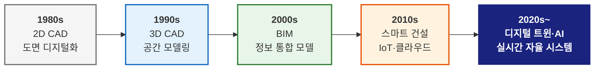
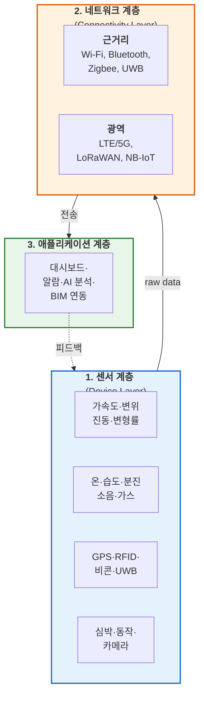
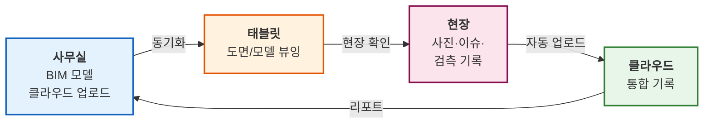
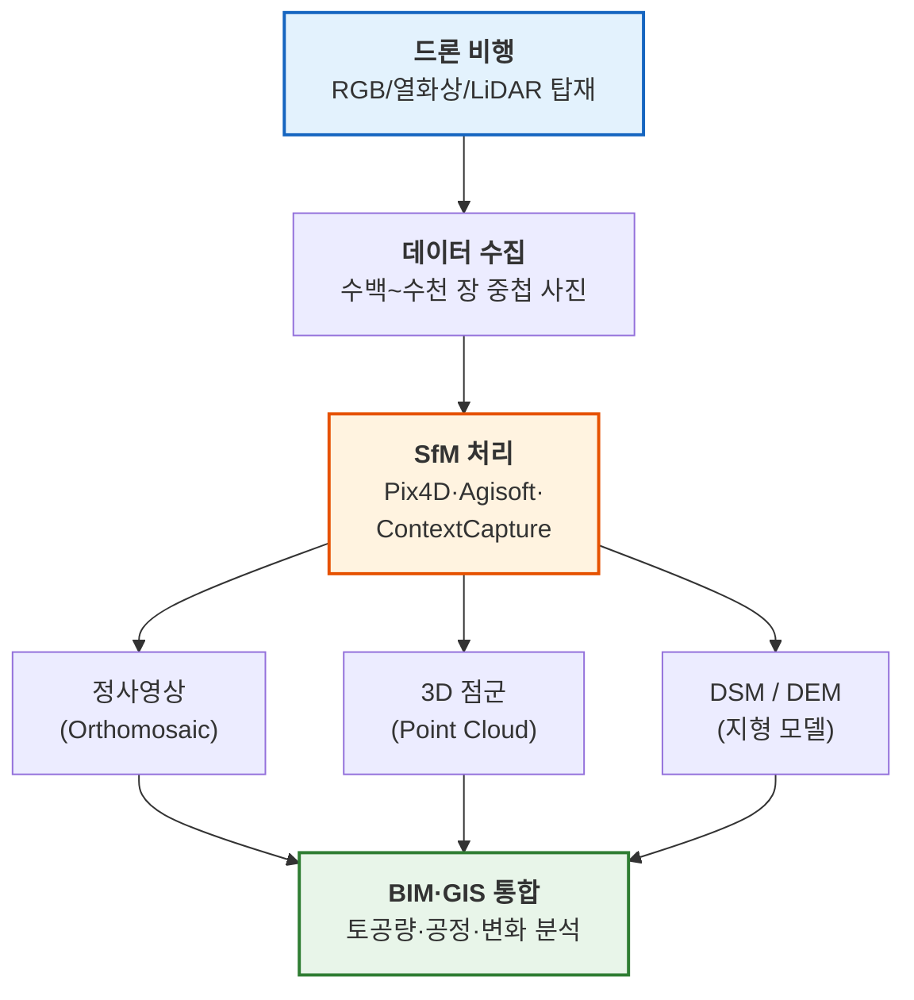
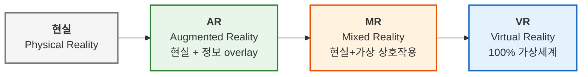

# L25. 건축공학과 IT 기술

> [!finding] 핵심 메시지
> BIM이 "건축물의 정적 디지털 모델"이라면, IT 기술(IoT·클라우드·드론·AR/VR)은 그 모델에 **실시간성·현장성·협업성**을 부여한다. 이 결합이 다음 강의 L26의 **디지털 트윈(Digital Twin)**으로 완성된다. 오늘은 BIM 바깥의 "살아있는 건설 인프라"를 살핀다.

## 강의 중점
- 건축공학에서의 IT 기술 활용 전반
- IoT/센서 기반 스마트 건설 기술
- 클라우드·모바일 기술의 건설 현장 적용

## 학습 목표
1. 건축공학 분야에서 활용되는 IT 기술의 종류와 역할을 설명할 수 있다.

## 강의 내용

---

> [!ref] 이전 강의에서 이어지는 이야기
> **L23-24 (BIM)**에서 건축물의 정적 정보 모델을 배웠다. BIM은 강력하지만 "지금 이 순간 현장에서 실제로 벌어지는 일"을 담지 못한다. 시멘트가 굳어가는 온도, 크레인의 움직임, 작업자의 심박수, 외벽의 균열 진행 — 이것들은 모두 **실세계의 시간축**에서 벌어진다. 이번 강의에서는 IoT·클라우드·모바일·드론·AR/VR 등 **BIM에 실시간성·현장성·협업성을 부여하는 IT 인프라**를 살펴본다.

### 도입 — 건설 IT의 큰 그림

건설 IT 기술은 지난 40년간 단계적으로 진화해왔다. 초기에는 개별 도구(2D CAD)였지만, 이제는 **여러 기술이 연결된 생태계**로 작동한다.

| 세대 | 주요 기술 | 초점 | 한계 |
|------|----------|------|------|
| 1세대 (1980s) | 2D CAD | 도면 자동화 | 정보 없는 선·도형 |
| 2세대 (1990s) | 3D CAD | 공간 시각화 | 기하(形)만 존재 |
| 3세대 (2000s) | BIM | 정보 통합 | 정적 모델, 현장 단절 |
| 4세대 (2010s) | 스마트 건설(IoT·클라우드) | 실시간 데이터 | 데이터 폭증, 분석 미흡 |
| 5세대 (2020s~) | 디지털 트윈·AI | 자율 최적화 | 보안·표준화 과제 |

![[posco-smart-construction.jpg|600]]
*포스코이앤씨의 스마트 건설 통합 대시보드 — AI와 건설자동화로 현장을 원격 관리 — 출처: POSCO 뉴스룸 (2025)*

> [!ref] 도입 영상 — 한국어
> [[Smart Construction] 안전한 건설 현장을 위한 스마트 기술](https://www.youtube.com/watch?v=RA0KW3kn4cQ) — 스마트건설 공식채널, IoT·CCTV·웨어러블 기반 안전관리 종합 소개

> [!ref] 도입 영상 — 국제
> [IoT for beginners — Lesson 1: Introduction to IoT (6:55)](https://www.youtube.com/watch?v=1KVrBjSqS5s) — Microsoft Reactor, IoT 개념의 쉬운 설명

> [!question] 생각해보기
> BIM 모델에는 벽·기둥·창 같은 "형태 정보"가 담긴다. 그러나 **"오늘 15층 작업자가 몇 명 입장했는지"**, **"30층 콘크리트 양생 온도"**, **"크레인이 지금 어디 있는지"**는 BIM에 없다. 이런 **실시간·현장 데이터**는 누가, 어떻게 수집할까?

---

### 섹션 1. IoT와 스마트 건설현장

#### IoT(사물인터넷)란?

**IoT**(Internet of Things)는 사물에 센서·통신 기능을 내장하여 데이터를 수집·전송·활용하는 기술이다. 건설현장에서는 **"보이지 않던 현장 상태를 숫자로 보이게 만드는"** 핵심 인프라다.

IoT 시스템은 일반적으로 다음 3계층으로 구성된다.

#### 건설 IoT의 4대 적용 영역

| 영역 | 목적 | 대표 센서 | 실무 적용 예 |
|------|------|----------|-------------|
| **① 구조건전성 모니터링(SHM)** | 구조물 거동·이상 감지 | 가속도계, 변위계, 변형률게이지, 경사계 | 교량·고층빌딩 장기 계측, 잭업 시 변위 감시 |
| **② 환경 모니터링** | 작업환경·품질 관리 | 온습도, 분진(PM), 소음, 가스(CO·CO₂) | 실내 공기질, 콘크리트 양생 온도, 소음 민원 대응 |
| **③ 장비·자재 관리** | 위치·가동률·도난 방지 | GPS, RFID, UWB, LoRaWAN | 타워크레인, 지게차, 자재 QR 추적 |
| **④ 작업자 안전** | 위치·생체·낙상 감지 | GPS, 가속도, 심박, 자이로 | 스마트 안전모, 스마트 밴드, 가상 펜스 |

![[shm-bridge-monitoring.png|600]]
*교량 구조건전성 모니터링(SHM) 시스템 — 가속도·변위·변형률 센서가 실시간으로 교량 거동을 측정 — 출처: Dewesoft*

#### 스마트 안전모(Smart Helmet) — 가장 빠르게 확산되는 웨어러블

스마트 안전모는 기존 안전모에 **GPS·가속도·가스·심박 센서**를 통합한 IoT 디바이스다. 작업자 위치·낙하 감지·생체 이상을 **실시간 중앙 모니터링**으로 전송한다.

![[lansitec-helmet-worker.jpg|600]]
*실제 작업자가 착용한 Lansitec 스마트 안전모 — LoRaWAN 기반 위치 추적, SOS 버튼, 낙상 감지 내장 — 출처: Lansitec 공식*

| 기능 | 센서 | 목표 이벤트 |
|------|------|------------|
| 위치 추적 | GPS / UWB / LoRaWAN | 가상 펜스 이탈, 출입금지구역 진입 |
| 낙상·충격 감지 | 가속도계 + 자이로 | 고소작업 추락, 머리 충격 |
| SOS 호출 | 물리 버튼 | 긴급 상황 즉시 보고 |
| 생체 이상 | 심박·체온(옵션) | 열사병, 심정지 의심 |
| 유해가스 | CO·H₂S·CH₄ 센서(옵션) | 맨홀·지하작업 질식 방지 |

> [!important] 스마트 안전모의 현실적 가치
> 건설 중대재해의 **약 46%가 추락(떨어짐)**이다(고용노동부 2023). 스마트 안전모의 핵심 가치는 "추락을 막는 것"이 아니라, 추락 발생 **후 구조 도착 시간을 분 단위에서 초 단위로 단축**하는 데 있다. Golden Time 확보 = 생존률 향상.

> [!ref] 참고 영상
> [스마트건설 기술 — 포스코이앤씨 (6:09)](https://www.youtube.com/watch?v=bWo5fDzqUUo) — 스마트 안전모·IoT 센서 현장 적용 사례

#### 웨어러블 기기 — 작업자의 "또 하나의 센서"

| 디바이스 | 측정 | 활용 |
|---------|------|------|
| **스마트 밴드·워치** | 심박수, 걸음 수, 수면 | 피로 누적·열사병 조기 경고 |
| **스마트 조끼(Vest)** | 자세, 충격, 생체신호 | 근골격계 부담·위험 자세 감지 |
| **엑소스켈레톤(외골격)** | 근력 보조 | 중량물 취급 시 허리 부담 저감 |
| **스마트 신발** | 지면 충격, 보행 패턴 | 미끄러짐·낙상 패턴 감지 |

#### 중장비 IoT — 스마트 컨스트럭션

건설 중장비는 이미 **움직이는 IoT 노드**가 되었다. Komatsu(일본)·Caterpillar(미국)·현대두산인프라코어(한국)는 전 장비에 통신 모듈을 장착해 원격 가동률·연료·정비·위치를 관리한다.

![[komatsu-autonomous-excavator.jpg|600]]
*Komatsu Smart Construction의 자율/반자율 건설장비 — GPS·센서 기반 정밀 토공, 원격 관제 — 출처: Komatsu 공식*

| 국내외 사례 | 기술 | 효과 |
|------------|------|------|
| **Komatsu Smart Construction** | 드론+GNSS+AI 토공 | 토공 정밀도 향상, 재작업 40% 감소 |
| **현대건설 원격 타워크레인** | 5G 원격 조작 + CCTV | 고소작업자 안전, 인력 효율 |
| **CAT Connect / VisionLink** | 차량 텔레매틱스 | 장비 가동률·연료·정비 관리 |

![[hyundai-hios-safety.jpg|600]]
*현대건설 HIoS(HI-iSMART) 통합 안전관제 — IoT·AI·CCTV를 통합해 현장 이상징후를 사전 감지 — 출처: Daily CNC*

> [!ref] 참고 영상
> [2025 스마트건설 챌린지 — 현대건설·삼성물산 자재 운반 로봇](https://www.youtube.com/watch?v=-TWGwg9Aoj8) — 국토부, 실제 현장 로봇·IoT 적용 시연

---

### 섹션 2. 클라우드 컴퓨팅과 건설 협업 플랫폼

#### 클라우드가 바꾼 건설 협업

과거 건설 도면은 **종이 출력 → 팩스 → 다시 수정** 과정을 반복했다. 2010년대 이후 클라우드 기반 협업 플랫폼이 등장하면서 **"모든 참여자가 동일한 최신 모델을 본다"**는 원칙이 실현되고 있다.

| 서비스 형태 | 내용 | 건설 분야 예 |
|-----------|------|-------------|
| **IaaS**(Infrastructure) | 서버·스토리지 임대 | AWS·Azure 위에 자체 솔루션 구축 |
| **PaaS**(Platform) | 개발·배포 환경 | Autodesk Platform Services(APS) |
| **SaaS**(Software) | 완성된 앱 구독 | Autodesk Construction Cloud, Procore |

![[cloud-based-bim-diagram.webp|650]]
*클라우드 기반 BIM — 설계자·시공자·발주처가 중앙 서버의 단일 모델을 공유하며 동시 작업 — 출처: United BIM*

#### 주요 글로벌 건설 클라우드 플랫폼

| 플랫폼 | 제공사 | 특징 |
|--------|--------|------|
| **Autodesk Construction Cloud (ACC)** | Autodesk | 구 BIM 360 통합. Revit 연동 최강. Build·Docs·BIM Collaborate |
| **Trimble Connect** | Trimble | 개방형·IFC 기반. 무료 플랜. HoloLens 연동 |
| **Bentley iTwin** | Bentley | 인프라·플랜트 강점. 디지털 트윈 중심 |
| **Procore** | Procore | 일정·비용·품질·안전 통합. 북미 점유율 1위 |
| **Oracle Aconex** | Oracle | 대형 프로젝트·정부기관 중심 |

![[autodesk-acc-admin-ui.png|650]]
*Autodesk Construction Cloud(ACC) 계정·프로젝트 관리 UI — 도면·모델·이슈를 중앙에서 통합 관리 — 출처: Autodesk 공식 학습센터*

#### 국내 건설 클라우드

| 플랫폼/사례 | 주체 | 내용 |
|-----------|------|------|
| **국토교통부 건설사업정보시스템(CALS)** | 국토부 | 공공 건설사업 전자적 관리·문서 공유 |
| **조달청 나라장터·전자계약** | 조달청 | 공공 발주·계약의 클라우드화 |
| **한미글로벌 CM 플랫폼** | 한미글로벌 | 대형 CM 프로젝트 협업 |
| **현대건설 Hi-GENIE** | 현대건설 | 사내 AI+클라우드 BIM 협업 |
| **KICT 스마트건설플랫폼** | 한국건설기술연구원 | 공공 R&D 통합 |

> [!ref] 참고 영상
> [Autodesk Construction Cloud Tutorial, Overview & Demo](https://www.youtube.com/watch?v=ZvFeKaTkT5s) — ACC 공식 데모

> [!question] 생각해보기
> 설계도·물량·원가·공사비는 건설사의 **핵심 영업비밀**이다. 그런데 이 데이터를 Autodesk·Trimble 등 **해외 클라우드**에 올리면, 데이터 주권은 누가 가질까? 국내 기업이 글로벌 플랫폼을 쓸 수밖에 없는 이유는 무엇이고, 대안은 존재할까?

---

### 섹션 3. 모바일 기술과 현장 디지털화

#### "도면 한 다발"에서 "태블릿 하나"로

과거 현장소장은 두툼한 종이 도면 철을 들고 다녔다. 2015년 이후 **태블릿 기반 도면 앱**이 확산되면서, 현장은 **"실시간 최신 도면 + 현장 사진 + 이슈 등록"**을 한 디바이스에서 처리한다.

#### 대표 모바일 앱

| 앱 | 제공사 | 핵심 기능 |
|----|--------|----------|
| **Autodesk Build(구 PlanGrid)** | Autodesk | 도면 뷰잉·마크업·이슈 관리 |
| **Procore Mobile** | Procore | 일정·안전·품질 통합 |
| **Fieldwire** | Hilti(인수) | 태스크·펀치리스트·동기화 |
| **Dalux Field** | Dalux | BIM 모바일 뷰어·검측 |
| **OpenSpace / Holobuilder** | OpenSpace | 360° 카메라 자동 공정 기록 |

![[procore-mobile-ui.png|600]]
*Procore 모바일 앱 — 현장에서 태블릿·스마트폰으로 일정·도면·품질 통합 관리 — 출처: Procore 공식*

#### 360° 사진 기반 공정 기록 — OpenSpace·Holobuilder

작업자가 **헬멧에 360° 카메라를 달고** 현장을 한 바퀴 돌면, 앱이 자동으로 BIM 좌표와 매칭해 "그 시점 그 위치의 파노라마"를 저장한다. Google Street View의 건설 버전이다.

![[openspace-360-capture.png|650]]
*OpenSpace 360° 건설 공정 기록 — 헬멧 카메라가 자동으로 위치·시점 매칭된 파노라마 생성 — 출처: OpenSpace 공식*

| 가치 | 설명 |
|------|------|
| **객관적 기록** | 분쟁·클레임 발생 시 "그때 그 자리"의 증빙 |
| **원격 관리** | 본사·발주처가 현장 방문 없이 진도 확인 |
| **은폐 공정 문서화** | 단열·배관 등 마감 후 보이지 않는 부위의 기록 |

#### 자재 추적 — QR · RFID · NFC

| 기술 | 읽기 거리 | 비용 | 건설 활용 |
|------|---------|------|----------|
| **QR 코드** | 시야 내 | 매우 낮음 | 자재·장비 식별, 작업자 출입 |
| **RFID(수동)** | ~1 m | 낮음 | 자재 입·출고 자동 인식 |
| **RFID(능동) / UWB** | ~수십 m | 중 | 정밀 위치 추적(±30 cm) |
| **NFC** | ~10 cm | 매우 낮음 | 장비 점검표·출입문 |

---

### 섹션 4. 드론(UAV)·3D 스캔·LiDAR — "현장을 통째로 디지털화"

#### 드론(UAV)의 건설 활용

드론은 **"하늘에서 내려다보는 저가 측량 도구"**이자 **"사람이 못 가는 곳을 대신 가는 점검 도구"**다.

| 활용 | 전통 방식 | 드론 기반 | 효과 |
|------|----------|----------|------|
| **토공 측량** | 토탈스테이션·GNSS 수동 | 자동 비행·SfM | 측량 시간 80% 단축 |
| **공정 모니터링** | 현장 방문 + 카메라 | 주간 자동 비행 | 정량적 진도 추적 |
| **외벽 점검** | 로프공·곤돌라 | 고해상도 줌 + AI 균열 탐지 | 안전↑, 비용 50% 절감 |
| **재해 대응** | 현장 접근 곤란 | 즉시 출동, 열화상 촬영 | 인명 구조 지원 |

![[drone-photogrammetry.jpg|650]]
*드론 사진측량(Photogrammetry)으로 생성된 정사영상과 3D 지형 — 수백 장의 겹친 항공사진을 SfM 알고리즘으로 3D 재구성 — 출처: Volatus Aerospace*

![[drone-facade-crack.webp|600]]
*드론 기반 외벽 균열 자동 탐지 — 고소작업자 없이 고해상도 영상 촬영 + AI 분석 — 출처: Mavdrones*

> [!ref] 참고 영상 — 국내
> [쌍용건설 드론 측량 데이터를 활용한 토공 플랫폼 사례](https://www.youtube.com/watch?v=JJrM1FBhJ8Q) — 인천검단 택지개발 실제 적용

> [!ref] 참고 영상 — 국내
> [미래건설기술: 드론이 인싸? 스마트 건설 열풍 — KICT](https://www.youtube.com/watch?v=Yootjt7Wc9c) — 한국건설기술연구원 공식채널

#### 3D LiDAR 스캔과 Scan-to-BIM

**LiDAR**(Light Detection And Ranging)는 레이저 펄스로 대상까지의 거리를 측정해 **초당 수십만~수백만 점**의 3D 좌표를 만든다. 결과물을 **Point Cloud(점군)**라 하며, 이것을 BIM 모델로 전환하는 작업이 **Scan-to-BIM**이다.

![[lidar-point-cloud-faro.jpg|650]]
*FARO 지상 레이저 스캐너의 3D 점군(Point Cloud) 결과 — 수억 개 점으로 공간 전체를 재현 — 출처: FARO 공식*

![[scan-to-bim-process.jpg|700]]
*Scan-to-BIM 워크플로우 — 레이저 스캔 → Point Cloud 정합 → BIM 모델 역설계 — 출처: QeCAD*

| 장비 유형 | 특징 | 대표 기기 | 건설 용도 |
|----------|------|----------|----------|
| **지상형(Terrestrial)** | 삼각대 고정, 초고정밀 | FARO Focus, Leica RTC360 | 준공 검증, 리모델링 실측 |
| **핸드헬드(SLAM)** | 걸어다니며 스캔 | GeoSLAM, Leica BLK2GO | 공정 중 신속 실측 |
| **모바일(MMS)** | 차량 탑재 | Leica Pegasus | 터널·도로 |
| **드론 LiDAR** | 항공 탑재 | DJI Zenmuse L2 | 넓은 부지·삼림 |
| **스마트폰 LiDAR** | iPhone Pro/iPad Pro | 애플 자체 | 간이 측정·교육용 |

| 기술 | 측정 시간(30×30 m 실) | 정확도 | 비용 |
|------|-------------------|--------|------|
| 전통 줄자·레벨 | 반나절~하루 | ±10 mm | 인건비만 |
| 토탈스테이션 | 2~3시간 | ±3 mm | 중 |
| 지상 LiDAR | 30분 | ±2 mm | 고 |
| 스마트폰 LiDAR | 5분 | ±30 mm | 저 |

> [!ref] 참고 영상
> [3D Laser Scanning and Scan to BIM](https://www.youtube.com/watch?v=Wp-S8x9OFXg) — FARO 계열, 스캔→BIM 워크플로우 종합

> [!question] 생각해보기
> 드론 측량·LiDAR 스캔은 **시공 전·중·후** 모두에 쓰일 수 있다. 같은 현장을 **1주일 간격**으로 스캔하면 무엇을 알아낼 수 있을까? (힌트: 점군의 "차이" = 무엇이 생기고 무엇이 사라졌는가)

---

### 섹션 5. 확장현실(XR) — VR · AR · MR

확장현실(XR, eXtended Reality)은 **디지털과 현실의 혼합 정도**에 따라 VR·AR·MR로 나뉜다.

| 구분 | 현실 비중 | 대표 기기 | 건설 분야 활용 |
|------|---------|----------|---------------|
| **VR** | 0% (완전 가상) | Meta Quest 3, HTC Vive, PSVR2 | 설계 리뷰·가상 모델하우스·안전교육 VR |
| **AR** | 70~90% | 스마트폰·태블릿(ARKit, ARCore) | 현장 배관·배선 오버레이, 가구 배치 미리보기 |
| **MR** | 50% 상호작용 | Microsoft HoloLens 2, Magic Leap, Trimble XR10 | 현장 BIM 홀로그램 검측, 원격 전문가 지원 |

#### VR — 설계 리뷰와 안전교육

![[vr-architecture-walkthrough.jpg|650]]
*VR 헤드셋으로 BIM 모델 내부를 실시간 워크스루 — 착공 전 공간감·동선·채광 검증 — 출처: Plus Render*

| 건설 VR 적용 | 내용 | 효과 |
|-------------|------|------|
| **설계 리뷰** | 발주처·설계자·사용자가 가상공간에서 공간 체험 | 설계 변경 요청 조기 발견 |
| **가상 모델하우스** | 미준공 아파트 VR 투어 | 분양 마케팅, 방문 교통·시간 절감 |
| **VR 안전교육** | 추락·감전·화재 등 재해 가상 체험 | 훈련 효과 ↑, 실제 사고 위험 0 |
| **용접·조립 훈련** | 가상 장비로 반복 훈련 | 숙련도 향상, 장비 손상 없음 |

#### AR — 현장에 정보를 겹치다

**AR**은 스마트폰·태블릿 카메라로 현장을 보면 **화면 위에 BIM 모델·정보가 덧씌워지는** 기술이다. Apple ARKit(iPad)과 Gamma AR·vGIS·Trimble SiteVision이 대표적이다.

![[ar-bim-overlay-site.jpg|650]]
*Gamma AR의 BIM 모델 현장 오버레이 — 태블릿 카메라 너머로 설치 예정 배관·덕트가 입체로 보임 — 출처: AEC Magazine*

| AR 적용 | 예 |
|--------|-----|
| **은폐 공정 확인** | 벽 뒤 배관·배선 위치를 AR로 투시 |
| **시공 오차 검증** | 실제 벽 위치 vs. 설계 위치 실시간 비교 |
| **가구·인테리어 배치** | IKEA Place, 한샘 앱 — 소비자용 AR |
| **지하 매설물** | vGIS로 도로 굴착 전 매설 관로 확인 |

> [!ref] 참고 영상
> [GAMMA AR in action on the construction site](https://www.youtube.com/watch?v=FiVn3SyMscE) — 독일 PORR사 실제 현장 AR BIM 적용

#### MR — HoloLens·Trimble XR10으로 홀로그램 검측

**MR**(혼합현실)은 사용자가 **홀로그램과 상호작용**할 수 있다는 점에서 AR과 다르다. Microsoft HoloLens 2가 사실상 표준이다.

![[hololens-bim-overlay.png|650]]
*HoloLens 2를 착용한 현장 엔지니어가 MEP BIM 모델을 실물 배경 위에 홀로그램으로 확인 — 출처: Engineering.com / Holotech Solutions*

![[trimble-xr10-hardhat.png|550]]
*Trimble XR10 — HoloLens 2를 안전모에 통합한 ANSI 인증 하드햇. 건설·중공업 현장 전용 MR 기기 — 출처: BuildingPoint (Trimble 공인 파트너)*

| MR 적용 | 효과 |
|--------|------|
| **1:1 BIM 홀로그램 검측** | 설계 모델과 시공 상태를 현장에서 직접 비교 |
| **원격 전문가 지원** | 본사 전문가가 현장 작업자 시점 공유·지시 |
| **MEP 사전 조립 가이드** | 복잡한 배관 조립을 단계별 홀로그램으로 안내 |
| **안전 경고 표시** | 가상 펜스·위험구역을 시야에 직접 표시 |

> [!ref] 참고 영상
> [Trimble XR10 with HoloLens 2](https://www.youtube.com/watch?v=MYuFHHb6FA4) — Trimble 공식 MR 솔루션 데모

> [!hypothesis] BIM · IoT · XR의 접점
> 오늘 배운 기술들은 **독립적으로 가치가 있지만**, 결합되면 폭발적 시너지를 낸다.
> - **BIM + 모바일** = 현장에서 최신 설계 확인
> - **BIM + AR/MR** = 설계와 시공의 실시간 비교
> - **IoT + 클라우드** = 실시간 원격 모니터링
> - **드론 + LiDAR + BIM** = 자동 준공 검증
> - **모두 결합** = 🎯 **디지털 트윈**(L26)

---

### 섹션 6. 사이버 보안과 프라이버시

#### 왜 건설도 사이버 보안이 중요한가?

건설 데이터는 흔히 **"보안과 무관한 기술정보"**로 오해되지만, 실제로는 매우 민감하다.

| 민감도 | 데이터 유형 | 위협 시나리오 |
|--------|-----------|--------------|
| **국가 안보** | 군 시설, 발전소, 데이터센터 도면 | 적성국 유출, 테러 표적 |
| **영업 비밀** | 원가·공법·설계 노하우 | 경쟁사 유출, 입찰 담합 |
| **개인 정보** | 작업자 위치·심박·얼굴 | 근로 감시, 보험료 차별 |
| **구조 안전** | 실시간 SHM 데이터 | 조작 시 사고 위장 |
| **금융** | 자금 집행, 공사비 내역 | 랜섬웨어 협박 |

![[bim-cybersecurity.jpg|650]]
*BIM 데이터 사이버 보안 — 설계·시공·운영 전 생애주기 데이터 보호 필요 — 출처: Technostruct Academy*

#### 주요 국내 규제

| 법·지침 | 핵심 요구 |
|--------|----------|
| **개인정보보호법** | 작업자 위치·생체 데이터 수집·보관 제한 |
| **정보통신기반 보호법** | 주요 인프라(발전·수도 등) 설계정보 보호 |
| **국가정보통신보안지침** | 군·공공 시설 설계의 해외 클라우드 업로드 제한 |
| **산업기술보호법** | 국가핵심기술(원전·반도체 공장 등) 유출 방지 |
| **중대재해처벌법** (안전 측면) | 근로자 생체정보 수집의 **정당성·목적 제한** 필요 |

#### 프라이버시 딜레마 — 안전 vs 감시

IoT·CCTV·스마트 안전모는 **"안전을 위한 관찰"**이지만, 동시에 **"상시 근로 감시"**가 될 수 있다.

> [!important] 보안·프라이버시 5대 원칙
> 1. **목적 제한**: 안전 목적으로만 수집(근태 감시 용도 전용 금지)
> 2. **최소 수집**: 꼭 필요한 데이터만, 최소 기간 보관
> 3. **익명화·가명화**: 분석 단계에서 개인 식별 제거
> 4. **근로자 동의**: 단체협상·안전보건위 협의 후 도입
> 5. **접근 통제**: 역할 기반 권한(RBAC), 감사 로그 의무화

> [!question] 생각해보기
> 스마트 안전모가 근로자의 **심박·위치·동선**을 24시간 기록한다고 하자. 이 데이터는 분명히 **생명을 구할 수 있다**. 그러나 같은 데이터로 "**점심시간에 흡연실에 얼마나 오래 있었는지**"도 알 수 있다. 안전과 감시의 경계선을 어디에 그어야 할까?

---

### 섹션 7. 통합 IT 플랫폼 — 국내 건설사 사례

개별 기술보다 **여러 기술을 연결하는 플랫폼**이 곧 차별화 요소다. 2020년 이후 국내 대형 건설사들은 자체 통합 플랫폼을 앞다투어 발표하고 있다.

| 건설사 | 플랫폼 | 특징 | 적용 기술 |
|--------|--------|------|----------|
| **포스코이앤씨** | 스마트건설 플랫폼 | AI·로봇·IoT 통합 | 콘크리트 품질 AI, 자율 양중 |
| **현대건설** | HIoS / Hi-GENIE | 사전 감지형 통합 안전관제 | AI CCTV, IoT 센서, 원격 크레인 |
| **삼성물산** | S-TBM, 스마트 콘 | 안전·생산성 플랫폼 | 스마트 안전모, MR 검측 |
| **GS건설** | GSIL(Intelligent Lab) | 드론·AI·BIM 통합 R&D | 드론 측량·AI 품질관리 |
| **DL이앤씨** | D.LIGHT | 전사 디지털 전환 | BIM·IoT·클라우드 |
| **SK에코플랜트** | ENVILINK | 환경·안전 IoT 플랫폼 | 소음·분진·에너지 모니터링 |
| **대우건설** | 스마트 에이블 | 안전·품질 통합 | AI 영상, IoT 밴드 |

> [!important] IT 기술 통합의 3대 원칙
> 1. **개별 기술보다 통합이 가치** — 센서 하나보다 "센서+AI+대시보드" 한 세트가 10배 효과
> 2. **표준·개방성 확보** — IFC·OpenAPI·OAuth 등 표준 미준수 시 벤더 락인(lock-in)
> 3. **조직 수용성** — 아무리 좋은 플랫폼도 현장 사용자가 거부하면 무용지물. **UX + 교육 + 인센티브**가 기술만큼 중요

> [!ref] 참고 영상
> [2025 스마트건설 챌린지 — 현대건설 AI 스마트 안전 시스템(HITTS)](https://www.youtube.com/watch?v=E4eDtVrVXng) — 국토부 주관 공식 사례

---

### 요약 — "BIM을 살아있게 만드는 IT 인프라"

| 기술 | BIM과의 관계 | 기여 |
|------|------------|------|
| IoT | BIM에 **실시간 상태** 주입 | "지금 이 순간" |
| 클라우드 | BIM을 **어디서나 접근 가능**하게 | "어디서든" |
| 모바일 | BIM을 **현장 손바닥 안에** | "누구나" |
| 드론·LiDAR | BIM을 **현실과 동기화** | "있는 그대로" |
| AR/MR | BIM을 **현실 위에 겹침** | "눈 앞에" |

> [!info] 다음 강의 예고 — L26
> 오늘 배운 BIM · IoT · Cloud · Drone · AR/VR이 **실시간으로 통합**되면 어떻게 될까? 물리적 건축물의 **실시간 가상 복제본** = **디지털 트윈(Digital Twin)**이다. L26에서 싱가포르 Virtual Singapore·스마트팩토리·스마트시티 사례를 함께 본다.

---

## 실습/과제

- [ ] **체험 실습** (택 1):
  1. **Arduino IoT Cloud 시뮬레이터** — [cloud.arduino.cc](https://cloud.arduino.cc) 접속, 무료 계정 생성, 가상 온습도 센서 연결, 대시보드에서 데이터 그래프 확인
  2. **Autodesk Construction Cloud 공식 데모 영상** — [공식 튜토리얼](https://www.youtube.com/watch?v=ZvFeKaTkT5s) 감상 후 UI 3개 기능 캡처 및 설명
  3. **Microsoft HoloLens 건설 데모 영상** — [Trimble XR10 데모](https://www.youtube.com/watch?v=MYuFHHb6FA4) 감상 후 MR의 장점·한계 각 3가지 정리
  - 제출물: 스크린샷 2-3장 + 3줄 소감

- [ ] **과제**: 스마트 건설 IT 기술 1개(IoT / Cloud / 드론·LiDAR / AR·VR·MR 중 택1)를 선정하여 **국내외 실제 적용 사례 1건**을 A4 1매로 분석
  - 포함 항목: ① 기술 개요 ② 적용 현장·기업 ③ 효과(정량적 수치 포함) ④ 본인 의견 및 확장 아이디어
  - **평가 루브릭(8점)**: 기술 설명 3점 + 사례 구체성 3점 + 본인 의견 2점
  - 제출: 이메일 kh1819@khu.ac.kr, 제목 `[AE개론_L25] 학번_이름_IT기술사례`
  - 마감: **W14 수업 전** (6/3 수요일 12시 — 공휴일 시 6/8로 연기 가능)

## Notes
- 수업 중 질문/피드백:
- 다음 수업 준비사항: 디지털 트윈 개념 예습, 싱가포르 Virtual Singapore 검색해보기

## 이미지 출처

| 파일명 | 설명 | 출처 |
|--------|------|------|
| `L25/posco-smart-construction.jpg` | 포스코이앤씨 스마트건설 통합 대시보드 | [POSCO Newsroom](https://newsroom.posco.com/kr/%EC%97%85%E6%A5%AD%ED%86%A0%ED%81%AC-1%ED%8E%B8-%EA%B1%B4%EC%84%A4-%ED%98%84%EC%9E%A5%EC%9D%98-%ED%98%81%EC%8B%A0%EC%9D%84-%EC%9D%B4%EB%81%88-%ED%8F%AC%EC%8A%A4%EC%BD%94%EC%9D%B4%EC%95%A4/) |
| `L25/shm-bridge-monitoring.png` | 교량 구조건전성 모니터링 시스템 | [Dewesoft](https://dewesoft.com/applications/bridge-health-monitoring) |
| `L25/lansitec-helmet-worker.jpg` | Lansitec 스마트 안전모 실제 착용 | [Lansitec 공식](https://www.lansitec.com/blogs/smart-helmet-tracker-sensor-for-industrial-workers/) |
| `L25/komatsu-autonomous-excavator.jpg` | Komatsu Smart Construction 자율 장비 | [Komatsu 공식](https://www.komatsu.com/en-us/newsroom/2024/komatsu-achieves-major-autonomous-milestones) |
| `L25/hyundai-hios-safety.jpg` | 현대건설 HIoS 통합 안전관제 | [Daily CNC](https://www.dailycnc.com/news/articleView.html?idxno=205849) |
| `L25/cloud-based-bim-diagram.webp` | 클라우드 기반 BIM 협업 개념도 | [United BIM](https://www.united-bim.com/blog/cloud-based-bim-guide-aec-industry/) |
| `L25/autodesk-acc-admin-ui.png` | Autodesk Construction Cloud(ACC) 관리 화면 | [Autodesk 학습센터](https://www.autodesk.com/learn/ondemand/course/bim-collaborate-quick-start-guide/unit/2wxsBdMKYbf13wD1zOPfbj) |
| `L25/procore-mobile-ui.png` | Procore 모바일 앱 UI | [Procore 공식](https://www.procore.com/en-ae/lp/smarter-construction) |
| `L25/openspace-360-capture.png` | OpenSpace 360° 건설 공정 기록 | [OpenSpace](https://www.openspace.ai/blog/how-360-cameras-for-construction-enhance-jobsite-documentation/) |
| `L25/drone-photogrammetry.jpg` | 드론 사진측량 정사영상·3D | [Volatus Aerospace](https://volatusaerospace.com/drone_network_news/value-of-drone-mapping-for-construction-progress-monitoring/) |
| `L25/drone-facade-crack.webp` | 드론 외벽 균열 탐지 | [Mavdrones](https://www.mavdrones.com/building-outer-wall-crack-detection/) |
| `L25/lidar-point-cloud-faro.jpg` | FARO 레이저 스캔 점군 | [FARO 공식](https://www.faro.com/en/Resource-Library/Article/Point-Clouds-for-Beginners) |
| `L25/scan-to-bim-process.jpg` | Scan-to-BIM 워크플로우 | [QeCAD](https://www.qecad.com/cadblog/how-does-scan-to-bim-work-concerning-3d-laser-scanners/) |
| `L25/vr-architecture-walkthrough.jpg` | VR 건축 워크스루 | [Plus Render](https://plusrender.com/virtual-reality-walkthrough-for-architecture/) |
| `L25/ar-bim-overlay-site.jpg` | Gamma AR 현장 BIM 오버레이 | [AEC Magazine](https://aecmag.com/vr-mr/gamma-ar-optimises-bim-model-placement-on-site/) |
| `L25/hololens-bim-overlay.png` | HoloLens 2 MEP BIM 홀로그램 | [Engineering.com](https://www.engineering.com/trimble-connect-for-hololens-goes-live-on-site-under-a-new-ansi-approved-hard-hat/) |
| `L25/trimble-xr10-hardhat.png` | Trimble XR10 하드햇 | [BuildingPoint NE (Trimble 파트너)](https://www.buildingpointne.com/store/mixed-reality/trimble-xr10/) |
| `L25/bim-cybersecurity.jpg` | BIM 사이버 보안 개념도 | [Technostruct Academy](https://www.technostructacademy.com/blog/cyber-security-in-bim-protecting-digital-building-data/) |

> 모든 이미지는 교육 목적으로 사용되었으며, 저작권은 각 출처에 있습니다.

## Related
- **이전 강의**: [[L24-BIM-활용과-국내-동향]]
- **다음 강의**: [[L26-디지털-트윈과-신기술]]
- **관련 주제**: [[L17-AI-기초-개념]], [[L23-BIM-기본-개념]], [[L27-스마트-빌딩]]
- **주차 노트**: [[W13-건축공학IT]]
- **강의일정**: [[00-Syllabus/강의일정_2026-1|강의일정표]]
- **MOC**: [[400-Lab/_MOC]]
