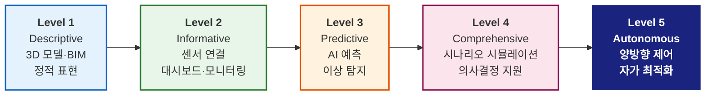
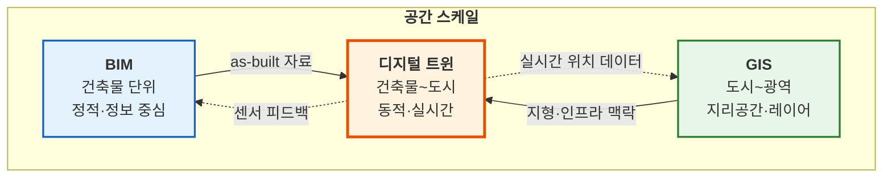
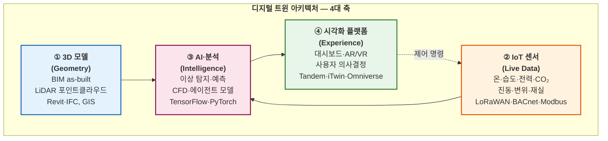
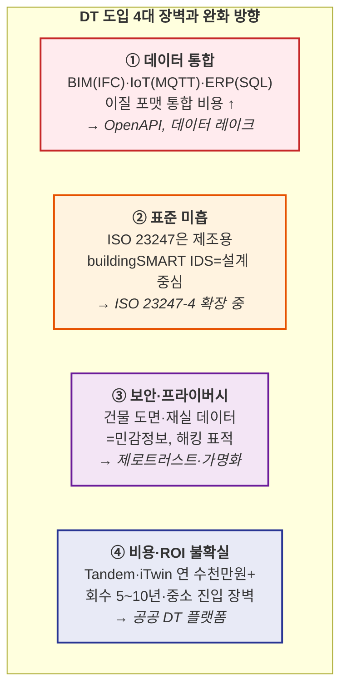

# L26. 디지털 트윈과 신기술

> [!finding] 핵심 메시지
> 디지털 트윈(Digital Twin, DT)은 **L23-24(BIM)**에서 배운 정적 정보 모델과 **L25(IoT·클라우드·드론·AR/VR)**에서 배운 실시간 IT 인프라가 결합된 **"살아있는 건축물의 가상 복제본"**이다. 단순히 3D 모델을 만드는 것이 아니라, 물리적 건축물과 **실시간 양방향 동기화·예측·자율 제어**를 수행하는 운영 패러다임 전환이다. 오늘은 건축·도시 스케일 DT 사례와 이를 떠받치는 3D 프린팅·모듈러·건설 로봇 등 신기술을 함께 본다.

## 강의 중점
- 디지털 트윈 개념과 건축 적용

## 학습 목표
1. IoT/센서 기반 스마트 건설 기술의 원리와 적용 사례를 이해한다.
2. 디지털 트윈의 개념과 건축물 관리에서의 활용 가능성을 파악한다.

## 강의 내용

---

> [!ref] 이전 강의에서 이어지는 이야기
> **L23-24 (BIM)** + **L25 (IT 인프라: IoT·Cloud·Drone·AR/VR)**의 통합 = **디지털 트윈(Digital Twin)**. BIM이 "정적 모델", IT가 "실시간 데이터"라면, DT는 이 둘의 결합으로 **"살아있는 건축물의 가상 복제본"**을 만든다. 이전 강의 L25 마지막의 "BIM·IoT·XR의 접점" 콜아웃에서 예고했던 목적지가 바로 오늘 강의다.

---

### 도입 — "가상이 물리를 추월하는 순간"

싱가포르 Marina Bay, 세종 5-1 생활권, 네바다의 BMW 공장. 이 세 장소는 공통점이 있다. **물리 세계가 지어지기 전에, 가상 세계에서 먼저 완성되었다.** 센서·BIM·AI가 결합된 "디지털 쌍둥이"가 먼저 운영되고, 실제 건물은 그 복제본일 뿐이다. 이것이 지난 5년간 건축·도시 운영 방식을 근본적으로 바꾸고 있는 **디지털 트윈(Digital Twin)** 패러다임이다.

![[L26/virtual-singapore-3d.jpg|650]]
*Virtual Singapore — Marina Bay 일대를 그대로 복제한 도시 스케일 디지털 트윈. 모든 건물·도로·공원을 3D로 재현하며, 실시간 센서·GIS 데이터와 연동된다 — 출처: Dassault Systèmes / Geospatial World (2022)*

> [!ref] 도입 영상 — 국제(영어)
> [Virtual Singapore — National Research Foundation (2:01)](https://www.youtube.com/watch?v=QnLyy0owGL0) — 싱가포르 NRF 공식 소개 영상, 도시 전체 DT의 세부 기능 시연
> [Uses of Virtual Singapore (4:30)](https://www.youtube.com/watch?v=y8cXBSI6o44) — 건물 의미정보·지오로케이션 데이터를 어떻게 활용하는지 구체 예시

> [!ref] 도입 영상 — 한국어
> [5분만에 이해하는 디지털 트윈 핵심 사례 (7:11)](https://www.youtube.com/watch?v=gLUuiu9NtfQ) — 스케일TV, 건축·도시 분야 DT 사례 개괄
> [세종 자율주행 플랫폼, 스마트 시티를 꿈꾸다](https://www.youtube.com/watch?v=WUDGzO8h_dE) — 세종시 자율주행 관제센터와 SMFL 역할

> [!question] 생각해보기
> BIM만으로도 3D 모델은 만들 수 있다. **그렇다면 "디지털 트윈"이라는 새 용어가 왜 필요했을까?** BIM과 DT의 결정적 차이는 무엇인가? (힌트: "시간")

---

### 섹션 1. 디지털 트윈의 정의와 5단계 성숙도 모델

> [!question] 현실 사례로 감 잡기
> 서울에 있는 **롯데월드타워(555 m)**는 약 1,600개의 센서가 실시간으로 풍진동·온도·변위를 측정한다. 이 데이터가 BIM 모델 위에서 시각화되고, 태풍 접근 시 **대피 시나리오 시뮬레이션**이 자동 실행된다. 이것이 DT일까, 아닐까? 뒤에 나오는 성숙도 모델을 보고 판단해보자.

#### 디지털 트윈의 탄생 — GE에서 Gartner까지

**디지털 트윈**이라는 개념은 **2002년** 미시간대학교 Michael Grieves 교수가 PLM(제품 수명주기 관리) 강의에서 처음 제시했다(*Information Mirroring Model*). 이후 **2011년 GE**가 항공 엔진 모니터링에 도입하며 산업적 주목을 받았고, **2017년 Gartner**가 "향후 10대 전략 기술"로 선정하면서 전 산업으로 확산됐다. 건축 분야에서는 2018년 **싱가포르 Virtual Singapore** 완공과 **영국 Centre for Digital Built Britain(CDBB)**의 Gemini Principles 발표가 분기점이 됐고, 2021년 **ISO 23247** 제조용 DT 프레임워크 국제표준이 제정되며 개념적 합의가 이루어졌다.

#### 5단계 성숙도 모델 — "모든 3D가 DT는 아니다"

많은 사람이 BIM 모델만 있으면 "디지털 트윈이 완성됐다"고 오해한다. 하지만 실제 DT는 **5단계 성숙도**로 구분되며, 대부분의 국내 프로젝트는 아직 **Level 1~2** 수준에 머물러 있다.

![[L26/dt-maturity-levels.png|700]]
*디지털 트윈 성숙도 6단계(Level 0~5) — 대부분의 조직이 Level 2~3 수준에 있으며, Level 4~5(예측·자율)로 갈수록 AI·IoT·BIM·GIS 통합이 필수 — 출처: BSMA Enterprises (2024)*

| 레벨 | 특성 | 주요 기술 | 대표 사례 | 국내 수준 |
|------|------|---------|----------|---------|
| **L1 Descriptive** | 3D/BIM 정적 모델 | Revit, Navisworks | 준공 as-built 모델 | 다수 |
| **L2 Informative** | 실시간 센서 연결 | IoT + BIM 뷰어 | 에너지 모니터링 대시보드 | 확산 중 |
| **L3 Predictive** | AI 기반 예측 | ML, 시계열 분석 | 설비 고장 예측 | 초기 |
| **L4 Comprehensive** | What-if 시뮬레이션 | CFD, 에이전트 모델 | 재난 대응 시나리오 | 연구 |
| **L5 Autonomous** | 양방향 자율 제어 | 강화학습, 엣지 AI | 자가최적화 빌딩 | 극소수 |

![[L26/dt-maturity-bim6d.png|700]]
*DT 성숙도 5단계 대안 모델(PowerBIM) — Descriptive → Informative → Predictive → Comprehensive → Autonomous. 상위 단계로 갈수록 AI 기반 예측·원격 운영·드론 점검 기능이 추가됨 — 출처: BIM6D (2024), PowerBIM Digital Twin Maturity*

> [!important] BIM ≠ DT
> 많은 국내 프로젝트가 "BIM 모델 = 디지털 트윈"으로 홍보하지만, 이는 **Level 1**에 불과하다. 진정한 DT는 최소 **Level 2 이상** — 즉 **실시간 센서 데이터와 연동되어 상태가 계속 업데이트**되어야 한다. "살아있는 모델(Living Model)"이 아니면 DT가 아니다. 반대로 **Level 5(자율)**에 도달한 건축물은 사실상 L27에서 다룰 **자율 스마트 빌딩**과 구분되지 않는다.

> [!method] DT 판별 간단 체크리스트
> ① **양방향 동기화**가 되는가? (센서 변화가 모델에 즉시 반영되는가)
> ② 모델을 통해 **물리 시스템을 제어**할 수 있는가? (단방향 뷰어는 DT 아님)
> ③ **예측·시뮬레이션** 기능이 있는가? (과거 재생만 가능하면 L1~L2)
> ④ **단일 데이터 소스**로 통합돼 있는가? (분산 대시보드 집합이 아니라)
> — 이 네 가지가 모두 "Yes"여야 Level 3 이상의 진정한 DT다.

---

### 섹션 2. BIM vs DT vs GIS — 세 가지 개념의 관계

많은 학생이 BIM·DT·GIS를 혼동한다. 이 세 개념은 **"다루는 대상의 스케일"**과 **"시간성"**에서 근본적으로 다르다.

| 구분 | **BIM** | **Digital Twin** | **GIS** |
|------|---------|------------------|---------|
| **공간 스케일** | 건축물 단위 | 건축물~도시 | 도시~광역 |
| **시간성** | 정적 (스냅샷) | 동적 (실시간) | 준정적 (주기 업데이트) |
| **주요 데이터** | 3D 기하·속성 | 3D + IoT + AI | 2.5D·레이어·좌표 |
| **목표** | 설계·시공 협업 | 운영·예측·제어 | 공간 분석·계획 |
| **대표 도구** | Revit, ArchiCAD | Autodesk Tandem, Bentley iTwin | ArcGIS, QGIS |
| **L25와의 관계** | L23-24 | L26 (오늘) | L28(도시) 예고 |

---

### 섹션 3. 디지털 트윈 구축 요소 — 4대 축

실제로 DT를 구축하려면 **네 가지 축**이 필수다. 하나라도 빠지면 "움직이지 않는 3D 모델" 또는 "센서 대시보드"에 머물고 만다.

**하나씩 빠지면**: ①이 없으면 DT 공간 기반 자체가 없음. ②가 없으면 "그림 속 건물"에 불과. ③이 없으면 단순 모니터링에 머무름. ④가 없으면 사용자가 활용 불가.

> [!hypothesis] 4축의 우선순위
> 많은 DT 프로젝트가 "예쁜 3D 뷰어"(④)부터 시작했다가 실패한다. 실제 성공한 DT는 ①(BIM 품질) → ②(센서 신뢰성) → ③(AI 정확도) → ④(시각화) 순으로 구축된다. **시각화는 과정이지 목적이 아니다.**

---

### 섹션 4. 건축물 스케일 DT — 실제 플랫폼과 사례

#### Autodesk Tandem — 건물 운영 DT의 표준

Autodesk는 2022년 **Tandem**을 출시하며 건물 운영 단계 DT 시장에 진출했다. Revit BIM 모델을 업로드하면 자동으로 DT 환경으로 변환되며, 여기에 IoT 센서 데이터를 덧씌우는 방식이다.

![[L26/autodesk-tandem-dashboard.png|750]]
*Autodesk Tandem — Revit BIM 모델을 그대로 가져와 자산(Assets)·스트림(Streams)·공간(Spaces) 관리 인터페이스로 변환. 좌측에 Assets·Files·Systems·Streams 탭이 있어 자산별 속성 조회가 가능 — 출처: Autodesk Tandem 공식 (2023)*

#### Bentley iTwin — 인프라·플랜트 DT의 강자

Bentley는 인프라(교량·도로·발전소) 분야에서 **iTwin** 플랫폼을 통해 DT 시장을 선점하고 있다. 특히 **iTwin IoT**는 실시간 센서 데이터와 3D 모델을 결합한 대시보드를 제공한다.

![[L26/bentley-itwin-dashboard.png|750]]
*Bentley iTwin IoT Dashboard — Highland Cable Bridge 디지털 트윈의 주파수·변위·클러스터링 차트와 실시간 3D 뷰어 통합. 센서 데이터가 구조물 모델 위에 즉시 오버레이 — 출처: Bentley Developer Portal (2024)*

#### 실제 건물 DT 4대 활용 분야

건물 스케일 DT는 단순 모니터링을 넘어 **운영 자동화·예측·시뮬레이션**의 기반이 된다.

| 활용 | 내용 | 정량 효과 (업계 벤치마크) |
|------|------|------------------------|
| **에너지 최적화** | BEMS + DT + AI 예측 제어 | 냉난방 에너지 **15~30% 절감** |
| **예방 정비 (PdM)** | 설비 이상징후 사전 감지 | 설비 다운타임 **40~50% 감소** |
| **공간 활용 분석** | 재실 센서 기반 회의실·책상 활용률 | 유휴 공간 **20~30% 재배치** |
| **재난 시뮬레이션** | 화재·지진 대피 CFD/에이전트 모델 | 대피 시간 설계 단계에서 검증 |

> [!ref] 참고 영상
> [Digital Twin Tutorial - Getting Started | Autodesk Tandem (7:52)](https://www.youtube.com/watch?v=I8sNN74MzJM) — 공식 입문 튜토리얼, 무료 계정 생성부터 DT 구축까지

---

### 섹션 5. 도시 스케일 DT — 스마트시티의 기반

#### Virtual Singapore — 세계 최초 도시 스케일 DT

2014~2018년 **싱가포르 국가연구재단(NRF)**이 **Dassault Systèmes**와 공동 구축한 Virtual Singapore는 도시 스케일 DT의 출발점이다. 국토 전체(728 km²)의 모든 건물·도로·지하 인프라를 3D로 재현했고, 여기에 인구·교통·기상 데이터를 실시간 연동한다.

![[L26/ura-singapore-planner.jpg|750]]
*싱가포르 URA 3D Urban Planner — Virtual Singapore 플랫폼 위에서 건물 일조 분석·홍수 시뮬레이션·돔 분석 등을 실시간 수행. 좌측 지구별 건물 트리 구조와 우측 분석 도구 패널이 실제 도시 계획에 활용됨 — 출처: 싱가포르 URA (도시재개발청) 공식*

주요 활용 영역:
- **도시 계획**: 신축 건물 일조·바람 영향 사전 분석
- **긴급 대응**: 화재·홍수 시 최적 대피·자원 배분 시뮬레이션
- **에너지**: 건물 지붕 태양광 잠재량 자동 산정
- **시민 참여**: 공공 DT 포털에서 지구별 개발 시나리오 열람

#### 세종 스마트시티 5-1 — 한국의 도시 DT 시범사업

국토부·세종시·ETRI가 **2018~2024년** 190억원 규모로 추진한 국내 첫 도시 스케일 DT 사업. 세종 5-1 생활권(274ha)을 디지털 쌍둥이로 복제했다.

![[L26/sejong-digital-twin.jpg|750]]
*세종 5-1 생활권 디지털 트윈 — 자율주행·공유 모빌리티·제로에너지 단지 전체를 3D 복제. 파란색 격자 건물은 DT 레이어, 주변은 실제 위성 항공사진 합성 — 출처: E8 / 세종시 (2025)*

![[L26/sejong-predictive-admin.png|700]]
*세종시 예측행정 디지털 트윈 — 도시 전역의 음식물·재활용 수거함에 IoT 센서를 설치해 수거 경로를 최적화. 녹색=정상, 적색=포화, 수거 우선순위 자동 제안 — 출처: 세종포스트 (2022)*

#### 주요 도시 DT 플랫폼 비교

| 도시/플랫폼 | 주관 | 시작연도 | 스케일 | 핵심 특징 |
|-----------|------|-------|------|---------|
| **Virtual Singapore** | 싱가포르 NRF + Dassault | 2014 | 국토 전체 728 km² | 3DEXPERIENCity 기반, 공공 포털 개방 |
| **세종 5-1 DT** | 국토부·ETRI | 2018 | 274 ha | 자율주행·제로에너지 실증 |
| **Digital Twin Victoria** (호주) | Victoria Gov | 2021 | 주 전체 | LiDAR 전국 스캔 기반 |
| **Helsinki 3D** | Helsinki City | 2015 | 도심부 | 오픈 3D 모델 + CityGML |
| **London Digital Twin** | Greater London | 2020 | 광역런던 | 공공 데이터·세션 플랫폼 |
| **Virtual Seoul** | 서울시 | 2022~ | 서울시 | S-Map 기반, 시민 참여형 |

#### Cesium — 3D 지리공간 DT의 오픈 표준

Cesium은 **3D Tiles**라는 OGC(국제 개방형 지리공간 컨소시엄) 표준을 주도하는 미국 오픈소스 기업이다. Cesium ion 플랫폼 위에 전 세계 도시 모델을 올리고 DT 앱을 구축할 수 있다.

![[L26/cesium-3d-tiles-city.png|750]]
*Cesium 3D Tiles — 뉴욕시 맨해튼 전체 건물을 높이별 색상으로 스트리밍. 수백만 개 건물도 브라우저에서 실시간 렌더링 가능. 시간축 슬라이더로 변화 재생도 지원 — 출처: Cesium 공식*

![[L26/cesium-denver-building.gif|750]]
*Cesium ion으로 구현한 덴버 스카이라인 위의 신축 건물 시뮬레이션 — 제안된 건물을 기존 3D 도시에 즉시 삽입해 주변 영향 분석. 스마트시티 DT의 개방 표준 기반 — 출처: Cesium 공식 튜토리얼*

#### NVIDIA Omniverse — 산업용 DT·AI 훈련의 허브

NVIDIA Omniverse는 **USD(Universal Scene Description, Pixar 개발)** 기반의 산업용 DT 플랫폼으로, BMW·지멘스·Foxconn·현대차 등이 공장 DT 구축에 사용한다. 건축 분야에서는 **Bouygues·Saint-Gobain** 등이 건설 현장 DT 및 지속가능성 시뮬레이션에 도입 중이다.

![[L26/nvidia-bmw-factory.png|750]]
*NVIDIA Omniverse로 구축한 BMW "Factory of the Future" 디지털 트윈 — 실제 공장과 1:1 복제된 조립 라인에서 물리 시뮬레이션·로봇 경로 계획·사람 동선까지 사전 검증. 건설·물류 분야로 확장 중 — 출처: NVIDIA Blog (2021)*

> [!ref] 참고 영상
> [세종 디지털트윈 실증: 국가시범도시 테스트베드](https://imyu1.com/13) — 세종시 DT 교통·자율주행·에너지 실증 사례
> [NVIDIA Omniverse - BMW Factory of the Future (GTC21)](https://www.youtube.com/watch?v=6-DaWgg4zF8) — BMW 공장 DT 전체 설계·시뮬레이션·운영 시연

> [!question] 생각해보기
> Virtual Singapore는 **싱가포르 전 국민의 위치·통행 데이터**를 익명화해 활용한다. 만약 서울시가 똑같이 한다면? **개인정보보호·시민 동의·데이터 주권** 문제를 어떻게 풀어야 할까? (힌트: L25에서 배운 보안·프라이버시 5대 원칙)

---

### 섹션 6. DT와 함께 떠오르는 건설 신기술

DT가 "운영·관리"의 혁신이라면, 아래 네 가지 신기술은 **"만드는 방식 자체"**를 바꾼다. 모두 DT와 결합될 때 위력이 증폭된다.

#### ① 3D 프린팅 건축 — 24시간 내 벽체 출력

대형 콘크리트 3D 프린터로 건축물 벽체·구조체를 직접 출력하는 기술이다. 2018년 미국 ICON의 시범 주택을 시작으로, 2023년에는 **텍사스 Wolf Ranch에 100채 규모 3D 프린팅 커뮤니티**가 완공됐다.

![[L26/icon-wolf-ranch.webp|750]]
*ICON Wolf Ranch (텍사스 조지타운) — 100채 전체가 ICON Vulcan 로봇 프린터로 출력된 세계 최대 3D 프린팅 주거 커뮤니티. 기존 대비 공기 30% 단축, 건축 폐기물 대폭 감소 — 출처: ICON 공식 (2023)*

![[L26/icon-wolf-ranch-photo.webp|700]]
*Wolf Ranch 준공 주택의 실제 외관 — 3D 프린팅 특유의 수평 레이어 무늬가 벽면에 드러남. 철근 보강·단열 후 일반 주택과 동일한 성능 확보 — 출처: ICON*

덴마크 **COBOD**의 BOD2 프린터는 유럽·아프리카·미국에서 활발히 사용되고, 2022년 **아프리카 최대 3D 프린팅 건물**(말라위)과 2024년 **미국 최대(Houston, 4000 ft²)**를 완공했다.

![[L26/cobod-bod2-printer.jpg|750]]
*COBOD BOD2 프린터 — 갠트리 구조 위에 노즐이 이동하며 모르타르를 적층. 프린팅 속도 최대 1000 mm/s, 안전 펜스 없이 작업 가능. 유럽에서 가장 많이 판매된 건설 3D 프린터 — 출처: COBOD International 공식*

![[L26/cobod-two-houses.jpg|700]]
*COBOD BOD2로 출력한 아프리카 말라위의 2동 주택 — 벽체 완전 출력 후 지붕·창호만 수작업. 기존 공법 대비 공기·인건비 50% 이상 절감 — 출처: COBOD (2022)*

국내에서는 **한국건설기술연구원(KICT)**이 2017년부터 건축 3D 프린팅 기술 개발을 주도하고 있다.

![[L26/kict-3d-print-house.jpg|600]]
*KICT 3D 프린팅 맞춤주택 개발 — 소형 건축물 Off-Site/On-Site 장비, 비정형 부재 거푸집 제조, 환경대응형 콘크리트 복합재료, BIM 기반 설계·유통 플랫폼의 4개 세부 기술. 30평형 테스트베드 운영 — 출처: KICT (2017)*

#### ② 모듈러 건축 / OSC — 공장에서 집을 만들다

모듈러 건축은 **공장에서 완성된 유닛**을 현장에서 조립하는 방식이다. 싱가포르는 2015년부터 공공주택에 **PPVC(Prefabricated Prefinished Volumetric Construction) 의무화**, 한국도 2020년 이후 LH·서울주택도시공사 주도로 확산 중이다.

![[L26/posco-modular-robot.jpg|750]]
*포스코A&C 모듈러 공동주택 시공 현장 — 공장에서 완성된 스틸 모듈이 크레인으로 현장 적층. 내부 마감·배관·전기까지 공장에서 완료되어 현장 공기 50% 이상 단축. 국내 최초 민간 모듈러 아파트 "청담 MUTO" (2012) 이후 대형화 지속 — 출처: 포스코A&C*

| 공법 비교 | 전통 시공 | 모듈러/OSC |
|---------|---------|----------|
| **공기** | 기준 | 30~50% 단축 |
| **품질** | 현장 의존 | 공장 품질관리 |
| **폐기물** | 많음 | 80% 이상 감소 |
| **인력** | 현장 대규모 | 공장 숙련공 + 소수 현장 |
| **DT 통합** | 어려움 | **공장 단계 BIM-ID 추적 용이** |

#### ③ 건설 로봇 — 현장의 자동화

Boston Dynamics **Spot 로봇**은 건설 현장에서 자동 순회하며 LiDAR 스캔·안전 점검·BIM 비교를 수행한다. 사람이 가기 어려운 좁고 위험한 공간을 반복 탐사하는 데 탁월하다.

![[L26/spot-construction-scan.png|700]]
*Boston Dynamics Spot 건설현장 자동 스캔 — 사전 설정된 경로를 주기적으로 순회하며 3D LiDAR 스캔 수행. 결과 포인트 클라우드는 Trimble·Autodesk 플랫폼과 자동 동기화되어 **공정 진도와 BIM 설계의 차이를 자동 비교** — 출처: Boston Dynamics 공식 (2023)*

#### ④ 신기술 4종 비교

| 신기술 | 현재 성숙도 | 국내 보급 | DT와의 접점 |
|--------|----------|---------|-----------|
| **3D 프린팅 건축** | 시범~초기 상용 | KICT, 군 실증 | 출력 과정 실시간 센서 연동 |
| **모듈러 건축** | 상용 확산 | LH·SH·포스코A&C | 모듈별 BIM ID·품질 이력 추적 |
| **건설 로봇** | 실용화 초기 | 현대건설·삼성물산 | 자동 스캔 → BIM 자동 업데이트 |
| **자율 중장비** | 시범 | 현대건설·두산 | 장비 DT → 작업 시뮬레이션 |

> [!ref] 참고 영상 — 신기술
> [포스코이앤씨 미래 건축 솔루션, 스틸모듈러(Steel Modular)](https://www.youtube.com/watch?v=AXHJSnZe44w) — 포스코 스틸 모듈러 공법
> [How Do You Build a 3D-Printed Home? - ICON](https://www.youtube.com/watch?v=ybP_oT370kc) — ICON 3D 프린팅 주택 건축 과정
> [Spot, the robot dog from Boston Dynamics scans Buildext office](https://www.youtube.com/watch?v=cTE59Gqx7BA) — Spot 로봇 자율 건축 스캔
> [3D프린터로 집까지 짓는다고? — KICT (4:17)](https://www.youtube.com/watch?v=OT4SJ1dTjCE) — 한국건설기술연구원 3D 프린팅 기술 소개

> [!question] 생각해보기
> 3D 프린팅·모듈러·로봇이 모두 보편화되면 **건축공학도의 역할**은 어떻게 변할까? "기능인력 대체"만 강조하는 시각은 정확한가? (힌트: 누가 **설계·프로그래밍·감리·DT 운영**을 할 것인가)

---

### 섹션 7. DT 도입의 한계와 과제

DT는 강력하지만, 현실에서는 네 가지 장벽이 확산을 막고 있다.

> [!important] DT는 기술이 아니라 "운영 패러다임"
> DT 프로젝트 실패의 대부분은 기술적 이유가 아닌 **조직적 이유**다. BIM 담당·IoT 담당·시설 담당이 **서로 다른 부서**에 있고, 데이터·KPI·예산이 분리돼 있기 때문이다. 성공 사례(Virtual Singapore·BMW)의 공통점은 **단일 DT 오너십**과 **데이터 통합 거버넌스**를 최상위 의사결정자가 강제한 것이다.

#### 국내 DT 관련 정책·표준 동향

- **국토부 「디지털트윈 국토 기본계획」(2021~2025)**: 전국 스마트시티 DT 구축·공공 DT 플랫폼 상호운용성 확보
- **행안부 「디지털 플랫폼 정부」(2023~)**: 세종시 시범 후 타 지자체 확산
- **스마트건설기술 활용촉진법**(2023): DT를 포함한 스마트 건설 기술의 법적 근거 마련
- **ISO/TC 268(Smart community infrastructures)** 국내 대응 활동 강화 중

> [!deadline] 2025년 공공 건축물 BIM 의무화가 열어줄 문
> 조달청은 **2025년부터 공공 건축물 BIM 설계 의무화**를 시행한다. 설계 단계 BIM이 표준화되면 이를 **준공 후 DT로 연결**하는 경로가 열린다. 즉 현재 L1(정적 BIM) 수준의 모델이 **시설관리 단계에서 L2(센서 연동 DT)로 자동 전환**될 수 있는 제도적 토대가 마련된 셈이다. 우리 건축공학도가 졸업 후 가장 먼저 만나게 될 변화다.

---

### 섹션 8. 건축공학도에게 — DT 시대 무엇을 준비할까

DT는 특정 전공의 전유물이 아니다. 구조·설비·시공·관리 전 분야에서 DT 리터러시가 요구된다.

| 분야 | DT 시대 새로 필요한 역량 | 본 학과 연계 교과목 |
|------|---------------------|------------------|
| **구조** | 센서 기반 SHM 데이터 해석, AI 이상 탐지 | 구조역학, 계측공학 |
| **설비·에너지** | BEMS·IoT 프로토콜, AI 예측 제어 | 건축환경, 설비시스템 |
| **시공관리** | 4D·5D BIM, 공정 DT 시뮬레이션, 로봇 협업 | 공사관리, BIM |
| **유지관리** | Tandem·iTwin 운영, 예측 정비, 디지털 감리 | 시설관리, 법규 |

> [!hypothesis] 졸업 후 10년 — "DT 네이티브 세대"
> 지금 1학년 학생이 졸업하는 2030년 전후, 국내 공공 신축 건물 상당수는 **준공 시점부터 DT와 함께 납품**되는 것이 표준이 될 가능성이 높다. 한국 건설사들이 글로벌 경쟁에서 살아남는 키가 여기에 있다. **L17-26 전체 흐름(AI·LLM·BIM·IT·DT)을 관통해 이해하는 것**이 여러분의 차별화 역량이다.

---

### 요약 — "BIM+IoT+AI = 살아있는 건축물"

| L23-24 (BIM) | L25 (IT 인프라) | **L26 (DT)** |
|-------------|----------------|-------------|
| 정적 정보 모델 | 실시간 데이터 수집 | **실시간 모델 + 양방향 제어** |
| 설계·시공 | 현장 가시화 | **운영·예측·자율** |
| Revit·IFC | IoT·Cloud·AR/VR | Tandem·iTwin·Omniverse |
| 건물 단위 | 현장 단위 | **건물~도시~국토** |

> [!info] 다음 강의 예고 — L27 스마트 빌딩
> L23-26에서 배운 BIM·IoT·DT가 **실제 건물 운영**에 통합되면? **BAS(Building Automation System) → BEMS(Energy) → DT 기반 예측 제어**의 발전 단계를 L27 **스마트 빌딩**에서 다룬다. 삼성 서초·롯데월드타워·여의도 파크원의 실제 운영 사례를 본다.

---

## 실습/과제

- [ ] **체험 실습** (택 1):
  1. **Virtual Singapore 공식 웹** — [nrf.gov.sg/programmes/virtual-singapore](https://www.nrf.gov.sg/programmes/virtual-singapore) 탐색 → 스크린샷 2~3장 + 3줄 소감
  2. **Cesium ion 데모** — [cesium.com/platform/cesium-ion](https://cesium.com/platform/cesium-ion) 무료 계정 생성 → 3D 도시 타일 불러오기 → 스크린샷 2~3장 + 3줄 소감
  3. **세종 스마트시티 공식 페이지** — [sejong.go.kr 세종 스마트시티 소개](https://www.sejong.go.kr/kor/sub04_1405.do) 탐색 → 7대 혁신 요소 중 3개 요약
  4. **Autodesk Tandem 무료 계정** — [intandem.autodesk.com/get-started-free](https://intandem.autodesk.com/get-started-free/) 접속 → 샘플 DT 탐색 → 스크린샷 2~3장 + 3줄 소감

- [ ] **과제** (기존 유지·보강): 건축공학 IT 기술(IoT / 디지털 트윈 / 드론 / AR-VR / 3D 프린팅 / 모듈러 중 **1개**)를 선정하여 **국내외 실제 적용 사례 1건**을 A4 2매로 정리
  - 포함 항목: ① 기술 원리 (이론 설명) ② 적용 현장·기업·장소 구체 명시 ③ 효과 (정량적 수치 필수) ④ 본인 분석·미래 전망
  - **평가 루브릭 (8점)**:
    - 기술 원리 설명 **2점**
    - 사례 구체성 (기업·프로젝트명·연도·규모) **3점**
    - 본인 분석 (의견·비판·확장 아이디어) **2점**
    - 미래 전망 (5~10년 후 예측) **1점**
  - 제출: 이메일 kh1819@khu.ac.kr, 제목 `[AE개론_L26] 학번_이름_DT사례`
  - 마감: **W15 수업 전** (6/10 수요일 12시)

## Notes
- 수업 중 질문/피드백:
- 다음 수업 준비사항: 스마트 빌딩·BAS·BEMS 개념 예습, 에너지 자립률 개념 복습

## 이미지 출처

| 파일명 | 설명 | 출처 |
|--------|------|------|
| `L26/virtual-singapore-3d.jpg` | Virtual Singapore Marina Bay 3D 모델 | [Geospatial World / Dassault Systèmes](https://geospatialworld.net/prime/case-study/national-mapping/virtual-singapore-building-a-3d-empowered-smart-nation/) |
| `L26/ura-singapore-planner.jpg` | 싱가포르 URA 3D Urban Planner UI | [URA 싱가포르 도시재개발청](https://www.ura.gov.sg/Corporate/Resources/Ideas-and-Trends/Viewing-Cities-Through-A-Different-Lens) |
| `L26/sejong-digital-twin.jpg` | 세종 5-1 스마트시티 디지털 트윈 | [E8 세종 스마트시티 사업](https://e8ight.co.kr/blog/2025/07/31/e8-%EC%84%B8%EC%A2%855-1-%EC%8A%A4%EB%A7%88%ED%8A%B8%EC%8B%9C%ED%8B%B0-%EC%82%AC%EC%97%85-%EB%B3%B8%EA%B2%A9%ED%99%94%EB%94%94%EC%A7%80%ED%84%B8-%ED%8A%B8%EC%9C%88-%EC%82%AC%EC%97%85-%EC%B6%94/) |
| `L26/sejong-predictive-admin.png` | 세종시 예측행정 DT 실시간 수거함 관제 | [세종포스트](https://www.sjsori.com/news/articleView.html?idxno=60620) |
| `L26/autodesk-tandem-dashboard.png` | Autodesk Tandem 빌딩 DT 인터페이스 | [Autodesk Tandem 공식](https://intandem.autodesk.com/resource/twinning-autodesk/) |
| `L26/bentley-itwin-dashboard.png` | Bentley iTwin IoT Dashboard | [Bentley Developer Portal](https://developer.bentley.com/use-cases/itwins-and-iot/) |
| `L26/dt-maturity-levels.png` | DT 성숙도 6단계 다이어그램 | [BSMA Enterprises Blog](https://bsmaenterprises.com/blog-1/f/digital-twin-maturity-levels-from-level-0-to-level-5) |
| `L26/dt-maturity-bim6d.png` | PowerBIM DT 성숙도 5단계 모델 | [BIM6D EU](https://bim6d.eu/2024/02/04/digitaltwin-maturity-buildings-infrastructures-cities/) |
| `L26/cesium-3d-tiles-city.png` | Cesium 3D Tiles NYC 빌딩 스트리밍 | [Cesium 공식 블로그](https://cesium.com/blog/2015/08/10/introducing-3d-tiles/) |
| `L26/cesium-denver-building.gif` | Cesium ion 덴버 신축 건물 시뮬레이션 | [Cesium Learn](https://cesium.com/learn/cesiumjs-learn/cesiumjs-interactive-building/) |
| `L26/nvidia-bmw-factory.png` | NVIDIA Omniverse BMW Factory of Future | [NVIDIA Blog](https://blogs.nvidia.com/blog/nvidia-bmw-factory-future/) |
| `L26/icon-wolf-ranch.webp` | ICON Wolf Ranch 3D 프린팅 주거단지 전경 | [ICON 공식](https://www.iconbuild.com/projects/wolf-ranch) |
| `L26/icon-wolf-ranch-photo.webp` | ICON Wolf Ranch 개별 주택 | [ICON 공식](https://www.iconbuild.com/projects/wolf-ranch) |
| `L26/cobod-bod2-printer.jpg` | COBOD BOD2 3D 프린터 현장 | [COBOD 공식](https://cobod.com/solution/bod2/) |
| `L26/cobod-two-houses.jpg` | 아프리카 말라위 COBOD 2동 3D 출력 주택 | [COBOD](https://cobod.com/largest-3d-printed-building-in-africa/) |
| `L26/kict-3d-print-house.jpg` | KICT 3D 프린팅 맞춤주택 4개 핵심 기술 | [한국건설기술연구원](https://www.kharn.kr/mobile/article.html?no=3627) |
| `L26/posco-modular-robot.jpg` | 포스코A&C 모듈러 공동주택 크레인 시공 | [ZDNet Korea](https://zdnet.co.kr/view/?no=20231123094457) |
| `L26/spot-construction-scan.png` | Boston Dynamics Spot 건설현장 자동 스캔 | [Boston Dynamics](https://bostondynamics.com/blog/automated-construction-site-documentation/) |

> 모든 이미지는 교육 목적으로 사용되었으며, 저작권은 각 출처에 있습니다.

## Related
- **이전 강의**: [[L25-건축공학과-IT-기술]]
- **다음 강의**: [[L27-스마트-빌딩]]
- **관련 주제**: [[L17-AI-기초-개념]], [[L25-건축공학과-IT-기술]], [[L27-스마트-빌딩]]
- **주차 노트**: [[W13-건축공학IT]]
- **강의일정**: [[00-Syllabus/강의일정_2026-1|강의일정표]]
- **MOC**: [[400-Lab/_MOC]]
