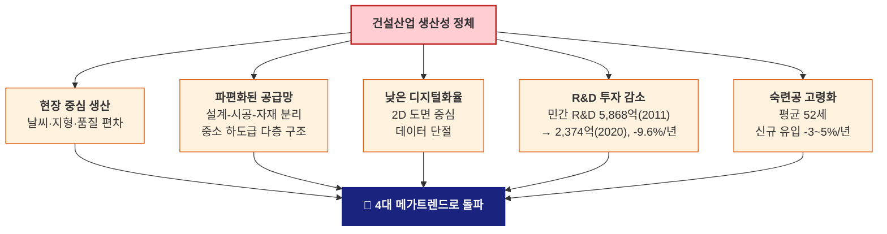
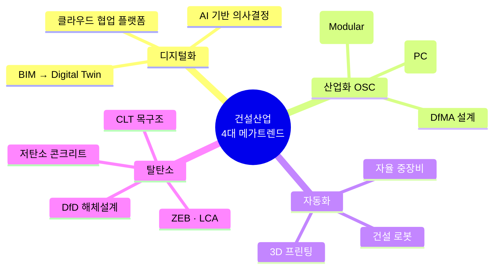
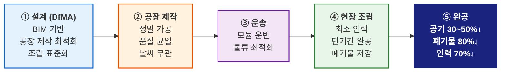
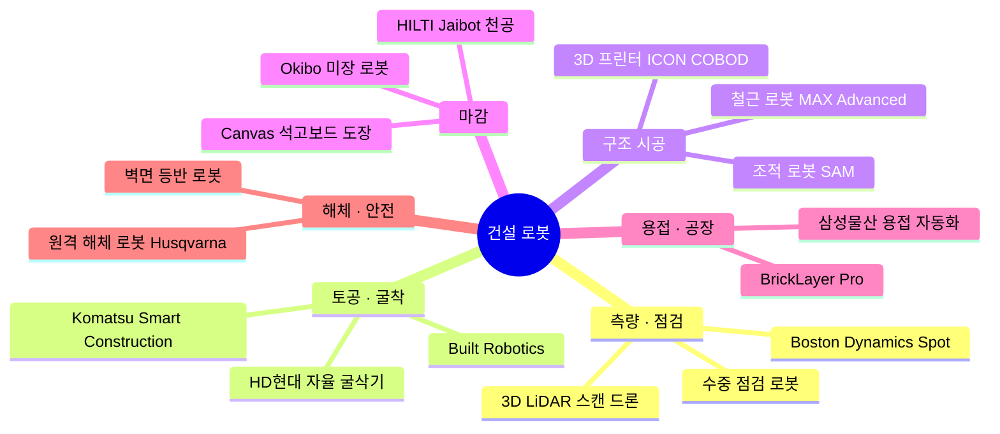
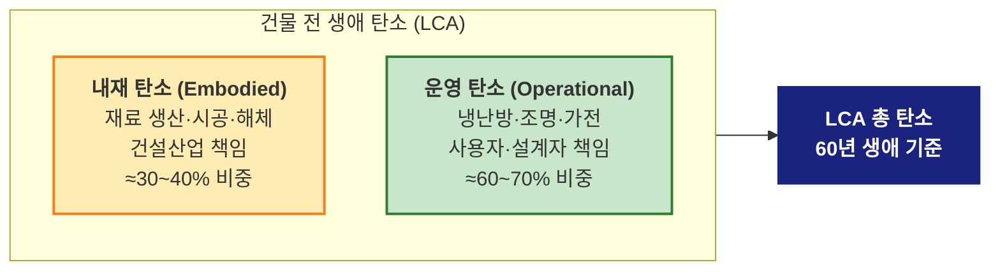

# L29. 건설산업 메가트렌드

> [!finding] 핵심 메시지
> 건설산업은 제조업 대비 생산성 정체 50년. 이를 돌파할 4대 메가트렌드 — **디지털화 · 산업화(OSC) · 자동화(로봇·3D프린팅) · 탈탄소** — 가 구조적 변화를 이끌고 있다. 현장을 공장으로, 사람을 로봇으로, 시멘트를 저탄소 재료로 — 변화는 이미 시작됐다.

## 강의 중점
- 건설산업의 메가트렌드와 미래 전망
- 모듈러/OSC, 3D 프린팅 등 신공법

## 학습 목표
1. 건설산업의 주요 메가트렌드(디지털화, 자동화, 지속가능성)를 설명할 수 있다.
2. 모듈러 건축, 3D 프린팅 등 미래 건설 공법의 원리와 장단점을 이해한다.

## 강의 내용

---

> [!ref] 이전 강의에서
> **[[L28-스마트-시티와-그린-빌딩|L28. 스마트 시티·그린 빌딩]]**에서 "어디에 어떤 기준으로" 지을지 — 도시 단위 인프라와 건물 단위 에너지 기준을 배웠다.
>
> 이번 강의는 "**어떻게**" 지을지 — 현장 중심 건설을 **공장·로봇·프린터**로 전환하는 메가트렌드를 본다. [[L04-건축공학의-미래|L04]]에서 스치듯 봤던 내용을 이번에 깊이 있게 다룬다.

---

### 도입 영상

> [!ref] 도입 영상 — 미래 건설현장 미리보기
> **[3D프린터로 집까지 짓는다고? — KICT (4:17)](https://www.youtube.com/watch?v=OT4SJ1dTjCE)** — 한국건설기술연구원, 국내 3D 프린팅 건축 기술 실증
>
> **[[엠빅네이처] 6주 만에 3층 아파트 출력 (9:24)](https://www.youtube.com/watch?v=UXeU8GLwj8k)** — MBC, 독일 3D 프린팅 아파트 시공 현장
>
> **[건설현장에 웬 로봇개? — 연합뉴스 (3:48)](https://www.youtube.com/watch?v=gdij9OnZthY)** — Spot 로봇, 자율 중장비, 드론이 만드는 스마트 건설현장
>
> **[건설로봇 끝판왕, 현대건설 로보틱스 (7:50)](https://www.youtube.com/watch?v=z43TWQj3PBM)** — Spot·앙카링 로봇·물류로봇·드론 국내 현장 적용
>
> **[Wolf Ranch: The World's First 3D-printed Community (3:45)](https://www.youtube.com/watch?v=VChT9hHpu4Q)** — ICON+Lennar, 세계 최초 3D 프린팅 주택단지 (영어)
>
> **[Spot on Site: Construction Solution (2:26)](https://www.youtube.com/watch?v=0NYJ_9FIHZA)** — Boston Dynamics, 건설현장 자율 데이터 수집 (영어)

> [!question] 생각해보기
> "제조업은 지난 50년간 생산성이 10배 늘었는데, 건설업은 **왜 제자리**일까? 그리고 **2030년 건설현장은 지금과 얼마나 다를까**?"

---

### 섹션 1 — 건설산업 생산성 정체의 근원

#### 50년간 제자리 걸음

McKinsey Global Institute의 두 차례 분석(2017, 2024)은 건설산업의 **구조적 정체**를 명확히 드러낸다.

![[mckinsey-productivity.jpg|520]]
*McKinsey "Reinventing Construction" — 건설 생산성 혁신을 위한 7대 레버 — 출처: McKinsey Global Institute (2017) / Aproplan 재인용*

| 구분 | 제조업 | 건설업 | 격차 |
|------|--------|--------|------|
| **1995~2015 노동생산성 증가율** | 3.6%/년 | 1.0%/년 | **3.6배** |
| **1950~2010 누적 생산성 변화 (미국)** | +760% | +6% | **127배** |
| **1968 대비 현재 (미국 건설업)** | — | **정체 or 하락** | — |

출처: McKinsey (2017, 2024); Goolsbee & Syverson (2023), *Becker Friedman Institute, U. Chicago*

> [!info] L04 복습 포인트
> 이 숫자들을 이미 [[L04-건축공학의-미래|L04]]에서 본 기억이 날 것이다. 이번 강의는 **"그래서 무엇을 바꾸고 있는가"**에 집중한다.

#### 국내 — CERIK 2022 진단

한국건설산업연구원(CERIK)의 *한국 건설산업 생산성 분석*(2022)은 국내 상황도 심각함을 보고한다.

| 지표 | 건설업 | 전산업 |
|------|--------|--------|
| **부가가치 노동생산성지수** (2011→2021) | 104.1 → **94.5 ↓** | 98.8 → 113.5 ↑ |
| **OECD 노동생산성 순위** (2010→2019) | 22위 → **26위 ↓** | 23위 → 22위 ↑ |
| **총요소생산성 기여율** (2001~2020) | **−47%** | +15% |
| **부가가치 증가율** (2001~2020) | 1.53%/년 | 3.57%/년 |

출처: 한국건설산업연구원 (2022), *한국 건설산업 생산성 분석*

#### 왜 이런가? — 구조적 원인

- **현장 중심**: 변동성이 큰 환경(날씨·지형·작업자)에서 반복 생산의 이점을 못 얻음
- **파편화**: 설계·시공·자재·설비가 분리돼 데이터와 책임이 파편화
- **디지털 격차**: 제조업은 1980년대부터 CAD/CAM·자동화에 투자, 건설은 2010년대부터 BIM 도입
- **R&D 투자 감소**: 국내 민간 건설 R&D는 10년간 **60% 감소** (CERIK)

> [!question] 생각해보기
> "만약 건설현장이 **자동차 공장처럼** 돌아간다면 어떤 변화가 생길까? — 공기·품질·폐기물·인력 측면에서."

---

### 섹션 2 — 4대 메가트렌드 개관

건설산업의 구조적 돌파구는 단일 기술이 아니라 **4개 트렌드의 동시 진행**이다.

| 트렌드 | 핵심 기술 | 전환 방향 | 대표 키워드 |
|--------|-----------|-----------|-------------|
| **① 디지털화** | BIM·AI·디지털 트윈 | 도면 → 데이터 | 4D/5D BIM, 생성형 AI 설계 |
| **② 산업화 (OSC)** | 모듈러·PC·DfMA | 현장 → 공장 | PPVC, 프리패브, 탈현장 |
| **③ 자동화** | 건설 로봇·3D 프린팅·자율 장비 | 사람 → 기계 | Spot, ICON, COBOD |
| **④ 탈탄소** | ZEB·LCA·저탄소 재료 | 시멘트 → CLT·Geopolymer | Embodied Carbon, CCUS |

> [!hypothesis] 4가지가 맞물리는 이유
> 4개 트렌드는 **따로 가는 것이 아니다**. 예: **디지털(BIM) + 산업화(DfMA) → 공장 자동화** → 탈탄소(재료 최적화). BIM 없이 DfMA 없고, DfMA 없이 공장 로봇 활용 없다.

---

### 섹션 3 — 디지털화: BIM에서 Digital Twin으로

#### BIM의 진화 — 3D에서 nD로

![[bim-4d-5d.jpg|540]]
*BIM 차원의 확장 — 3D(형상) → 4D(시간) → 5D(비용) → 6D(에너지/지속가능성) → 7D(유지관리) — 출처: United BIM*

| 차원 | 추가되는 정보 | 활용 |
|------|--------------|------|
| **3D** | 공간 형상 | 시각화, Clash Detection |
| **4D** | + 시간 (공정) | 공정 시뮬레이션, 간섭 예측 |
| **5D** | + 비용 | 물량 산출, VE, 원가 관리 |
| **6D** | + 에너지/지속가능성 | LEED·G-SEED, LCA |
| **7D** | + 유지관리 | FM, 센서 연동 디지털 트윈 |

- **국내 정책**: 2025년부터 **공공 건축물 BIM 설계 의무화** (조달청·국토부)
- 설계 오류 사전 검토로 **재작업 비용 10~20% 절감** (Autodesk 2023)

> [!info] 심화 학습
> BIM의 세부 원리·국내 적용 사례는 [[L23-BIM-기본-개념|L23]]·[[L24-BIM-활용과-국내-동향|L24]]에서 이미 다뤘다. 디지털 트윈·AI 활용은 [[L26-디지털-트윈과-신기술|L26]]·[[L18-건축공학에서의-AI-활용|L18]] 참고.

#### AI·빅데이터의 역할

| 적용 영역 | 기술 | 효과 |
|-----------|------|------|
| **생성형 설계** | 매개변수 기반 AI 최적 설계 | 재료비 10~30% 절감 |
| **공정 예측** | 과거 데이터 기반 ML 지연 예측 | 공기 5~15% 단축 |
| **품질 검측** | 드론 + AI 영상 분석 | 검측 시간 80% 단축 |
| **안전 관리** | AI CCTV 위험행동 감지 | 사고 예방 |

---

### 섹션 4 — 산업화·OSC (Off-Site Construction)

#### DfMA — "공장에서 만들고 현장에서 조립하라"

**DfMA** (Design for Manufacture and Assembly)는 **공장 제작·현장 조립을 전제로 설계**하는 방식. 기존 설계는 시공 방법이 결정된 후에야 조율되지만, DfMA는 **설계 단계부터** 제조·조립 용이성을 최적화한다.

#### 모듈러 vs 현장 시공 — 정량 비교

| 항목         | 기존 현장 시공     | 모듈러/OSC    | 비고              |
| ---------- | ------------ | ---------- | --------------- |
| **공기**     | 100% (기준)    | **50~70%** | Mace Group 2024 |
| **품질 균일성** | 현장 의존 (편차 큼) | 공장 QC (균일) | 하자 50%↓         |
| **폐기물**    | 100% (기준)    | **20% 수준** | McKinsey 2020   |
| **현장 인력**  | 100%         | 30~40%     | 숙련공 부족 대응       |
| **안전사고**   | 100%         | 50~70%     | 현장 고소작업 ↓       |
| **초기 투자비** | 낮음           | 높음 (공장 구축) | Scale Effect 필요 |
| **설계 자유도** | 높음           | 제한 (모듈 치수) | 운송 규격           |

#### 해외 선도 — 싱가포르 PPVC

![[ppvc-lego-building.jpg|500]]
*싱가포르 PPVC(Prefabricated Prefinished Volumetric Construction) — 공장에서 마감·배관·전기까지 완성된 모듈을 레고처럼 현장에 조립 — 출처: PropertyGuru SG*

![[ppvc-module-install.jpg|500]]
*PPVC 모듈 현장 설치 — 타워크레인으로 완성된 유닛을 하루 수 층씩 조립 — 출처: AEC Technical SG*

- **싱가포르 BCA (Building & Construction Authority)**: 공공주택 PPVC **의무화** (2014~)
- 공기 40% 단축, 현장 인력 60% 감축 달성
- 영국 Legal & General Modular Homes, 일본 Sekisui Heim 등 유사 사례

#### 국내 선도 기업

![[samsung-modular.jpg|500]]
*삼성물산의 모듈러 건축 — 사우디 네옴(NEOM)·중동 유가스전 숙박시설 수출, 탈탄소 모듈러 주택 사업 확대 — 출처: 매일경제*

![[posco-modular.jpg|500]]
*포스코이앤씨·포스코A&C 25층 모듈러 아파트 프로젝트 — 국내 최고층 모듈러 공동주택 도전 — 출처: 에너지경제*

| 기업 | 주요 사업 | 현황 |
|------|-----------|------|
| **삼성물산** | 사우디 PIF·NEOM 모듈러 주택, UAE 유가스전 숙박시설 | 2023 수주 확대, 중동 진출 |
| **포스코이앤씨/A&C** | 25층 모듈러 아파트, 강구조 모듈 | 국내 최고층 모듈러 도전 |
| **GS건설 (자이가이스트)** | 모듈러 주택 브랜드 론칭 | 충북 음성 공장 |
| **현대엔지니어링** | H-Cube 모듈러 호텔·오피스 | 서울 사업 확대 |

> [!ref] 참고 영상
> [국내 1호 모듈러 프로젝트 — 삼성물산 (5:52)](https://www.youtube.com/watch?v=qvTdlhE5HzY) — 스마트건설지원센터, 모듈러 건축 공장·현장 과정
>
> ['입양' 빼고 가족/집 짓기의 재구성 — KBS 더 보다 (33:24)](https://www.youtube.com/watch?v=eqY7qFWhpV8) — 모듈러 주택·탈현장공법(OSC) 국내 사례 조명

> [!question] 생각해보기
> "국내 아파트 건설에 **25층 모듈러**를 적용하려면 어떤 기술적·제도적 장벽이 있을까?"

---

### 섹션 5 — 자동화 ①: 3D 프린팅 건축

#### 핵심 기업 3사

| 기업 | 국가 | 대표 프린터 | 대표 프로젝트 |
|------|------|-----------|--------------|
| **ICON** | 미국 | Vulcan (3세대) | Wolf Ranch 100호 주택단지 (텍사스, 2024 완공) |
| **COBOD** | 덴마크 | BOD2 | 세계 최대 3D 프린팅 건물 (플로리다, 2023) |
| **WinSun** | 중국 | Giant Printer | 상하이 주택·두바이 사무실 |

#### ICON — Wolf Ranch (세계 최초 3D 프린팅 주택단지)

![[icon-wolf-ranch-hero.jpg|600]]
*ICON + Lennar + BIG(Bjarke Ingels Group) 공동 개발 Wolf Ranch — 미국 텍사스 조지타운, 세계 최초·최대 3D 프린팅 주택단지 (100호) — 출처: ICON Build*

![[icon-wolf-ranch-home.jpg|600]]
*완공된 Wolf Ranch 3D 프린팅 주택 — Vulcan 프린터가 콘크리트를 적층 출력, 상부는 전통 목구조 지붕 — 출처: ICON Build*

- **Vulcan 프린터**: 폭 14m, 높이 5m의 갠트리(gantry)형 로봇 팔
- **재료**: ICON 자체 개발 **Lavacrete** — 특수 배합 시멘트계 몰탈
- **속도**: 벽체 출력 **24~48시간**, 전체 공사 약 3주
- **파트너**: Lennar(미국 2위 주택 건설사) + BIG(덴마크 건축가)

#### COBOD — BOD2 프린터

![[cobod-bod2-printer.jpg|600]]
*COBOD BOD2 갠트리형 콘크리트 3D 프린터 — 세계에서 가장 많이 보급된 건설 3D 프린터 — 출처: COBOD International*

![[cobod-largest-3d-building.jpg|600]]
*세계 최대 3D 프린팅 건물 (플로리다, 2023 완공) — COBOD BOD2로 출력한 상업용 건물 — 출처: COBOD International*

- BOD2는 **모듈형 설계**로 프린터 크기를 현장 맞춤 확장 가능 (최대 50m)
- PERI, CEMEX, 하이델베르크시멘트 등 글로벌 건설사가 라이선스 도입
- 아프리카 학교, 우크라이나 복구 주택 등 **인도주의 프로젝트**에도 활용

#### 국내 — KICT의 실증

![[kict-3d-printing.jpg|500]]
*한국건설기술연구원(KICT)의 3D 프린팅 맞춤주택 실증 — 국내 최초 3D 프린팅 주택 기술 개발 — 출처: KICT / 월간 국토*

- **KICT**: 2017년부터 3D 프린팅 건축 연구, 군 시설·저층 주택 실증
- **뉴디원**(강원 정보문화산업진흥원 벤처): 2024 국내 최초 3D 프린팅 주택 오픈하우스
- **한계**: 구조 안전성 인증, 건축법 규정 미비, 철근 배근 자동화 미완성

#### 3D 프린팅의 장단점

| 장점 | 한계 |
|------|------|
| ✅ 인건비 절감 (인력 70%↓) | ❌ 구조 안전성 검증 미흡 (특히 지진) |
| ✅ 공기 단축 (벽체 24~48h) | ❌ 대형화 어려움 (갠트리 크기 제약) |
| ✅ 자유 형상 구현 (곡면·비정형) | ❌ 재료 제한 (시멘트계 위주) |
| ✅ 재료 낭비 최소화 | ❌ 철근 배근 수동 (일부) |
| ✅ 폐기물 대폭 감소 | ❌ 건축법·심의 기준 부재 |

> [!ref] 참고 영상
> [3D프린터로 집까지 짓는다고? — KICT (4:17)](https://www.youtube.com/watch?v=OT4SJ1dTjCE) — 한국건설기술연구원 기술 소개
>
> [[엠빅네이처] 6주 만에 3층 아파트 출력 (9:24)](https://www.youtube.com/watch?v=UXeU8GLwj8k) — MBC, 독일 3D 프린팅 아파트
>
> [Wolf Ranch: The World's First 3D-printed Community (3:45)](https://www.youtube.com/watch?v=VChT9hHpu4Q) — ICON+Lennar Wolf Ranch 소개
>
> [ICON and Lennar start selling homes (4:11)](https://www.youtube.com/watch?v=kUus_EbzPFI) — Wolf Ranch 판매 시작

---

### 섹션 6 — 자동화 ②: 건설 로봇과 자율 중장비

#### 분야별 로봇 기술 지형

| 분야         | 대표 기술                        | 현재 수준               |
| ---------- | ---------------------------- | ------------------- |
| **측량·점검**  | Spot + LiDAR (Trimble/Hilti) | **실용화**             |
| **토공·굴착**  | Komatsu Smart, HD현대 AI 굴삭기   | **실용화 (시범→상용화 진행)** |
| **3D 프린팅** | ICON Vulcan, COBOD BOD2      | 시범 + 일부 상용          |
| **철근 결속**  | MAX Advanced MAX (자율 이동형)    | 시범                  |
| **마감**     | Canvas 석고보드, Okibo 미장        | 시범                  |
| **조적**     | SAM (Construction Robotics)  | 시범 (美 일부 현장)        |
| **해체**     | Husqvarna 원격 해체 로봇           | 실용화                 |

#### ① 측량·점검 — Boston Dynamics Spot

![[spot-construction-laser.jpg|600]]
*Boston Dynamics Spot 로봇의 건설현장 자율 3D 레이저 스캐닝 — Trimble·Hilti와 협업, 현장 진도·품질 자동 문서화 — 출처: Boston Dynamics*

- **파트너십**: Trimble Spot Reality Capture, Hilti Jaibot, Leica BLK ARC 스캐너
- **활용**: 공정 진도 모니터링, BIM 모델과 실제 비교(Progress Capture), 위험구역 점검
- **국내 적용**: 현대건설 (Spot 도입 2021), 대우건설 (2022), 포스코이앤씨
- **장점**: 사람이 접근 불가능한 위험 공간(고소·밀폐) 탐사 + **자율 주행** 경로 반복 가능

> [!ref] 참고 영상
> [Spot on Site: Construction Solution (2:26)](https://www.youtube.com/watch?v=0NYJ_9FIHZA) — Boston Dynamics 공식 건설 적용 영상
>
> [건설로봇 끝판왕, 현대건설 로보틱스 (7:50)](https://www.youtube.com/watch?v=z43TWQj3PBM) — Spot·앙카링·물류·드론 국내 사례

#### ② 토공·굴착 — 자율 중장비의 시대

![[komatsu-smart-excavator.jpg|600]]
*Komatsu Smart Construction PC158USLCi-11 — 3D 설계 데이터를 받아 반자동 굴착 (ICT 시공기술) — 출처: Komatsu Corporate*

![[hyundai-autonomous-excavator.jpg|500]]
*현대건설기계(HD현대인프라코어) 자율 굴착기 — 운전자 없이 AI가 굴착·상차 작업 수행 — 출처: AI타임즈*

![[hd-hyundai-ai-excavator.jpg|500]]
*HD현대 무인 AI 굴착기 실증 시연 (2025) — 건설현장 무인 자동화의 본격 상용화 진입 — 출처: 이데일리*

- **Komatsu Smart Construction** (일본): 2013년 세계 최초 ICT 건설장비 상용화, 2025년 Tilt Rotator 호환 확대
- **HD현대** (국내): CES 2024 무인 AI 건설기계 공개, 2025 실증, 2026~ 상용화 목표
- **Built Robotics** (미국): 자율 말뚝 박기 로봇, 태양광 발전소 건설 자동화

| 기업 | 국가 | 제품 | 수준 |
|------|------|------|------|
| Komatsu Smart Construction | 일본 | PC-i 시리즈 (반자율) | 상용화 |
| Caterpillar Command | 미국 | 원격·반자율 덤프트럭 | 광산 상용화 |
| HD현대인프라코어 | 한국 | AI 자율 굴삭기 | 2025 실증 → 2026~ |
| Built Robotics | 미국 | Exosystem (굴삭기 자율화 키트) | 상용화 |

> [!ref] 참고 영상
> [(알기 쉬운 스마트 건설) 디지털 기반 건설장비 자동화 기술 (8:45)](https://www.youtube.com/watch?v=5s8ixZ5c3lE) — 스마트건설사업단
>
> [토공 자동화 스마트 건설 기술 (6:12)](https://www.youtube.com/watch?v=cCCbZRRiETk) — 국토부/도로공사 실증 영상

#### ③ 마감 — 사람이 하던 가장 힘든 작업부터

![[canvas-drywall-robot.jpg|500]]
*Canvas 석고보드 마감 로봇 — 샌딩·퍼티·도장을 자동화, 노동집약 마감 공정의 혁신 — 출처: Bluebeam / Canvas*

- **Canvas** (미국): 석고보드 샌딩·퍼티·도장 자동화. 샌프란시스코 공항·병원 현장 상용화
- **Okibo** (이스라엘): 미장 로봇, 고정밀 평탄성 확보
- **HILTI Jaibot**: 천장 천공 로봇, 설비 공정 자동화

---

### 섹션 7 — 탈탄소와 순환경제

#### 운영 탄소 vs 내재 탄소

건물의 전 생애 탄소는 두 개로 나뉜다. [[L28-스마트-시티와-그린-빌딩|L28]]에서 배운 ZEB는 **운영 탄소**를 다뤘지만, 건설산업 차원에서는 **내재 탄소**(Embodied Carbon) 감축이 새로운 과제다.

- **내재 탄소**: 철강·시멘트·알루미늄 등 **재료 생산**이 전체의 80%
- **ZEB 확산**으로 운영 탄소는 감소 중이지만, 내재 탄소 비중은 상대적으로 **증가**
- **UNEP 2023**: 건설·건물 부문 탄소 배출 약 37% 중 **운영 27% + 건설 10%**

#### 탄소 감축 4대 전략

| 전략           | 내용                          | 대표 기술/사례                        |
| ------------ | --------------------------- | ------------------------------- |
| **① 저탄소 재료** | 시멘트·철강 탈탄소                  | CarbonCure, 삼성물산 무시멘트 콘크리트      |
| **② 재료 대체**  | 시멘트 → 목재                    | CLT(Cross-Laminated Timber) 목구조 |
| **③ 재료 최적화** | AI 생성형 설계로 재료 감축            | 토폴로지 최적화, 중공 슬래브                |
| **④ 해체·재활용** | DfD(Design for Disassembly) | 볼트 접합, 모듈러 재사용                  |

#### ① 저탄소 콘크리트

![[carboncure-concrete.jpg|600]]
*CarbonCure 기술 — 레미콘 배합 시 CO₂를 주입하여 강도 향상 + 탄소 저장, 시멘트 사용량 5~7% 절감 — 출처: CarbonCure Technologies*

- **CarbonCure** (캐나다): 포집한 CO₂를 레미콘에 주입, 북미 800개 공장 보급
- **삼성물산 무시멘트 콘크리트** (2024): 시멘트 0% 슬래그·플라이애시 기반 (탄소배출 **-70%**)
- **Holcim ECOPact**: 저탄소 시멘트 글로벌 상용화 (유럽)

#### ② 목구조 르네상스 — CLT

![[clt-mass-timber.jpg|600]]
*CLT (Cross-Laminated Timber) 고층 목구조 빌딩 — 콘크리트·철강 대체, 탄소 **흡수**(-) 재료 — 출처: NaturallyWood.com / MGA Architecture*

- **CLT**: 목재를 교차 적층 접착한 엔지니어드 목재. RC·S조 대체
- 25층 **Mjøstårnet** (노르웨이, 2019 완공 당시 세계 최고층 목조)
- 국내: 산림청 **목조건축 활성화**, 경희대 국제캠퍼스 목구조 강의동
- 장점: **탄소 저장** 재료 (−kg CO₂/m³), 가벼움, 미관 → 아파트·오피스로 확대

#### ③ DfD (Design for Disassembly)

- 60년 뒤 **해체** 가능하도록 설계 단계부터 접합 방식·자재 구성 계획
- 모듈러와 결합 시 **건물 전체 재사용** 가능
- EU 순환경제법(2024)·한국 자원순환기본법 개정 논의 중

> [!ref] 참고 영상
> [삼성물산, 저탄소 콘크리트 상용화 (2:03)](https://www.youtube.com/watch?v=_lEcIY6ih64) — 무시멘트 콘크리트, 탄소 -70%
>
> [건설자재도 '저탄소·고성능'…넷제로 속도 (2:18)](https://www.youtube.com/watch?v=i2v1in-TrN8) — 시멘트·콘크리트 탈탄소 동향
>
> ['기후 악당' 길들이기...탄소 먹는 콘크리트 (7:45)](https://www.youtube.com/watch?v=l3pczLSZ_wo) — YTN, CCUS 콘크리트 기술

---

### 섹션 8 — 글로벌 경쟁 지형 (2026)

#### 국가별 전략

| 국가       | 핵심 정책·투자                                   | 강점               |
| -------- | ------------------------------------------ | ---------------- |
| **미국**   | IRA법(10년 $3700억 인프라), ICON·COBOD 3D 프린팅 선도 | 기술 혁신, 벤처 생태계    |
| **EU**   | Green Deal, 탄소세(CBAM), Level(s) 건물 탄소 기준   | 탈탄소 규제 선도        |
| **중국**   | BIM 의무화(2018~), WinSun 3D 프린팅, 초고속 시공      | 스케일, 저가 공급망      |
| **일본**   | Komatsu Smart, 초고령화 대응 로봇, i-Construction  | 자동화·로봇, 정밀 품질    |
| **싱가포르** | PPVC 의무화, BCA 디지털 전환 로드맵                   | OSC·DfMA, 정책 실행력 |
| **한국**   | 스마트건설기술 활용촉진법(2023), BIM 의무화(2025), 중대재해법  | 해외 수주, 스마트건설 챌린지 |

![[smart-construction-challenge.jpg|480]]
*국토교통부·한국건설기술연구원 스마트건설 챌린지 — 연 1회 스마트 건설 기술 경진대회 — 출처: 환경일보*

#### 한국 건설의 위치

- **수출**: 2024년 해외 건설 수주 **$371억** (산업부), 중동·동남아 강점
- **강점 기술**: 초고층(부르즈 할리파·롯데월드타워), 발전·플랜트, 모듈러(삼성·포스코)
- **약점**: R&D 투자 감소, 중소·숙련공 부족, 생산성 OECD 26위

> [!deadline] 2030 전망 (CERIK·McKinsey 공통)
> - 국내 모듈러 시장: **2023년 1조 → 2030년 10조 원** 전망 (CERIK)
> - 글로벌 3D 프린팅 건축: 2024년 $10억 → 2030년 **$150억** (Grand View Research)
> - 건설 로봇: 2024년 $45억 → 2030년 **$180억** (Reports and Data)

---

> [!important] 핵심 원칙
> 건설산업은 **제조업을 따라잡는 것이 아니라 제조업과 결합**한다.
>
> - **DfMA** = 설계가 제조를 고려
> - **OSC·PPVC** = 현장이 공장
> - **3D 프린팅·건설 로봇** = 인력이 기계
> - **저탄소 재료·CLT** = 콘크리트가 목재
>
> 모두 "현장을 공장화"하는 동일 방향이다.

> [!info] 다음 강의 예고
> 이 모든 변화를 이끌 **건축공학도**는 어떤 역량을 갖춰야 할까? **[[L30-미래-건축공학도의-역량|L30]]**에서 학기 전체 29강을 정리하고, BIM·AI·로봇·탈탄소 시대의 **미래 인재상**을 함께 그린다.

---

## 실습/과제

- [ ] **체험 (선택 1)**:
  - ICON Build 공식 사이트([iconbuild.com](https://www.iconbuild.com)) → Wolf Ranch 프로젝트 페이지 탐색
  - Boston Dynamics Spot 건설 영상 2편 이상 시청 → 노트에 3줄 감상
  - 한국건설기술연구원(KICT) 3D 프린팅 실증 영상 시청

- [ ] **과제**: 4대 메가트렌드(디지털화·산업화·자동화·탈탄소) 중 **1개 선정** → 국내외 사례·한계·2030 전망을 **A4 2매**로 정리
  - **평가 루브릭 (8점)**:
    - 트렌드 이해 및 정의 (2점)
    - 국내외 사례 2개 이상 (3점)
    - 기술·제도·경제적 한계 (2점)
    - 본인의 2030 전망 (1점)
  - **제출**: kh1819@khu.ac.kr, 제목 `[AE개론_L29] 학번_이름_메가트렌드`
  - **마감**: W16 수업 전 (**6/17 수요일 12:00**)

## Notes
- 수업 중 질문/피드백:
- 다음 수업 준비사항: L02~L29 전체 복습 — L30은 학기 전체 정리 + 미래 인재상

## 이미지 출처

| 파일명 | 설명 | 출처 |
|--------|------|------|
| `mckinsey-productivity.jpg` | McKinsey 건설 생산성 혁신 7대 레버 | [McKinsey / Aproplan](https://www.aproplan.com/blog/there-is-an-1-6tn-opportunity-for-construction) |
| `bim-4d-5d.jpg` | BIM 3D→4D→5D→6D 차원 확장 | [United BIM](https://www.united-bim.com/barriers-benefits-of-5d-bim-implementation-in-the-construction-industry/) |
| `ppvc-lego-building.jpg` | 싱가포르 PPVC 모듈 개요 | [Qanvast / HDB](https://qanvast.com/sg/articles/what-are-ppvc-flats-plus-answers-from-hdb-to-renovation-questions-2830) |
| `ppvc-module-install.jpg` | PPVC 현장 모듈 설치 | [AEC Technical SG](https://www.aectechnicalsg.com/ppvc-structural-design-singapore/) |
| `samsung-modular.jpg` | 삼성물산 모듈러 사업 | [매일경제](https://www.mk.co.kr/news/special-edition/10688796) |
| `posco-modular.jpg` | 포스코이앤씨 25층 모듈러 | [에너지경제](https://m.ekn.kr/view.php?key=20230219010004276) |
| `icon-wolf-ranch-hero.jpg` | ICON+Lennar Wolf Ranch 전경 | [ICON Build](https://www.iconbuild.com/projects/wolf-ranch) |
| `icon-wolf-ranch-home.jpg` | Wolf Ranch 3D 프린팅 주택 | [ICON Build](https://www.iconbuild.com/projects/wolf-ranch) |
| `cobod-bod2-printer.jpg` | COBOD BOD2 3D 프린터 | [COBOD International](https://cobod.com/solution/bod2/) |
| `cobod-largest-3d-building.jpg` | 세계 최대 3D 프린팅 건물 (플로리다) | [COBOD International](https://cobod.com/worlds-largest-3d-printed-building-in-florida/) |
| `kict-3d-printing.jpg` | KICT 3D 프린팅 맞춤주택 | [KICT / 월간 국토](https://www.kharn.kr/mobile/article.html?no=3627) |
| `spot-construction-laser.jpg` | Boston Dynamics Spot 건설현장 3D 스캔 | [Boston Dynamics](https://bostondynamics.com/blog/automated-construction-site-documentation/) |
| `komatsu-smart-excavator.jpg` | Komatsu Smart Construction 굴삭기 | [Komatsu](https://www.komatsu.com/en-us/newsroom/2026/komatsu-smart-construction-makes-stronger-connection-between-machines-office-work) |
| `hyundai-autonomous-excavator.jpg` | 현대건설기계 자율 굴삭기 | [AI타임즈](https://www.aitimes.kr/news/articleView.html?idxno=20202) |
| `hd-hyundai-ai-excavator.jpg` | HD현대 무인 AI 굴삭기 (2025) | [이데일리](https://marketin.edaily.co.kr/News/ReadE?newsId=03729366642396552) |
| `canvas-drywall-robot.jpg` | Canvas 석고보드 마감 로봇 | [Bluebeam / Canvas](https://blog.bluebeam.com/drywall-robot-interior-construction-automation/) |
| `carboncure-concrete.jpg` | CarbonCure CO₂ 주입 콘크리트 | [CarbonCure Technologies](https://www.carboncure.com/) |
| `clt-mass-timber.jpg` | CLT 목구조 빌딩 | [NaturallyWood.com](https://www.naturallywood.com/engineered-wood-products/cross-laminated-timber-clt/) |
| `smart-construction-challenge.jpg` | 국토부 스마트건설 챌린지 | [환경일보 HKBS](http://www.hkbs.co.kr/news/articleView.html?idxno=723708) |

> 모든 이미지는 교육 목적으로 사용되었으며, 저작권은 각 출처에 있습니다.

## Related
- **이전 강의**: [[L28-스마트-시티와-그린-빌딩]]
- **다음 강의**: [[L30-미래-건축공학도의-역량]]
- **관련 주제**: [[L02-건축공학의-역사와 교훈]], [[L04-건축공학의-미래]]
- **강의일정**: [[200-Lecture/건축공학개론/00-Syllabus/강의일정_2026-1|강의일정표]]
- **MOC**: [[400-Lab/_MOC]]
