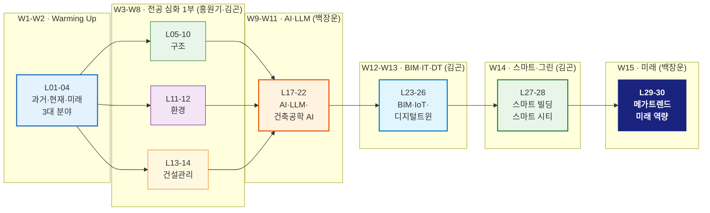
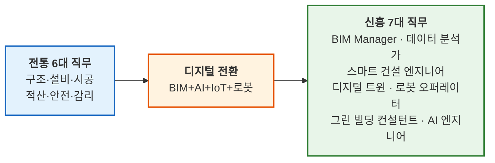
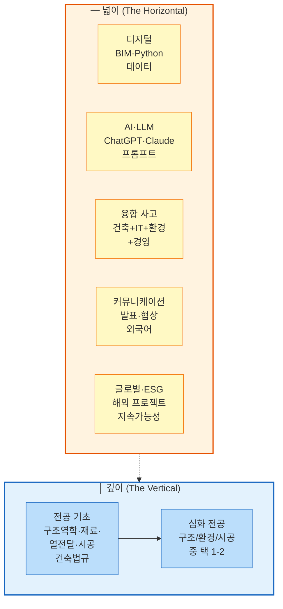
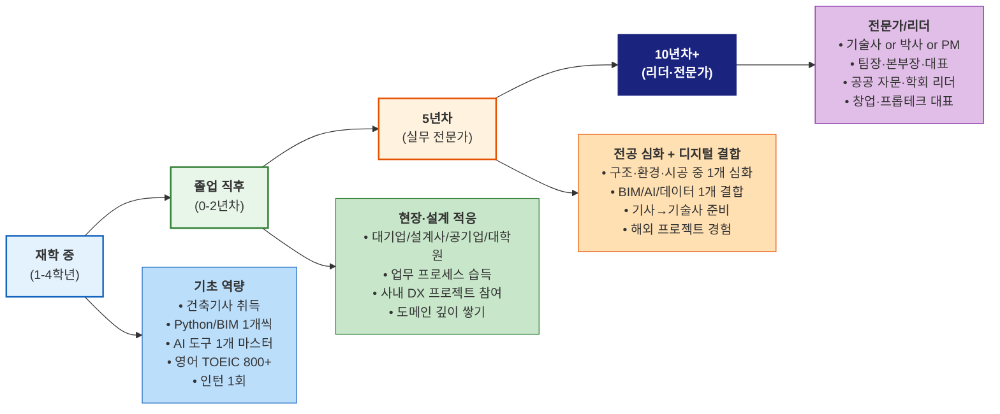

# L30. 미래 건축공학도의 역량

> [!finding] 핵심 메시지
> L01-L29를 통해 건축공학의 과거·현재·미래·기술을 모두 살폈다. 미래 건축공학도는 **전공 기초(I)** 위에 **디지털·AI·융합·커뮤니케이션(T의 가로 획)** 을 얹은 **T자형 인재**이며, 평생학습(Lifelong Learning)이 기본기이다. 오늘은 한 학기의 마지막 이론 강의로, 여러분이 앞으로 걸어갈 길을 함께 그린다.

## 강의 중점
- 건설 로봇과 자동화 기술
- 건축공학도의 미래 역량과 진로 방향

## 학습 목표
1. 건축공학도로서 미래에 필요한 역량과 진로 방향을 파악한다.

## 강의 내용

---

> [!ref] 이전 강의에서
> **L29 (건설산업 메가트렌드)** 에서 4대 변화 — 디지털화·산업화·자동화·탈탄소 — 를 보았다. 이 모든 변화를 실제로 만들어 갈 **사람**이 바로 이 강의실의 여러분이다. 이번 강의는 한 학기 여정의 마무리로, **미래 건축공학도에게 필요한 역량**을 함께 그린다. L03·L04에서 제시한 "3대 분야 진로·자격증·건설산업 과제" 위에, 오늘은 **T자형 인재상·신흥 직무·진로 로드맵**이라는 세 개의 축을 올린다.

### 도입 영상

> [!ref] 도입 영상 — 건설산업의 미래와 인재상 (한국어)
> - [건설로봇 끝판왕, 현대건설 로보틱스 (7:50)](https://www.youtube.com/watch?v=z43TWQj3PBM) — Spot, 앙카링 로봇, 물류로봇, 드론의 현장 적용
> - [삼성물산-현대건설, 건설 로봇 생태계 확장 (5:20)](https://www.youtube.com/watch?v=9Kw3J6u-9MM) — 국내 양대 건설사의 로봇 공동 개발 MOU
> - [건축공학과 취업현실 — 구인공고 데이터 분석 (10:00)](https://www.youtube.com/watch?v=K14-aGAvbHw) — 2025년 건축공학 취업 트렌드
> - [구조기술사가 알려주는 건축 취업전망 (8:30)](https://www.youtube.com/watch?v=OILpsLIy_hs) — 40년 경력 구조기술사의 조언

> [!ref] 도입 영상 — 글로벌 건설산업의 미래 (영어)
> - [The Future of Construction: How AI & Robotics Are Reshaping the Industry (6:12)](https://www.youtube.com/watch?v=z3k0hNmrPHk) — McKinsey Global Institute, AI·로봇 시대의 건설
> - [Careers in AEC: The Jobs of the Future (8:45)](https://www.youtube.com/watch?v=cF8eHHa7G9E) — Autodesk, 2030년 건축·엔지니어링·건설 직무 전망

![[spot-robot-construction-scan.jpg|600]]
*Boston Dynamics Spot이 건설 현장을 자율 이동하며 3D 레이저 스캐닝을 수행하는 모습 — 사람이 3일 걸리던 문서화를 2시간 만에 완료한다 — 출처: Boston Dynamics*

> [!question] 생각해보기
> "로봇과 AI가 건설 현장의 많은 일을 대신하게 되는 미래에, **건축공학도는 무엇을 해야 할까?**"
> - 더 이상 필요 없는 직무는?
> - 새롭게 등장할 직무는?
> - 여러분이 지금부터 준비해야 할 역량은?

---

### 섹션 1. 학기 전체 리뷰 — L01부터 L30까지

한 학기 동안 함께 걸어온 길을 한 장으로 정리해 보자. 각 주제는 서로 연결되어 있으며, 오늘의 이야기는 그 위에 놓인다.

| 블록 | 강의 범위 | 핵심 키워드 | 담당 |
|------|-----------|-------------|------|
| **Warming Up** | L01-L04 | 역사·3대 분야·진로·미래 이슈 | 백장운 |
| **구조** | L05-L10 | 하중·RC·철골·내진·FEM | 홍원기 |
| **환경** | L11-L12 | 열·빛·음·HVAC | 김곤 |
| **건설관리** | L13-L14 | CPM·적산·품질·안전 | 김곤 |
| **AI/LLM** | L17-L22 | 머신러닝·LLM·건축 AI 응용 | 백장운 |
| **BIM·IT·DT** | L23-L26 | BIM·IoT·디지털 트윈 | 김곤 |
| **스마트·그린** | L27-L28 | 스마트 빌딩·스마트 시티·ZEB | 김곤 |
| **미래** | L29-L30 | 메가트렌드·미래 역량 | 백장운 |

> [!finding] 한 학기의 큰 그림
> 건축공학의 뿌리(과거) → 현재(3대 분야) → 미래(디지털·AI·로봇·지속가능성)로 이어지는 **30개의 점**을 그렸다. 오늘은 그 점들을 **여러분 자신의 진로 지도**로 연결하는 시간이다.

---

### 섹션 2. 기술 변화에 따른 직무 진화

건설산업의 직무는 **사라지는 것이 아니라 진화**하고 있다. 핵심은 "무엇이 달라지는가"를 정확히 이해하는 것.

#### 2-1. 전통 직무는 여전히 중요하다

| 전통 직무             | 20년 전     | 2026 현재         | 2030년 이후        |
| ----------------- | --------- | --------------- | --------------- |
| **구조 설계 엔지니어**    | 손계산+MIDAS | BIM + AI 최적화    | 생성형 AI 협업 설계    |
| **시공 관리자 (현장소장)** | 종이 도면+무전기 | 태블릿+드론          | AR 글래스+로봇 감독    |
| **설비 설계 엔지니어**    | 2D CAD    | BIM 기반 MEP      | AI 에너지 시뮬레이션    |
| **적산 담당**         | 엑셀 수기     | 5D BIM 물량 자동 산출 | AI 단가·리스크 예측    |
| **안전관리자**         | 육안 점검     | CCTV+AI 영상 분석   | 웨어러블+디지털 트윈 실시간 |

> [!action] 핵심 통찰
> **직업이 사라지는 것이 아니라, 도구와 방법이 바뀐다.** 설계·구조·시공·환경·적산·안전 — 건축공학의 여섯 기둥은 2030년에도 건재하지만, **같은 일을 더 빠르고·정확하고·안전하게** 수행하게 된다. 따라서 **전공 기초**를 탄탄히 하면서 **새로운 도구**를 익히는 것이 핵심이다.

#### 2-2. 새롭게 등장한 직무

![[digital-careers-construction.jpg|600]]
*2025년 기준 건설산업의 디지털 신흥 직무 15선 — 코딩 기술 없이도 진입 가능한 영역이 절반 이상 — 출처: Construction Placements*

> [!question] 생각해보기
> 위 7개 신흥 직무 중 **여러분이 가장 끌리는 것 1개**를 골라 보자. 왜 끌리는가? 현재 그 직무에 필요한 역량 중 여러분이 이미 가지고 있는 것은 무엇인가?

---

### 섹션 3. 신흥 직무 상세 프로파일

#### 3-1. BIM Manager (BIM 매니저)

![[bim-manager-workflow.png|600]]
*BIM Manager의 핵심 역할 — 설계·시공·유지관리 전 생애주기에 걸친 BIM 데이터 통합 관리 — 출처: ABC Tennessee*

| 항목          | 내용                                                              |
| ----------- | --------------------------------------------------------------- |
| **주요 업무**   | 설계-시공-준공 전 과정의 BIM 총괄, 모델 표준 수립, Clash Detection, 물량 자동 산출 관리   |
| **필요 역량**   | Revit·ArchiCAD·Navisworks 등 BIM SW 숙련, ISO 19650 표준 이해, 프로젝트 관리 |
| **대표 기업**   | 삼성물산, 현대건설, 희림종합건축, 대형 설계사무소 BIM 팀                              |
| **초봉**      | 4,000-5,000만 원 (대형사 기준)                                         |
| **10년차 연봉** | 7,000만-1억 원 (BIM Specialist 등급)                                 |
| **시장 전망**   | 2030년까지 모든 공공공사 BIM 의무화 → 수요 급증                                 |

#### 3-2. 건설 데이터 분석가

![[iot-dashboard-construction.png|600]]
*실시간 IoT 센서 데이터 대시보드 — 건설 데이터 분석가는 이런 수십만 데이터 포인트에서 인사이트를 추출한다 — 출처: FutureIoT*

| 항목 | 내용 |
|------|------|
| **주요 업무** | 현장·BEMS·공정 데이터 수집→전처리→분석, 의사결정 지원 리포트 작성 |
| **필요 역량** | Python/SQL, 통계, Power BI/Tableau, 건설 도메인 지식 |
| **대표 기업** | 건설사 디지털혁신본부, 프롭테크(PropTech) 스타트업, 한미글로벌 CM |
| **초봉** | 4,500-5,500만 원 (이공계+데이터 전문가 프리미엄) |
| **성장 경로** | 주니어 분석가 → 시니어 → Data Lead → CDO |

#### 3-3. 스마트 건설 엔지니어 / 건설 로봇 오퍼레이터

![[hyundai-samsung-robot.jpg|600]]
*현대건설-삼성물산 '스마트 자재 운반 로봇' 기술 시연회 (2025) — 국내 양대 건설사가 공동으로 로봇 생태계를 확장하고 있다 — 출처: 현대자동차그룹*

| 항목 | 내용 |
|------|------|
| **주요 업무** | AI·IoT·로봇·드론·3D 프린터·VR/AR을 현장에 적용. 로봇 운용 SOP 수립, 안전 인터페이스 설계 |
| **필요 역량** | 시공 원리 + 로봇 제어 기초 + 센서·통신 프로토콜 + 안전관리 |
| **대표 기업** | 현대건설 로보틱스 팀, 삼성물산 건설기술연구소, 포스코이앤씨 |
| **초봉** | 4,000-4,800만 원 |
| **2030 시장 규모** | 국내 건설 로봇 시장 **1조 원** 돌파 전망 (CERIK, 2024) |

![[tybot-rebar-robot.jpg|600]]
*TyBot — 교량 철근 결속을 자동화하는 로봇. 4명의 숙련공이 하루 종일 해야 할 작업을 절반 시간에 완료 — 출처: Construct Connect Canada*

#### 3-4. 디지털 트윈 전문가 · 그린 빌딩 컨설턴트 · 건설 AI 엔지니어

![[digital-twin-monitoring.png|600]]
*빌딩 디지털 트윈 실시간 모니터링 대시보드 — 에너지·쾌적성·설비 상태를 한 화면에서 관리 — 출처: Contexus*

| 직무 | 주요 업무 | 필요 역량 | 초봉 |
|------|-----------|-----------|------|
| **디지털 트윈 전문가** | BIM+IoT 결합, 건물·도시 DT 구축·운영 | BIM+IoT+클라우드+데이터 시각화 | 4,500-5,500만 원 |
| **그린 빌딩 컨설턴트** | ZEB 설계 자문, LEED·G-SEED 인증, ESG 컨설팅 | 에너지 시뮬레이션(EnergyPlus), 인증 체계 | 3,800-4,500만 원 |
| **건설 AI / LLM 엔지니어** | LLM 기반 법규·계약·설계 검토 자동화 | 법규+프롬프트 설계+기초 Python | 5,000-6,000만 원 |

![[green-building-career-map.png|600]]
*미국 에너지부(DOE)가 제시한 그린 빌딩 커리어 맵 — ZEB·LEED·에너지 감사 등 전문 경로 — 출처: US Department of Energy*

- **디지털 트윈**: [[L26-디지털-트윈과-신기술\|L26]] 참조. 대표 기업 — ETRI, LH 스마트시티부, Arup Neuron
- **그린 빌딩**: 2025 공공 ZEB 의무화 + 2030 민간 확대 → 폭발적 성장. 대표 — KIER, ESCO, WSP
- **건설 AI**: [[L22-LLM의-건축공학-활용\|L22]]에서 본 LLM의 건축 실무 침투 — 매우 희소한 직무

> [!hypothesis] 신흥 직무의 공통 법칙
> 모든 신흥 직무는 **"건축공학 전공 지식 × 디지털 역량"** 의 곱셈 구조를 갖는다. 어느 한쪽만 뛰어나면 경쟁력이 약하지만, **둘을 곱하면 시장에서 희소한 인재**가 된다. 건축공학도는 **전공 지식이라는 강력한 이점**을 이미 가지고 있다.

---

### 섹션 4. T자형 인재상 (T-shaped Professional)

#### 4-1. I자형 vs T자형 vs π자형

![[tshaped-skills-diagram.jpg|700]]
*T자형 인재의 기본 구조 — 깊이(전공)와 넓이(협업·디지털·소통) 모두 갖춘 인재 — 출처: TechGig (2026)*

**역사적 배경**: T자형 개념은 1980년대 IDEO·McKinsey에서 컨설턴트 인재상으로 제시되었고, 2010년대 이후 **엔지니어링·디자인·데이터 과학** 분야로 확산되었다. Daniel Pink의 *A Whole New Mind*(2006) 이후 "왼쪽 뇌(분석)+오른쪽 뇌(공감·창의)" 결합이 강조되었다.

| 유형          | 의미             | 건축공학 적용 예           | 시장 가치         |
| ----------- | -------------- | ------------------- | ------------- |
| **I자형 (│)** | 전공 1개 깊이만      | 구조설계 40년 외길         | 희소하나 대체 가능    |
| **T자형 (┬)** | 전공 + 협업·디지털 역량 | 구조설계 + BIM + Python | 현재 시장의 주류     |
| **π자형 (π)** | 전공 2개 + 협업     | 구조 + 데이터사이언스 + 소통   | **미래 최상위 인재** |
| **일자형 (━)** | 넓이만 있고 깊이 없음   | 여러 분야 얕게            | 대체 매우 쉬움      |

#### 4-2. 미래 건축공학도의 T자형 해부

**깊이 (세로축 │) — 전공 기초는 변하지 않는다**
- 구조역학·재료·시공·환경·법규 — **이것이 없으면 모든 것이 무너진다.**
- AI·BIM·로봇은 "도구"이지 "내용"이 아니다. 내용은 결국 **공학 원리**.
- 2026년이든 2050년이든, **콘크리트는 압축에 강하고 인장에 약하다.**

**넓이 (가로축 ━) — 시대가 요구하는 다섯 가지 역량**

| 역량 | 구체 내용 | 어디서 배우나 |
|------|-----------|--------------|
| **디지털** | BIM, Python, 데이터 시각화, GitHub | 건축공학프로그래밍, BIM 실습 |
| **AI·LLM** | ChatGPT·Claude 활용, 프롬프트 설계, AI 윤리 | [[L17-AI의-미래기술\|L17]]-[[L22-LLM의-건축공학-활용\|L22]], LLM활용건축공학AI구현 |
| **융합 사고** | 건축+IT+환경+경영의 연결 | 인문학 교양, 경영 부전공 |
| **커뮤니케이션** | 발표, 협상, 외국어(영어·중국어) | 세미나, 해외 교류, TOEIC/OPIc |
| **글로벌·ESG** | 해외 프로젝트, 지속가능성 이해 | 해외 인턴십, LEED·G-SEED 자격 |

> [!finding] 경희대 건축공학과가 추구하는 인재상
> 경희대 건축공학과는 **"공학적 분석력(깊이)+디지털 창의력(넓이)+글로벌 시민의식(리더십)"** 을 갖춘 T자형을 넘어선 **π자형 인재**를 양성하는 것을 목표로 한다. 여러분이 4년간 걸을 교육과정은 바로 이 T와 π를 완성하기 위한 설계다.

---

### 섹션 5. 자기역량 진단 워크시트 (수업 워크숍 · 10분)

오늘 수업 중 반드시 작성한다. **자신의 현재 위치를 정직하게 체크**하고, 다음 장의 진로 로드맵과 연결한다.

![[skills-radar-chart.png|500]]
*역량 레이더 차트 예시 — 다섯 축의 균형을 시각화하면 자신의 강점과 약점이 명확해진다 — 출처: Shiftmove Engineering Blog*

#### 5-1. 역량 자가 평가표 (A=매우 우수 / B=우수 / C=보통 / D=부족 / E=미경험)

| 영역 | 세부 항목 | 2026-1 (현재) | 목표 (졸업 시) |
|------|-----------|----------------|-----------------|
| **① 전공 기초** | 구조역학 이해도 |  |  |
|  | 건축 재료·시공 이해도 |  |  |
|  | 환경·설비 이해도 |  |  |
| **② 디지털 역량** | BIM 소프트웨어 (Revit 등) |  |  |
|  | Python 코딩 |  |  |
|  | 데이터 분석 (Excel 고급·SQL) |  |  |
| **③ AI 활용** | ChatGPT/Claude 실무 활용 |  |  |
|  | 프롬프트 설계 |  |  |
| **④ 커뮤니케이션** | 발표·팀 프로젝트 |  |  |
|  | 영어 (공학 영어 논문 읽기) |  |  |
| **⑤ 융합 사고** | 타 분야(IT·환경·경영) 관심 |  |  |
|  | 문제 해결·창의성 |  |  |

#### 5-2. 약점 보완 1년 계획 (3가지만)

| 우선순위 | 보완할 영역 | 구체적 실행 계획 | 목표 달성 시점 |
|---------|-------------|------------------|------------------|
| 1 |  (예: Python) |  (예: 건축공학프로그래밍 A+) | 2026-2 종강 |
| 2 |  |  |  |
| 3 |  |  |  |

> [!action] 워크숍 진행 순서 (10분)
> 1. **(3분)** 위 자가 평가표를 혼자 작성. 정직하게, 빠르게.
> 2. **(3분)** 자신의 레이더 차트 그리기 (간단한 오각형).
> 3. **(4분)** 옆 친구와 짝을 이뤄, **서로의 약점을 보고 "이건 이렇게 보완해봐"** 한 가지씩 조언.
> 4. **(과제 연장)** 1년 보완 계획 3가지를 노션/Obsidian에 기록하고, 기말고사 전까지 교수에게 DM으로 사진 인증 시 **가산점 1점**.

---

### 섹션 6. 진로 로드맵 — 재학 / 졸업 직후 / 5년차 / 10년차

#### 6-1. 경력 단계별 역량 체크리스트

| 단계 | 최소 보유 역량 (필수) | 권장 역량 (가산점) |
|------|----------------------|---------------------|
| **재학 중 (1-4학년)** | 전공 GPA 3.5+, 건축기사, BIM 1개, Python 기초 | 인턴 1회, 해외 교류, AI 활용 프로젝트 1건 |
| **졸업 직후 (0-2년차)** | 입사 후 6개월 OJT 완료, 사내 SW 숙련 | 사내 TF 참여, 논문 1편 읽기/주 |
| **5년차** | 전공 심화 (구조/환경/시공 중 1개), 기사→기술사 준비 | BIM/AI/데이터 중 1개 사내 전문가, 해외 1년 |
| **10년차+** | 기술사 or 박사 or PM 자격, 팀 리드 | 공공 자문, 학회 상임이사, 창업 경험 |

#### 6-2. 재학 중 학년별 로드맵 (경희대 건축공학과 기준)

![[khu-eng-college.jpg|600]]
*경희대학교 국제캠퍼스 공과대학 — 여러분이 4년을 보낼 공간 — 출처: 경희대학교 공식 홈페이지*

| 학년      | 핵심 과목 (필수)                                           | 권장 활동                         |
| ------- | ---------------------------------------------------- | ----------------------------- |
| **1학년** | 건축공학개론, 일반물리, 미적분, **건축공학프로그래밍(Python)**             | 건축 관련 책 5권, 건설 현장 견학 1회       |
| **2학년** | 구조역학, 건축환경, 건축재료, **건축BIM**                          | 건축기사 필기 준비 시작, BIM(Revit) 실습  |
| **3학년** | 철근콘크리트, 건축시공, HVAC, 구조설계, **건축공학시스템설계(LLM활용 AI 구현)** | 건축기사 취득, 공모전 참가, 인턴 1회        |
| **4학년** | 심화 전공 (구조/환경/시공 중 택 1), 졸업설계, 현장실습                   | 취업 or 대학원 준비, 영어 공인 점수, 포트폴리오 |

> [!info] 과목 연계 지도
> - **건축공학개론(1학년)** — 전체 그림 제공 (지금 이 수업)
> - **건축공학프로그래밍(2학년, 백장운)** — Python으로 구조 계산·BIM 자동화
> - **LLM활용 건축공학 AI 구현(3학년, 백장운)** — LLM을 건축 실무에 적용

#### 6-3. 졸업 직후 진로 4대 경로

| 경로 | 대표 기업 | 초봉 | 특징 |
|------|-----------|------|------|
| **대기업** | 삼성물산·현대건설·대우건설·GS건설·DL이앤씨·포스코이앤씨 | 4,500-5,000만 원 + 현장수당 | 현장 경험·해외 진출 |
| **설계사무소** | 희림·삼우·창조·동양구조·하중구조 | 3,200-3,800만 원 | 설계 스킬 집중·전문성 |
| **공기업** | LH·SH·도공·철도공사·KICT·KIER | 3,800-4,500만 원 | 안정성 최고 |
| **대학원 진학** | 경희대 및 타대학 (석사 2년 / 박사 3-4년) | 등록금 장학 흔함 | 5년 후 기업 R&D·교수 |

> [!action] 진로 선택 팁
> - **현장 경험을 원한다** → 대기업 시공 or 공기업 감리
> - **설계·디자인을 좋아한다** → 설계사무소 (초봉 낮아도 기술 축적)
> - **안정성을 원한다** → 공기업 (LH·KICT 등)
> - **연구·개발을 원한다** → 대학원 → 기업 R&D·교수·국책연구소
> - **창업·혁신을 원한다** → 대기업 2-3년 후 프롭테크·건설 AI 스타트업

---

### 섹션 7. 미니 토론 — 건설 로봇과 AI, 사람을 대체할 수 있는가?

![[samsung-construction-robot.jpg|600]]
*삼성물산 반포3주구 레미안 현장의 건설 로봇 시연 (2025) — 용접·자재 운반·검측 로봇이 실제 투입되기 시작했다 — 출처: 공학저널*

> [!question] 토론 주제
> **"건설 로봇과 AI가 건설 기능인력을 완전히 대체할 수 있을까?"**

#### 7-1. 찬성 측 논거

| 근거 | 구체적 예시 |
|------|-------------|
| 인력 부족 | 기능인력 고령화(평균 52세), 젊은 층 기피 |
| 안전사고 예방 | 건설업 사망 연 400명 → 위험 작업 로봇 대체 |
| 24시간 작업 | 야간·악천후·고소작업 로봇 가능 |
| 품질 균일성 | 공장 제작·로봇 시공 → 편차 최소화 |
| 경제성 | 10-15년 후 로봇 단가 급락 예상 |

#### 7-2. 반대 측 논거

| 근거 | 구체적 예시 |
|------|-------------|
| 현장 변수 대응 한계 | 설계 변경·지반 이상·기상 대응은 숙련공 직관 필수 |
| 초기 투자비 | 로봇 1대 수억 원, 중소 건설사 도입 어려움 |
| 숙련공의 판단력 | 시공 오류·안전 위험의 경험적 인식 |
| 일자리·사회 문제 | 기능인력 실업 → 사회 불안, 정치적 저항 |
| 법·보험 제도 | 로봇 사고 책임 소재 불명확, 건축법 미비 |

#### 7-3. 진행 방식 (15분)

**① 조 편성 (1분, 4-5인) → ② 찬/반 선정 (1분) → ③ 조별 논거 정리 (5분) → ④ 조별 발표 (2분 × 3조 = 6분) → ⑤ 교수 정리 (2분)**

> [!hypothesis] 교수의 관점 (토론 후 공유)
> **"완전 대체는 불가능하지만, 대체되지 않는 일은 바뀐다."** 2040년쯤이면 단순·반복·위험 작업은 90% 이상 로봇이 맡지만, **설계 의사결정·창의적 문제 해결·사람 간 협업**은 여전히 인간 엔지니어의 영역이다. 여러분이 준비해야 할 것은 **로봇이 못하는 일**을 잘하는 것이다.

---

### 섹션 8. 백장운 교수의 메시지 — 한 학기의 마무리

![[lifelong-learning-engineer.jpg|600]]
*평생학습은 21세기 엔지니어의 핵심 역량 — 기술은 5년마다 판이 바뀌지만, 학습 습관은 30년을 간다 — 출처: KIT (Karpagam Institute of Technology)*

#### 8-1. 한 학기를 돌아보며

지난 15주 동안 여러분과 함께 **30번의 강의**를 걸어왔다. L01에서 "건축공학이란 무엇인가?"라는 질문으로 시작해, 역사·현재·미래를 살폈고, 구조·환경·건설관리 3대 분야를 열었고, AI·LLM·BIM·디지털 트윈·스마트 시티·탈탄소로 이어지는 **미래의 풍경**을 그렸다.

> [!finding] 이 강의가 여러분에게 남기는 것
> - **지식**: 건축공학의 전체 지도 (그림 1장으로 설명 가능한 수준)
> - **언어**: 구조·설비·시공·AI·BIM 전문가와 대화할 수 있는 기초 용어
> - **방향**: 앞으로 4년을 무엇에 쓸지에 대한 자기만의 답

#### 8-2. 세 가지 당부

**① 호기심을 꺼뜨리지 말라 (Curiosity)** — 건축공학은 **가장 오래된 동시에 가장 빨리 변하는** 학문이다. 피라미드에서 3D 프린팅까지, 사람은 여전히 **"어떻게 더 안전하고, 더 아름답고, 더 지속가능하게 짓는가"** 를 묻는다. 이 질문을 여러분의 것으로 삼아라.

**② 협력하라 (Collaboration)** — 혼자 위대한 건물을 지은 사람은 없다. 부르즈 할리파도 1만 명의 노동자와 수백 명의 엔지니어가 함께 지었다. 4년 뒤 여러분의 가장 큰 자산은 GPA가 아니라 **함께 일하고 싶은 사람들과의 관계**일 것이다.

**③ 평생 학습하라 (Lifelong Learning)** — 2026년의 AI·BIM·로봇은 2036년에 **박물관 도구**가 될 것이다. 지금 배우는 Revit은 10년 뒤 다른 이름으로 바뀌어 있을 것이다. 그러나 **"새로운 것을 배우는 능력"** 은 영원하다. 30년차 엔지니어도 **대학원 1학년처럼 새 기술을 배울 수 있어야 한다.**

![[daqri-ar-smart-helmet.jpg|600]]
*AR 스마트 헬멧을 쓴 건설 엔지니어 — 10년 뒤 여러분이 현장에서 쓰고 있을 도구 — 출처: DesignBoom*

#### 8-3. 10년 후 여러분에게

> [!hypothesis] 2036년, 여러분은...
> - **구조 엔지니어**가 되어 AI와 함께 서울의 200층 빌딩을 설계하고 있을지도 모른다.
> - **건설 로봇 팀장**이 되어 100대의 로봇 시공 현장을 지휘하고 있을지도 모른다.
> - **디지털 트윈 스타트업 대표**가 되어 글로벌 시장에 도전하고 있을지도 모른다.
> - **경희대 교수**가 되어 또 다른 1학년들에게 건축공학개론을 가르치고 있을지도 모른다.
>
> 어느 길을 가든, **2026년 여러분이 L01-L30을 들었던 이 시간**이 그 출발점이 될 것이다. 그리고 그 시간을 **어떻게 사용했는가**는 지금부터 여러분의 선택이다.

## 실습/과제

- [ ] **수업 중 워크숍**: 자기역량 진단표 작성 + 약점 보완 1년 계획 3가지 (10분)
  - 제출: 사진으로 교수 DM → **가산점 1점** (기말고사 추가)
- [ ] **기말고사 대비 필수 과제**: L01-L04, L17-L30 핵심 내용 정리 노트 작성
  - 형식 자유 (Obsidian·Notion·손글씨·마인드맵 모두 인정)
  - 제출: 사진 1-3매 이메일 → **가산점 1점**
- [ ] **(선택, 가산점 최대 2점)**: 건설산업 미래기술 중 1가지 선정, 5분 발표 (L30 수업 중 or L31)
  - 예: 건설 3D 프린팅·디지털 트윈·건설 로봇·ZEB·LLM 법규 검토
  - 채점 기준: 발표력(40%) + 기술 이해도(40%) + 전망 타당성(20%)
  - 가산점: 최대 2점 (기말고사 점수에 가산)

## Notes
- 수업 중 질문/피드백:
- 토론 조별 논거 요약:
- 기말고사 준비: L01-L04 (백장운), L17-L30 (백장운, 김곤) 범위 복습
- 가산점 과제 제출 마감: L31 수업 전까지 (6/17 23:59)

## 이미지 출처

| 파일명 | 설명 | 출처 |
|--------|------|------|
| `spot-robot-construction-scan.jpg` | Boston Dynamics Spot 건설현장 자율 3D 스캔 | [Boston Dynamics](https://bostondynamics.com/solutions/digital-twin/laser-scanning/) |
| `digital-careers-construction.jpg` | 디지털 건설 신흥 직무 15선 | [Construction Placements](https://www.constructionplacements.com/digital-construction-careers-without-coding/) |
| `bim-manager-workflow.png` | BIM Manager 역할과 생애주기 데이터 통합 | [ABC Tennessee](https://abctn.org/digital-twins-and-bim-a-practical-roadmap-for-modern-construction-leaders/) |
| `iot-dashboard-construction.png` | IoT 센서 실시간 대시보드 예시 | [FutureIoT](https://futureiot.tech/building-an-iot-data-pipeline/) |
| `hyundai-samsung-robot.jpg` | 현대건설-삼성물산 스마트 자재 운반 로봇 시연 | [현대자동차그룹](https://www.hyundaimotorgroup.com/ko/news/CONT0000000000180084) |
| `tybot-rebar-robot.jpg` | TyBot — 철근 결속 자동화 로봇 | [Construct Connect Canada](https://canada.constructconnect.com/dcn/news/usa/2023/06/robot-can-now-tie-large-rebar-grids-ideal-for-bridge-work) |
| `digital-twin-monitoring.png` | 빌딩 디지털 트윈 실시간 모니터링 | [Contexus](https://contexus.io/resources/blog/digital-twins-transforming-smart-buildings) |
| `green-building-career-map.png` | 그린 빌딩 커리어 맵 (미국 에너지부) | [US DOE](https://www.energy.gov/cmei/buildings/articles/green-buildings-career-map-offers-glimpse-promising-energy-efficiency) |
| `tshaped-skills-diagram.jpg` | T자형 스킬 모델 다이어그램 | [TechGig 2026](https://content.techgig.com/career-advice/what-is-a-t-shaped-developer-skill-shape-for-2026-careers/articleshow/125320992.cms) |
| `skills-radar-chart.png` | 역량 레이더(거미줄) 차트 예시 | [Shiftmove Engineering](https://tech.shiftmove.com/understanding-and-implementing-team-skills-radar-0dade2e15c45) |
| `khu-eng-college.jpg` | 경희대학교 국제캠퍼스 공과대학 전경 | [경희대학교](https://www.khu.ac.kr/eng/user/contents/view.do?menuNo=300066) |
| `samsung-construction-robot.jpg` | 삼성물산 반포3주구 레미안 로봇 시연 | [공학저널](https://www.e-science.co.kr/news/curationView.html?idxno=113094) |
| `lifelong-learning-engineer.jpg` | 평생학습 — 엔지니어의 핵심 역량 | [Karpagam Institute of Technology](https://karpagamtech.ac.in/importance-of-lifelong-learning-in-engineering-careers/) |
| `daqri-ar-smart-helmet.jpg` | AR 스마트 헬멧 착용 건설 엔지니어 | [DesignBoom](https://www.designboom.com/technology/daqri-smart-helmet-augmented-reality-wearable-01-27-2016/) |
| `vr-construction-future.jpg` | VR 기반 건설 현장 미래 비전 | [Program-Ace](https://program-ace.com/blog/vr-in-construction/) |
| `icon-vulcan-3d-printer.jpg` | ICON Vulcan 3D 프린터 건설 현장 | [VoxelMatters](https://www.voxelmatters.com/icon-vulcan-3d-printer-house-zero-project/) |

> 모든 이미지는 교육 목적으로 사용되었으며, 저작권은 각 출처에 있습니다.

## Related
- **이전 강의**: [[L29-건설산업-메가트렌드]]
- **다음 강의**: [[L31-기말고사-복습]]
- **관련 주제**: [[L02-건축공학의-역사와 교훈]], [[L03-건축공학의-현재]], [[L04-건축공학의-미래]], [[L22-LLM의-건축공학-활용]], [[L26-디지털-트윈과-신기술]]
- **강의일정**: [[200-Lecture/건축공학개론/00-Syllabus/강의일정_2026-1|강의일정표]]
- **MOC**: [[200-Lecture/_MOC]]
